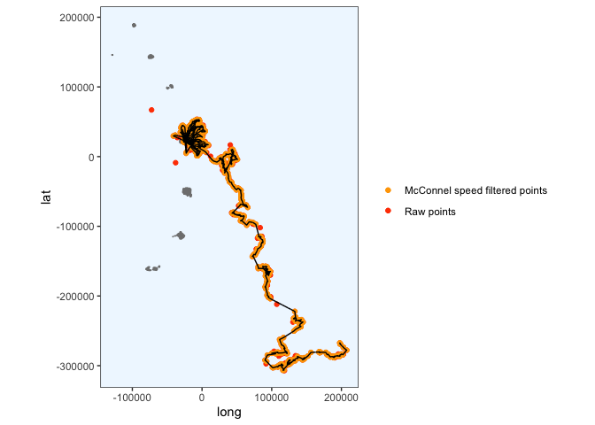
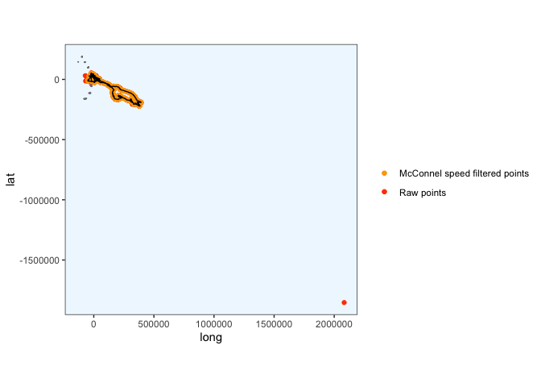
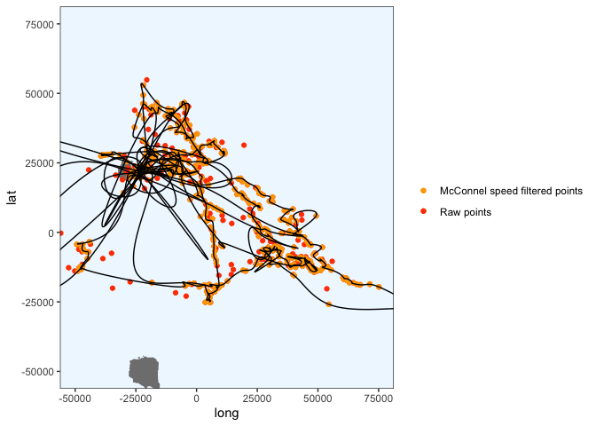
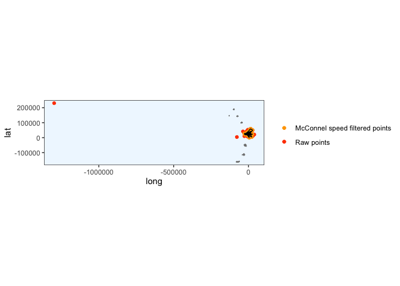
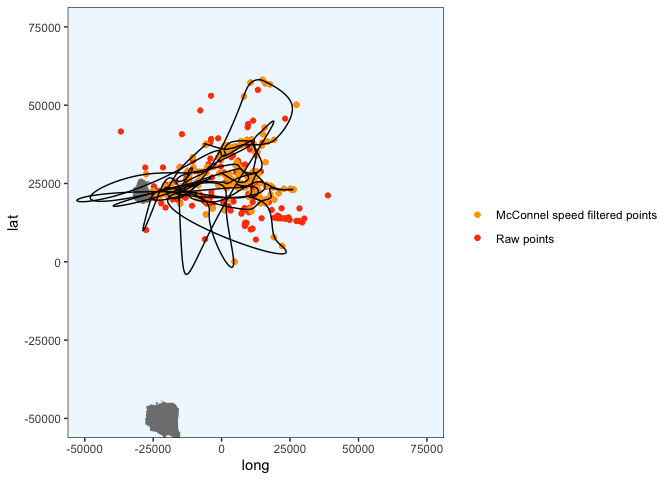

Initial processing with Crawl
================
Gemma Clucas
6/29/2020

``` r
knitr::opts_chunk$set(echo = TRUE)
library(tidyverse)
library(lubridate)
library(crawl)   #to fit Kalman filter models
library(trip)    #to prepare GPS data
library(maptools)
library(sp)
library(rgdal)
library(raster)
library(ggplot2)
library(knitr)
library(spdplyr)
options(scipen=999)
```

## Load data

This is the data that Claudia sent over on 30th June 2020.

``` r
raw <- read.csv("raw_data/satellite_tracking_data_30_06_20.csv")
```

## Prepare data for analysis

**Format times**

The date and time are in the format:  
\* mm/dd/yy hh:mm

I can use the `lubridate` package to change them into a proper
date-time.

``` r
raw$Time <- mdy_hm(raw$Date, tz = "UTC")
```

Create a column with the time in hours since the first fix (that is, the
first fix for all
individuals).

``` r
raw$Time_since <- as.numeric(difftime(raw$Time, min(raw$Time), units="hours"))
```

Remove duplicated rows and rename columns.

``` r
raw <- raw[!duplicated(raw), ]

raw <- raw %>% 
  rename(Argos_loc_class = Loc.Class, LON = Lon1, LAT = Lat1)
```

At this stage I’m going to remove all the other columns from the
dataframe and just keep the ones we will work with.

``` r
clean <- raw %>% 
  dplyr::select(Ptt, Time, Time_since, LON, LAT, Argos_loc_class, Uplink)
```

## Create a map that we can plot the fixes onto later

This is the SGSSI shapefile that Vicky and I found.

``` r
Seamask<-readOGR("Seamask.shp")
```

    ## OGR data source with driver: ESRI Shapefile 
    ## Source: "/Users/gemmaclucas/GitHub/CHPE_Tracking_South_Sandwich_Islands/Seamask.shp", layer: "Seamask"
    ## with 1 features
    ## It has 1 fields

Don’t try to plot the whole thing, it takes ages as it includes all of
South Georgia. The code to use would be `plot(Seamask,axes=T)`.

Instead, crop to just the South Sandwich Islands (SSI) and convert to a
dataframe that can be plotted with ggplot. The code for doing the
conversion is from
<https://github.com/tidyverse/ggplot2/wiki/plotting-polygon-shapefiles>

``` r
SSI <- crop(Seamask, c(450000, 750000, -600000, -100000))

# convert to dataframe for use with ggplot2
SSI@data$id = rownames(SSI@data)
SSI.points = fortify(SSI, region="id")
SSI.df = plyr::join(SSI.points, SSI@data, by="id")

# NB all the polygons for the islands have hole == TRUE, so I am filtering for these.
# the polygon for the sea has hole == FALSE, so I don't need to plot that.
SSI.df %>% dplyr::filter(hole == TRUE) %>% 
  ggplot(aes(x = long, y = lat, group = group)) + 
  geom_polygon(fill="grey") +
  geom_path(color="grey") +
  coord_equal() +
  theme_bw() +
  xlim(450000, 750000) +
  ylim(-600000, -100000) +
  theme(panel.grid.major = element_blank(), 
        panel.grid.minor = element_blank(),
        panel.background = element_rect(fill = "aliceblue"))
```

<!-- -->

Check the projection

``` r
crs(SSI)
```

    ## CRS arguments:
    ##  +proj=lcc +lat_1=-54 +lat_2=-54.75 +lat_0=-55 +lon_0=-37 +x_0=0 +y_0=0
    ## +datum=WGS84 +units=m +no_defs +ellps=WGS84 +towgs84=0,0,0

Re-project to Lambert Azimuthal Equal
Area

``` r
SSI_laea<-spTransform(SSI, CRS=CRS("+proj=laea +lon_0=-26 +lat_0=-58 +units=m"))

# convert to dataframe for use with ggplot2
SSI_laea@data$id = rownames(SSI_laea@data)
SSI_laea.points = fortify(SSI_laea, region="id")
SSI_laea.df = plyr::join(SSI_laea.points, SSI_laea@data, by="id")

# filter out only the polygons for the islands
SSI_laea.df <- SSI_laea.df %>% filter(hole == TRUE)


SSI_laea.df %>% 
  ggplot(aes(x = long, y = lat, group = group)) + 
  geom_polygon(fill="grey") +
  geom_path(color="grey") +
  coord_equal() +
  theme_bw() +
  theme(panel.grid.major = element_blank(), 
        panel.grid.minor = element_blank(),
        panel.background = element_rect(fill = "aliceblue"))
```

<!-- -->

## Pick a penguin

We need to run crawl on the tracks from each individual separately.
First, display the PTT
    numbers:

``` r
unique(clean$Ptt)
```

    ##  [1] 196697 196698 196699 196700 196701 196702 196703 196704 196705 196706
    ## [11] 196707 196708 196709 196710 196711 196712 196713 196714 196715 196716

We’ll start with `196697` and select the data for that individual.

``` r
penguin <- "196697"

x1 <- clean %>%
  dplyr::filter(Ptt == penguin)

kable(head(x1))
```

|    Ptt | Time                | Time\_since |      LON |      LAT | Argos\_loc\_class | Uplink |
| -----: | :------------------ | ----------: | -------: | -------: | :---------------- | -----: |
| 196697 | 2020-01-06 17:14:00 |    0.400000 | \-26.264 | \-57.718 | A                 |      1 |
| 196697 | 2020-01-06 18:33:00 |    1.716667 | \-26.244 | \-57.705 | 1                 |      2 |
| 196697 | 2020-01-06 18:51:00 |    2.016667 | \-26.222 | \-57.704 | 0                 |      3 |
| 196697 | 2020-01-06 20:13:00 |    3.383333 | \-26.177 | \-57.686 | A                 |      5 |
| 196697 | 2020-01-06 20:13:00 |    3.383333 | \-26.183 | \-57.685 | 3                 |      5 |
| 196697 | 2020-01-06 20:36:00 |    3.766667 | \-26.178 | \-57.681 | 1                 |      6 |

## Order error classes and correct duplicated times

View a summary of the error classes:

``` r
x1 %>% 
  dplyr::group_by(Argos_loc_class) %>% 
  count() %>% 
  kable()
```

| Argos\_loc\_class |   n |
| :---------------- | --: |
| 0                 |  58 |
| 1                 | 227 |
| 2                 | 272 |
| 3                 | 131 |
| A                 | 244 |
| B                 | 436 |

There are quite a lot of low quality (B) fixes. We may need to remove
them if crawling doesn’t work very well. Make the error classes factors
and put them in order from most accurate to least accurate.

``` r
x1$Argos_loc_class <- factor(x1$Argos_loc_class,  
                             levels=c("3","2","1","0", "A","B")) 
```

No idea why there are duplicated times in here still, but I get a
warning in the next step if I do not do this.

``` r
x1$Time <- adjust.duplicateTimes(x1$Time, x1$Ptt)
```

## Apply McConnell speed filter in trip package to remove bad fixes

``` r
# I can't find a way to do this without making a new dataframe x2
x2 <- x1 %>% 
  dplyr::select(LAT, LON, Time, Ptt) 

#Change it into class SpatialPointsDataFrame 
coordinates(x2) <- c("LON","LAT")

# Make it into a trip object, apply speed filter and save result to new variable called Pass_speed
x2$Pass_speed <- 
  x2 %>% 
  trip(., TORnames = c("Time","Ptt")) %>% 
  speedfilter(., max.speed = 8) 
```

    ## Warning in assume_if_longlat(out): input looks like longitude/latitude data,
    ## assuming +proj=longlat +datum=WGS84

``` r
# Filter the original dataframe
x1 <- x1 %>% dplyr::filter(x2$Pass_speed == TRUE)
```

## Make the data spatial and project to Lambert Azimuthal Equal Area

``` r
coordinates(x1) <- ~LON + LAT
```

First we have to give it a projection i.e. tell it it is in long lat
with WGS84.

``` r
proj4string(x1) <- CRS("+proj=longlat +ellps=WGS84")
```

Then we reproject it to laea. This is just centered on the long and lat
of Saunders for now, maybe change to UTM zones later - **check
this**

``` r
x1 <- spTransform(x1, CRS = CRS("+proj=laea +lon_0=-26 +lat_0=-58 +units=m"))
```

We can now plot it with our laea projection of the islands. We have to
convert the `SpatialPointsDataFrame` to a regular dataframe, `x1.df`
before plotting.

``` r
x1.df <- data.frame(x1)

ggplot() + 
  geom_polygon(data = SSI_laea.df, aes(x = long, y = lat, group = group), fill="grey80") +
  geom_path(data = SSI_laea.df, aes(x = long, y = lat, group = group), color="grey80") +
  coord_equal() +
  theme_bw() +
  theme(panel.grid.major = element_blank(), 
        panel.grid.minor = element_blank(),
        panel.background = element_rect(fill = "aliceblue")) +
  geom_point(data = x1.df, aes(x = LON, y = LAT), colour = "orange")
```

<!-- -->

## Set inital params for `crawl`

I took these from the [pragmatic guide to
crawling](https://jmlondon.github.io/crawl-workshop/crawl-practical.html#determining-your-model-parameters)
and modified them for our data, so that the first co-ordinate is used to
initialise `a` and the `P` params are from the guide:

> “When choosing the initial parameters, it is typical to have the mean
> centered on the first observation with zero velocity. a is the
> starting location for the model – the first known coordinate; and P is
> a 4x4 var-cov matrix that specifies the error (in projected units) for
> the initial coordinates.”

``` r
initial = list(a = c(coordinates(x1)[1,1], 0,
                     coordinates(x1)[1,2], 0),
               P = diag(c(10 ^ 2, 10 ^ 2, 10 ^ 2, 10 ^ 2)))
```

## Add location error priors

From the pragmatic guide:

> "The second option is to provide a prior distribution for each of the
> location quality classes. The crawl::crwMLE() function accepts a
> function for the ‘prior’ argument. In this example, we provide a
> normal distribution of the log-transformed error. The standard error
> is 0.2.

``` r
prior <-  function(p) { 
    dnorm(p[1], log(250), 0.2 , log = TRUE) +     # prior for 3
      dnorm(p[2], log(500), 0.2 , log = TRUE) +   # prior for 2
      dnorm(p[3], log(1500), 0.2, log = TRUE) +   # prior for 1
      dnorm(p[4], log(2500), 0.4 , log = TRUE) +  # prior for 0
      dnorm(p[5], log(2500), 0.4 , log = TRUE) +  # prior for A
      dnorm(p[6], log(2500), 0.4 , log = TRUE) +  # prior for B
      # skip p[7] as we won't provide a prior for sigma
      dnorm(p[8], -4, 2, log = TRUE)              # prior for beta
}
```

> "Previous documentation and examples that described a setup for
> ‘crawl’ often suggested users implement a mixed approach by
> providing both fixed values and constraints to optimize the fit and
> increase the model’s ability to converge with limited/challenging
> data. We now suggest users rely on prior distributions to achieve a
> similar intent but provide the model more flexibility. Users should
> feel free to explore various distributions and approaches for
> describing the priors (e.g. laplace, log-normal) based on their data
> and research questions.

> “Those documents also often suggested fixing the beta parameter to 4
> as the best approach to encourage challenging datasets to fit. This,
> essentially, forced the fit toward Brownian movement. We now suggest
> users rely on the prior distribution centered on -4 (smoother fit)
> and, if needed, fix the beta parameter to -4. Only fix the parameter
> to 4 as a final resort.”

Note that the guide used to suggest a standard deviation of 2 for the
beta prior as well, but that seems to have been removed from the
documentation.

## Run crawl

First remove any results from previous runs, then run it, saving the
results to `fit1`. Note that I am caching the results from this section
of code so that crawl is not re-run everytime I knit the document.

``` r
if(exists("fit")){rm(fit)} 

fit1 <- crwMLE( 
  mov.model = ~1, 
  err.model=list(x=~Argos_loc_class-1), 
  drift=T, 
  data=x1, 
  Time.name="Time_since",  #method="L-BFGS-B",
  initial.state=initial, 
  prior=prior, 
  control=list(trace=1, REPORT=1) 
) 
```

    ##   Nelder-Mead direct search function minimizer
    ## function value for initial parameters = 6861527547.963152
    ##   Scaled convergence tolerance is 102.245
    ## Stepsize computed as 0.491537
    ## BUILD             11 6897943147.431558 3672842412.591302
    ## LO-REDUCTION      13 6861527547.963152 3672842412.591302
    ## LO-REDUCTION      15 6781214873.791483 3672842412.591302
    ## LO-REDUCTION      17 6772208631.710556 3672842412.591302
    ## LO-REDUCTION      19 6748638781.556947 3672842412.591302
    ## LO-REDUCTION      21 6602530104.467413 3672842412.591302
    ## LO-REDUCTION      23 6599050729.906735 3672842412.591302
    ## LO-REDUCTION      25 6541550046.405584 3672842412.591302
    ## EXTENSION         27 6332313719.462297 2757648098.959428
    ## LO-REDUCTION      29 5870013188.957159 2757648098.959428
    ## LO-REDUCTION      31 5468447205.205256 2757648098.959428
    ## LO-REDUCTION      33 5271391957.914357 2757648098.959428
    ## EXTENSION         35 5121585899.515848 1893521864.659778
    ## LO-REDUCTION      37 4837734461.105460 1893521864.659778
    ## LO-REDUCTION      39 4512909334.198500 1893521864.659778
    ## EXTENSION         41 4355865232.958950 1268314335.774404
    ## LO-REDUCTION      43 3998960276.903986 1268314335.774404
    ## LO-REDUCTION      45 3672842412.591302 1268314335.774404
    ## EXTENSION         47 3249403541.140333 694249448.784917
    ## LO-REDUCTION      49 3001307776.541529 694249448.784917
    ## LO-REDUCTION      51 2874713960.622136 694249448.784917
    ## LO-REDUCTION      53 2757648098.959428 694249448.784917
    ## EXTENSION         55 2242255928.034853 307460975.014690
    ## LO-REDUCTION      57 2039770781.185810 307460975.014690
    ## LO-REDUCTION      59 1893521864.659778 307460975.014690
    ## EXTENSION         61 1530708853.519731 90577641.532601
    ## LO-REDUCTION      63 1404594375.270136 90577641.532601
    ## LO-REDUCTION      65 1268314335.774404 90577641.532601
    ## LO-REDUCTION      67 963180193.316809 90577641.532601
    ## LO-REDUCTION      69 904222645.680842 90577641.532601
    ## EXTENSION         71 713679106.446516 7122252.079823
    ## LO-REDUCTION      73 694249448.784917 7122252.079823
    ## LO-REDUCTION      75 469228199.624534 7122252.079823
    ## LO-REDUCTION      77 367899011.660897 7122252.079823
    ## EXTENSION         79 307460975.014690 463385.433668
    ## LO-REDUCTION      81 189942131.191543 463385.433668
    ## LO-REDUCTION      83 136946491.660737 463385.433668
    ## LO-REDUCTION      85 100518269.467619 463385.433668
    ## EXTENSION         87 94203765.285856 45103.023066
    ## LO-REDUCTION      89 90577641.532601 45103.023066
    ## REFLECTION        91 27440774.023434 43874.071140
    ## REFLECTION        93 12755446.073966 41729.201184
    ## REFLECTION        95 9620434.183683 40323.750808
    ## LO-REDUCTION      97 7122252.079823 40323.750808
    ## LO-REDUCTION      99 1401434.424618 40323.750808
    ## LO-REDUCTION     101 1170131.297884 40323.750808
    ## LO-REDUCTION     103 724584.156120 40323.750808
    ## LO-REDUCTION     105 463385.433668 40323.750808
    ## LO-REDUCTION     107 58783.806567 40323.750808
    ## LO-REDUCTION     109 45103.023066 40323.750808
    ## LO-REDUCTION     111 44267.702591 40323.750808
    ## HI-REDUCTION     113 43874.071140 40323.750808
    ## HI-REDUCTION     115 42258.861277 40323.750808
    ## LO-REDUCTION     117 42193.333298 40323.750808
    ## LO-REDUCTION     119 42114.143892 40323.750808
    ## HI-REDUCTION     121 41873.177119 40323.750808
    ## HI-REDUCTION     123 41729.201184 40323.750808
    ## LO-REDUCTION     125 41387.116109 40323.750808
    ## HI-REDUCTION     127 41161.866196 40323.750808
    ## LO-REDUCTION     129 41095.016476 40323.750808
    ## HI-REDUCTION     131 40979.898144 40323.750808
    ## HI-REDUCTION     133 40910.500611 40323.750808
    ## HI-REDUCTION     135 40894.701278 40323.750808
    ## LO-REDUCTION     137 40849.139850 40323.750808
    ## HI-REDUCTION     139 40784.341067 40323.750808
    ## LO-REDUCTION     141 40765.528319 40323.750808
    ## LO-REDUCTION     143 40718.081938 40323.750808
    ## LO-REDUCTION     145 40672.317324 40323.750808
    ## LO-REDUCTION     147 40643.885709 40323.750808
    ## LO-REDUCTION     149 40631.302035 40323.750808
    ## LO-REDUCTION     151 40599.783848 40323.750808
    ## LO-REDUCTION     153 40578.387786 40323.750808
    ## EXTENSION        155 40546.737759 40041.406290
    ## LO-REDUCTION     157 40487.314618 40041.406290
    ## LO-REDUCTION     159 40450.216923 40041.406290
    ## LO-REDUCTION     161 40421.438057 40041.406290
    ## LO-REDUCTION     163 40408.107126 40041.406290
    ## HI-REDUCTION     165 40393.637509 40041.406290
    ## LO-REDUCTION     167 40379.720185 40041.406290
    ## EXTENSION        169 40347.706239 39894.898779
    ## LO-REDUCTION     171 40324.643599 39894.898779
    ## LO-REDUCTION     173 40323.750808 39894.898779
    ## LO-REDUCTION     175 40269.886600 39894.898779
    ## LO-REDUCTION     177 40218.077657 39894.898779
    ## LO-REDUCTION     179 40214.308856 39894.898779
    ## EXTENSION        181 40197.634592 39809.358253
    ## LO-REDUCTION     183 40154.224438 39809.358253
    ## LO-REDUCTION     185 40068.716505 39809.358253
    ## EXTENSION        187 40041.406290 39754.725941
    ## LO-REDUCTION     189 39982.657023 39754.725941
    ## EXTENSION        191 39980.459469 39726.761249
    ## EXTENSION        193 39974.087827 39627.499220
    ## LO-REDUCTION     195 39924.466365 39627.499220
    ## LO-REDUCTION     197 39909.137905 39627.499220
    ## EXTENSION        199 39894.898779 39504.670343
    ## LO-REDUCTION     201 39878.759003 39504.670343
    ## HI-REDUCTION     203 39859.232744 39504.670343
    ## LO-REDUCTION     205 39809.358253 39504.670343
    ## LO-REDUCTION     207 39761.451237 39504.670343
    ## LO-REDUCTION     209 39754.725941 39504.670343
    ## EXTENSION        211 39738.694235 39318.601073
    ## LO-REDUCTION     213 39726.761249 39318.601073
    ## LO-REDUCTION     215 39713.767803 39318.601073
    ## LO-REDUCTION     217 39670.197093 39318.601073
    ## LO-REDUCTION     219 39633.964060 39318.601073
    ## EXTENSION        221 39627.499220 39142.396931
    ## LO-REDUCTION     223 39599.684190 39142.396931
    ## LO-REDUCTION     225 39569.639455 39142.396931
    ## EXTENSION        227 39526.859441 38933.606534
    ## LO-REDUCTION     229 39524.445696 38933.606534
    ## LO-REDUCTION     231 39504.670343 38933.606534
    ## EXTENSION        233 39408.944299 38752.342700
    ## LO-REDUCTION     235 39352.852031 38752.342700
    ## LO-REDUCTION     237 39322.552426 38752.342700
    ## EXTENSION        239 39318.601073 38456.756943
    ## LO-REDUCTION     241 39240.570394 38456.756943
    ## LO-REDUCTION     243 39206.636217 38456.756943
    ## LO-REDUCTION     245 39142.396931 38456.756943
    ## LO-REDUCTION     247 39045.694029 38456.756943
    ## REFLECTION       249 38977.095643 38403.118128
    ## REFLECTION       251 38933.606534 38353.859112
    ## REFLECTION       253 38819.779167 38299.728765
    ## LO-REDUCTION     255 38776.209043 38299.728765
    ## LO-REDUCTION     257 38752.342700 38299.728765
    ## LO-REDUCTION     259 38594.996103 38299.728765
    ## LO-REDUCTION     261 38591.949760 38299.728765
    ## REFLECTION       263 38458.663246 38266.120066
    ## LO-REDUCTION     265 38457.250297 38266.120066
    ## EXTENSION        267 38456.756943 38126.959294
    ## HI-REDUCTION     269 38403.118128 38126.959294
    ## LO-REDUCTION     271 38395.812719 38126.959294
    ## LO-REDUCTION     273 38384.196119 38126.959294
    ## LO-REDUCTION     275 38353.859112 38126.959294
    ## LO-REDUCTION     277 38348.312786 38126.959294
    ## EXTENSION        279 38331.508604 38053.410917
    ## LO-REDUCTION     281 38310.181766 38053.410917
    ## LO-REDUCTION     283 38307.240517 38053.410917
    ## LO-REDUCTION     285 38299.728765 38053.410917
    ## LO-REDUCTION     287 38266.120066 38053.410917
    ## EXTENSION        289 38228.205746 37979.246608
    ## LO-REDUCTION     291 38225.176486 37979.246608
    ## EXTENSION        293 38218.078564 37811.559857
    ## LO-REDUCTION     295 38168.931008 37811.559857
    ## LO-REDUCTION     297 38155.865449 37811.559857
    ## LO-REDUCTION     299 38126.959294 37811.559857
    ## LO-REDUCTION     301 38106.771979 37811.559857
    ## LO-REDUCTION     303 38073.752320 37811.559857
    ## EXTENSION        305 38072.947542 37586.754794
    ## LO-REDUCTION     307 38053.410917 37586.754794
    ## LO-REDUCTION     309 38007.427019 37586.754794
    ## LO-REDUCTION     311 37979.246608 37586.754794
    ## LO-REDUCTION     313 37927.688664 37586.754794
    ## EXTENSION        315 37877.547066 37359.308154
    ## LO-REDUCTION     317 37843.176329 37359.308154
    ## LO-REDUCTION     319 37824.261756 37359.308154
    ## LO-REDUCTION     321 37813.679645 37359.308154
    ## EXTENSION        323 37811.559857 37177.512324
    ## LO-REDUCTION     325 37712.798220 37177.512324
    ## LO-REDUCTION     327 37695.038438 37177.512324
    ## EXTENSION        329 37658.264385 36892.018023
    ## LO-REDUCTION     331 37606.621064 36892.018023
    ## LO-REDUCTION     333 37586.754794 36892.018023
    ## LO-REDUCTION     335 37492.136245 36892.018023
    ## LO-REDUCTION     337 37435.308780 36892.018023
    ## EXTENSION        339 37377.719393 36699.572500
    ## LO-REDUCTION     341 37359.308154 36699.572500
    ## EXTENSION        343 37285.388992 36453.090569
    ## LO-REDUCTION     345 37261.022380 36453.090569
    ## LO-REDUCTION     347 37177.512324 36453.090569
    ## EXTENSION        349 37058.307699 36159.737664
    ## LO-REDUCTION     351 37037.761052 36159.737664
    ## LO-REDUCTION     353 36918.191908 36159.737664
    ## LO-REDUCTION     355 36903.783819 36159.737664
    ## LO-REDUCTION     357 36892.018023 36159.737664
    ## LO-REDUCTION     359 36774.009067 36159.737664
    ## REFLECTION       361 36699.572500 36158.431281
    ## REFLECTION       363 36580.981896 36116.664224
    ## REFLECTION       365 36494.663743 36110.353245
    ## LO-REDUCTION     367 36453.090569 36110.353245
    ## REFLECTION       369 36421.245116 36067.231368
    ## REFLECTION       371 36325.580089 36060.723373
    ## LO-REDUCTION     373 36308.145816 36060.723373
    ## LO-REDUCTION     375 36306.072939 36060.723373
    ## LO-REDUCTION     377 36191.719699 36060.723373
    ## LO-REDUCTION     379 36184.711011 36060.723373
    ## REFLECTION       381 36159.737664 36023.931742
    ## HI-REDUCTION     383 36158.431281 36023.931742
    ## Exiting from Nelder Mead minimizer
    ##     385 function evaluations used

``` r
fit1 
```

    ## 
    ## 
    ## Continuous-Time Correlated Random Walk fit
    ## 
    ## Models:
    ## --------
    ## Movement   ~ 1
    ## Error   ~Argos_loc_class - 1
    ## with Random Drift
    ## 
    ##                         Parameter Est.  St. Err.  95% Lower 95% Upper
    ## ln tau Argos_loc_class3          4.755     0.178      4.407     5.103
    ## ln tau Argos_loc_class2          6.059     0.088      5.888     6.231
    ## ln tau Argos_loc_class1          5.762     0.119      5.530     5.994
    ## ln tau Argos_loc_class0         -2.441     0.400     -3.225    -1.657
    ## ln tau Argos_loc_classA          4.681     0.280      4.132     5.230
    ## ln tau Argos_loc_classB          5.898     0.117      5.669     6.126
    ## ln sigma (Intercept)             1.166     0.016      1.136     1.197
    ## ln beta (Intercept)             19.199     2.000     15.279    23.119
    ## ln sigma.drift/sigma             6.551     0.000      6.551     6.551
    ## ln psi-1                       -17.709 18758.053 -36783.494 36748.076
    ## 
    ## 
    ## Log Likelihood = -18011.966 
    ## AIC = 36043.932

## Predict locations at 5 minute intervals

First make a new set of times, spaced by 5 minutes, to predict locations
for.

``` r
predTime <- seq(min(x1$Time_since), max(x1$Time_since), 1/12)
```

Then predict the location for each time point in `predTime`. The
`predObj` dataframe that is produced contains the original locations
from `x1`, but adds rows in between for the predicted locations at the
time given in `predTime`. The predicted locations are stored in
`predObj$mu.x` and
`predObj$mu.y`.

``` r
predObj <- crwPredict(object.crwFit = fit1, predTime = predTime, speedEst = TRUE, flat=TRUE) 
kable(head(predObj))
```

|   |   TimeNum | locType |    Ptt | Time                | Time\_since | Argos\_loc\_class | Uplink |        LON |      LAT |       mu.x |   theta.x |  gamma.x |     mu.y |   theta.y |  gamma.y |
| - | --------: | :------ | -----: | :------------------ | ----------: | :---------------- | -----: | ---------: | -------: | ---------: | --------: | -------: | -------: | --------: | -------: |
| 1 | 0.4000000 | p       | 196697 | 2020-01-06 17:14:00 |   0.4000000 | A                 |      1 | \-15733.54 | 31377.18 | \-15731.35 | 0.0019366 | 948.4462 | 31379.70 | 0.0022278 | 1091.055 |
| 3 | 0.4833333 | p       | 196697 | NA                  |   0.4833333 | NA                |     NA |         NA |       NA | \-15652.32 | 0.0019366 | 948.4462 | 31470.62 | 0.0022278 | 1091.055 |
| 4 | 0.5666667 | p       | 196697 | NA                  |   0.5666667 | NA                |     NA |         NA |       NA | \-15573.28 | 0.0019366 | 948.4462 | 31561.54 | 0.0022278 | 1091.055 |
| 5 | 0.6500000 | p       | 196697 | NA                  |   0.6500000 | NA                |     NA |         NA |       NA | \-15494.24 | 0.0019366 | 948.4462 | 31652.46 | 0.0022278 | 1091.055 |
| 6 | 0.7333333 | p       | 196697 | NA                  |   0.7333333 | NA                |     NA |         NA |       NA | \-15415.20 | 0.0019366 | 948.4462 | 31743.38 | 0.0022278 | 1091.055 |
| 7 | 0.8166667 | p       | 196697 | NA                  |   0.8166667 | NA                |     NA |         NA |       NA | \-15336.17 | 0.0019366 | 948.4462 | 31834.30 | 0.0022278 | 1091.055 |

## Plot the crawled tracks

I want to plot the crawled track against the original data i.e. before
the speed filter was applied. This means that I need to go back and
filter the data for this penguin from the `clean` dataframe and project
it to LAEA before I can plot it against `predObj`.

``` r
par(mfrow=c(1,1))

# get the original data for this penguin
x3 <- clean %>%
  dplyr::filter(Ptt == penguin)

# project to LAEA
coordinates(x3) <- ~LON + LAT 
proj4string(x3) <- CRS("+proj=longlat +ellps=WGS84")
x3 <- spTransform(x3, CRS = CRS("+proj=laea +lon_0=-26 +lat_0=-58 +units=m"))

# get just the coordinates from x3
x3 <- coordinates(x3) %>% 
  as.data.frame()

#
colors <- c("Raw points" = "orangered", "McConnel speed filtered points" = "orange")


# plot
ggplot() + 
  geom_polygon(data = SSI_laea.df, aes(x = long, y = lat, group = group), fill="grey50") +
  geom_path(data = SSI_laea.df, aes(x = long, y = lat, group = group), color="grey50") +
  coord_equal() +
  geom_point(data = x3, aes(x = LON, y = LAT, colour = "Raw points") ) +
  geom_point(data = x1.df, aes(x = LON, y = LAT, colour = "McConnel speed filtered points")) +
  geom_path(data = predObj, aes(x = mu.x, y = mu.y)) +
  scale_color_manual(values = colors) +
  theme_bw() +
  theme(panel.grid.major = element_blank(), 
        panel.grid.minor = element_blank(),
        panel.background = element_rect(fill = "aliceblue"),
        legend.title = element_blank()) 
```

<!-- -->

It doesn’t look like it is doing anything crazy in this one, but
sometimes it goes very loopy, so watch out for
that.

## Add absolute times for the predicted positions back to the dataframe `predObj`

``` r
predObj$Time_absolute <- as.POSIXct(3600 * (predObj$Time_since ), origin = min(raw$Time), tz="UTC") 
```

## Write the predicted positions to csv for use later

``` r
write.csv(predObj, paste0("predicted_tracks/", penguin, "_track.csv", sep = ""), row.names = FALSE)
```

# Run for the other penguins in the dataset

## Create functions for the different steps

I am going to define functions to select and clean the data, and plot
it, to reduce the amount of code that I have to
re-write.

``` r
# define the function for selecting the data for one penguin and applying to McConnel speed filter
filter_points <-  function(penguin) {
  # select the data for the penguin
  x1 <- clean %>% dplyr::filter(Ptt == penguin)
  # order error classes
  x1$Argos_loc_class <- factor(x1$Argos_loc_class,  
                             levels=c("3","2","1","0", "A","B"))
  # adjust duplicate times
  x1$Time <- adjust.duplicateTimes(x1$Time, x1$Ptt)
  # select just the latitude, longitude, time and id columns
  x2 <- x1 %>% dplyr::select(LAT, LON, Time, Ptt)
  # make it spatial
  coordinates(x2) <- c("LON","LAT")
  # apply McConnel speed filter
  x2$Pass_speed <- x2 %>% 
    trip(., TORnames = c("Time","Ptt")) %>% 
    speedfilter(., max.speed = 8) 
  # filter the original data for the points that pass the speed filter
  x1 <- x1 %>% dplyr::filter(x2$Pass_speed == TRUE)
  # make the points spatial
  coordinates(x1) <- ~LON + LAT
  # give it a projection
  proj4string(x1) <- CRS("+proj=longlat +ellps=WGS84")
  # transform to LAEA centered around the south sandwich islands
  x1 <- spTransform(x1, CRS = CRS("+proj=laea +lon_0=-26 +lat_0=-58 +units=m"))
}


# define a function for plotting the cleaned data to check that it looks ok
plot_cleaned_points <- function(x) {
  ggplot() + 
    geom_polygon(data = SSI_laea.df, aes(x = long, y = lat, group = group), fill="grey80") +
    geom_path(data = SSI_laea.df, aes(x = long, y = lat, group = group), color="grey80") +
    coord_equal() +
    theme_bw() +
    theme(panel.grid.major = element_blank(), 
          panel.grid.minor = element_blank(),
          panel.background = element_rect(fill = "aliceblue")) +
    geom_point(data = x, aes(x = LON, y = LAT), colour = "orange")
}  


# define a function for crawling
crawl <- function(x1) {
  if(exists("fit")){rm(fit)} 
  fit1 <- crwMLE( 
    mov.model = ~1, 
    err.model=list(x=~Argos_loc_class-1), 
    drift=T, 
    data=x1, 
    Time.name="Time_since",  
    initial.state=initial, 
    prior=prior, 
    control=list(trace=1, REPORT=1)) 
}

# function for creating times where points will be predicted
predict_times <- function(x) {
  seq(min(x$Time_since), max(x$Time_since), 1/12)
}

# define a function for predicting points every 5 minutes, based on the crawled data
predict_points <- function(x, y) {
  crwPredict(object.crwFit = x, predTime = y, speedEst = TRUE, flat=TRUE)
}
  

# define a function for plotting the results of the crawled tracks against the original points
plot_crawled_track <- function() {
  # get the original data
  x3 <- clean %>% dplyr::filter(Ptt == penguin)
  # project original data to LAEA
  coordinates(x3) <- ~LON + LAT 
  proj4string(x3) <- CRS("+proj=longlat +ellps=WGS84")
  x3 <- spTransform(x3, CRS = CRS("+proj=laea +lon_0=-26 +lat_0=-58 +units=m"))
  # get just the coordinates from x3 and make a dataframe for plotting
  x3 <- coordinates(x3) %>% as.data.frame()
  # define the colour scheme
  colors <- c("Raw points" = "orangered", "McConnel speed filtered points" = "orange")
  # plot
  ggplot() + 
    geom_polygon(data = SSI_laea.df, aes(x = long, y = lat, group = group), fill="grey50") +
    geom_path(data = SSI_laea.df, aes(x = long, y = lat, group = group), color="grey50") +
    coord_equal() +
    geom_point(data = x3, aes(x = LON, y = LAT, colour = "Raw points") ) +
    geom_point(data = x1.df, aes(x = LON, y = LAT, colour = "McConnel speed filtered points")) +
    geom_path(data = predObj, aes(x = mu.x, y = mu.y)) +
    scale_color_manual(values = colors) +
    theme_bw() +
    theme(panel.grid.major = element_blank(), 
          panel.grid.minor = element_blank(),
          panel.background = element_rect(fill = "aliceblue"),
          legend.title = element_blank()) 
}

# zoom in on Saunders Island only
plot_crawled_track_Saunders <- function() {
  # get the original data
  x3 <- clean %>% dplyr::filter(Ptt == penguin)
  # project original data to LAEA
  coordinates(x3) <- ~LON + LAT 
  proj4string(x3) <- CRS("+proj=longlat +ellps=WGS84")
  x3 <- spTransform(x3, CRS = CRS("+proj=laea +lon_0=-26 +lat_0=-58 +units=m"))
  # get just the coordinates from x3 and make a dataframe for plotting
  x3 <- coordinates(x3) %>% as.data.frame()
  # define the colour scheme
  colors <- c("Raw points" = "orangered", "McConnel speed filtered points" = "orange")
  # plot
  ggplot() + 
    geom_polygon(data = SSI_laea.df, aes(x = long, y = lat, group = group), fill="grey50") +
    geom_path(data = SSI_laea.df, aes(x = long, y = lat, group = group), color="grey50") +
    coord_equal() +
    geom_point(data = x3, aes(x = LON, y = LAT, colour = "Raw points") ) +
    geom_point(data = x1.df, aes(x = LON, y = LAT, colour = "McConnel speed filtered points")) +
    geom_path(data = predObj, aes(x = mu.x, y = mu.y)) +
    scale_color_manual(values = colors) +
    theme_bw() +
    theme(panel.grid.major = element_blank(), 
          panel.grid.minor = element_blank(),
          panel.background = element_rect(fill = "aliceblue"),
          legend.title = element_blank()) +
    coord_cartesian(xlim = c(-50000, 75000),
                    ylim = c(-50000, 75000))

}
```

## Ptt 196698

``` r
penguin <- "196698"
x1 <- filter_points(penguin)
```

    ## Warning in assume_if_longlat(out): input looks like longitude/latitude data,
    ## assuming +proj=longlat +datum=WGS84

``` r
# convert to dataframe for plotting
x1.df <- data.frame(x1)
plot_cleaned_points(x1.df)
```

<!-- -->

For this penguin, the first fix is funky. The code below removes it from
the dataframe `x1.df` and then converts this back to a
SpatialPointsDataFrame. I couldn’t get the subsetting on the SPDF `x1`
to work, so this is a roundabout solution…

``` r
x1.df <- x1.df %>% dplyr::filter(LON < 2000000)
plot_cleaned_points(x1.df)
```

<!-- -->

``` r
# then make x1.df spatial 
coordinates(x1.df) <- ~LON + LAT
# tell it it's already projected in LAEA centered around the south sandwich islands
proj4string(x1.df) <- CRS("+proj=laea +lon_0=-26 +lat_0=-58 +units=m")
# transform to LAEA centered around the south sandwich islands
x1.df <- spTransform(x1.df, CRS = CRS("+proj=laea +lon_0=-26 +lat_0=-58 +units=m"))

# rename back to x1 so that I can continue with the code below
x1 <- x1.df

# then recreate x1.df as a normal data frame
x1.df <- data.frame(x1)
```

Next we apply the `crwMLE()` function to the spatial object `x1`. Run
this multiple times until you don’t get any `NaN`s.

``` r
fit1 <- crawl(x1)
```

    ##   Nelder-Mead direct search function minimizer
    ## function value for initial parameters = 11595389938.946281
    ##   Scaled convergence tolerance is 172.785
    ## Stepsize computed as 0.491446
    ## BUILD             11 11827917822.399122 5920728464.768681
    ## LO-REDUCTION      13 11595389938.946281 5920728464.768681
    ## LO-REDUCTION      15 11519666689.371605 5920728464.768681
    ## LO-REDUCTION      17 11466671790.337328 5920728464.768681
    ## LO-REDUCTION      19 11308631845.483801 5920728464.768681
    ## LO-REDUCTION      21 11261354587.760508 5920728464.768681
    ## LO-REDUCTION      23 11190429032.797501 5920728464.768681
    ## LO-REDUCTION      25 11025023695.271614 5920728464.768681
    ## EXTENSION         27 10723108292.829309 4335738914.006924
    ## LO-REDUCTION      29 10107196307.607716 4335738914.006924
    ## LO-REDUCTION      31 9029003538.471407 4335738914.006924
    ## LO-REDUCTION      33 8824525638.005329 4335738914.006924
    ## EXTENSION         35 8471733264.423353 2996304420.126439
    ## LO-REDUCTION      37 8017291513.340964 2996304420.126439
    ## LO-REDUCTION      39 7638668418.472754 2996304420.126439
    ## EXTENSION         41 7082426582.750891 1823615673.482880
    ## LO-REDUCTION      43 6542622284.774283 1823615673.482880
    ## LO-REDUCTION      45 5920728464.768681 1823615673.482880
    ## LO-REDUCTION      47 5201839016.752686 1823615673.482880
    ## EXTENSION         49 4791042703.204777 850407508.192723
    ## LO-REDUCTION      51 4661933732.963902 850407508.192723
    ## LO-REDUCTION      53 4335738914.006924 850407508.192723
    ## LO-REDUCTION      55 3598263794.736360 850407508.192723
    ## EXTENSION         57 3239973377.559306 323849525.055565
    ## LO-REDUCTION      59 2996304420.126439 323849525.055565
    ## LO-REDUCTION      61 2361480054.570094 323849525.055565
    ## LO-REDUCTION      63 2049976187.168417 323849525.055565
    ## EXTENSION         65 1841096194.072788 75347008.464696
    ## LO-REDUCTION      67 1823615673.482880 75347008.464696
    ## LO-REDUCTION      69 1340077936.884516 75347008.464696
    ## EXTENSION         71 1055165614.619795 10281682.279920
    ## LO-REDUCTION      73 940666536.888260 10281682.279920
    ## LO-REDUCTION      75 850407508.192723 10281682.279920
    ## LO-REDUCTION      77 522562750.862287 10281682.279920
    ## EXTENSION         79 396084728.338572 1000886.911032
    ## LO-REDUCTION      81 341471973.088998 1000886.911032
    ## LO-REDUCTION      83 323849525.055565 1000886.911032
    ## EXTENSION         85 146271856.216584 69352.063875
    ## LO-REDUCTION      87 87656808.640772 69352.063875
    ## LO-REDUCTION      89 75347008.464696 69352.063875
    ## LO-REDUCTION      91 34572275.814388 69352.063875
    ## EXTENSION         93 23177082.377657 43383.581630
    ## LO-REDUCTION      95 11973320.460361 43383.581630
    ## LO-REDUCTION      97 10281682.279920 43383.581630
    ## LO-REDUCTION      99 3604517.752872 43383.581630
    ## LO-REDUCTION     101 1590098.684203 43219.542238
    ## LO-REDUCTION     103 1000886.911032 43000.221932
    ## LO-REDUCTION     105 358995.112932 43000.221932
    ## LO-REDUCTION     107 188898.025689 43000.221932
    ## LO-REDUCTION     109 81324.417610 43000.221932
    ## LO-REDUCTION     111 69352.063875 43000.221932
    ## LO-REDUCTION     113 46161.942109 43000.221932
    ## LO-REDUCTION     115 45113.995096 43000.221932
    ## LO-REDUCTION     117 44830.809022 43000.221932
    ## HI-REDUCTION     119 44610.657450 43000.221932
    ## HI-REDUCTION     121 44433.818782 43000.221932
    ## LO-REDUCTION     123 44087.801657 43000.221932
    ## HI-REDUCTION     125 43697.480569 43000.221932
    ## HI-REDUCTION     127 43661.975262 43000.221932
    ## HI-REDUCTION     129 43579.298573 43000.221932
    ## LO-REDUCTION     131 43383.581630 43000.221932
    ## HI-REDUCTION     133 43355.881404 43000.221932
    ## HI-REDUCTION     135 43239.873416 43000.221932
    ## LO-REDUCTION     137 43227.861913 43000.221932
    ## LO-REDUCTION     139 43219.542238 43000.221932
    ## HI-REDUCTION     141 43208.882429 43000.221932
    ## LO-REDUCTION     143 43196.419799 42999.029456
    ## LO-REDUCTION     145 43176.103840 42977.447282
    ## Exiting from Nelder Mead minimizer
    ##     147 function evaluations used

    ## Warning in sqrt(diag(Cmat)): NaNs produced

``` r
print(fit1)
```

    ## 
    ## 
    ## Continuous-Time Correlated Random Walk fit
    ## 
    ## Models:
    ## --------
    ## Movement   ~ 1
    ## Error   ~Argos_loc_class - 1
    ## with Random Drift
    ## 
    ##                         Parameter Est. St. Err. 95% Lower 95% Upper
    ## ln tau Argos_loc_class3         -4.348    0.200    -4.740    -3.956
    ## ln tau Argos_loc_class2          1.816    0.200     1.424     2.208
    ## ln tau Argos_loc_class1         -1.390    0.200    -1.782    -0.998
    ## ln tau Argos_loc_class0         -1.166    0.400    -1.950    -0.382
    ## ln tau Argos_loc_classA         -2.093    0.400    -2.877    -1.309
    ## ln tau Argos_loc_classB          1.839    0.399     1.057     2.622
    ## ln sigma (Intercept)             8.045    0.016     8.014     8.076
    ## ln beta (Intercept)              5.252      NaN       NaN       NaN
    ## ln sigma.drift/sigma            -4.455    3.442   -11.202     2.292
    ## ln psi-1                         1.327      NaN       NaN       NaN
    ## 
    ## 
    ## Log Likelihood = -21488.718 
    ## AIC = 42997.435

This was the best I could do for this penguin.

Predict points and plot the crawled track.

``` r
predTime <- predict_times(x1)
predObj <- predict_points(fit1, predTime)

plot_crawled_track()
```

<!-- -->

Zoom in on Saunders Island to check the tracks around there. I think
this looks
    ok.

``` r
plot_crawled_track_Saunders()
```

    ## Coordinate system already present. Adding new coordinate system, which will replace the existing one.

<!-- -->

Write to
CSV:

``` r
write.csv(predObj, paste0("predicted_tracks/", penguin, "_track.csv", sep = ""), row.names = FALSE)
```

## Ptt 196699

``` r
penguin <- "196699"
x1 <- filter_points(penguin)
```

    ## Warning in assume_if_longlat(out): input looks like longitude/latitude data,
    ## assuming +proj=longlat +datum=WGS84

``` r
# convert to dataframe for plotting
x1.df <- data.frame(x1)
plot_cleaned_points(x1.df)
```

<!-- -->
Crawl (ran many times)

``` r
fit1 <- crawl(x1)
```

    ##   Nelder-Mead direct search function minimizer
    ## function value for initial parameters = 6886111737.031627
    ##   Scaled convergence tolerance is 102.611
    ## Stepsize computed as 0.455522
    ## BUILD             11 6906303937.206191 3422810988.574377
    ## LO-REDUCTION      13 6886111737.031627 3422810988.574377
    ## LO-REDUCTION      15 6861167118.105954 3422810988.574377
    ## LO-REDUCTION      17 6844800800.782454 3422810988.574377
    ## LO-REDUCTION      19 6837468178.642467 3422810988.574377
    ## LO-REDUCTION      21 6831530024.082914 3422810988.574377
    ## LO-REDUCTION      23 6811723534.500162 3422810988.574377
    ## LO-REDUCTION      25 6633928642.720289 3422810988.574377
    ## LO-REDUCTION      27 6490350824.595705 3422810988.574377
    ## EXTENSION         29 5742153520.222186 2452818618.332179
    ## LO-REDUCTION      31 5604898145.573935 2452818618.332179
    ## LO-REDUCTION      33 5428863502.016046 2452818618.332179
    ## LO-REDUCTION      35 5207036024.753898 2452818618.332179
    ## EXTENSION         37 4943339913.045941 1506982089.883342
    ## LO-REDUCTION      39 4629978057.430239 1506982089.883342
    ## LO-REDUCTION      41 4289875914.896618 1506982089.883342
    ## LO-REDUCTION      43 3924449622.106247 1506982089.883342
    ## EXTENSION         45 3567943330.119950 872361701.181124
    ## LO-REDUCTION      47 3422810988.574377 872361701.181124
    ## LO-REDUCTION      49 2975898854.874727 872361701.181124
    ## LO-REDUCTION      51 2792267553.821098 872361701.181124
    ## EXTENSION         53 2529154920.777030 449653943.532049
    ## LO-REDUCTION      55 2452818618.332179 449653943.532049
    ## EXTENSION         57 1892449907.408454 163791796.339515
    ## LO-REDUCTION      59 1691847547.715119 163791796.339515
    ## LO-REDUCTION      61 1529106883.691221 163791796.339515
    ## LO-REDUCTION      63 1506982089.883342 163791796.339515
    ## LO-REDUCTION      65 1198858216.406594 163791796.339515
    ## EXTENSION         67 954439760.581119 60562302.982952
    ## LO-REDUCTION      69 889168913.637304 60562302.982952
    ## LO-REDUCTION      71 872361701.181124 60562302.982952
    ## EXTENSION         73 615275573.290628 18591118.886113
    ## LO-REDUCTION      75 449653943.532049 18591118.886113
    ## LO-REDUCTION      77 388976256.896800 18591118.886113
    ## LO-REDUCTION      79 322171309.987008 18591118.886113
    ## EXTENSION         81 263280876.387924 3578128.455505
    ## LO-REDUCTION      83 221912786.189039 3578128.455505
    ## LO-REDUCTION      85 163791796.339515 3578128.455505
    ## LO-REDUCTION      87 140456419.883721 3578128.455505
    ## EXTENSION         89 96287814.917682 146927.264545
    ## LO-REDUCTION      91 60562302.982952 146927.264545
    ## LO-REDUCTION      93 40387315.261891 146927.264545
    ## LO-REDUCTION      95 31629451.531539 146927.264545
    ## LO-REDUCTION      97 24610573.860361 146927.264545
    ## EXTENSION         99 18591118.886113 16499.679273
    ## LO-REDUCTION     101 8524309.221912 16499.679273
    ## LO-REDUCTION     103 6711695.203000 16499.679273
    ## EXTENSION        105 4014630.675399 15631.069303
    ## REFLECTION       107 3578128.455505 14772.045482
    ## LO-REDUCTION     109 816751.476643 14772.045482
    ## LO-REDUCTION     111 451593.404176 14772.045482
    ## LO-REDUCTION     113 323147.154659 14686.650150
    ## LO-REDUCTION     115 182067.579651 14686.650150
    ## LO-REDUCTION     117 146927.264545 14686.650150
    ## LO-REDUCTION     119 24097.356259 14686.650150
    ## LO-REDUCTION     121 23721.884575 14686.650150
    ## LO-REDUCTION     123 16499.679273 14686.650150
    ## LO-REDUCTION     125 15631.069303 14686.650150
    ## HI-REDUCTION     127 15618.355037 14686.650150
    ## REFLECTION       129 15443.210053 14625.223533
    ## HI-REDUCTION     131 15322.338724 14625.223533
    ## HI-REDUCTION     133 15228.890898 14625.223533
    ## LO-REDUCTION     135 15202.248794 14624.007267
    ## HI-REDUCTION     137 15101.765787 14624.007267
    ## HI-REDUCTION     139 15067.192576 14624.007267
    ## LO-REDUCTION     141 15014.772692 14624.007267
    ## HI-REDUCTION     143 14946.572749 14624.007267
    ## HI-REDUCTION     145 14908.517523 14624.007267
    ## LO-REDUCTION     147 14847.594626 14624.007267
    ## HI-REDUCTION     149 14825.128520 14624.007267
    ## REFLECTION       151 14772.045482 14589.374843
    ## EXTENSION        153 14760.227440 14260.776035
    ## LO-REDUCTION     155 14726.065637 14260.776035
    ## HI-REDUCTION     157 14706.124876 14260.776035
    ## HI-REDUCTION     159 14705.191904 14260.776035
    ## HI-REDUCTION     161 14695.431274 14260.776035
    ## LO-REDUCTION     163 14686.650150 14260.776035
    ## LO-REDUCTION     165 14636.609679 14260.776035
    ## LO-REDUCTION     167 14625.223533 14260.776035
    ## LO-REDUCTION     169 14624.007267 14260.776035
    ## LO-REDUCTION     171 14611.312063 14260.776035
    ## LO-REDUCTION     173 14602.828708 14260.776035
    ## LO-REDUCTION     175 14598.846683 14260.776035
    ## REFLECTION       177 14589.374843 14228.490927
    ## EXTENSION        179 14583.640832 14204.289495
    ## EXTENSION        181 14508.837115 14109.132757
    ## LO-REDUCTION     183 14430.434463 14109.132757
    ## LO-REDUCTION     185 14395.900154 14109.132757
    ## REFLECTION       187 14376.628095 14098.322234
    ## LO-REDUCTION     189 14366.074292 14098.322234
    ## HI-REDUCTION     191 14319.594586 14098.322234
    ## LO-REDUCTION     193 14273.213206 14098.322234
    ## LO-REDUCTION     195 14260.776035 14098.322234
    ## LO-REDUCTION     197 14228.490927 14097.149870
    ## HI-REDUCTION     199 14227.475994 14097.149870
    ## HI-REDUCTION     201 14204.289495 14097.149870
    ## Exiting from Nelder Mead minimizer
    ##     203 function evaluations used

``` r
print(fit1)
```

    ## 
    ## 
    ## Continuous-Time Correlated Random Walk fit
    ## 
    ## Models:
    ## --------
    ## Movement   ~ 1
    ## Error   ~Argos_loc_class - 1
    ## with Random Drift
    ## 
    ##                         Parameter Est. St. Err. 95% Lower 95% Upper
    ## ln tau Argos_loc_class3          2.962    0.203     2.564     3.360
    ## ln tau Argos_loc_class2         -1.575    0.200    -1.967    -1.183
    ## ln tau Argos_loc_class1         -3.110    0.200    -3.502    -2.718
    ## ln tau Argos_loc_class0          0.012    0.400    -0.772     0.796
    ## ln tau Argos_loc_classA         -0.823    0.400    -1.607    -0.039
    ## ln tau Argos_loc_classB          2.426    0.521     1.406     3.447
    ## ln sigma (Intercept)             8.513    0.040     8.434     8.592
    ## ln beta (Intercept)              0.570    0.061     0.451     0.689
    ## ln sigma.drift/sigma            -2.356    0.966    -4.249    -0.463
    ## ln psi-1                         0.271    4.652    -8.847     9.389
    ## 
    ## 
    ## Log Likelihood = -7018.251 
    ## AIC = 14056.503

``` r
predTime <- predict_times(x1)
predObj <- predict_points(fit1, predTime)

plot_crawled_track()
```

<!-- -->

``` r
plot_crawled_track_Saunders()
```

<!-- -->

Write to
CSV:

``` r
write.csv(predObj, paste0("predicted_tracks/", penguin, "_track.csv", sep = ""), row.names = FALSE)
```

## Ptt 196700

``` r
penguin <- "196700"
x1 <- filter_points(penguin)
```

    ## Warning in assume_if_longlat(out): input looks like longitude/latitude data,
    ## assuming +proj=longlat +datum=WGS84

``` r
# convert to dataframe for plotting
x1.df <- data.frame(x1)
plot_cleaned_points(x1.df)
```

<!-- -->

Get rid of that weird fix.

``` r
x1.df <- x1.df %>% dplyr::filter(LON > -500000)
plot_cleaned_points(x1.df)
```

<!-- -->

``` r
# then make x1.df spatial 
coordinates(x1.df) <- ~LON + LAT
# tell it it's already projected in LAEA centered around the south sandwich islands
proj4string(x1.df) <- CRS("+proj=laea +lon_0=-26 +lat_0=-58 +units=m")
# transform to LAEA centered around the south sandwich islands
x1.df <- spTransform(x1.df, CRS = CRS("+proj=laea +lon_0=-26 +lat_0=-58 +units=m"))

# rename back to x1 so that I can continue with the code below
x1 <- x1.df

# then recreate x1.df as a normal data frame
x1.df <- data.frame(x1)
```

Crawl (ran many times).

``` r
fit1 <- crawl(x1)
```

    ## Beginning SANN initialization ...

    ## Beginning likelihood optimization ...

    ##   Nelder-Mead direct search function minimizer
    ## function value for initial parameters = 34566.832484
    ##   Scaled convergence tolerance is 0.000515086
    ## Stepsize computed as 2.963780
    ## BUILD             11 38189.530182 32326.792501
    ## EXTENSION         13 34665.328947 25056.783248
    ## LO-REDUCTION      15 34586.988813 25056.783248
    ## LO-REDUCTION      17 34566.832484 25056.783248
    ## LO-REDUCTION      19 34566.832484 25056.783248
    ## LO-REDUCTION      21 34563.059768 25056.783248
    ## LO-REDUCTION      23 33944.657822 25056.783248
    ## LO-REDUCTION      25 33857.911674 25056.783248
    ## LO-REDUCTION      27 32951.922647 25056.783248
    ## LO-REDUCTION      29 32886.183842 25056.783248
    ## EXTENSION         31 32326.792501 20300.680033
    ## LO-REDUCTION      33 30054.999397 20300.680033
    ## LO-REDUCTION      35 29530.944408 20300.680033
    ## LO-REDUCTION      37 29145.769540 20300.680033
    ## LO-REDUCTION      39 28884.898602 20300.680033
    ## LO-REDUCTION      41 28824.117150 20300.680033
    ## LO-REDUCTION      43 28799.858469 20300.680033
    ## EXTENSION         45 28472.193472 16862.976281
    ## LO-REDUCTION      47 26511.785714 16862.976281
    ## LO-REDUCTION      49 25154.670040 16862.976281
    ## LO-REDUCTION      51 25056.783248 16862.976281
    ## EXTENSION         53 24420.990717 14084.959831
    ## LO-REDUCTION      55 23763.580876 14084.959831
    ## REFLECTION        57 23058.175900 13803.457191
    ## LO-REDUCTION      59 21960.403891 13803.457191
    ## EXTENSION         61 21128.276992 11103.938713
    ## LO-REDUCTION      63 20300.680033 11103.938713
    ## LO-REDUCTION      65 18331.542940 11103.938713
    ## LO-REDUCTION      67 17853.316746 11103.938713
    ## REFLECTION        69 17541.619705 10233.108201
    ## LO-REDUCTION      71 16862.976281 10233.108201
    ## LO-REDUCTION      73 14639.916647 10233.108201
    ## REFLECTION        75 14541.965265 10188.884406
    ## LO-REDUCTION      77 14084.959831 10188.884406
    ## HI-REDUCTION      79 13803.457191 10188.884406
    ## LO-REDUCTION      81 13271.793620 10188.884406
    ## LO-REDUCTION      83 12426.997763 10188.884406
    ## REFLECTION        85 12267.109309 10079.191452
    ## HI-REDUCTION      87 11527.523310 10079.191452
    ## REFLECTION        89 11133.597109 9956.154729
    ## LO-REDUCTION      91 11103.938713 9956.154729
    ## LO-REDUCTION      93 11060.562015 9956.154729
    ## REFLECTION        95 11027.792176 9846.402413
    ## LO-REDUCTION      97 10921.977939 9846.402413
    ## LO-REDUCTION      99 10604.029108 9821.847532
    ## LO-REDUCTION     101 10581.503925 9703.479538
    ## HI-REDUCTION     103 10233.108201 9703.479538
    ## LO-REDUCTION     105 10188.884406 9703.479538
    ## LO-REDUCTION     107 10135.951503 9703.479538
    ## HI-REDUCTION     109 10097.133542 9703.479538
    ## LO-REDUCTION     111 10080.140926 9703.479538
    ## EXTENSION        113 10079.191452 9193.270991
    ## LO-REDUCTION     115 10032.682977 9193.270991
    ## HI-REDUCTION     117 9956.154729 9193.270991
    ## LO-REDUCTION     119 9859.153460 9193.270991
    ## LO-REDUCTION     121 9846.402413 9193.270991
    ## LO-REDUCTION     123 9821.847532 9193.270991
    ## LO-REDUCTION     125 9812.865119 9193.270991
    ## LO-REDUCTION     127 9800.882946 9193.270991
    ## LO-REDUCTION     129 9785.844907 9193.270991
    ## LO-REDUCTION     131 9763.210561 9193.270991
    ## LO-REDUCTION     133 9725.277598 9193.270991
    ## LO-REDUCTION     135 9703.479538 9193.270991
    ## EXTENSION        137 9624.660556 9080.957703
    ## LO-REDUCTION     139 9586.687242 9080.957703
    ## EXTENSION        141 9548.358969 8822.555673
    ## LO-REDUCTION     143 9545.676162 8822.555673
    ## LO-REDUCTION     145 9457.031840 8822.555673
    ## LO-REDUCTION     147 9425.946890 8822.555673
    ## REFLECTION       149 9385.170407 8793.174575
    ## EXTENSION        151 9267.966525 8399.862112
    ## LO-REDUCTION     153 9257.600835 8399.862112
    ## LO-REDUCTION     155 9193.270991 8399.862112
    ## LO-REDUCTION     157 9156.672587 8399.862112
    ## LO-REDUCTION     159 9080.957703 8399.862112
    ## EXTENSION        161 9007.203554 8336.273937
    ## EXTENSION        163 8859.958043 7962.549064
    ## LO-REDUCTION     165 8856.833857 7962.549064
    ## LO-REDUCTION     167 8822.555673 7962.549064
    ## LO-REDUCTION     169 8793.174575 7962.549064
    ## LO-REDUCTION     171 8715.680646 7962.549064
    ## LO-REDUCTION     173 8682.631660 7962.549064
    ## REFLECTION       175 8565.418039 7885.818719
    ## LO-REDUCTION     177 8465.416165 7885.818719
    ## LO-REDUCTION     179 8399.862112 7885.818719
    ## HI-REDUCTION     181 8336.273937 7885.818719
    ## LO-REDUCTION     183 8255.229249 7885.818719
    ## LO-REDUCTION     185 8207.442774 7885.818719
    ## LO-REDUCTION     187 8204.260577 7885.818719
    ## LO-REDUCTION     189 8202.721153 7885.818719
    ## LO-REDUCTION     191 8117.081024 7857.379129
    ## REFLECTION       193 8080.912296 7791.298023
    ## HI-REDUCTION     195 8017.855304 7791.298023
    ## LO-REDUCTION     197 7995.046216 7791.298023
    ## REFLECTION       199 7968.787213 7769.054408
    ## LO-REDUCTION     201 7962.549064 7769.054408
    ## HI-REDUCTION     203 7929.678978 7769.054408
    ## LO-REDUCTION     205 7928.776997 7769.054408
    ## REFLECTION       207 7916.790343 7760.549280
    ## LO-REDUCTION     209 7888.433500 7760.549280
    ## LO-REDUCTION     211 7885.818719 7760.549280
    ## EXTENSION        213 7857.379129 7675.746753
    ## LO-REDUCTION     215 7853.407750 7675.746753
    ## LO-REDUCTION     217 7830.673023 7675.746753
    ## LO-REDUCTION     219 7808.150010 7675.746753
    ## EXTENSION        221 7791.298023 7658.602967
    ## REFLECTION       223 7782.895365 7653.480297
    ## EXTENSION        225 7779.126493 7608.829585
    ## LO-REDUCTION     227 7777.592871 7608.829585
    ## LO-REDUCTION     229 7769.054408 7608.829585
    ## LO-REDUCTION     231 7760.549280 7608.829585
    ## REFLECTION       233 7715.277744 7590.031593
    ## LO-REDUCTION     235 7707.517978 7590.031593
    ## LO-REDUCTION     237 7706.947294 7590.031593
    ## LO-REDUCTION     239 7675.746753 7590.031593
    ## REFLECTION       241 7664.111048 7574.692030
    ## LO-REDUCTION     243 7658.602967 7574.692030
    ## LO-REDUCTION     245 7653.480297 7574.692030
    ## HI-REDUCTION     247 7648.232523 7574.692030
    ## REFLECTION       249 7628.912948 7564.933213
    ## REFLECTION       251 7609.231936 7563.187331
    ## HI-REDUCTION     253 7608.829585 7563.187331
    ## LO-REDUCTION     255 7608.769740 7563.187331
    ## REFLECTION       257 7602.561979 7555.522428
    ## LO-REDUCTION     259 7595.992709 7555.522428
    ## EXTENSION        261 7590.031593 7550.389190
    ## LO-REDUCTION     263 7585.152542 7550.389190
    ## REFLECTION       265 7584.118737 7545.404756
    ## LO-REDUCTION     267 7582.611999 7545.404756
    ## LO-REDUCTION     269 7574.692030 7545.404756
    ## LO-REDUCTION     271 7569.724778 7545.404756
    ## HI-REDUCTION     273 7567.430973 7545.404756
    ## LO-REDUCTION     275 7564.933213 7545.404756
    ## LO-REDUCTION     277 7563.187331 7545.404756
    ## REFLECTION       279 7555.522428 7543.185606
    ## EXTENSION        281 7555.282481 7531.070177
    ## LO-REDUCTION     283 7555.001043 7531.070177
    ## LO-REDUCTION     285 7552.566412 7531.070177
    ## LO-REDUCTION     287 7551.268848 7531.070177
    ## EXTENSION        289 7550.389190 7519.217769
    ## LO-REDUCTION     291 7549.749052 7519.217769
    ## LO-REDUCTION     293 7548.033751 7519.217769
    ## LO-REDUCTION     295 7547.340813 7519.217769
    ## LO-REDUCTION     297 7545.404756 7519.217769
    ## LO-REDUCTION     299 7544.082424 7519.217769
    ## EXTENSION        301 7543.185606 7508.071893
    ## LO-REDUCTION     303 7536.876074 7508.071893
    ## LO-REDUCTION     305 7535.521679 7508.071893
    ## EXTENSION        307 7534.045819 7498.002942
    ## LO-REDUCTION     309 7533.385164 7498.002942
    ## LO-REDUCTION     311 7531.070177 7498.002942
    ## EXTENSION        313 7525.605330 7483.923585
    ## LO-REDUCTION     315 7525.392251 7483.923585
    ## LO-REDUCTION     317 7522.762774 7483.923585
    ## EXTENSION        319 7519.217769 7458.617019
    ## LO-REDUCTION     321 7511.577676 7458.617019
    ## LO-REDUCTION     323 7509.957261 7458.617019
    ## LO-REDUCTION     325 7508.071893 7458.617019
    ## LO-REDUCTION     327 7502.564515 7458.617019
    ## EXTENSION        329 7499.469300 7443.107609
    ## LO-REDUCTION     331 7498.002942 7443.107609
    ## LO-REDUCTION     333 7497.341348 7443.107609
    ## EXTENSION        335 7488.486681 7427.514281
    ## LO-REDUCTION     337 7483.923585 7427.514281
    ## LO-REDUCTION     339 7483.337087 7427.514281
    ## EXTENSION        341 7473.597710 7400.825455
    ## LO-REDUCTION     343 7469.761360 7400.825455
    ## LO-REDUCTION     345 7466.911510 7400.825455
    ## LO-REDUCTION     347 7461.366166 7400.825455
    ## LO-REDUCTION     349 7458.617019 7400.825455
    ## LO-REDUCTION     351 7453.082935 7400.825455
    ## EXTENSION        353 7446.658239 7383.083554
    ## LO-REDUCTION     355 7443.107609 7383.083554
    ## LO-REDUCTION     357 7433.848948 7383.083554
    ## REFLECTION       359 7427.514281 7381.120697
    ## EXTENSION        361 7418.424413 7352.159244
    ## LO-REDUCTION     363 7412.947346 7352.159244
    ## LO-REDUCTION     365 7408.141302 7352.159244
    ## LO-REDUCTION     367 7407.365664 7352.159244
    ## LO-REDUCTION     369 7404.739716 7352.159244
    ## EXTENSION        371 7400.825455 7334.725374
    ## LO-REDUCTION     373 7386.251899 7334.725374
    ## LO-REDUCTION     375 7383.384032 7334.725374
    ## LO-REDUCTION     377 7383.083554 7334.725374
    ## LO-REDUCTION     379 7381.120697 7334.725374
    ## LO-REDUCTION     381 7377.548395 7334.725374
    ## EXTENSION        383 7376.783536 7308.919943
    ## EXTENSION        385 7362.280256 7284.185259
    ## LO-REDUCTION     387 7358.405193 7284.185259
    ## LO-REDUCTION     389 7358.251272 7284.185259
    ## LO-REDUCTION     391 7356.848020 7284.185259
    ## LO-REDUCTION     393 7352.159244 7284.185259
    ## LO-REDUCTION     395 7346.116964 7284.185259
    ## LO-REDUCTION     397 7340.882778 7284.185259
    ## LO-REDUCTION     399 7339.018512 7284.185259
    ## EXTENSION        401 7334.725374 7265.200846
    ## LO-REDUCTION     403 7323.734764 7265.200846
    ## EXTENSION        405 7314.153303 7241.438728
    ## LO-REDUCTION     407 7308.919943 7241.438728
    ## LO-REDUCTION     409 7304.127804 7241.438728
    ## LO-REDUCTION     411 7302.850574 7241.438728
    ## LO-REDUCTION     413 7299.287616 7241.438728
    ## LO-REDUCTION     415 7296.993634 7241.438728
    ## EXTENSION        417 7287.628250 7231.512113
    ## LO-REDUCTION     419 7285.529262 7231.512113
    ## EXTENSION        421 7284.185259 7192.968930
    ## LO-REDUCTION     423 7265.200846 7192.968930
    ## LO-REDUCTION     425 7262.326705 7192.968930
    ## LO-REDUCTION     427 7260.613948 7192.968930
    ## EXTENSION        429 7255.264065 7156.930130
    ## LO-REDUCTION     431 7245.284879 7156.930130
    ## LO-REDUCTION     433 7242.761902 7156.930130
    ## LO-REDUCTION     435 7241.438728 7156.930130
    ## LO-REDUCTION     437 7235.299259 7156.930130
    ## LO-REDUCTION     439 7231.762626 7156.930130
    ## EXTENSION        441 7231.512113 7128.593102
    ## LO-REDUCTION     443 7207.856212 7128.593102
    ## LO-REDUCTION     445 7206.399586 7128.593102
    ## LO-REDUCTION     447 7205.263799 7128.593102
    ## LO-REDUCTION     449 7197.136516 7128.593102
    ## LO-REDUCTION     451 7192.968930 7128.593102
    ## LO-REDUCTION     453 7187.530540 7128.593102
    ## EXTENSION        455 7186.538220 7093.225628
    ## LO-REDUCTION     457 7172.446241 7093.225628
    ## LO-REDUCTION     459 7167.711377 7093.225628
    ## EXTENSION        461 7156.930130 7070.488351
    ## LO-REDUCTION     463 7146.924403 7070.488351
    ## LO-REDUCTION     465 7141.228611 7070.488351
    ## LO-REDUCTION     467 7141.041054 7070.488351
    ## LO-REDUCTION     469 7139.309457 7070.488351
    ## LO-REDUCTION     471 7131.810387 7070.488351
    ## REFLECTION       473 7128.593102 7069.184002
    ## LO-REDUCTION     475 7107.663432 7069.184002
    ## EXTENSION        477 7103.199812 7040.387793
    ## LO-REDUCTION     479 7101.575252 7040.387793
    ## LO-REDUCTION     481 7093.225628 7040.387793
    ## LO-REDUCTION     483 7088.431997 7040.387793
    ## LO-REDUCTION     485 7077.863491 7040.387793
    ## HI-REDUCTION     487 7076.054071 7040.387793
    ## LO-REDUCTION     489 7075.100064 7040.387793
    ## REFLECTION       491 7070.488351 7038.882018
    ## LO-REDUCTION     493 7070.415319 7038.882018
    ## EXTENSION        495 7069.184002 7019.823246
    ## LO-REDUCTION     497 7062.141025 7019.823246
    ## EXTENSION        499 7060.000702 7009.605844
    ## Exiting from Nelder Mead minimizer
    ##     501 function evaluations used
    ## 
    ## Cannot calculate covariance matrix

``` r
print(fit1)
```

    ## 
    ## 
    ## Continuous-Time Correlated Random Walk fit
    ## 
    ## Models:
    ## --------
    ## Movement   ~ 1
    ## Error   ~Argos_loc_class - 1
    ## with Random Drift
    ## 
    ##                         Parameter Est. St. Err. 95% Lower 95% Upper
    ## ln tau Argos_loc_class3          4.596       NA        NA        NA
    ## ln tau Argos_loc_class2          7.408       NA        NA        NA
    ## ln tau Argos_loc_class1          7.989       NA        NA        NA
    ## ln tau Argos_loc_class0          9.007       NA        NA        NA
    ## ln tau Argos_loc_classA          6.581       NA        NA        NA
    ## ln tau Argos_loc_classB          6.630       NA        NA        NA
    ## ln sigma (Intercept)            14.275       NA        NA        NA
    ## ln beta (Intercept)             -6.257       NA        NA        NA
    ## ln sigma.drift/sigma           -24.437       NA        NA        NA
    ## ln psi-1                       -23.659       NA        NA        NA
    ## 
    ## 
    ## Log Likelihood = -3504.803 
    ## AIC = 7029.606

``` r
predTime <- predict_times(x1)
predObj <- predict_points(fit1, predTime)

plot_crawled_track()
```

<!-- -->

``` r
plot_crawled_track_Saunders()
```

    ## Coordinate system already present. Adding new coordinate system, which will replace the existing one.

<!-- -->

**There seem to be a lot of points lost due to the speed filter on this
penguin. Should I re-run with a more lenient filter?**

Write to
CSV:

``` r
write.csv(predObj, paste0("predicted_tracks/", penguin, "_track.csv", sep = ""), row.names = FALSE)
```

## Questions to ask

1.  Are the times that we get from the trackers in UTC? Should I convert
    them to local times so that we can calculate proportion of day or
    night spent foraging?

2.  What are the units of the speed filter - is it km/hr? I don’t
    remember what the justification was for setting it to 8…

3.
