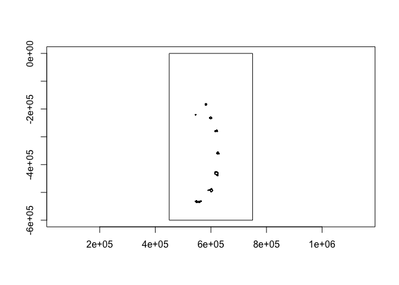
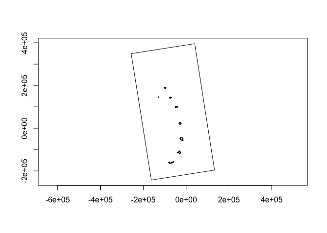

Crawling first 10 individuals
================
Gemma Clucas
6/29/2020

``` r
knitr::opts_chunk$set(echo = TRUE)
library(tidyverse)
library(lubridate)
library(crawl)   #to fit Kalman filter models
library(trip)    #to prepare GPS data
library(maptools)
library(sp)
library(rgdal)
library(raster)
library(ggplot2)
library(knitr)
```

## Load data

This is the data that Phil sent over on April 1st 2020. It only includes
data for the first 10 individuals (PTTs 196697 - 196706) so I will need
to run this code a second time once we have the data for PTTs 196707 -
196716.

``` r
raw <- read.csv("raw_data/P_Trathen_chinstrap_data.csv")
```

## Prepare data for analysis

**Format times**

The date and time come in two formats in the CSV file:  
\* dd/mm/yy hh:mm  
\* dd/mm/yyyy hh:mm:ss

I can use `parse_date_time()` from the `lubridate` package to change
them into a consistent format.

``` r
raw$Time <- parse_date_time(raw$DATE, orders = c('dmy_HM', 'dmy_HMS'))
```

Create a column with the time in hours since the first fix (that is, the
first fix for all
individuals).

``` r
raw$Time_since <- as.numeric(difftime(raw$Time, min(raw$Time), units="hours"))
```

Remove duplicated rows and rename columns.

``` r
raw <- raw[!duplicated(raw), ]

raw <- raw %>% 
  rename(Argos_loc_class = LOC_CLASS, LON = LON1, LAT = LAT1)
```

## Create a map that we can plot the fixes onto later

This is the SGSSI shapefile that Vicky and I found.

``` r
Seamask<-readOGR("Seamask.shp")
```

    ## OGR data source with driver: ESRI Shapefile 
    ## Source: "/Users/gemmaclucas/GitHub/CHPE_Tracking_South_Sandwich_Islands/Seamask.shp", layer: "Seamask"
    ## with 1 features
    ## It has 1 fields

Don’t try to plot the whole thing, it takes ages. The code to use would
be `plot(Seamask,axes=T)`.  
Instead, crop to just the South Sandwich Islands
    (SSI).

``` r
SSI <- crop(Seamask, c(450000, 750000, -600000, 0))
```

    ## Warning in RGEOSUnaryPredFunc(spgeom, byid, "rgeos_isvalid"): Ring Self-
    ## intersection at or near point 77954.359424359995 26605.230663620001

    ## Warning in rgeos::gIntersection(x[i, ], y, byid = TRUE, drop_lower_td = TRUE):
    ## Invalid objects found; consider using set_RGEOS_CheckValidity(2L)

``` r
plot(SSI, axes = TRUE)
```

<!-- -->

Check the projection

``` r
crs(SSI)
```

    ## CRS arguments:
    ##  +proj=lcc +lat_1=-54 +lat_2=-54.75 +lat_0=-55 +lon_0=-37 +x_0=0 +y_0=0
    ## +datum=WGS84 +units=m +no_defs +ellps=WGS84 +towgs84=0,0,0

Re-project to Lambert Azimuthal Equal
Area

``` r
SSI_laea<-spTransform(SSI, CRS=CRS("+proj=laea +lon_0=-26 +lat_0=-58 +units=m"))
plot(SSI_laea, axes = T)
```

<!-- -->

## Pick a penguin

We need to run crawl on the tracks from each individual separately.
First, display the PTT
    numbers:

``` r
unique(raw$PTT)
```

    ##  [1] 196697 196698 196699 196700 196701 196702 196703 196704 196705 196706

We’ll start with `196697` and select the data for that individual.

``` r
penguin <- "196697"

x1 <- raw %>%
  filter(PTT == penguin)

kable(head(x1))
```

|    PTT | DATE         | Argos\_loc\_class | LOC\_IND |    LAT | NS1 |    LON | EW1 | Time                | Time\_since |
| -----: | :----------- | :---------------- | -------: | -----: | :-- | -----: | :-- | :------------------ | ----------: |
| 196697 | 6/1/20 17:14 | A                 |        0 | 57.718 | S   | 26.264 | W   | 2020-01-06 17:14:00 |   0.3833333 |
| 196697 | 6/1/20 18:33 | 1                 |       47 | 57.705 | S   | 26.244 | W   | 2020-01-06 18:33:00 |   1.7000000 |
| 196697 | 6/1/20 18:51 | 0                 |       46 | 57.704 | S   | 26.222 | W   | 2020-01-06 18:51:00 |   2.0000000 |
| 196697 | 6/1/20 20:13 | A                 |        8 | 57.686 | S   | 26.177 | W   | 2020-01-06 20:13:00 |   3.3666667 |
| 196697 | 6/1/20 20:13 | 3                 |       58 | 57.685 | S   | 26.183 | W   | 2020-01-06 20:13:00 |   3.3666667 |
| 196697 | 6/1/20 20:36 | 1                 |       46 | 57.681 | S   | 26.178 | W   | 2020-01-06 20:36:00 |   3.7500000 |

## Order error classes and correct duplicated times

View a summary of the error classes:

``` r
x1 %>% 
  group_by(Argos_loc_class) %>% 
  count() %>% 
  kable()
```

| Argos\_loc\_class |   n |
| :---------------- | --: |
| 0                 |  58 |
| 1                 | 227 |
| 2                 | 272 |
| 3                 | 131 |
| A                 | 244 |
| B                 | 436 |

There are quite a lot of low quality (B) fixes. We may need to remove
them if crawling doesn’t work very well. Make the error classes factors
in order from most accurate to least accurate.

``` r
x1$Argos_loc_class <- factor(x1$Argos_loc_class,  
                             levels=c("3","2","1","0", "A")) 
```

No idea why there are duplicated times in here still, but I get a
warning in the next step if I do not do this.

``` r
x1$Time <- adjust.duplicateTimes(x1$Time, x1$PTT)
```

## Apply McConnell speed filter in trip package to remove bad fixes

``` r
# I can't find a way to do this without making a new dataframe -_-
x2 <- x1 %>% 
  dplyr::select(LAT, LON, Time, PTT) 

#Change it into class SpatialPointsDataFrame 
coordinates(x2) <- c("LON","LAT")

# Make it into a trip object, apply speed filter and save result to new variable called Pass_speed
x2$Pass_speed <- 
  x2 %>% 
  trip(., TORnames = c("Time","PTT")) %>% 
  speedfilter(., max.speed = 20) 
```

    ## Warning in assume_if_longlat(out): input looks like longitude/latitude data,
    ## assuming +proj=longlat +datum=WGS84

``` r
# Filter the original dataframe
x1 <- x1 %>% dplyr::filter(x2$Pass_speed == TRUE)
```

## Questions to ask

1.  What is the projection of the co-ordinates?
2.  Are the times in UTC?
3.  The speed filter of 8 - is that 8km/hr? It looks like a lot of
    points are being filtered.
