Initial processing with Crawl - caching not working
================
Gemma Clucas
6/29/2020

``` r
knitr::opts_chunk$set(echo = TRUE)
library(tidyverse)
library(lubridate)
library(crawl)   #to fit Kalman filter models
library(trip)    #to prepare GPS data
library(maptools)
library(sp)
library(rgdal)
library(raster)
library(ggplot2)
library(knitr)
library(spdplyr)
options(scipen=999)
```

Note that caching the crawled tracks each penguin stopped working, so
they would get overwritten each time I knitted this document. This
document, therefore, shows the steps that I took for the first penguin
only. I ran all the other penguins multiple times until I got no (or
only a few) NAs when I ran crawl, and I have saved an image of the
tracks for each PTT for later use.

## Load data

This is the data that Claudia sent over on 30th June 2020.

``` r
raw <- read.csv("raw_data/satellite_tracking_data_30_06_20.csv")
```

## Prepare data for analysis

**Format times**

The date and time are in the format:  
\* mm/dd/yy hh:mm

I can use the `lubridate` package to change them into a proper
date-time.

``` r
raw$Time <- mdy_hm(raw$Date, tz = "UTC")
```

Create a column with the time in hours since the first fix (that is, the
first fix for all
individuals).

``` r
raw$Time_since <- as.numeric(difftime(raw$Time, min(raw$Time), units="hours"))
```

Remove duplicated rows and rename columns.

``` r
raw <- raw[!duplicated(raw), ]

raw <- raw %>% 
  rename(Argos_loc_class = Loc.Class, LON = Lon1, LAT = Lat1)
```

At this stage I’m going to remove all the other columns from the
dataframe and just keep the ones we will work with.

``` r
clean <- raw %>% 
  dplyr::select(Ptt, Time, Time_since, LON, LAT, Argos_loc_class, Uplink)
```

## Create a map that we can plot the fixes onto later

This is the SGSSI shapefile that Vicky and I found.

``` r
Seamask<-readOGR("Seamask.shp")
```

    ## OGR data source with driver: ESRI Shapefile 
    ## Source: "/Users/gemmaclucas/GitHub/CHPE_Tracking_South_Sandwich_Islands/Seamask.shp", layer: "Seamask"
    ## with 1 features
    ## It has 1 fields

Don’t try to plot the whole thing, it takes ages as it includes all of
South Georgia. The code to use would be `plot(Seamask,axes=T)`.

Instead, crop to just the South Sandwich Islands (SSI) and convert to a
dataframe that can be plotted with ggplot. The code for doing the
conversion is from
<https://github.com/tidyverse/ggplot2/wiki/plotting-polygon-shapefiles>

``` r
SSI <- crop(Seamask, c(450000, 750000, -600000, -100000))

# convert to dataframe for use with ggplot2
SSI@data$id = rownames(SSI@data)
SSI.points = fortify(SSI, region="id")
SSI.df = plyr::join(SSI.points, SSI@data, by="id")

# NB all the polygons for the islands have hole == TRUE, so I am filtering for these.
# the polygon for the sea has hole == FALSE, so I don't need to plot that.
SSI.df %>% dplyr::filter(hole == TRUE) %>% 
  ggplot(aes(x = long, y = lat, group = group)) + 
  geom_polygon(fill="grey") +
  geom_path(color="grey") +
  coord_equal() +
  theme_bw() +
  xlim(450000, 750000) +
  ylim(-600000, -100000) +
  theme(panel.grid.major = element_blank(), 
        panel.grid.minor = element_blank(),
        panel.background = element_rect(fill = "aliceblue"))
```

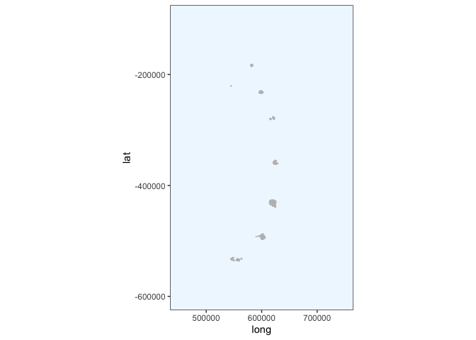<!-- -->

Check the projection

``` r
crs(SSI)
```

    ## CRS arguments:
    ##  +proj=lcc +lat_1=-54 +lat_2=-54.75 +lat_0=-55 +lon_0=-37 +x_0=0 +y_0=0
    ## +datum=WGS84 +units=m +no_defs +ellps=WGS84 +towgs84=0,0,0

Re-project to Lambert Azimuthal Equal
Area

``` r
SSI_laea<-spTransform(SSI, CRS=CRS("+proj=laea +lon_0=-26 +lat_0=-58 +units=m"))

# convert to dataframe for use with ggplot2
SSI_laea@data$id = rownames(SSI_laea@data)
SSI_laea.points = fortify(SSI_laea, region="id")
SSI_laea.df = plyr::join(SSI_laea.points, SSI_laea@data, by="id")

# filter out only the polygons for the islands
SSI_laea.df <- SSI_laea.df %>% filter(hole == TRUE)


SSI_laea.df %>% 
  ggplot(aes(x = long, y = lat, group = group)) + 
  geom_polygon(fill="grey") +
  geom_path(color="grey") +
  coord_equal() +
  theme_bw() +
  theme(panel.grid.major = element_blank(), 
        panel.grid.minor = element_blank(),
        panel.background = element_rect(fill = "aliceblue"))
```

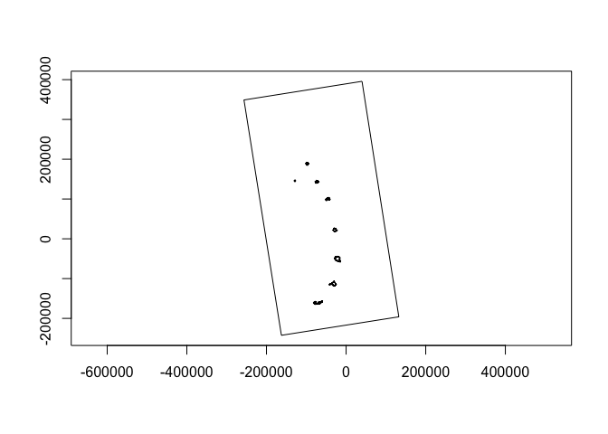<!-- -->

## Pick a penguin

We need to run crawl on the tracks from each individual separately.
First, display the PTT
    numbers:

``` r
unique(clean$Ptt)
```

    ##  [1] 196697 196698 196699 196700 196701 196702 196703 196704 196705 196706
    ## [11] 196707 196708 196709 196710 196711 196712 196713 196714 196715 196716

We’ll start with `196697` and select the data for that individual.

``` r
penguin <- "196697"

x1 <- clean %>%
  dplyr::filter(Ptt == penguin)

kable(head(x1))
```

|    Ptt | Time                | Time\_since |      LON |      LAT | Argos\_loc\_class | Uplink |
| -----: | :------------------ | ----------: | -------: | -------: | :---------------- | -----: |
| 196697 | 2020-01-06 17:14:00 |    0.400000 | \-26.264 | \-57.718 | A                 |      1 |
| 196697 | 2020-01-06 18:33:00 |    1.716667 | \-26.244 | \-57.705 | 1                 |      2 |
| 196697 | 2020-01-06 18:51:00 |    2.016667 | \-26.222 | \-57.704 | 0                 |      3 |
| 196697 | 2020-01-06 20:13:00 |    3.383333 | \-26.177 | \-57.686 | A                 |      5 |
| 196697 | 2020-01-06 20:13:00 |    3.383333 | \-26.183 | \-57.685 | 3                 |      5 |
| 196697 | 2020-01-06 20:36:00 |    3.766667 | \-26.178 | \-57.681 | 1                 |      6 |

## Order error classes and correct duplicated times

View a summary of the error classes:

``` r
x1 %>% 
  dplyr::group_by(Argos_loc_class) %>% 
  count() %>% 
  kable()
```

| Argos\_loc\_class |   n |
| :---------------- | --: |
| 0                 |  58 |
| 1                 | 227 |
| 2                 | 272 |
| 3                 | 131 |
| A                 | 244 |
| B                 | 436 |

There are quite a lot of low quality (B) fixes. We may need to remove
them if crawling doesn’t work very well. Make the error classes factors
and put them in order from most accurate to least accurate.

``` r
x1$Argos_loc_class <- factor(x1$Argos_loc_class,  
                             levels=c("3","2","1","0", "A","B")) 
```

No idea why there are duplicated times in here still, but I get a
warning in the next step if I do not do this.

``` r
x1$Time <- adjust.duplicateTimes(x1$Time, x1$Ptt)
```

## Apply McConnell speed filter in trip package to remove bad fixes

``` r
# I can't find a way to do this without making a new dataframe x2
x2 <- x1 %>% 
  dplyr::select(LAT, LON, Time, Ptt) 

#Change it into class SpatialPointsDataFrame 
coordinates(x2) <- c("LON","LAT")

# Make it into a trip object, apply speed filter and save result to new variable called Pass_speed
x2$Pass_speed <- 
  x2 %>% 
  trip(., TORnames = c("Time","Ptt")) %>% 
  speedfilter(., max.speed = 8) 
```

    ## Warning in assume_if_longlat(out): input looks like longitude/latitude data,
    ## assuming +proj=longlat +datum=WGS84

``` r
# Filter the original dataframe
x1 <- x1 %>% dplyr::filter(x2$Pass_speed == TRUE)
```

## Make the data spatial and project to Lambert Azimuthal Equal Area

``` r
coordinates(x1) <- ~LON + LAT
```

First we have to give it a projection i.e. tell it it is in long lat
with WGS84.

``` r
proj4string(x1) <- CRS("+proj=longlat +ellps=WGS84")
```

Then we reproject it to laea. This is just centered on the long and lat
of Saunders for now, maybe change to UTM zones later - **check
this**

``` r
x1 <- spTransform(x1, CRS = CRS("+proj=laea +lon_0=-26 +lat_0=-58 +units=m"))
```

We can now plot it with our laea projection of the islands. We have to
convert the `SpatialPointsDataFrame` to a regular dataframe, `x1.df`
before plotting.

``` r
x1.df <- data.frame(x1)

ggplot() + 
  geom_polygon(data = SSI_laea.df, aes(x = long, y = lat, group = group), fill="grey80") +
  geom_path(data = SSI_laea.df, aes(x = long, y = lat, group = group), color="grey80") +
  coord_equal() +
  theme_bw() +
  theme(panel.grid.major = element_blank(), 
        panel.grid.minor = element_blank(),
        panel.background = element_rect(fill = "aliceblue")) +
  geom_point(data = x1.df, aes(x = LON, y = LAT), colour = "orange")
```

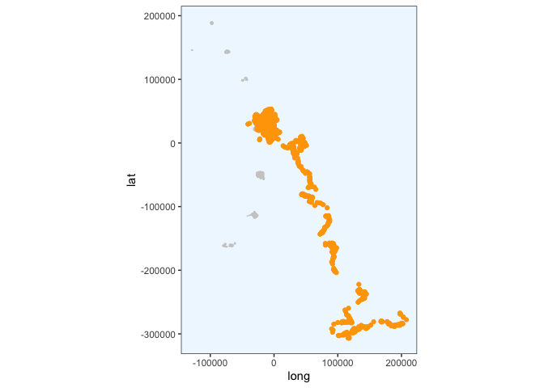<!-- -->

## Set inital params for `crawl`

I took these from the [pragmatic guide to
crawling](https://jmlondon.github.io/crawl-workshop/crawl-practical.html#determining-your-model-parameters)
and modified them for our data, so that the first co-ordinate is used to
initialise `a` and the `P` params are from the guide:

> “When choosing the initial parameters, it is typical to have the mean
> centered on the first observation with zero velocity. a is the
> starting location for the model – the first known coordinate; and P is
> a 4x4 var-cov matrix that specifies the error (in projected units) for
> the initial coordinates.”

``` r
initial = list(a = c(coordinates(x1)[1,1], 0,
                     coordinates(x1)[1,2], 0),
               P = diag(c(10 ^ 2, 10 ^ 2, 10 ^ 2, 10 ^ 2)))
```

## Add location error priors

From the pragmatic guide:

> "The second option is to provide a prior distribution for each of the
> location quality classes. The crawl::crwMLE() function accepts a
> function for the ‘prior’ argument. In this example, we provide a
> normal distribution of the log-transformed error. The standard error
> is 0.2.

``` r
prior <-  function(p) { 
    dnorm(p[1], log(250), 0.2 , log = TRUE) +     # prior for 3
      dnorm(p[2], log(500), 0.2 , log = TRUE) +   # prior for 2
      dnorm(p[3], log(1500), 0.2, log = TRUE) +   # prior for 1
      dnorm(p[4], log(2500), 0.4 , log = TRUE) +  # prior for 0
      dnorm(p[5], log(2500), 0.4 , log = TRUE) +  # prior for A
      dnorm(p[6], log(2500), 0.4 , log = TRUE) +  # prior for B
      # skip p[7] as we won't provide a prior for sigma
      dnorm(p[8], -4, 2, log = TRUE)              # prior for beta
}
```

> "Previous documentation and examples that described a setup for
> ‘crawl’ often suggested users implement a mixed approach by
> providing both fixed values and constraints to optimize the fit and
> increase the model’s ability to converge with limited/challenging
> data. We now suggest users rely on prior distributions to achieve a
> similar intent but provide the model more flexibility. Users should
> feel free to explore various distributions and approaches for
> describing the priors (e.g. laplace, log-normal) based on their data
> and research questions.

> “Those documents also often suggested fixing the beta parameter to 4
> as the best approach to encourage challenging datasets to fit. This,
> essentially, forced the fit toward Brownian movement. We now suggest
> users rely on the prior distribution centered on -4 (smoother fit)
> and, if needed, fix the beta parameter to -4. Only fix the parameter
> to 4 as a final resort.”

Note that the guide used to suggest a standard deviation of 2 for the
beta prior as well, but that seems to have been removed from the
documentation.

## Run crawl (many times)

First remove any results from previous runs, then run it, saving the
results to `fit1`. Note that I am caching the results from this section
of code so that crawl is not re-run everytime I knit the document.
**EDIT: the caching is broken, so ignore the results from this section.
I ran it until I got no NAs and the tracks looked good before I saved
the result.**

``` r
if(exists("fit1")){rm(fit1)} 

fit1 <- crwMLE( 
  mov.model = ~1, 
  err.model=list(x=~Argos_loc_class-1), 
  drift=T, 
  data=x1, 
  Time.name="Time_since",  #method="L-BFGS-B",
  initial.state=initial, 
  prior=prior, 
  control=list(trace=1, REPORT=1) 
) 
```

    ##   Nelder-Mead direct search function minimizer
    ## function value for initial parameters = 106180882.509958
    ##   Scaled convergence tolerance is 1.58222
    ## Stepsize computed as 9.224206
    ## BUILD             11 106229079.421377 483056.495503
    ## LO-REDUCTION      13 106206564.255236 483056.495503
    ## LO-REDUCTION      15 106200018.867965 483056.495503
    ## LO-REDUCTION      17 106181181.205924 483056.495503
    ## LO-REDUCTION      19 106180882.509958 483056.495503
    ## LO-REDUCTION      21 106180882.509958 483056.495503
    ## EXTENSION         23 106180882.509958 427649.358008
    ## LO-REDUCTION      25 106174135.267467 427649.358008
    ## LO-REDUCTION      27 106173516.249902 427649.358008
    ## LO-REDUCTION      29 84136492.149117 427649.358008
    ## EXTENSION         31 3074269.786674 393241.906717
    ## LO-REDUCTION      33 1706113.130272 393241.906717
    ## LO-REDUCTION      35 958563.499911 393241.906717
    ## LO-REDUCTION      37 629209.963915 393241.906717
    ## LO-REDUCTION      39 495846.235511 393241.906717
    ## LO-REDUCTION      41 483056.495503 393241.906717
    ## EXTENSION         43 439311.901029 326317.804149
    ## LO-REDUCTION      45 434632.880026 326317.804149
    ## LO-REDUCTION      47 434546.801306 326317.804149
    ## LO-REDUCTION      49 433518.429234 326317.804149
    ## LO-REDUCTION      51 431327.036903 326317.804149
    ## LO-REDUCTION      53 429912.760820 326317.804149
    ## LO-REDUCTION      55 427649.358008 326317.804149
    ## LO-REDUCTION      57 419791.993976 326317.804149
    ## EXTENSION         59 418261.168607 273239.386291
    ## LO-REDUCTION      61 393241.906717 273239.386291
    ## LO-REDUCTION      63 389598.544235 273239.386291
    ## LO-REDUCTION      65 383237.323511 273239.386291
    ## LO-REDUCTION      67 375229.073484 273239.386291
    ## EXTENSION         69 365393.856289 231871.155131
    ## LO-REDUCTION      71 356072.958956 231871.155131
    ## LO-REDUCTION      73 342899.461892 231871.155131
    ## EXTENSION         75 329875.902633 191871.883790
    ## LO-REDUCTION      77 326317.804149 191871.883790
    ## LO-REDUCTION      79 300469.203938 191871.883790
    ## LO-REDUCTION      81 291353.881488 191871.883790
    ## LO-REDUCTION      83 283246.542357 191871.883790
    ## REFLECTION        85 282940.230028 190057.255403
    ## EXTENSION         87 273239.386291 137409.746020
    ## LO-REDUCTION      89 244722.432644 137409.746020
    ## LO-REDUCTION      91 232170.676861 137409.746020
    ## LO-REDUCTION      93 231871.155131 137409.746020
    ## LO-REDUCTION      95 203225.337135 137409.746020
    ## HI-REDUCTION      97 198478.339199 137409.746020
    ## LO-REDUCTION      99 198411.863046 137409.746020
    ## LO-REDUCTION     101 197173.862101 137409.746020
    ## LO-REDUCTION     103 191871.883790 137409.746020
    ## LO-REDUCTION     105 190057.255403 137409.746020
    ## LO-REDUCTION     107 182498.077173 137409.746020
    ## HI-REDUCTION     109 178870.533700 137409.746020
    ## LO-REDUCTION     111 176017.359471 137409.746020
    ## LO-REDUCTION     113 173147.482826 137409.746020
    ## EXTENSION        115 167814.726178 126347.309752
    ## EXTENSION        117 163011.954942 108434.530249
    ## LO-REDUCTION     119 162242.701060 108434.530249
    ## LO-REDUCTION     121 161997.596875 108434.530249
    ## LO-REDUCTION     123 159634.282090 108434.530249
    ## LO-REDUCTION     125 147863.579829 108434.530249
    ## LO-REDUCTION     127 146916.629383 108434.530249
    ## EXTENSION        129 145830.296225 90946.954725
    ## LO-REDUCTION     131 145172.729217 90946.954725
    ## EXTENSION        133 142660.944509 71144.114675
    ## LO-REDUCTION     135 137409.746020 71144.114675
    ## LO-REDUCTION     137 126347.309752 71144.114675
    ## LO-REDUCTION     139 126246.754019 71144.114675
    ## REFLECTION       141 119924.178413 70809.466963
    ## HI-REDUCTION     143 114482.016284 70809.466963
    ## REFLECTION       145 112185.304446 70094.587786
    ## HI-REDUCTION     147 108434.530249 70094.587786
    ## HI-REDUCTION     149 106853.135504 70094.587786
    ## REFLECTION       151 103937.646363 61578.849427
    ## HI-REDUCTION     153 96983.491176 61578.849427
    ## HI-REDUCTION     155 94108.909918 61578.849427
    ## HI-REDUCTION     157 90946.954725 61578.849427
    ## LO-REDUCTION     159 90110.363773 61578.849427
    ## HI-REDUCTION     161 86334.301568 61578.849427
    ## HI-REDUCTION     163 86015.520853 61578.849427
    ## LO-REDUCTION     165 84402.063282 61578.849427
    ## LO-REDUCTION     167 81359.827490 61578.849427
    ## LO-REDUCTION     169 80436.494741 61578.849427
    ## LO-REDUCTION     171 79308.241367 61578.849427
    ## REFLECTION       173 76895.404097 60899.768475
    ## HI-REDUCTION     175 71144.114675 60899.768475
    ## EXTENSION        177 70809.466963 56809.897959
    ## LO-REDUCTION     179 70094.587786 56809.897959
    ## REFLECTION       181 69510.664113 54608.509137
    ## REFLECTION       183 69472.872701 52177.749900
    ## REFLECTION       185 68793.575802 50871.782320
    ## HI-REDUCTION     187 65683.722230 50871.782320
    ## EXTENSION        189 63933.790059 48103.297020
    ## LO-REDUCTION     191 62480.488114 48103.297020
    ## LO-REDUCTION     193 61867.049011 48103.297020
    ## LO-REDUCTION     195 61578.849427 47731.318187
    ## LO-REDUCTION     197 60899.768475 47731.318187
    ## LO-REDUCTION     199 57919.944694 47731.318187
    ## REFLECTION       201 56809.897959 44191.181027
    ## LO-REDUCTION     203 54608.509137 44191.181027
    ## LO-REDUCTION     205 52177.749900 44191.181027
    ## LO-REDUCTION     207 50871.782320 44191.181027
    ## EXTENSION        209 50683.047784 40430.155767
    ## HI-REDUCTION     211 49744.108674 40430.155767
    ## LO-REDUCTION     213 48891.883240 40430.155767
    ## LO-REDUCTION     215 48103.297020 40430.155767
    ## LO-REDUCTION     217 47943.219166 40430.155767
    ## LO-REDUCTION     219 47731.318187 40430.155767
    ## LO-REDUCTION     221 47007.320671 40430.155767
    ## LO-REDUCTION     223 46940.542602 40430.155767
    ## LO-REDUCTION     225 46658.994686 40430.155767
    ## LO-REDUCTION     227 45807.499812 40276.481687
    ## REFLECTION       229 44280.990234 39758.622607
    ## LO-REDUCTION     231 44191.181027 39758.622607
    ## LO-REDUCTION     233 42540.000047 39202.296117
    ## LO-REDUCTION     235 42355.257838 39202.296117
    ## LO-REDUCTION     237 42096.013343 39202.296117
    ## LO-REDUCTION     239 41657.083964 39202.296117
    ## REFLECTION       241 41316.066943 38993.953038
    ## LO-REDUCTION     243 41057.889902 38991.061418
    ## LO-REDUCTION     245 40430.155767 38813.926078
    ## HI-REDUCTION     247 40276.481687 38813.926078
    ## EXTENSION        249 39843.952421 37995.155540
    ## LO-REDUCTION     251 39758.622607 37995.155540
    ## LO-REDUCTION     253 39524.144924 37995.155540
    ## LO-REDUCTION     255 39491.005269 37995.155540
    ## REFLECTION       257 39395.959664 37917.019537
    ## LO-REDUCTION     259 39369.424065 37917.019537
    ## REFLECTION       261 39202.296117 37828.881624
    ## LO-REDUCTION     263 38993.953038 37828.881624
    ## LO-REDUCTION     265 38991.061418 37828.881624
    ## LO-REDUCTION     267 38813.926078 37828.881624
    ## LO-REDUCTION     269 38713.761125 37828.881624
    ## REFLECTION       271 38667.889993 37807.542367
    ## LO-REDUCTION     273 38603.753658 37807.542367
    ## REFLECTION       275 38601.407167 37653.506629
    ## LO-REDUCTION     277 38285.680409 37634.813959
    ## LO-REDUCTION     279 38082.809138 37634.813959
    ## LO-REDUCTION     281 38018.986206 37634.813959
    ## LO-REDUCTION     283 37995.155540 37624.252815
    ## HI-REDUCTION     285 37917.019537 37624.252815
    ## LO-REDUCTION     287 37887.917647 37624.252815
    ## HI-REDUCTION     289 37869.061369 37624.252815
    ## REFLECTION       291 37828.881624 37577.315045
    ## HI-REDUCTION     293 37807.542367 37577.315045
    ## LO-REDUCTION     295 37749.386665 37577.315045
    ## LO-REDUCTION     297 37739.539500 37577.315045
    ## LO-REDUCTION     299 37699.986658 37577.315045
    ## HI-REDUCTION     301 37681.827605 37577.315045
    ## LO-REDUCTION     303 37674.278711 37577.315045
    ## LO-REDUCTION     305 37668.698935 37577.315045
    ## LO-REDUCTION     307 37653.506629 37574.543004
    ## REFLECTION       309 37634.813959 37553.016262
    ## LO-REDUCTION     311 37624.252815 37553.016262
    ## EXTENSION        313 37623.421604 37503.557548
    ## LO-REDUCTION     315 37604.992618 37503.557548
    ## LO-REDUCTION     317 37599.928084 37503.557548
    ## LO-REDUCTION     319 37599.166046 37503.557548
    ## LO-REDUCTION     321 37587.822250 37503.557548
    ## EXTENSION        323 37579.423394 37481.537678
    ## LO-REDUCTION     325 37577.315045 37481.537678
    ## LO-REDUCTION     327 37574.543004 37481.537678
    ## EXTENSION        329 37563.930444 37474.514495
    ## LO-REDUCTION     331 37553.016262 37474.514495
    ## LO-REDUCTION     333 37547.243418 37474.514495
    ## EXTENSION        335 37542.381553 37424.165408
    ## LO-REDUCTION     337 37532.396291 37424.165408
    ## LO-REDUCTION     339 37531.499181 37424.165408
    ## LO-REDUCTION     341 37513.673749 37424.165408
    ## LO-REDUCTION     343 37503.557548 37424.165408
    ## REFLECTION       345 37496.968117 37420.660947
    ## LO-REDUCTION     347 37490.974344 37420.660947
    ## REFLECTION       349 37481.537678 37419.610518
    ## LO-REDUCTION     351 37479.942069 37419.610518
    ## LO-REDUCTION     353 37474.514495 37419.610518
    ## REFLECTION       355 37448.972246 37404.090722
    ## EXTENSION        357 37433.155658 37381.768293
    ## LO-REDUCTION     359 37431.824530 37381.768293
    ## LO-REDUCTION     361 37426.362449 37381.768293
    ## LO-REDUCTION     363 37425.876696 37381.768293
    ## LO-REDUCTION     365 37425.393451 37381.768293
    ## HI-REDUCTION     367 37424.165408 37381.768293
    ## LO-REDUCTION     369 37422.369053 37381.768293
    ## LO-REDUCTION     371 37420.660947 37381.768293
    ## LO-REDUCTION     373 37419.610518 37381.768293
    ## LO-REDUCTION     375 37406.737741 37381.768293
    ## LO-REDUCTION     377 37406.339813 37381.768293
    ## LO-REDUCTION     379 37405.414380 37381.768293
    ## LO-REDUCTION     381 37404.090722 37381.768293
    ## LO-REDUCTION     383 37402.687459 37381.768293
    ## EXTENSION        385 37402.479992 37371.783221
    ## LO-REDUCTION     387 37395.769742 37371.783221
    ## LO-REDUCTION     389 37394.397571 37371.783221
    ## EXTENSION        391 37391.750071 37371.207177
    ## REFLECTION       393 37391.465501 37370.956414
    ## LO-REDUCTION     395 37388.332420 37370.956414
    ## REFLECTION       397 37386.466930 37368.957753
    ## REFLECTION       399 37384.922111 37365.897766
    ## HI-REDUCTION     401 37384.803869 37365.897766
    ## LO-REDUCTION     403 37381.768293 37365.897766
    ## REFLECTION       405 37377.718942 37365.619208
    ## LO-REDUCTION     407 37376.626841 37365.619208
    ## REFLECTION       409 37373.567824 37364.222579
    ## EXTENSION        411 37373.189277 37358.915135
    ## LO-REDUCTION     413 37371.783221 37358.915135
    ## HI-REDUCTION     415 37371.207177 37358.915135
    ## EXTENSION        417 37370.956414 37353.951742
    ## LO-REDUCTION     419 37368.957753 37353.951742
    ## LO-REDUCTION     421 37367.231372 37353.951742
    ## LO-REDUCTION     423 37366.674087 37353.951742
    ## LO-REDUCTION     425 37366.407889 37353.951742
    ## LO-REDUCTION     427 37365.918299 37353.951742
    ## LO-REDUCTION     429 37365.897766 37353.951742
    ## LO-REDUCTION     431 37365.619208 37353.951742
    ## EXTENSION        433 37364.222579 37345.037434
    ## LO-REDUCTION     435 37361.917127 37345.037434
    ## LO-REDUCTION     437 37361.879840 37345.037434
    ## LO-REDUCTION     439 37358.915135 37345.037434
    ## LO-REDUCTION     441 37358.116917 37345.037434
    ## EXTENSION        443 37357.816114 37341.515330
    ## LO-REDUCTION     445 37357.518561 37341.515330
    ## EXTENSION        447 37356.219859 37339.566232
    ## EXTENSION        449 37355.657352 37337.910254
    ## LO-REDUCTION     451 37353.951742 37337.910254
    ## REFLECTION       453 37350.206558 37336.126283
    ## LO-REDUCTION     455 37348.815350 37336.126283
    ## LO-REDUCTION     457 37347.058340 37336.126283
    ## LO-REDUCTION     459 37346.623166 37336.126283
    ## REFLECTION       461 37346.227226 37334.651441
    ## LO-REDUCTION     463 37345.037434 37334.651441
    ## LO-REDUCTION     465 37341.515330 37334.651441
    ## LO-REDUCTION     467 37341.273476 37334.651441
    ## LO-REDUCTION     469 37340.018377 37334.651441
    ## EXTENSION        471 37339.566232 37329.259991
    ## LO-REDUCTION     473 37337.910254 37329.259991
    ## LO-REDUCTION     475 37337.875984 37329.259991
    ## LO-REDUCTION     477 37336.384750 37329.259991
    ## LO-REDUCTION     479 37336.126283 37329.259991
    ## HI-REDUCTION     481 37336.065617 37329.259991
    ## LO-REDUCTION     483 37335.864446 37329.259991
    ## LO-REDUCTION     485 37335.823013 37329.259991
    ## LO-REDUCTION     487 37335.583154 37329.259991
    ## EXTENSION        489 37334.651441 37325.675717
    ## LO-REDUCTION     491 37333.472090 37325.675717
    ## LO-REDUCTION     493 37333.451284 37325.675717
    ## LO-REDUCTION     495 37333.337245 37325.675717
    ## LO-REDUCTION     497 37332.778343 37325.675717
    ## LO-REDUCTION     499 37331.908631 37325.675717
    ## Exiting from Nelder Mead minimizer
    ##     501 function evaluations used
    ## 
    ## Cannot calculate covariance matrix

``` r
fit1 
```

    ## 
    ## 
    ## Continuous-Time Correlated Random Walk fit
    ## 
    ## Models:
    ## --------
    ## Movement   ~ 1
    ## Error   ~Argos_loc_class - 1
    ## with Random Drift
    ## 
    ##                         Parameter Est. St. Err. 95% Lower 95% Upper
    ## ln tau Argos_loc_class3          5.885       NA        NA        NA
    ## ln tau Argos_loc_class2          5.535       NA        NA        NA
    ## ln tau Argos_loc_class1          4.303       NA        NA        NA
    ## ln tau Argos_loc_class0         -0.412       NA        NA        NA
    ## ln tau Argos_loc_classA         -3.267       NA        NA        NA
    ## ln tau Argos_loc_classB          0.411       NA        NA        NA
    ## ln sigma (Intercept)             7.773       NA        NA        NA
    ## ln beta (Intercept)             44.126       NA        NA        NA
    ## ln sigma.drift/sigma           -52.246       NA        NA        NA
    ## ln psi-1                       102.753       NA        NA        NA
    ## 
    ## 
    ## Log Likelihood = -18662.838 
    ## AIC = 37345.676

## Predict locations at 5 minute intervals

First make a new set of times, spaced by 5 minutes, to predict locations
for.

``` r
predTime <- seq(min(x1$Time_since), max(x1$Time_since), 1/12)
```

Then predict the location for each time point in `predTime`. The
`predObj` dataframe that is produced contains the original locations
from `x1`, but adds rows in between for the predicted locations at the
time given in `predTime`. The predicted locations are stored in
`predObj$mu.x` and
`predObj$mu.y`.

``` r
predObj <- crwPredict(object.crwFit = fit1, predTime = predTime, speedEst = TRUE, flat=TRUE) 
kable(head(predObj))
```

|   |   TimeNum | locType |    Ptt | Time                | Time\_since | Argos\_loc\_class | Uplink |        LON |      LAT |       mu.x |  theta.x | gamma.x |     mu.y |  theta.y | gamma.y |
| - | --------: | :------ | -----: | :------------------ | ----------: | :---------------- | -----: | ---------: | -------: | ---------: | -------: | ------: | -------: | -------: | ------: |
| 1 | 0.4000000 | p       | 196697 | 2020-01-06 17:14:00 |   0.4000000 | A                 |      1 | \-15733.54 | 31377.18 | \-15733.54 | 903.8475 |       0 | 31377.18 | 1102.492 |       0 |
| 3 | 0.4833333 | p       | 196697 | NA                  |   0.4833333 | NA                |     NA |         NA |       NA | \-15658.22 | 903.8475 |       0 | 31469.06 | 1102.492 |       0 |
| 4 | 0.5666667 | p       | 196697 | NA                  |   0.5666667 | NA                |     NA |         NA |       NA | \-15582.90 | 903.8475 |       0 | 31560.93 | 1102.492 |       0 |
| 5 | 0.6500000 | p       | 196697 | NA                  |   0.6500000 | NA                |     NA |         NA |       NA | \-15507.58 | 903.8475 |       0 | 31652.81 | 1102.492 |       0 |
| 6 | 0.7333333 | p       | 196697 | NA                  |   0.7333333 | NA                |     NA |         NA |       NA | \-15432.26 | 903.8475 |       0 | 31744.68 | 1102.492 |       0 |
| 7 | 0.8166667 | p       | 196697 | NA                  |   0.8166667 | NA                |     NA |         NA |       NA | \-15356.94 | 903.8475 |       0 | 31836.55 | 1102.492 |       0 |

## Plot the crawled tracks

I want to plot the crawled track against the original data i.e. before
the speed filter was applied. This means that I need to go back and
filter the data for this penguin from the `clean` dataframe and project
it to LAEA before I can plot it against `predObj`.

``` r
par(mfrow=c(1,1))

# get the original data for this penguin
x3 <- clean %>%
  dplyr::filter(Ptt == penguin)

# project to LAEA
coordinates(x3) <- ~LON + LAT 
proj4string(x3) <- CRS("+proj=longlat +ellps=WGS84")
x3 <- spTransform(x3, CRS = CRS("+proj=laea +lon_0=-26 +lat_0=-58 +units=m"))

# get just the coordinates from x3
x3 <- coordinates(x3) %>% 
  as.data.frame()

#
colors <- c("Raw points" = "orangered", "McConnel speed filtered points" = "orange")


# plot
ggplot() + 
  geom_polygon(data = SSI_laea.df, aes(x = long, y = lat, group = group), fill="grey50") +
  geom_path(data = SSI_laea.df, aes(x = long, y = lat, group = group), color="grey50") +
  coord_equal() +
  geom_point(data = x3, aes(x = LON, y = LAT, colour = "Raw points") ) +
  geom_point(data = x1.df, aes(x = LON, y = LAT, colour = "McConnel speed filtered points")) +
  geom_path(data = predObj, aes(x = mu.x, y = mu.y)) +
  scale_color_manual(values = colors) +
  theme_bw() +
  theme(panel.grid.major = element_blank(), 
        panel.grid.minor = element_blank(),
        panel.background = element_rect(fill = "aliceblue"),
        legend.title = element_blank()) 
```

<!-- -->

## Add absolute times for the predicted positions back to the dataframe `predObj`

``` r
predObj$Time_absolute <- as.POSIXct(3600 * (predObj$Time_since ), origin = min(raw$Time), tz="UTC") 
```

## Write the predicted positions to csv for use later

Commented out so that I don’t overwrite the results that I want to keep
each time I knit the
doc.

``` r
#write.csv(predObj, paste0("predicted_tracks/", penguin, "_track.csv", sep = ""), row.names = FALSE)
```

# Run for the other penguins in the dataset - except caching the results isn’t working so the crawled tracks look hideous

This gives an idea of what I was doing for each one though.

## Create functions for the different steps

I am going to define functions to select and clean the data, and plot
it, to reduce the amount of code that I have to
re-write.

``` r
# define the function for selecting the data for one penguin and applying to McConnel speed filter
filter_points <-  function(penguin) {
  # select the data for the penguin
  x1 <- clean %>% dplyr::filter(Ptt == penguin)
  # order error classes
  x1$Argos_loc_class <- factor(x1$Argos_loc_class,  
                             levels=c("3","2","1","0", "A","B"))
  # adjust duplicate times
  x1$Time <- adjust.duplicateTimes(x1$Time, x1$Ptt)
  # select just the latitude, longitude, time and id columns
  x2 <- x1 %>% dplyr::select(LAT, LON, Time, Ptt)
  # make it spatial
  coordinates(x2) <- c("LON","LAT")
  # apply McConnel speed filter
  x2$Pass_speed <- x2 %>% 
    trip(., TORnames = c("Time","Ptt")) %>% 
    speedfilter(., max.speed = 8) 
  # filter the original data for the points that pass the speed filter
  x1 <- x1 %>% dplyr::filter(x2$Pass_speed == TRUE)
  # make the points spatial
  coordinates(x1) <- ~LON + LAT
  # give it a projection
  proj4string(x1) <- CRS("+proj=longlat +ellps=WGS84")
  # transform to LAEA centered around the south sandwich islands
  x1 <- spTransform(x1, CRS = CRS("+proj=laea +lon_0=-26 +lat_0=-58 +units=m"))
}


# define a function for plotting the cleaned data to check that it looks ok
plot_cleaned_points <- function(x) {
  ggplot() + 
    geom_polygon(data = SSI_laea.df, aes(x = long, y = lat, group = group), fill="grey80") +
    geom_path(data = SSI_laea.df, aes(x = long, y = lat, group = group), color="grey80") +
    coord_equal() +
    theme_bw() +
    theme(panel.grid.major = element_blank(), 
          panel.grid.minor = element_blank(),
          panel.background = element_rect(fill = "aliceblue")) +
    geom_point(data = x, aes(x = LON, y = LAT), colour = "orange")
}  

# define the prior for crawl
prior <-  function(p) { 
    dnorm(p[1], log(250), 0.2 , log = TRUE) +     # prior for 3
      dnorm(p[2], log(500), 0.2 , log = TRUE) +   # prior for 2
      dnorm(p[3], log(1500), 0.2, log = TRUE) +   # prior for 1
      dnorm(p[4], log(2500), 0.4 , log = TRUE) +  # prior for 0
      dnorm(p[5], log(2500), 0.4 , log = TRUE) +  # prior for A
      dnorm(p[6], log(2500), 0.4 , log = TRUE) +  # prior for B
      # skip p[7] as we won't provide a prior for sigma
      dnorm(p[8], -4, 2, log = TRUE)              # prior for beta
}


# define a function for crawling
crawl <- function(x1) {
  if(exists("fit1")){rm(fit1)}
  initial = list(a = c(coordinates(x1)[1,1], 0,
                     coordinates(x1)[1,2], 0),
               P = diag(c(10 ^ 2, 10 ^ 2, 10 ^ 2, 10 ^ 2)))
  fit1 <- crwMLE( 
    mov.model = ~1, 
    err.model=list(x=~Argos_loc_class-1), 
    drift=T, 
    data=x1, 
    Time.name="Time_since",  
    initial.state=initial, 
    prior=prior, 
    control=list(trace=1, REPORT=1)) 
}

# function for creating times where points will be predicted
predict_times <- function(x) {
  seq(min(x$Time_since), max(x$Time_since), 1/12)
}

# define a function for predicting points every 5 minutes, based on the crawled data
predict_points <- function(x, y) {
  crwPredict(object.crwFit = x, predTime = y, speedEst = TRUE, flat=TRUE)
}
  

# define a function for plotting the results of the crawled tracks against the original points
plot_crawled_track <- function() {
  # get the original data
  x3 <- clean %>% dplyr::filter(Ptt == penguin)
  # project original data to LAEA
  coordinates(x3) <- ~LON + LAT 
  proj4string(x3) <- CRS("+proj=longlat +ellps=WGS84")
  x3 <- spTransform(x3, CRS = CRS("+proj=laea +lon_0=-26 +lat_0=-58 +units=m"))
  # get just the coordinates from x3 and make a dataframe for plotting
  x3 <- coordinates(x3) %>% as.data.frame()
  # define the colour scheme
  colors <- c("Raw points" = "orangered", "McConnel speed filtered points" = "orange")
  # plot
  ggplot() + 
    geom_polygon(data = SSI_laea.df, aes(x = long, y = lat, group = group), fill="grey50") +
    geom_path(data = SSI_laea.df, aes(x = long, y = lat, group = group), color="grey50") +
    coord_equal() +
    geom_point(data = x3, aes(x = LON, y = LAT, colour = "Raw points") ) +
    geom_point(data = x1.df, aes(x = LON, y = LAT, colour = "McConnel speed filtered points")) +
    geom_path(data = predObj, aes(x = mu.x, y = mu.y)) +
    scale_color_manual(values = colors) +
    theme_bw() +
    theme(panel.grid.major = element_blank(), 
          panel.grid.minor = element_blank(),
          panel.background = element_rect(fill = "aliceblue"),
          legend.title = element_blank()) 
}

# zoom in on Saunders Island only
plot_crawled_track_Saunders <- function() {
  # get the original data
  x3 <- clean %>% dplyr::filter(Ptt == penguin)
  # project original data to LAEA
  coordinates(x3) <- ~LON + LAT 
  proj4string(x3) <- CRS("+proj=longlat +ellps=WGS84")
  x3 <- spTransform(x3, CRS = CRS("+proj=laea +lon_0=-26 +lat_0=-58 +units=m"))
  # get just the coordinates from x3 and make a dataframe for plotting
  x3 <- coordinates(x3) %>% as.data.frame()
  # define the colour scheme
  colors <- c("Raw points" = "orangered", "McConnel speed filtered points" = "orange")
  # plot
  ggplot() + 
    geom_polygon(data = SSI_laea.df, aes(x = long, y = lat, group = group), fill="grey50") +
    geom_path(data = SSI_laea.df, aes(x = long, y = lat, group = group), color="grey50") +
    coord_equal() +
    geom_point(data = x3, aes(x = LON, y = LAT, colour = "Raw points") ) +
    geom_point(data = x1.df, aes(x = LON, y = LAT, colour = "McConnel speed filtered points")) +
    geom_path(data = predObj, aes(x = mu.x, y = mu.y)) +
    scale_color_manual(values = colors) +
    theme_bw() +
    theme(panel.grid.major = element_blank(), 
          panel.grid.minor = element_blank(),
          panel.background = element_rect(fill = "aliceblue"),
          legend.title = element_blank()) +
    coord_cartesian(xlim = c(-50000, 75000),
                    ylim = c(-50000, 75000))

}
```

## Ptt 196698

``` r
penguin <- "196698"
x1 <- filter_points(penguin)
```

    ## Warning in assume_if_longlat(out): input looks like longitude/latitude data,
    ## assuming +proj=longlat +datum=WGS84

``` r
# convert to dataframe for plotting
x1.df <- data.frame(x1)
plot_cleaned_points(x1.df)
```

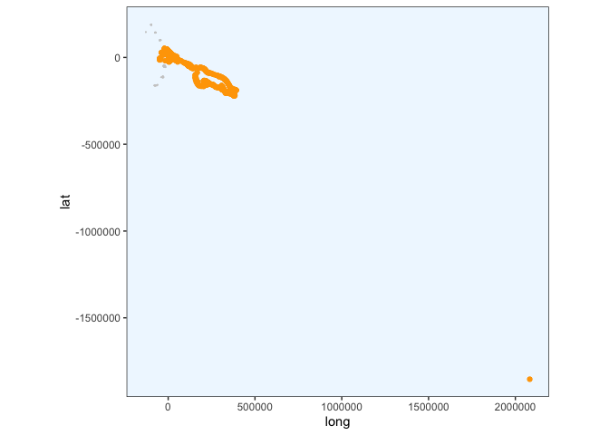<!-- -->

For this penguin, the first fix is funky. The code below removes it from
the dataframe `x1.df` and then converts this back to a
SpatialPointsDataFrame. I couldn’t get the subsetting on the SPDF `x1`
to work, so this is a roundabout solution…

``` r
x1.df <- x1.df %>% dplyr::filter(LON < 2000000)
plot_cleaned_points(x1.df)
```

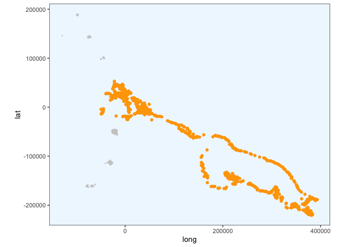<!-- -->

``` r
# then make x1.df spatial 
coordinates(x1.df) <- ~LON + LAT
# tell it it's already projected in LAEA centered around the south sandwich islands
proj4string(x1.df) <- CRS("+proj=laea +lon_0=-26 +lat_0=-58 +units=m")
# transform to LAEA centered around the south sandwich islands
x1.df <- spTransform(x1.df, CRS = CRS("+proj=laea +lon_0=-26 +lat_0=-58 +units=m"))

# rename back to x1 so that I can continue with the code below
x1 <- x1.df

# then recreate x1.df as a normal data frame
x1.df <- data.frame(x1)
```

Next we apply the `crwMLE()` function to the spatial object `x1`. Run
this multiple times until you don’t get any `NaN`s.

``` r
fit1 <- crawl(x1)
```

    ## Warning in rm(fit1): object 'fit1' not found

    ##   Nelder-Mead direct search function minimizer
    ## function value for initial parameters = 200304866.348485
    ##   Scaled convergence tolerance is 2.98478
    ## Stepsize computed as 9.224206
    ## BUILD             11 200354059.474155 499679.744550
    ## LO-REDUCTION      13 200330474.300116 499679.744550
    ## LO-REDUCTION      15 200325330.992162 499679.744550
    ## LO-REDUCTION      17 200305165.044452 499679.744550
    ## LO-REDUCTION      19 200304866.348485 499679.744550
    ## LO-REDUCTION      21 200304866.348485 499679.744550
    ## EXTENSION         23 200304866.348485 443887.129903
    ## LO-REDUCTION      25 200298119.105994 443887.129903
    ## LO-REDUCTION      27 200297500.088429 443887.129903
    ## LO-REDUCTION      29 182514662.529021 443887.129903
    ## EXTENSION         31 5442110.119927 406928.979697
    ## LO-REDUCTION      33 2847966.786902 406928.979697
    ## LO-REDUCTION      35 1438423.713607 406928.979697
    ## LO-REDUCTION      37 806615.494497 406928.979697
    ## LO-REDUCTION      39 557627.532894 406928.979697
    ## LO-REDUCTION      41 499679.744550 406928.979697
    ## EXTENSION         43 455222.374876 338603.254374
    ## LO-REDUCTION      45 450663.324301 338603.254374
    ## LO-REDUCTION      47 450540.046592 338603.254374
    ## LO-REDUCTION      49 450176.858400 338603.254374
    ## LO-REDUCTION      51 445568.764857 338603.254374
    ## LO-REDUCTION      53 445562.571412 338603.254374
    ## LO-REDUCTION      55 443887.129903 338603.254374
    ## LO-REDUCTION      57 434051.673400 338603.254374
    ## EXTENSION         59 432153.247174 287628.101753
    ## LO-REDUCTION      61 406928.979697 287628.101753
    ## LO-REDUCTION      63 403320.275823 287628.101753
    ## LO-REDUCTION      65 398343.131246 287628.101753
    ## EXTENSION         67 389338.925205 246171.786873
    ## LO-REDUCTION      69 375475.068160 246171.786873
    ## LO-REDUCTION      71 369959.421403 246171.786873
    ## EXTENSION         73 355043.742665 214357.146783
    ## LO-REDUCTION      75 342598.418929 214357.146783
    ## EXTENSION         77 338603.254374 168933.819079
    ## LO-REDUCTION      79 312407.904262 168933.819079
    ## LO-REDUCTION      81 303851.146388 168933.819079
    ## LO-REDUCTION      83 300339.971483 168933.819079
    ## LO-REDUCTION      85 287628.101753 168933.819079
    ## LO-REDUCTION      87 268469.334499 168933.819079
    ## LO-REDUCTION      89 260671.414091 168933.819079
    ## LO-REDUCTION      91 246171.786873 168933.819079
    ## LO-REDUCTION      93 226884.083587 168933.819079
    ## LO-REDUCTION      95 214357.146783 168933.819079
    ## LO-REDUCTION      97 211122.144752 168933.819079
    ## EXTENSION         99 202633.114986 158961.795498
    ## EXTENSION        101 197431.765055 129415.495901
    ## LO-REDUCTION     103 192188.627239 129415.495901
    ## LO-REDUCTION     105 191559.885152 129415.495901
    ## LO-REDUCTION     107 190979.185664 129415.495901
    ## LO-REDUCTION     109 188489.862351 129415.495901
    ## LO-REDUCTION     111 183670.209291 129415.495901
    ## EXTENSION        113 174951.408061 108240.942622
    ## LO-REDUCTION     115 172510.788789 108240.942622
    ## LO-REDUCTION     117 168933.819079 108240.942622
    ## LO-REDUCTION     119 158961.795498 108240.942622
    ## EXTENSION        121 157522.600845 94864.507029
    ## REFLECTION       123 144458.421736 92895.936315
    ## LO-REDUCTION     125 137275.327102 92895.936315
    ## HI-REDUCTION     127 137107.158067 92895.936315
    ## REFLECTION       129 134982.448426 91021.950314
    ## REFLECTION       131 130514.308251 78910.707473
    ## LO-REDUCTION     133 129415.495901 78910.707473
    ## HI-REDUCTION     135 128062.170684 78910.707473
    ## HI-REDUCTION     137 121735.573930 78910.707473
    ## HI-REDUCTION     139 111714.025132 78910.707473
    ## HI-REDUCTION     141 110234.159696 78910.707473
    ## HI-REDUCTION     143 108503.665440 78910.707473
    ## LO-REDUCTION     145 108240.942622 78910.707473
    ## LO-REDUCTION     147 107815.183290 78910.707473
    ## HI-REDUCTION     149 104751.324826 78910.707473
    ## LO-REDUCTION     151 102821.127926 78910.707473
    ## HI-REDUCTION     153 101861.015659 78910.707473
    ## LO-REDUCTION     155 98500.019479 78910.707473
    ## HI-REDUCTION     157 95271.824418 78910.707473
    ## LO-REDUCTION     159 94864.507029 78910.707473
    ## HI-REDUCTION     161 92895.936315 78910.707473
    ## LO-REDUCTION     163 91927.941794 78910.707473
    ## REFLECTION       165 91021.950314 76958.932424
    ## LO-REDUCTION     167 88596.739650 76958.932424
    ## LO-REDUCTION     169 88372.145065 76958.932424
    ## REFLECTION       171 87273.934941 76204.727847
    ## HI-REDUCTION     173 86241.052159 76204.727847
    ## REFLECTION       175 85910.789340 75780.400579
    ## LO-REDUCTION     177 83012.854485 75780.400579
    ## REFLECTION       179 82030.272573 74438.590309
    ## HI-REDUCTION     181 81095.943130 74438.590309
    ## EXTENSION        183 81065.076167 70060.235697
    ## LO-REDUCTION     185 80758.254463 70060.235697
    ## LO-REDUCTION     187 79081.513783 70060.235697
    ## EXTENSION        189 78910.707473 67157.222463
    ## LO-REDUCTION     191 78853.424586 67157.222463
    ## EXTENSION        193 76958.932424 61701.431757
    ## LO-REDUCTION     195 76948.908675 61701.431757
    ## LO-REDUCTION     197 76204.727847 61701.431757
    ## LO-REDUCTION     199 75780.400579 61701.431757
    ## REFLECTION       201 74438.590309 61266.189044
    ## REFLECTION       203 71752.442643 61102.138159
    ## LO-REDUCTION     205 70895.207201 61102.138159
    ## EXTENSION        207 70607.884494 54718.687684
    ## LO-REDUCTION     209 70060.235697 54718.687684
    ## EXTENSION        211 67157.222463 53744.272591
    ## EXTENSION        213 66900.599251 51148.695227
    ## LO-REDUCTION     215 66836.773661 51148.695227
    ## LO-REDUCTION     217 64660.398408 51148.695227
    ## REFLECTION       219 62125.969587 51114.790707
    ## LO-REDUCTION     221 61701.431757 51114.790707
    ## LO-REDUCTION     223 61266.189044 51114.790707
    ## REFLECTION       225 61102.138159 49248.005054
    ## HI-REDUCTION     227 59938.154980 49248.005054
    ## LO-REDUCTION     229 55519.975972 49248.005054
    ## LO-REDUCTION     231 55206.169563 49122.401068
    ## REFLECTION       233 55010.265035 48621.193245
    ## HI-REDUCTION     235 54718.687684 48621.193245
    ## HI-REDUCTION     237 53830.626502 48621.193245
    ## HI-REDUCTION     239 53744.272591 48621.193245
    ## LO-REDUCTION     241 51411.393396 48073.272606
    ## LO-REDUCTION     243 51262.061666 47748.904956
    ## REFLECTION       245 51148.695227 47128.945514
    ## HI-REDUCTION     247 51114.790707 47128.945514
    ## REFLECTION       249 51087.840493 46238.498688
    ## LO-REDUCTION     251 50790.125118 46238.498688
    ## LO-REDUCTION     253 49688.213776 46238.498688
    ## LO-REDUCTION     255 49248.005054 46031.845613
    ## HI-REDUCTION     257 49122.401068 46031.845613
    ## LO-REDUCTION     259 48621.193245 46031.845613
    ## LO-REDUCTION     261 48073.272606 46031.845613
    ## REFLECTION       263 47998.624428 45849.112053
    ## LO-REDUCTION     265 47748.904956 45849.112053
    ## REFLECTION       267 47288.971894 45236.416610
    ## LO-REDUCTION     269 47128.945514 45236.416610
    ## LO-REDUCTION     271 47019.668125 45236.416610
    ## LO-REDUCTION     273 46570.077190 45236.416610
    ## LO-REDUCTION     275 46541.112961 45236.416610
    ## REFLECTION       277 46334.754364 45048.477733
    ## REFLECTION       279 46238.498688 44872.401619
    ## LO-REDUCTION     281 46031.845613 44872.401619
    ## REFLECTION       283 45893.241686 44850.196592
    ## LO-REDUCTION     285 45849.112053 44850.196592
    ## LO-REDUCTION     287 45671.406275 44850.196592
    ## REFLECTION       289 45616.983583 44745.806617
    ## REFLECTION       291 45508.269097 44508.772062
    ## EXTENSION        293 45335.788346 43838.919874
    ## LO-REDUCTION     295 45294.235488 43838.919874
    ## LO-REDUCTION     297 45236.416610 43838.919874
    ## LO-REDUCTION     299 45048.477733 43838.919874
    ## LO-REDUCTION     301 44999.749514 43838.919874
    ## LO-REDUCTION     303 44872.401619 43838.919874
    ## LO-REDUCTION     305 44864.379528 43838.919874
    ## LO-REDUCTION     307 44850.196592 43838.919874
    ## LO-REDUCTION     309 44745.806617 43838.919874
    ## REFLECTION       311 44533.067700 43652.269984
    ## EXTENSION        313 44508.772062 43555.754788
    ## EXTENSION        315 44466.802226 43143.587734
    ## LO-REDUCTION     317 44353.488345 43143.587734
    ## LO-REDUCTION     319 44121.043469 43143.587734
    ## LO-REDUCTION     321 44054.547938 43143.587734
    ## EXTENSION        323 43989.072910 42998.358628
    ## EXTENSION        325 43967.765444 42619.364195
    ## LO-REDUCTION     327 43840.440032 42619.364195
    ## HI-REDUCTION     329 43838.919874 42619.364195
    ## LO-REDUCTION     331 43652.269984 42619.364195
    ## LO-REDUCTION     333 43570.789401 42619.364195
    ## LO-REDUCTION     335 43555.754788 42619.364195
    ## EXTENSION        337 43547.064468 42408.404654
    ## REFLECTION       339 43299.060112 42370.713319
    ## LO-REDUCTION     341 43164.732838 42370.713319
    ## REFLECTION       343 43143.587734 42366.580900
    ## LO-REDUCTION     345 43044.124790 42366.580900
    ## REFLECTION       347 42998.358628 42174.478181
    ## EXTENSION        349 42841.080433 41793.024926
    ## LO-REDUCTION     351 42680.025292 41793.024926
    ## LO-REDUCTION     353 42648.399376 41793.024926
    ## LO-REDUCTION     355 42633.884184 41793.024926
    ## LO-REDUCTION     357 42619.364195 41793.024926
    ## LO-REDUCTION     359 42412.407936 41793.024926
    ## LO-REDUCTION     361 42408.404654 41793.024926
    ## LO-REDUCTION     363 42370.713319 41793.024926
    ## REFLECTION       365 42366.580900 41776.267174
    ## LO-REDUCTION     367 42174.478181 41776.267174
    ## EXTENSION        369 42137.391029 41739.707673
    ## LO-REDUCTION     371 42051.712053 41739.707673
    ## REFLECTION       373 42034.832343 41732.188119
    ## REFLECTION       375 42015.931480 41685.062951
    ## EXTENSION        377 41980.708614 41544.350554
    ## REFLECTION       379 41934.857916 41528.640581
    ## LO-REDUCTION     381 41840.590992 41528.640581
    ## EXTENSION        383 41827.882452 41432.430473
    ## LO-REDUCTION     385 41793.024926 41432.430473
    ## LO-REDUCTION     387 41776.267174 41432.430473
    ## LO-REDUCTION     389 41765.775845 41432.430473
    ## LO-REDUCTION     391 41739.707673 41432.430473
    ## REFLECTION       393 41732.188119 41431.126384
    ## LO-REDUCTION     395 41685.062951 41431.043716
    ## REFLECTION       397 41586.302258 41368.239235
    ## EXTENSION        399 41572.073520 41338.047866
    ## REFLECTION       401 41544.350554 41303.519116
    ## LO-REDUCTION     403 41542.251715 41303.519116
    ## LO-REDUCTION     405 41528.640581 41303.519116
    ## LO-REDUCTION     407 41485.154361 41303.519116
    ## EXTENSION        409 41449.554338 41232.659705
    ## EXTENSION        411 41432.430473 41095.429301
    ## LO-REDUCTION     413 41431.126384 41095.429301
    ## LO-REDUCTION     415 41431.043716 41095.429301
    ## LO-REDUCTION     417 41419.662321 41095.429301
    ## LO-REDUCTION     419 41368.239235 41095.429301
    ## LO-REDUCTION     421 41354.720847 41095.429301
    ## LO-REDUCTION     423 41354.271539 41095.429301
    ## EXTENSION        425 41338.047866 40891.928974
    ## LO-REDUCTION     427 41303.519116 40891.928974
    ## LO-REDUCTION     429 41278.996528 40891.928974
    ## LO-REDUCTION     431 41232.659705 40891.928974
    ## LO-REDUCTION     433 41225.227667 40891.928974
    ## EXTENSION        435 41196.025724 40758.920293
    ## LO-REDUCTION     437 41148.712041 40758.920293
    ## LO-REDUCTION     439 41121.246109 40758.920293
    ## LO-REDUCTION     441 41100.085219 40758.920293
    ## EXTENSION        443 41095.429301 40566.373736
    ## LO-REDUCTION     445 41053.492526 40566.373736
    ## LO-REDUCTION     447 41046.395894 40566.373736
    ## EXTENSION        449 41013.815395 40387.104123
    ## LO-REDUCTION     451 40946.783527 40387.104123
    ## LO-REDUCTION     453 40891.928974 40387.104123
    ## LO-REDUCTION     455 40843.696790 40387.104123
    ## LO-REDUCTION     457 40833.845387 40387.104123
    ## EXTENSION        459 40788.266270 40014.832390
    ## LO-REDUCTION     461 40758.920293 40014.832390
    ## LO-REDUCTION     463 40697.109568 40014.832390
    ## LO-REDUCTION     465 40672.570520 40014.832390
    ## LO-REDUCTION     467 40566.373736 40014.832390
    ## LO-REDUCTION     469 40471.404847 40014.832390
    ## EXTENSION        471 40460.140002 39883.557819
    ## LO-REDUCTION     473 40423.811370 39883.557819
    ## EXTENSION        475 40419.642061 39644.149091
    ## LO-REDUCTION     477 40387.104123 39644.149091
    ## LO-REDUCTION     479 40351.147372 39644.149091
    ## REFLECTION       481 40147.323569 39615.856826
    ## LO-REDUCTION     483 40079.211437 39615.856826
    ## LO-REDUCTION     485 40065.010894 39615.856826
    ## EXTENSION        487 40042.855991 39464.806376
    ## LO-REDUCTION     489 40025.652405 39464.806376
    ## LO-REDUCTION     491 40014.832390 39464.806376
    ## LO-REDUCTION     493 39912.701359 39464.806376
    ## LO-REDUCTION     495 39883.557819 39464.806376
    ## LO-REDUCTION     497 39740.474895 39464.806376
    ## LO-REDUCTION     499 39693.581833 39464.806376
    ## Exiting from Nelder Mead minimizer
    ##     501 function evaluations used
    ## 
    ## Cannot calculate covariance matrix

``` r
print(fit1)
```

    ## 
    ## 
    ## Continuous-Time Correlated Random Walk fit
    ## 
    ## Models:
    ## --------
    ## Movement   ~ 1
    ## Error   ~Argos_loc_class - 1
    ## with Random Drift
    ## 
    ##                         Parameter Est. St. Err. 95% Lower 95% Upper
    ## ln tau Argos_loc_class3          7.007       NA        NA        NA
    ## ln tau Argos_loc_class2          5.720       NA        NA        NA
    ## ln tau Argos_loc_class1          3.537       NA        NA        NA
    ## ln tau Argos_loc_class0         -0.929       NA        NA        NA
    ## ln tau Argos_loc_classA         -0.276       NA        NA        NA
    ## ln tau Argos_loc_classB          4.511       NA        NA        NA
    ## ln sigma (Intercept)             7.959       NA        NA        NA
    ## ln beta (Intercept)             62.472       NA        NA        NA
    ## ln sigma.drift/sigma          -101.580       NA        NA        NA
    ## ln psi-1                       140.496       NA        NA        NA
    ## 
    ## 
    ## Log Likelihood = -19732.403 
    ## AIC = 39484.806

Again, caching is broken, so ignore these results.

Predict points and plot the crawled track.

``` r
predTime <- predict_times(x1)
predObj <- predict_points(fit1, predTime)

plot_crawled_track()
```

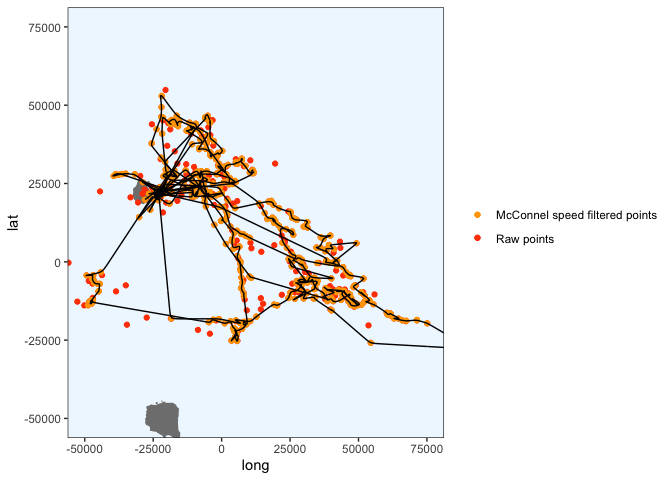<!-- -->

Zoom in on Saunders Island to check the tracks around there. I think
this looks
    ok.

``` r
plot_crawled_track_Saunders()
```

    ## Coordinate system already present. Adding new coordinate system, which will replace the existing one.

<!-- -->

Write to
CSV:

``` r
#write.csv(predObj, paste0("predicted_tracks/", penguin, "_track.csv", sep = ""), row.names = FALSE)
```

## Ptt 196699

``` r
penguin <- "196699"
x1 <- filter_points(penguin)
```

    ## Warning in assume_if_longlat(out): input looks like longitude/latitude data,
    ## assuming +proj=longlat +datum=WGS84

``` r
# convert to dataframe for plotting
x1.df <- data.frame(x1)
plot_cleaned_points(x1.df)
```

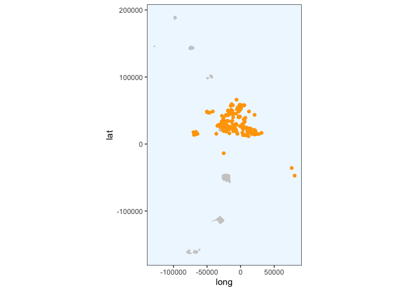<!-- -->
Crawl (ran many times)

``` r
fit1 <- crawl(x1)
```

    ## Warning in rm(fit1): object 'fit1' not found

    ##   Nelder-Mead direct search function minimizer
    ## function value for initial parameters = 39453977.756612
    ##   Scaled convergence tolerance is 0.58791
    ## Stepsize computed as 9.224206
    ## BUILD             11 39495828.414281 330079.605162
    ## LO-REDUCTION      13 39471874.271997 330079.605162
    ## LO-REDUCTION      15 39466546.479923 330079.605162
    ## LO-REDUCTION      17 39454276.452578 330079.605162
    ## LO-REDUCTION      19 39453977.756612 330079.605162
    ## EXTENSION         21 39453977.756612 292966.625270
    ## LO-REDUCTION      23 39453977.756612 292966.625270
    ## EXTENSION         25 39447230.514120 274245.740832
    ## LO-REDUCTION      27 39446611.496555 274245.740832
    ## LO-REDUCTION      29 29390912.919902 274245.740832
    ## EXTENSION         31 1270827.850607 243594.443178
    ## LO-REDUCTION      33 773972.723727 243594.443178
    ## LO-REDUCTION      35 494585.528643 243594.443178
    ## LO-REDUCTION      37 374407.429941 243594.443178
    ## LO-REDUCTION      39 330079.605162 243594.443178
    ## EXTENSION         41 298987.667697 192704.978295
    ## LO-REDUCTION      43 292966.625270 192704.978295
    ## LO-REDUCTION      45 291755.608969 192704.978295
    ## LO-REDUCTION      47 289330.951274 192704.978295
    ## LO-REDUCTION      49 284073.337158 192704.978295
    ## LO-REDUCTION      51 276084.725273 192704.978295
    ## LO-REDUCTION      53 274863.400306 192704.978295
    ## EXTENSION         55 274245.740832 142684.853896
    ## LO-REDUCTION      57 261995.465509 142684.853896
    ## LO-REDUCTION      59 243594.443178 142684.853896
    ## LO-REDUCTION      61 237408.843445 142684.853896
    ## EXTENSION         63 231103.096168 105425.830365
    ## LO-REDUCTION      65 221845.119703 105425.830365
    ## LO-REDUCTION      67 210924.125393 105425.830365
    ## LO-REDUCTION      69 202068.095928 105425.830365
    ## EXTENSION         71 198613.639494 78767.020715
    ## LO-REDUCTION      73 192704.978295 78767.020715
    ## EXTENSION         75 160436.517283 69342.989651
    ## EXTENSION         77 158711.987225 67287.786811
    ## EXTENSION         79 151225.736459 53993.085531
    ## LO-REDUCTION      81 142684.853896 53993.085531
    ## LO-REDUCTION      83 123075.402003 53993.085531
    ## LO-REDUCTION      85 114937.961670 53993.085531
    ## LO-REDUCTION      87 107636.297154 53993.085531
    ## LO-REDUCTION      89 105425.830365 53993.085531
    ## LO-REDUCTION      91 79670.362228 53993.085531
    ## HI-REDUCTION      93 78767.020715 53993.085531
    ## LO-REDUCTION      95 69342.989651 53993.085531
    ## REFLECTION        97 67354.323028 52683.953641
    ## LO-REDUCTION      99 67287.786811 52683.953641
    ## LO-REDUCTION     101 63955.899096 52683.953641
    ## LO-REDUCTION     103 62554.469996 52683.953641
    ## EXTENSION        105 62459.006963 50767.151139
    ## LO-REDUCTION     107 62056.492133 50767.151139
    ## EXTENSION        109 61403.292748 41590.097013
    ## LO-REDUCTION     111 60107.276780 41590.097013
    ## LO-REDUCTION     113 59843.146330 41590.097013
    ## LO-REDUCTION     115 57336.344463 41590.097013
    ## EXTENSION        117 55967.677525 30483.809775
    ## LO-REDUCTION     119 55432.592904 30483.809775
    ## LO-REDUCTION     121 55277.735612 30483.809775
    ## LO-REDUCTION     123 53993.085531 30483.809775
    ## REFLECTION       125 52683.953641 29828.540867
    ## LO-REDUCTION     127 50767.151139 29828.540867
    ## REFLECTION       129 47150.737080 29643.445770
    ## REFLECTION       131 44161.139164 27174.121833
    ## LO-REDUCTION     133 42106.987093 27174.121833
    ## REFLECTION       135 41886.796725 25699.569756
    ## REFLECTION       137 41590.097013 22117.721315
    ## HI-REDUCTION     139 38447.069763 22117.721315
    ## LO-REDUCTION     141 34739.620711 22117.721315
    ## REFLECTION       143 34412.754339 21964.326339
    ## HI-REDUCTION     145 34297.919852 21964.326339
    ## HI-REDUCTION     147 30483.809775 21964.326339
    ## HI-REDUCTION     149 29828.540867 21964.326339
    ## LO-REDUCTION     151 29643.445770 21964.326339
    ## LO-REDUCTION     153 29525.343777 21964.326339
    ## REFLECTION       155 28315.973091 21439.160951
    ## EXTENSION        157 27834.864122 20619.648401
    ## LO-REDUCTION     159 27342.657316 20619.648401
    ## HI-REDUCTION     161 27261.125778 20619.648401
    ## LO-REDUCTION     163 27174.121833 20619.648401
    ## REFLECTION       165 25699.569756 17239.143381
    ## LO-REDUCTION     167 25546.707860 17239.143381
    ## LO-REDUCTION     169 24458.140335 17239.143381
    ## HI-REDUCTION     171 23123.406080 17239.143381
    ## LO-REDUCTION     173 22175.818938 17239.143381
    ## LO-REDUCTION     175 22117.721315 17239.143381
    ## HI-REDUCTION     177 21964.326339 17239.143381
    ## LO-REDUCTION     179 21848.146046 17239.143381
    ## HI-REDUCTION     181 21439.160951 17239.143381
    ## HI-REDUCTION     183 20946.503433 17239.143381
    ## LO-REDUCTION     185 20619.648401 17239.143381
    ## LO-REDUCTION     187 20439.571696 17239.143381
    ## LO-REDUCTION     189 20304.777196 17239.143381
    ## HI-REDUCTION     191 20066.831166 17239.143381
    ## LO-REDUCTION     193 19896.241145 17239.143381
    ## HI-REDUCTION     195 19327.597524 17239.143381
    ## LO-REDUCTION     197 19219.251219 17239.143381
    ## HI-REDUCTION     199 19074.749824 17239.143381
    ## LO-REDUCTION     201 18910.639666 17239.143381
    ## HI-REDUCTION     203 18750.571436 17239.143381
    ## LO-REDUCTION     205 18630.826610 17239.143381
    ## LO-REDUCTION     207 18543.961978 17239.143381
    ## LO-REDUCTION     209 18513.221103 17239.143381
    ## LO-REDUCTION     211 18432.179054 17239.143381
    ## LO-REDUCTION     213 18342.279361 17239.143381
    ## HI-REDUCTION     215 18102.519802 17239.143381
    ## EXTENSION        217 18000.922952 16704.854978
    ## LO-REDUCTION     219 17954.311296 16704.854978
    ## LO-REDUCTION     221 17867.439401 16704.854978
    ## LO-REDUCTION     223 17850.681155 16704.854978
    ## EXTENSION        225 17749.359795 16459.481428
    ## EXTENSION        227 17566.130865 16299.872679
    ## EXTENSION        229 17510.167184 16024.526241
    ## LO-REDUCTION     231 17487.184142 16024.526241
    ## EXTENSION        233 17289.595317 15739.716483
    ## LO-REDUCTION     235 17239.143381 15739.716483
    ## LO-REDUCTION     237 16928.906554 15739.716483
    ## REFLECTION       239 16817.937924 15735.454504
    ## LO-REDUCTION     241 16797.306753 15735.454504
    ## REFLECTION       243 16704.854978 15719.336209
    ## REFLECTION       245 16459.481428 15498.037392
    ## EXTENSION        247 16387.256156 15220.502719
    ## LO-REDUCTION     249 16299.872679 15220.502719
    ## HI-REDUCTION     251 16024.526241 15220.502719
    ## HI-REDUCTION     253 15994.214602 15220.502719
    ## LO-REDUCTION     255 15814.300412 15220.502719
    ## LO-REDUCTION     257 15793.444583 15220.502719
    ## LO-REDUCTION     259 15745.427159 15220.502719
    ## LO-REDUCTION     261 15739.716483 15220.502719
    ## LO-REDUCTION     263 15735.454504 15220.502719
    ## LO-REDUCTION     265 15719.336209 15220.502719
    ## REFLECTION       267 15506.142242 15125.391532
    ## HI-REDUCTION     269 15498.037392 15125.391532
    ## LO-REDUCTION     271 15483.786859 15125.391532
    ## LO-REDUCTION     273 15389.877587 15125.391532
    ## LO-REDUCTION     275 15367.932479 15125.391532
    ## REFLECTION       277 15361.156753 15109.157163
    ## EXTENSION        279 15352.116194 15026.249916
    ## EXTENSION        281 15288.184028 14803.561889
    ## LO-REDUCTION     283 15280.986097 14803.561889
    ## HI-REDUCTION     285 15274.414952 14803.561889
    ## LO-REDUCTION     287 15220.502719 14803.561889
    ## LO-REDUCTION     289 15197.671960 14803.561889
    ## LO-REDUCTION     291 15194.589565 14803.561889
    ## LO-REDUCTION     293 15155.577265 14803.561889
    ## LO-REDUCTION     295 15125.391532 14803.561889
    ## LO-REDUCTION     297 15123.939065 14803.561889
    ## LO-REDUCTION     299 15118.699969 14803.561889
    ## EXTENSION        301 15109.157163 14720.097265
    ## LO-REDUCTION     303 15053.187292 14720.097265
    ## EXTENSION        305 15026.249916 14598.751749
    ## LO-REDUCTION     307 15017.698435 14598.751749
    ## LO-REDUCTION     309 14939.383118 14598.751749
    ## LO-REDUCTION     311 14930.353543 14598.751749
    ## LO-REDUCTION     313 14924.071278 14598.751749
    ## LO-REDUCTION     315 14885.071034 14598.751749
    ## EXTENSION        317 14869.802944 14440.815943
    ## HI-REDUCTION     319 14841.732436 14440.815943
    ## LO-REDUCTION     321 14803.561889 14440.815943
    ## LO-REDUCTION     323 14738.385907 14440.815943
    ## LO-REDUCTION     325 14737.281292 14440.815943
    ## HI-REDUCTION     327 14720.097265 14440.815943
    ## EXTENSION        329 14687.757589 14345.452762
    ## LO-REDUCTION     331 14674.622260 14345.452762
    ## LO-REDUCTION     333 14647.790303 14345.452762
    ## LO-REDUCTION     335 14635.145302 14345.452762
    ## LO-REDUCTION     337 14606.748902 14345.452762
    ## EXTENSION        339 14598.751749 14256.856961
    ## LO-REDUCTION     341 14589.670215 14256.856961
    ## EXTENSION        343 14520.032273 14031.679833
    ## LO-REDUCTION     345 14507.742574 14031.679833
    ## LO-REDUCTION     347 14503.260417 14031.679833
    ## EXTENSION        349 14440.815943 13802.579452
    ## LO-REDUCTION     351 14420.327372 13802.579452
    ## LO-REDUCTION     353 14371.704646 13802.579452
    ## LO-REDUCTION     355 14369.195100 13802.579452
    ## EXTENSION        357 14345.452762 13602.319078
    ## LO-REDUCTION     359 14314.087819 13602.319078
    ## LO-REDUCTION     361 14256.856961 13602.319078
    ## EXTENSION        363 14172.829467 13399.380213
    ## LO-REDUCTION     365 14122.781699 13399.380213
    ## EXTENSION        367 14031.679833 13146.390645
    ## LO-REDUCTION     369 13963.633740 13146.390645
    ## LO-REDUCTION     371 13931.872878 13146.390645
    ## LO-REDUCTION     373 13876.754557 13146.390645
    ## EXTENSION        375 13856.119898 13059.245002
    ## EXTENSION        377 13802.579452 12943.380520
    ## LO-REDUCTION     379 13654.141049 12943.380520
    ## EXTENSION        381 13602.319078 12891.221463
    ## LO-REDUCTION     383 13519.919866 12891.221463
    ## REFLECTION       385 13399.380213 12811.413616
    ## LO-REDUCTION     387 13292.266495 12811.413616
    ## LO-REDUCTION     389 13292.091309 12811.413616
    ## LO-REDUCTION     391 13233.242580 12811.413616
    ## LO-REDUCTION     393 13146.390645 12811.413616
    ## HI-REDUCTION     395 13126.184784 12811.413616
    ## LO-REDUCTION     397 13059.245002 12811.413616
    ## LO-REDUCTION     399 13002.179838 12811.413616
    ## EXTENSION        401 12984.189775 12776.410293
    ## EXTENSION        403 12954.399953 12671.893166
    ## LO-REDUCTION     405 12943.380520 12671.893166
    ## EXTENSION        407 12902.367312 12571.974154
    ## LO-REDUCTION     409 12892.151096 12571.974154
    ## LO-REDUCTION     411 12891.221463 12571.974154
    ## EXTENSION        413 12872.078320 12512.255636
    ## EXTENSION        415 12861.265452 12349.032386
    ## LO-REDUCTION     417 12819.215939 12349.032386
    ## LO-REDUCTION     419 12811.413616 12349.032386
    ## LO-REDUCTION     421 12776.410293 12349.032386
    ## LO-REDUCTION     423 12764.621933 12349.032386
    ## LO-REDUCTION     425 12705.680423 12349.032386
    ## LO-REDUCTION     427 12671.893166 12349.032386
    ## REFLECTION       429 12616.694230 12345.384792
    ## LO-REDUCTION     431 12571.974154 12345.384792
    ## REFLECTION       433 12527.968468 12290.360505
    ## EXTENSION        435 12512.255636 12229.544305
    ## LO-REDUCTION     437 12471.029209 12229.544305
    ## EXTENSION        439 12438.609381 12126.820435
    ## LO-REDUCTION     441 12393.776512 12126.820435
    ## LO-REDUCTION     443 12372.843908 12126.820435
    ## LO-REDUCTION     445 12356.834929 12126.820435
    ## LO-REDUCTION     447 12355.704409 12126.820435
    ## LO-REDUCTION     449 12349.032386 12126.820435
    ## LO-REDUCTION     451 12345.384792 12126.820435
    ## EXTENSION        453 12290.360505 11944.512481
    ## LO-REDUCTION     455 12274.279765 11944.512481
    ## LO-REDUCTION     457 12229.544305 11944.512481
    ## LO-REDUCTION     459 12214.593112 11944.512481
    ## LO-REDUCTION     461 12190.363845 11944.512481
    ## LO-REDUCTION     463 12183.925416 11944.512481
    ## LO-REDUCTION     465 12171.731102 11944.512481
    ## EXTENSION        467 12167.142631 11854.673702
    ## LO-REDUCTION     469 12157.612587 11854.673702
    ## EXTENSION        471 12147.498055 11769.190327
    ## LO-REDUCTION     473 12126.820435 11769.190327
    ## EXTENSION        475 12055.256726 11658.836495
    ## LO-REDUCTION     477 12047.728074 11658.836495
    ## LO-REDUCTION     479 12044.853355 11658.836495
    ## EXTENSION        481 11976.101328 11558.588713
    ## LO-REDUCTION     483 11961.095223 11558.588713
    ## LO-REDUCTION     485 11944.512481 11558.588713
    ## EXTENSION        487 11902.978084 11297.325673
    ## LO-REDUCTION     489 11854.673702 11297.325673
    ## LO-REDUCTION     491 11813.350915 11297.325673
    ## LO-REDUCTION     493 11769.190327 11297.325673
    ## LO-REDUCTION     495 11765.347124 11297.325673
    ## LO-REDUCTION     497 11725.256478 11297.325673
    ## LO-REDUCTION     499 11658.836495 11297.325673
    ## Exiting from Nelder Mead minimizer
    ##     501 function evaluations used
    ## 
    ## Cannot calculate covariance matrix

``` r
print(fit1)
```

    ## 
    ## 
    ## Continuous-Time Correlated Random Walk fit
    ## 
    ## Models:
    ## --------
    ## Movement   ~ 1
    ## Error   ~Argos_loc_class - 1
    ## with Random Drift
    ## 
    ##                         Parameter Est. St. Err. 95% Lower 95% Upper
    ## ln tau Argos_loc_class3          7.018       NA        NA        NA
    ## ln tau Argos_loc_class2          2.541       NA        NA        NA
    ## ln tau Argos_loc_class1          6.903       NA        NA        NA
    ## ln tau Argos_loc_class0         11.839       NA        NA        NA
    ## ln tau Argos_loc_classA          0.595       NA        NA        NA
    ## ln tau Argos_loc_classB          5.546       NA        NA        NA
    ## ln sigma (Intercept)             8.415       NA        NA        NA
    ## ln beta (Intercept)             79.056       NA        NA        NA
    ## ln sigma.drift/sigma           -22.071       NA        NA        NA
    ## ln psi-1                        53.176       NA        NA        NA
    ## 
    ## 
    ## Log Likelihood = -5648.663 
    ## AIC = 11317.326

``` r
predTime <- predict_times(x1)
predObj <- predict_points(fit1, predTime)

plot_crawled_track()
```

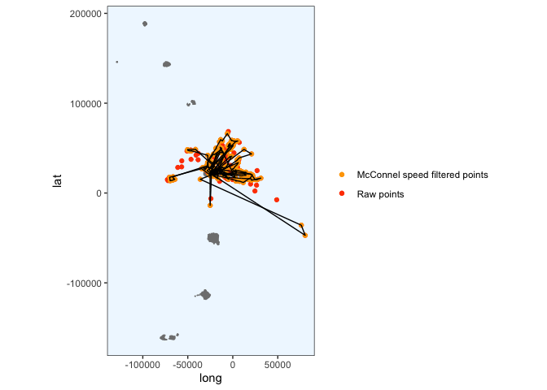<!-- -->

``` r
plot_crawled_track_Saunders()
```

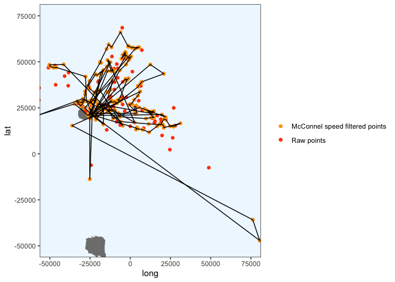<!-- -->

Write to
CSV:

``` r
#write.csv(predObj, paste0("predicted_tracks/", penguin, "_track.csv", sep = ""), row.names = FALSE)
```

## Ptt 196700

``` r
penguin <- "196700"
x1 <- filter_points(penguin)
```

    ## Warning in assume_if_longlat(out): input looks like longitude/latitude data,
    ## assuming +proj=longlat +datum=WGS84

``` r
# convert to dataframe for plotting
x1.df <- data.frame(x1)
plot_cleaned_points(x1.df)
```

<!-- -->

Get rid of that weird fix.

``` r
x1.df <- x1.df %>% dplyr::filter(LON > -500000)
plot_cleaned_points(x1.df)
```

<!-- -->

``` r
# then make x1.df spatial 
coordinates(x1.df) <- ~LON + LAT
# tell it it's already projected in LAEA centered around the south sandwich islands
proj4string(x1.df) <- CRS("+proj=laea +lon_0=-26 +lat_0=-58 +units=m")
# transform to LAEA centered around the south sandwich islands
x1.df <- spTransform(x1.df, CRS = CRS("+proj=laea +lon_0=-26 +lat_0=-58 +units=m"))

# rename back to x1 so that I can continue with the code below
x1 <- x1.df

# then recreate x1.df as a normal data frame
x1.df <- data.frame(x1)
```

Crawl (ran many times).

``` r
if(exists("fit1")){rm(fit1)} 
fit1 <- crawl(x1)
```

    ## Beginning SANN initialization ...

    ## Beginning likelihood optimization ...

    ##   Nelder-Mead direct search function minimizer
    ## function value for initial parameters = 25989061.959882
    ##   Scaled convergence tolerance is 0.387267
    ## Stepsize computed as 9.224206
    ## BUILD             11 26030654.339783 319674.626719
    ## LO-REDUCTION      13 26006331.229258 319674.626719
    ## LO-REDUCTION      15 26000855.849887 319674.626719
    ## LO-REDUCTION      17 25989360.655848 319674.626719
    ## LO-REDUCTION      19 25989061.959882 319674.626719
    ## EXTENSION         21 25989061.959882 282917.757849
    ## LO-REDUCTION      23 25989061.959882 282917.757849
    ## EXTENSION         25 25982314.717391 264578.468893
    ## LO-REDUCTION      27 25981695.699826 264578.468893
    ## LO-REDUCTION      29 25208461.939294 264578.468893
    ## EXTENSION         31 924346.808319 234506.239443
    ## LO-REDUCTION      33 603387.822344 234506.239443
    ## LO-REDUCTION      35 418798.523336 234506.239443
    ## LO-REDUCTION      37 341395.286545 234506.239443
    ## LO-REDUCTION      39 319674.626719 234506.239443
    ## EXTENSION         41 288374.184920 184528.712668
    ## LO-REDUCTION      43 282917.757849 184528.712668
    ## LO-REDUCTION      45 282256.338860 184528.712668
    ## LO-REDUCTION      47 279572.734941 184528.712668
    ## LO-REDUCTION      49 274432.747524 184528.712668
    ## LO-REDUCTION      51 266464.385161 184528.712668
    ## LO-REDUCTION      53 264824.073605 184528.712668
    ## EXTENSION         55 264578.468893 135628.862002
    ## LO-REDUCTION      57 252573.483410 135628.862002
    ## LO-REDUCTION      59 234506.239443 135628.862002
    ## LO-REDUCTION      61 228409.397677 135628.862002
    ## EXTENSION         63 222228.108477 97794.976879
    ## LO-REDUCTION      65 212688.732720 97794.976879
    ## LO-REDUCTION      67 202144.019198 97794.976879
    ## LO-REDUCTION      69 193344.883456 97794.976879
    ## EXTENSION         71 189876.530098 72289.799179
    ## LO-REDUCTION      73 184528.712668 72289.799179
    ## EXTENSION         75 152119.602601 57935.323444
    ## LO-REDUCTION      77 150718.841786 57935.323444
    ## EXTENSION         79 143324.233516 43945.480343
    ## LO-REDUCTION      81 135628.862002 43945.480343
    ## LO-REDUCTION      83 115390.323331 43945.480343
    ## LO-REDUCTION      85 107340.435617 43945.480343
    ## LO-REDUCTION      87 100310.367545 43945.480343
    ## LO-REDUCTION      89 97794.976879 43945.480343
    ## LO-REDUCTION      91 73039.214832 43945.480343
    ## LO-REDUCTION      93 72289.799179 43945.480343
    ## LO-REDUCTION      95 62478.027042 43945.480343
    ## HI-REDUCTION      97 57935.323444 43945.480343
    ## LO-REDUCTION      99 56045.456675 43945.480343
    ## LO-REDUCTION     101 55314.692457 43945.480343
    ## LO-REDUCTION     103 54812.436174 43945.480343
    ## EXTENSION        105 53626.392300 42212.047222
    ## EXTENSION        107 53501.583130 37149.567412
    ## LO-REDUCTION     109 53440.916197 37149.567412
    ## LO-REDUCTION     111 52000.152075 37149.567412
    ## EXTENSION        113 51217.769880 30511.325888
    ## LO-REDUCTION     115 50701.348112 30511.325888
    ## EXTENSION        117 47776.937841 25437.215466
    ## LO-REDUCTION     119 47737.842063 25437.215466
    ## LO-REDUCTION     121 45117.541912 25437.215466
    ## LO-REDUCTION     123 43945.480343 25437.215466
    ## EXTENSION        125 42212.047222 17000.764672
    ## LO-REDUCTION     127 41789.392557 17000.764672
    ## LO-REDUCTION     129 39263.884216 17000.764672
    ## LO-REDUCTION     131 37149.567412 17000.764672
    ## LO-REDUCTION     133 35586.892261 17000.764672
    ## REFLECTION       135 35473.700759 16685.995787
    ## HI-REDUCTION     137 35154.103695 16685.995787
    ## HI-REDUCTION     139 33152.597527 16685.995787
    ## HI-REDUCTION     141 30511.325888 16685.995787
    ## LO-REDUCTION     143 28266.604859 16138.279598
    ## HI-REDUCTION     145 27646.792474 16138.279598
    ## HI-REDUCTION     147 26354.744605 16138.279598
    ## HI-REDUCTION     149 25437.215466 16138.279598
    ## LO-REDUCTION     151 24821.070005 16138.279598
    ## REFLECTION       153 23541.665480 14961.249243
    ## LO-REDUCTION     155 22988.214922 14721.059919
    ## HI-REDUCTION     157 22185.326505 14721.059919
    ## HI-REDUCTION     159 20688.892390 14721.059919
    ## LO-REDUCTION     161 20463.585873 14721.059919
    ## LO-REDUCTION     163 20079.665227 14480.481879
    ## LO-REDUCTION     165 19760.723262 13895.653464
    ## HI-REDUCTION     167 19256.927310 13895.653464
    ## HI-REDUCTION     169 17218.225130 13895.653464
    ## REFLECTION       171 17193.245970 13137.118864
    ## LO-REDUCTION     173 17000.764672 13137.118864
    ## HI-REDUCTION     175 16880.902636 13137.118864
    ## HI-REDUCTION     177 16685.995787 13137.118864
    ## HI-REDUCTION     179 16138.279598 13137.118864
    ## LO-REDUCTION     181 15364.802353 13137.118864
    ## REFLECTION       183 15332.648616 12912.165184
    ## HI-REDUCTION     185 14961.249243 12912.165184
    ## HI-REDUCTION     187 14955.363463 12912.165184
    ## HI-REDUCTION     189 14721.059919 12912.165184
    ## LO-REDUCTION     191 14480.481879 12912.165184
    ## LO-REDUCTION     193 14349.771718 12912.165184
    ## REFLECTION       195 14179.079582 12860.247756
    ## LO-REDUCTION     197 14137.536630 12857.886657
    ## REFLECTION       199 14087.174096 12518.429343
    ## HI-REDUCTION     201 13917.089742 12518.429343
    ## HI-REDUCTION     203 13895.653464 12518.429343
    ## REFLECTION       205 13771.097990 12170.238474
    ## LO-REDUCTION     207 13462.744552 12170.238474
    ## LO-REDUCTION     209 13342.223249 12170.238474
    ## HI-REDUCTION     211 13137.118864 12170.238474
    ## LO-REDUCTION     213 13116.323068 12170.238474
    ## LO-REDUCTION     215 13073.439734 12170.238474
    ## HI-REDUCTION     217 12912.165184 12170.238474
    ## EXTENSION        219 12860.683328 12061.383960
    ## LO-REDUCTION     221 12860.247756 12061.383960
    ## EXTENSION        223 12857.886657 11834.848384
    ## EXTENSION        225 12656.498197 11535.188028
    ## LO-REDUCTION     227 12558.091628 11535.188028
    ## LO-REDUCTION     229 12531.016985 11535.188028
    ## EXTENSION        231 12518.429343 11241.010236
    ## EXTENSION        233 12438.865874 10879.009396
    ## LO-REDUCTION     235 12350.343094 10879.009396
    ## LO-REDUCTION     237 12283.436981 10879.009396
    ## LO-REDUCTION     239 12170.238474 10879.009396
    ## LO-REDUCTION     241 12061.383960 10879.009396
    ## LO-REDUCTION     243 12026.053254 10879.009396
    ## EXTENSION        245 11933.950737 10481.956029
    ## LO-REDUCTION     247 11834.848384 10481.956029
    ## LO-REDUCTION     249 11535.188028 10481.956029
    ## EXTENSION        251 11408.671982 9719.203586
    ## LO-REDUCTION     253 11389.099614 9719.203586
    ## LO-REDUCTION     255 11241.010236 9719.203586
    ## EXTENSION        257 11212.381190 8949.507793
    ## LO-REDUCTION     259 11145.514171 8949.507793
    ## LO-REDUCTION     261 11047.319109 8949.507793
    ## EXTENSION        263 10879.009396 8444.310427
    ## LO-REDUCTION     265 10689.215044 8444.310427
    ## LO-REDUCTION     267 10520.408485 8444.310427
    ## LO-REDUCTION     269 10481.956029 8444.310427
    ## LO-REDUCTION     271 10083.216301 8444.310427
    ## EXTENSION        273 9894.346880 8237.084413
    ## LO-REDUCTION     275 9719.203586 8237.084413
    ## LO-REDUCTION     277 9654.764003 8237.084413
    ## LO-REDUCTION     279 9588.173308 8237.084413
    ## REFLECTION       281 9386.060661 8089.812506
    ## REFLECTION       283 9212.302741 7937.905743
    ## LO-REDUCTION     285 8949.507793 7937.905743
    ## LO-REDUCTION     287 8799.189256 7937.905743
    ## LO-REDUCTION     289 8589.039805 7937.905743
    ## LO-REDUCTION     291 8444.310427 7937.905743
    ## HI-REDUCTION     293 8438.129696 7937.905743
    ## HI-REDUCTION     295 8428.608149 7937.905743
    ## LO-REDUCTION     297 8415.793545 7937.905743
    ## LO-REDUCTION     299 8240.262694 7937.905743
    ## EXTENSION        301 8237.084413 7811.956617
    ## LO-REDUCTION     303 8212.928815 7811.956617
    ## LO-REDUCTION     305 8200.616132 7811.956617
    ## LO-REDUCTION     307 8191.207460 7811.956617
    ## LO-REDUCTION     309 8089.812506 7811.956617
    ## LO-REDUCTION     311 8065.963436 7811.956617
    ## LO-REDUCTION     313 8064.187034 7811.956617
    ## EXTENSION        315 8045.900933 7691.904993
    ## LO-REDUCTION     317 8020.880426 7691.904993
    ## LO-REDUCTION     319 7985.225911 7691.904993
    ## LO-REDUCTION     321 7982.910707 7691.904993
    ## LO-REDUCTION     323 7946.766903 7691.904993
    ## LO-REDUCTION     325 7941.522048 7691.904993
    ## LO-REDUCTION     327 7937.905743 7691.904993
    ## REFLECTION       329 7916.278112 7645.757115
    ## LO-REDUCTION     331 7867.831211 7645.757115
    ## LO-REDUCTION     333 7811.956617 7645.757115
    ## REFLECTION       335 7755.448798 7640.441979
    ## REFLECTION       337 7747.700338 7629.000912
    ## LO-REDUCTION     339 7739.361017 7629.000912
    ## EXTENSION        341 7734.032106 7596.743008
    ## LO-REDUCTION     343 7702.899799 7596.743008
    ## HI-REDUCTION     345 7697.919168 7596.743008
    ## LO-REDUCTION     347 7691.904993 7596.743008
    ## LO-REDUCTION     349 7672.560102 7596.743008
    ## EXTENSION        351 7669.366018 7561.313168
    ## EXTENSION        353 7648.163547 7528.255020
    ## LO-REDUCTION     355 7645.757115 7528.255020
    ## LO-REDUCTION     357 7640.441979 7528.255020
    ## LO-REDUCTION     359 7639.428192 7528.255020
    ## EXTENSION        361 7629.000912 7466.912349
    ## LO-REDUCTION     363 7619.316541 7466.912349
    ## LO-REDUCTION     365 7600.891008 7466.912349
    ## LO-REDUCTION     367 7600.408575 7466.912349
    ## LO-REDUCTION     369 7596.743008 7466.912349
    ## LO-REDUCTION     371 7561.313168 7466.912349
    ## LO-REDUCTION     373 7558.732788 7466.912349
    ## LO-REDUCTION     375 7556.073705 7466.912349
    ## REFLECTION       377 7537.099222 7466.778735
    ## HI-REDUCTION     379 7528.255020 7466.778735
    ## LO-REDUCTION     381 7520.867882 7466.778735
    ## EXTENSION        383 7510.961521 7452.447531
    ## HI-REDUCTION     385 7510.804557 7452.447531
    ## LO-REDUCTION     387 7509.607114 7452.447531
    ## LO-REDUCTION     389 7504.901624 7452.447531
    ## EXTENSION        391 7502.623532 7438.833172
    ## EXTENSION        393 7500.791252 7416.481293
    ## LO-REDUCTION     395 7491.155926 7416.481293
    ## LO-REDUCTION     397 7488.631423 7416.481293
    ## LO-REDUCTION     399 7481.722686 7416.481293
    ## LO-REDUCTION     401 7469.151735 7416.481293
    ## LO-REDUCTION     403 7466.912349 7416.481293
    ## LO-REDUCTION     405 7466.778735 7416.481293
    ## REFLECTION       407 7456.811951 7415.003077
    ## LO-REDUCTION     409 7452.447531 7415.003077
    ## LO-REDUCTION     411 7449.811840 7415.003077
    ## LO-REDUCTION     413 7446.509707 7415.003077
    ## REFLECTION       415 7443.864684 7414.755220
    ## EXTENSION        417 7439.204355 7401.704839
    ## LO-REDUCTION     419 7438.833172 7401.704839
    ## LO-REDUCTION     421 7430.276145 7401.704839
    ## EXTENSION        423 7424.000796 7394.340616
    ## LO-REDUCTION     425 7423.231541 7394.340616
    ## LO-REDUCTION     427 7423.155694 7394.340616
    ## EXTENSION        429 7419.704982 7388.899052
    ## REFLECTION       431 7416.481293 7386.404233
    ## HI-REDUCTION     433 7415.003077 7386.404233
    ## LO-REDUCTION     435 7414.755220 7386.404233
    ## LO-REDUCTION     437 7410.201019 7386.404233
    ## REFLECTION       439 7407.301296 7385.459988
    ## LO-REDUCTION     441 7404.099013 7385.459988
    ## EXTENSION        443 7401.704839 7374.647617
    ## LO-REDUCTION     445 7401.243846 7374.647617
    ## LO-REDUCTION     447 7401.098129 7374.647617
    ## HI-REDUCTION     449 7394.881387 7374.647617
    ## EXTENSION        451 7394.340616 7367.383701
    ## LO-REDUCTION     453 7388.899052 7367.383701
    ## LO-REDUCTION     455 7388.480467 7367.383701
    ## LO-REDUCTION     457 7388.249470 7367.383701
    ## LO-REDUCTION     459 7386.509999 7367.383701
    ## LO-REDUCTION     461 7386.404233 7367.383701
    ## REFLECTION       463 7385.459988 7366.116277
    ## REFLECTION       465 7377.806191 7364.745257
    ## LO-REDUCTION     467 7375.994537 7364.745257
    ## LO-REDUCTION     469 7375.659168 7364.745257
    ## EXTENSION        471 7375.146111 7362.351759
    ## LO-REDUCTION     473 7374.647617 7362.351759
    ## LO-REDUCTION     475 7373.540478 7362.351759
    ## EXTENSION        477 7371.948636 7357.969485
    ## LO-REDUCTION     479 7370.168697 7357.969485
    ## LO-REDUCTION     481 7367.434480 7357.969485
    ## LO-REDUCTION     483 7367.383701 7357.969485
    ## LO-REDUCTION     485 7367.228185 7357.969485
    ## LO-REDUCTION     487 7366.116277 7357.969485
    ## LO-REDUCTION     489 7365.835946 7357.969485
    ## LO-REDUCTION     491 7365.723613 7357.969485
    ## LO-REDUCTION     493 7364.745257 7357.969485
    ## LO-REDUCTION     495 7363.092580 7357.969485
    ## LO-REDUCTION     497 7362.544632 7357.969485
    ## LO-REDUCTION     499 7362.351759 7357.969485
    ## Exiting from Nelder Mead minimizer
    ##     501 function evaluations used
    ## 
    ## Cannot calculate covariance matrix

``` r
print(fit1)
```

    ## 
    ## 
    ## Continuous-Time Correlated Random Walk fit
    ## 
    ## Models:
    ## --------
    ## Movement   ~ 1
    ## Error   ~Argos_loc_class - 1
    ## with Random Drift
    ## 
    ##                         Parameter Est. St. Err. 95% Lower 95% Upper
    ## ln tau Argos_loc_class3          5.518       NA        NA        NA
    ## ln tau Argos_loc_class2          6.375       NA        NA        NA
    ## ln tau Argos_loc_class1          6.162       NA        NA        NA
    ## ln tau Argos_loc_class0          6.718       NA        NA        NA
    ## ln tau Argos_loc_classA          6.360       NA        NA        NA
    ## ln tau Argos_loc_classB          6.122       NA        NA        NA
    ## ln sigma (Intercept)             8.129       NA        NA        NA
    ## ln beta (Intercept)             42.361       NA        NA        NA
    ## ln sigma.drift/sigma           -32.041       NA        NA        NA
    ## ln psi-1                        37.659       NA        NA        NA
    ## 
    ## 
    ## Log Likelihood = -3678.985 
    ## AIC = 7377.969

``` r
predTime <- predict_times(x1)
predObj <- predict_points(fit1, predTime)

plot_crawled_track()
```

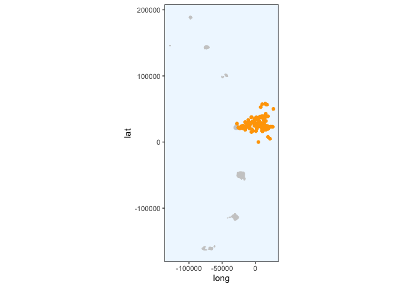<!-- -->

``` r
plot_crawled_track_Saunders()
```

    ## Coordinate system already present. Adding new coordinate system, which will replace the existing one.

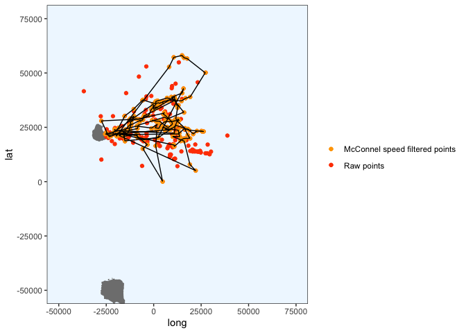<!-- -->

**There seem to be a lot of points lost due to the speed filter on this
penguin. Should I re-run with a more lenient filter?**

Write to
CSV:

``` r
#write.csv(predObj, paste0("predicted_tracks/", penguin, "_track.csv", sep = ""), row.names = FALSE)
```

## Questions to ask

1.  Are the times that we get from the trackers in UTC? Should I convert
    them to local times so that we can calculate proportion of day or
    night spent foraging?

2.  What are the units of the speed filter - is it km/hr? I don’t
    remember what the justification was for setting it to 8…

3.
