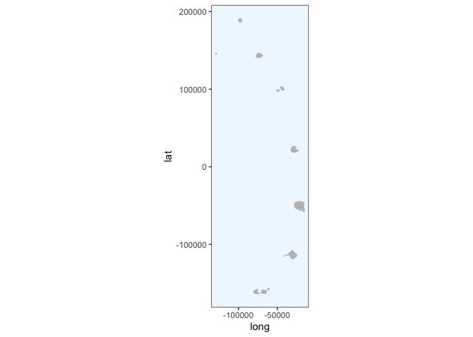

Initial processing with Crawl
================
Gemma Clucas
6/29/2020

``` r
knitr::opts_chunk$set(echo = TRUE)
library(tidyverse)
library(lubridate)
library(crawl)   #to fit Kalman filter models
library(trip)    #to prepare GPS data
library(maptools)
library(sp)
library(rgdal)
library(raster)
library(ggplot2)
library(knitr)
options(scipen=999)
```

## Load data

This is the data that Claudia sent over on 30th June 2020.

``` r
raw <- read.csv("raw_data/satellite_tracking_data_30_06_20.csv")
```

## Prepare data for analysis

**Format times**

The date and time are in the format:  
\* mm/dd/yy hh:mm

I can use the `lubridate` package to change them into a proper
date-time.

``` r
raw$Time <- mdy_hm(raw$Date, tz = "UTC")
```

Create a column with the time in hours since the first fix (that is, the
first fix for all
individuals).

``` r
raw$Time_since <- as.numeric(difftime(raw$Time, min(raw$Time), units="hours"))
```

Remove duplicated rows and rename columns.

``` r
raw <- raw[!duplicated(raw), ]

raw <- raw %>% 
  rename(Argos_loc_class = Loc.Class, LON = Lon1, LAT = Lat1)
```

At this stage I’m going to remove all the other columns from the
dataframe and just keep the ones we will work with.

``` r
clean <- raw %>% 
  dplyr::select(Ptt, Time, Time_since, LON, LAT, Argos_loc_class, Uplink)
```

## Create a map that we can plot the fixes onto later

This is the SGSSI shapefile that Vicky and I found.

``` r
Seamask<-readOGR("Seamask.shp")
```

    ## OGR data source with driver: ESRI Shapefile 
    ## Source: "/Users/gemmaclucas/GitHub/CHPE_Tracking_South_Sandwich_Islands/Seamask.shp", layer: "Seamask"
    ## with 1 features
    ## It has 1 fields

Don’t try to plot the whole thing, it takes ages. The code to use would
be `plot(Seamask,axes=T)`.  
Instead, crop to just the South Sandwich Islands (SSI) and
    plot.

``` r
SSI <- crop(Seamask, c(450000, 750000, -600000, 0))
```

    ## Warning in RGEOSUnaryPredFunc(spgeom, byid, "rgeos_isvalid"): Ring Self-
    ## intersection at or near point 77954.359424359995 26605.230663620001

    ## Warning in rgeos::gIntersection(x[i, ], y, byid = TRUE, drop_lower_td = TRUE):
    ## Invalid objects found; consider using set_RGEOS_CheckValidity(2L)

``` r
plot(SSI, axes = TRUE)
```

<!-- -->

Check the projection

``` r
crs(SSI)
```

    ## CRS arguments:
    ##  +proj=lcc +lat_1=-54 +lat_2=-54.75 +lat_0=-55 +lon_0=-37 +x_0=0 +y_0=0
    ## +datum=WGS84 +units=m +no_defs +ellps=WGS84 +towgs84=0,0,0

Re-project to Lambert Azimuthal Equal
Area

``` r
SSI_laea<-spTransform(SSI, CRS=CRS("+proj=laea +lon_0=-26 +lat_0=-58 +units=m"))
plot(SSI_laea, axes = T)
```

<!-- -->

## Pick a penguin

We need to run crawl on the tracks from each individual separately.
First, display the PTT
    numbers:

``` r
unique(clean$Ptt)
```

    ##  [1] 196697 196698 196699 196700 196701 196702 196703 196704 196705 196706
    ## [11] 196707 196708 196709 196710 196711 196712 196713 196714 196715 196716

We’ll start with `196697` and select the data for that individual.

``` r
penguin <- "196697"

x1 <- clean %>%
  filter(Ptt == penguin)

kable(head(x1))
```

|    Ptt | Time                | Time\_since |      LON |      LAT | Argos\_loc\_class | Uplink |
| -----: | :------------------ | ----------: | -------: | -------: | :---------------- | -----: |
| 196697 | 2020-01-06 17:14:00 |    0.400000 | \-26.264 | \-57.718 | A                 |      1 |
| 196697 | 2020-01-06 18:33:00 |    1.716667 | \-26.244 | \-57.705 | 1                 |      2 |
| 196697 | 2020-01-06 18:51:00 |    2.016667 | \-26.222 | \-57.704 | 0                 |      3 |
| 196697 | 2020-01-06 20:13:00 |    3.383333 | \-26.177 | \-57.686 | A                 |      5 |
| 196697 | 2020-01-06 20:13:00 |    3.383333 | \-26.183 | \-57.685 | 3                 |      5 |
| 196697 | 2020-01-06 20:36:00 |    3.766667 | \-26.178 | \-57.681 | 1                 |      6 |

## Order error classes and correct duplicated times

View a summary of the error classes:

``` r
x1 %>% 
  group_by(Argos_loc_class) %>% 
  count() %>% 
  kable()
```

| Argos\_loc\_class |   n |
| :---------------- | --: |
| 0                 |  58 |
| 1                 | 227 |
| 2                 | 272 |
| 3                 | 131 |
| A                 | 244 |
| B                 | 436 |

There are quite a lot of low quality (B) fixes. We may need to remove
them if crawling doesn’t work very well. Make the error classes factors
and put them in order from most accurate to least accurate.

``` r
x1$Argos_loc_class <- factor(x1$Argos_loc_class,  
                             levels=c("3","2","1","0", "A","B")) 
```

No idea why there are duplicated times in here still, but I get a
warning in the next step if I do not do this.

``` r
x1$Time <- adjust.duplicateTimes(x1$Time, x1$Ptt)
```

## Apply McConnell speed filter in trip package to remove bad fixes

``` r
# I can't find a way to do this without making a new dataframe x2
x2 <- x1 %>% 
  dplyr::select(LAT, LON, Time, Ptt) 

#Change it into class SpatialPointsDataFrame 
coordinates(x2) <- c("LON","LAT")

# Make it into a trip object, apply speed filter and save result to new variable called Pass_speed
x2$Pass_speed <- 
  x2 %>% 
  trip(., TORnames = c("Time","Ptt")) %>% 
  speedfilter(., max.speed = 8) 
```

    ## Warning in assume_if_longlat(out): input looks like longitude/latitude data,
    ## assuming +proj=longlat +datum=WGS84

``` r
# Filter the original dataframe
x1 <- x1 %>% dplyr::filter(x2$Pass_speed == TRUE)
```

## Make the data spatial and project to Lambert Azimuthal Equal Area

``` r
coordinates(x1) <- ~LON + LAT
```

First we have to give it a projection i.e. tell it it is in long lat
with WGS84.

``` r
proj4string(x1) <- CRS("+proj=longlat +ellps=WGS84")
```

Then we reproject it to laea. This is just centered on the long and lat
of Saunders for now, maybe change to UTM zones later - **check
this**

``` r
x1 <- spTransform(x1, CRS = CRS("+proj=laea +lon_0=-26 +lat_0=-58 +units=m"))
```

We can now plot it with our laea projection of the islands (this looks
terrible, but I’ll fix it later). Note, ggplot2 can **only** plot
dataframes, not `SpatialPointsDataFrames` or
`SpatialPolygonsDataFrames`, which is what we have for `x1` and
`SSI_laea`, respectively.

``` r
plot(x1, axes=T)
plot(SSI_laea, add=T)
```

<!-- -->

## Set inital params for `crawl`

I took these from the [pragmatic guide to
crawling](https://jmlondon.github.io/crawl-workshop/crawl-practical.html#determining-your-model-parameters)
and modified them for our data, so that the first co-ordinate is used to
initialise `a` and the `P` params are from the guide:

> “When choosing the initial parameters, it is typical to have the mean
> centered on the first observation with zero velocity. a is the
> starting location for the model – the first known coordinate; and P is
> a 4x4 var-cov matrix that specifies the error (in projected units) for
> the initial coordinates.”

``` r
initial = list(a = c(coordinates(x1)[1,1], 0,
                     coordinates(x1)[1,2], 0),
               P = diag(c(10 ^ 2, 10 ^ 2, 10 ^ 2, 10 ^ 2)))
```

## Add location error priors

From the pragmatic guide:

> "The second option is to provide a prior distribution for each of the
> location quality classes. The crawl::crwMLE() function accepts a
> function for the ‘prior’ argument. In this example, we provide a
> normal distribution of the log-transformed error. The standard error
> is 0.2.

``` r
prior <-  function(p) { 
    dnorm(p[1], log(250), 0.2 , log = TRUE) +     # prior for 3
      dnorm(p[2], log(500), 0.2 , log = TRUE) +   # prior for 2
      dnorm(p[3], log(1500), 0.2, log = TRUE) +   # prior for 1
      dnorm(p[4], log(2500), 0.4 , log = TRUE) +  # prior for 0
      dnorm(p[5], log(2500), 0.4 , log = TRUE) +  # prior for A
      dnorm(p[6], log(2500), 0.4 , log = TRUE) +  # prior for B
      # skip p[7] as we won't provide a prior for sigma
      dnorm(p[8], -4, 2, log = TRUE)              # prior for beta
}
```

> "Previous documentation and examples that described a setup for
> ‘crawl’ often suggested users implement a mixed approach by
> providing both fixed values and constraints to optimize the fit and
> increase the model’s ability to converge with limited/challenging
> data. We now suggest users rely on prior distributions to achieve a
> similar intent but provide the model more flexibility. Users should
> feel free to explore various distributions and approaches for
> describing the priors (e.g. laplace, log-normal) based on their data
> and research questions.

> “Those documents also often suggested fixing the beta parameter to 4
> as the best approach to encourage challenging datasets to fit. This,
> essentially, forced the fit toward Brownian movement. We now suggest
> users rely on the prior distribution centered on -4 (smoother fit)
> and, if needed, fix the beta parameter to -4. Only fix the parameter
> to 4 as a final resort.”

Note that the guide used to suggest a standard deviation of 2 for the
beta prior as well, but that seems to have been removed from the
documentation.

## Run crawl

First remove and results from previous runs, then run it, saving the
results to `fit1`. Note that I am caching the results from this section
of code so that crawl is not re-run everytime I knit the document.

``` r
if(exists("fit")){rm(fit)} 

fit1 <- crwMLE( 
  mov.model = ~1, 
  err.model=list(x=~Argos_loc_class-1), 
  drift=T, 
  data=x1, 
  Time.name="Time_since",  #method="L-BFGS-B",
  initial.state=initial, 
  prior=prior, 
  control=list(trace=1, REPORT=1) 
) 
```

    ## Beginning SANN initialization ...

    ## Beginning likelihood optimization ...

    ##   Nelder-Mead direct search function minimizer
    ## function value for initial parameters = 51171.298108
    ##   Scaled convergence tolerance is 0.000762512
    ## Stepsize computed as 0.893206
    ## BUILD             11 55009.957362 50027.721345
    ## EXTENSION         13 55009.938038 45066.217731
    ## LO-REDUCTION      15 52124.676268 45066.217731
    ## LO-REDUCTION      17 51619.350228 45066.217731
    ## LO-REDUCTION      19 51171.298108 45066.217731
    ## LO-REDUCTION      21 51113.569890 45066.217731
    ## LO-REDUCTION      23 51033.444245 45066.217731
    ## LO-REDUCTION      25 51019.692712 45066.217731
    ## EXTENSION         27 51011.986491 42788.340020
    ## LO-REDUCTION      29 50672.141298 42788.340020
    ## LO-REDUCTION      31 50027.721345 42788.340020
    ## REFLECTION        33 47320.939660 42044.315919
    ## LO-REDUCTION      35 47007.531652 42044.315919
    ## REFLECTION        37 46976.842545 41836.274372
    ## LO-REDUCTION      39 46272.768187 41836.274372
    ## HI-REDUCTION      41 46237.904542 41836.274372
    ## LO-REDUCTION      43 45400.957451 41836.274372
    ## LO-REDUCTION      45 45066.217731 41836.274372
    ## HI-REDUCTION      47 44505.496744 41836.274372
    ## HI-REDUCTION      49 43492.564643 41836.274372
    ## HI-REDUCTION      51 43283.929508 41836.274372
    ## LO-REDUCTION      53 43269.747594 41836.274372
    ## LO-REDUCTION      55 43212.671312 41836.274372
    ## LO-REDUCTION      57 42970.357440 41836.274372
    ## LO-REDUCTION      59 42825.660194 41836.274372
    ## HI-REDUCTION      61 42788.340020 41836.274372
    ## LO-REDUCTION      63 42623.429413 41836.274372
    ## EXTENSION         65 42547.792027 41637.339961
    ## EXTENSION         67 42479.195244 41216.228980
    ## LO-REDUCTION      69 42355.424311 41216.228980
    ## LO-REDUCTION      71 42286.445533 41216.228980
    ## LO-REDUCTION      73 42156.655003 41216.228980
    ## LO-REDUCTION      75 42154.588487 41216.228980
    ## EXTENSION         77 42044.315919 40870.691969
    ## LO-REDUCTION      79 41919.027389 40870.691969
    ## EXTENSION         81 41850.299356 40394.810933
    ## LO-REDUCTION      83 41836.274372 40394.810933
    ## EXTENSION         85 41637.339961 39795.831376
    ## LO-REDUCTION      87 41522.760429 39795.831376
    ## LO-REDUCTION      89 41354.436058 39795.831376
    ## LO-REDUCTION      91 41273.013693 39795.831376
    ## LO-REDUCTION      93 41251.216596 39795.831376
    ## LO-REDUCTION      95 41216.228980 39795.831376
    ## EXTENSION         97 40997.124673 39246.970239
    ## LO-REDUCTION      99 40870.691969 39246.970239
    ## LO-REDUCTION     101 40781.079943 39246.970239
    ## EXTENSION        103 40568.880006 38577.101230
    ## LO-REDUCTION     105 40521.381311 38577.101230
    ## LO-REDUCTION     107 40394.810933 38577.101230
    ## LO-REDUCTION     109 40391.722809 38577.101230
    ## LO-REDUCTION     111 39971.441811 38577.101230
    ## EXTENSION        113 39967.503165 38484.353337
    ## LO-REDUCTION     115 39795.831376 38484.353337
    ## LO-REDUCTION     117 39510.437360 38484.353337
    ## HI-REDUCTION     119 39388.170364 38484.353337
    ## HI-REDUCTION     121 39371.309601 38484.353337
    ## EXTENSION        123 39246.970239 38309.426649
    ## EXTENSION        125 38992.277798 37768.186523
    ## LO-REDUCTION     127 38965.149966 37768.186523
    ## LO-REDUCTION     129 38924.782961 37768.186523
    ## LO-REDUCTION     131 38796.220374 37768.186523
    ## LO-REDUCTION     133 38670.734485 37768.186523
    ## LO-REDUCTION     135 38650.344169 37768.186523
    ## LO-REDUCTION     137 38577.101230 37768.186523
    ## HI-REDUCTION     139 38489.037335 37768.186523
    ## LO-REDUCTION     141 38484.353337 37768.186523
    ## LO-REDUCTION     143 38339.596067 37768.186523
    ## LO-REDUCTION     145 38326.493716 37768.186523
    ## LO-REDUCTION     147 38309.426649 37768.186523
    ## LO-REDUCTION     149 38234.633272 37768.186523
    ## LO-REDUCTION     151 38122.842661 37768.186523
    ## REFLECTION       153 38081.173774 37767.721639
    ## EXTENSION        155 38070.037389 37661.626276
    ## LO-REDUCTION     157 38053.161873 37661.626276
    ## LO-REDUCTION     159 37895.768926 37661.626276
    ## LO-REDUCTION     161 37889.421780 37661.626276
    ## LO-REDUCTION     163 37880.356981 37661.626276
    ## LO-REDUCTION     165 37860.638771 37661.626276
    ## LO-REDUCTION     167 37832.174137 37661.626276
    ## LO-REDUCTION     169 37779.227151 37661.626276
    ## HI-REDUCTION     171 37778.896037 37661.626276
    ## LO-REDUCTION     173 37768.186523 37661.626276
    ## HI-REDUCTION     175 37767.721639 37661.626276
    ## LO-REDUCTION     177 37762.839218 37661.626276
    ## EXTENSION        179 37735.730839 37487.711702
    ## LO-REDUCTION     181 37712.968945 37487.711702
    ## LO-REDUCTION     183 37709.688821 37487.711702
    ## LO-REDUCTION     185 37706.199140 37487.711702
    ## LO-REDUCTION     187 37691.413970 37487.711702
    ## LO-REDUCTION     189 37687.079941 37487.711702
    ## LO-REDUCTION     191 37682.526988 37487.711702
    ## LO-REDUCTION     193 37679.496212 37487.711702
    ## LO-REDUCTION     195 37666.001514 37487.711702
    ## EXTENSION        197 37661.626276 37382.962745
    ## LO-REDUCTION     199 37638.339976 37382.962745
    ## LO-REDUCTION     201 37626.628406 37382.962745
    ## REFLECTION       203 37608.886964 37354.161359
    ## LO-REDUCTION     205 37602.373764 37354.161359
    ## LO-REDUCTION     207 37566.907305 37354.161359
    ## LO-REDUCTION     209 37556.508132 37354.161359
    ## REFLECTION       211 37528.649666 37353.749550
    ## LO-REDUCTION     213 37488.885956 37353.749550
    ## LO-REDUCTION     215 37487.711702 37353.749550
    ## HI-REDUCTION     217 37453.078081 37353.749550
    ## EXTENSION        219 37430.878258 37328.720448
    ## EXTENSION        221 37415.641716 37291.996842
    ## HI-REDUCTION     223 37411.444004 37291.996842
    ## LO-REDUCTION     225 37393.821130 37291.996842
    ## LO-REDUCTION     227 37391.363412 37291.996842
    ## LO-REDUCTION     229 37382.962745 37291.996842
    ## REFLECTION       231 37371.111738 37290.822626
    ## LO-REDUCTION     233 37367.856273 37290.822626
    ## LO-REDUCTION     235 37364.218812 37290.822626
    ## LO-REDUCTION     237 37354.161359 37290.822626
    ## LO-REDUCTION     239 37353.749550 37290.822626
    ## LO-REDUCTION     241 37328.720448 37290.822626
    ## REFLECTION       243 37325.448775 37286.447255
    ## LO-REDUCTION     245 37312.598355 37286.447255
    ## LO-REDUCTION     247 37308.496843 37286.447255
    ## LO-REDUCTION     249 37307.899135 37286.447255
    ## HI-REDUCTION     251 37306.323175 37286.447255
    ## LO-REDUCTION     253 37305.039586 37286.447255
    ## REFLECTION       255 37304.233310 37283.113600
    ## EXTENSION        257 37300.372696 37267.749421
    ## LO-REDUCTION     259 37296.409515 37267.749421
    ## LO-REDUCTION     261 37294.779597 37267.749421
    ## LO-REDUCTION     263 37291.996842 37267.749421
    ## LO-REDUCTION     265 37290.822626 37267.749421
    ## LO-REDUCTION     267 37290.470257 37267.749421
    ## REFLECTION       269 37289.661021 37266.469161
    ## LO-REDUCTION     271 37287.014979 37266.469161
    ## LO-REDUCTION     273 37286.447255 37266.469161
    ## LO-REDUCTION     275 37283.113600 37266.469161
    ## LO-REDUCTION     277 37276.458009 37266.469161
    ## REFLECTION       279 37276.118560 37266.055838
    ## LO-REDUCTION     281 37275.081506 37266.055838
    ## EXTENSION        283 37274.612879 37254.637092
    ## LO-REDUCTION     285 37273.254779 37254.637092
    ## LO-REDUCTION     287 37269.356706 37254.637092
    ## LO-REDUCTION     289 37269.267040 37254.637092
    ## LO-REDUCTION     291 37268.801268 37254.637092
    ## LO-REDUCTION     293 37267.749421 37254.637092
    ## LO-REDUCTION     295 37266.778106 37254.637092
    ## LO-REDUCTION     297 37266.469161 37254.637092
    ## EXTENSION        299 37266.339079 37244.395002
    ## LO-REDUCTION     301 37266.055838 37244.395002
    ## LO-REDUCTION     303 37261.521414 37244.395002
    ## LO-REDUCTION     305 37261.062117 37244.395002
    ## LO-REDUCTION     307 37259.137669 37244.395002
    ## EXTENSION        309 37259.102463 37236.194026
    ## LO-REDUCTION     311 37257.515317 37236.194026
    ## LO-REDUCTION     313 37256.074230 37236.194026
    ## LO-REDUCTION     315 37254.982829 37236.194026
    ## EXTENSION        317 37254.637092 37228.993758
    ## LO-REDUCTION     319 37249.960512 37228.993758
    ## LO-REDUCTION     321 37248.386861 37228.993758
    ## LO-REDUCTION     323 37248.058496 37228.993758
    ## LO-REDUCTION     325 37246.305138 37228.993758
    ## EXTENSION        327 37245.836478 37225.846379
    ## EXTENSION        329 37244.395002 37221.987341
    ## LO-REDUCTION     331 37242.157704 37221.987341
    ## EXTENSION        333 37240.125065 37216.751605
    ## LO-REDUCTION     335 37236.194026 37216.751605
    ## LO-REDUCTION     337 37233.160118 37216.751605
    ## REFLECTION       339 37232.623698 37214.525065
    ## EXTENSION        341 37230.752861 37211.264816
    ## LO-REDUCTION     343 37229.821079 37211.264816
    ## LO-REDUCTION     345 37228.993758 37211.264816
    ## LO-REDUCTION     347 37225.846379 37211.264816
    ## LO-REDUCTION     349 37222.853344 37211.264816
    ## LO-REDUCTION     351 37221.987341 37211.264816
    ## LO-REDUCTION     353 37218.013177 37211.264816
    ## LO-REDUCTION     355 37217.746401 37211.264816
    ## EXTENSION        357 37217.269213 37205.251845
    ## LO-REDUCTION     359 37216.751605 37205.251845
    ## LO-REDUCTION     361 37216.743344 37205.251845
    ## LO-REDUCTION     363 37215.596967 37205.251845
    ## LO-REDUCTION     365 37214.525065 37205.251845
    ## HI-REDUCTION     367 37213.073242 37205.251845
    ## EXTENSION        369 37213.044919 37204.175348
    ## EXTENSION        371 37212.054852 37202.921596
    ## EXTENSION        373 37211.546763 37196.811042
    ## LO-REDUCTION     375 37211.264816 37196.811042
    ## EXTENSION        377 37210.793268 37192.365823
    ## EXTENSION        379 37209.562078 37187.570515
    ## LO-REDUCTION     381 37207.763876 37187.570515
    ## LO-REDUCTION     383 37206.364759 37187.570515
    ## LO-REDUCTION     385 37206.136202 37187.570515
    ## LO-REDUCTION     387 37205.251845 37187.570515
    ## LO-REDUCTION     389 37204.175348 37187.570515
    ## REFLECTION       391 37202.921596 37186.617349
    ## EXTENSION        393 37197.526447 37173.392055
    ## LO-REDUCTION     395 37197.446603 37173.392055
    ## LO-REDUCTION     397 37196.811042 37173.392055
    ## LO-REDUCTION     399 37193.882108 37173.392055
    ## LO-REDUCTION     401 37193.574418 37173.392055
    ## LO-REDUCTION     403 37192.365823 37173.392055
    ## LO-REDUCTION     405 37191.076304 37173.392055
    ## EXTENSION        407 37188.703204 37161.955935
    ## LO-REDUCTION     409 37187.570515 37161.955935
    ## LO-REDUCTION     411 37186.617349 37161.955935
    ## LO-REDUCTION     413 37184.869354 37161.955935
    ## LO-REDUCTION     415 37182.063445 37161.955935
    ## LO-REDUCTION     417 37179.765838 37161.955935
    ## LO-REDUCTION     419 37178.235896 37161.955935
    ## EXTENSION        421 37176.779066 37151.086733
    ## LO-REDUCTION     423 37176.504094 37151.086733
    ## LO-REDUCTION     425 37175.550274 37151.086733
    ## LO-REDUCTION     427 37173.392055 37151.086733
    ## LO-REDUCTION     429 37170.874087 37151.086733
    ## LO-REDUCTION     431 37169.693215 37151.086733
    ## EXTENSION        433 37166.444277 37140.180016
    ## LO-REDUCTION     435 37165.062572 37140.180016
    ## LO-REDUCTION     437 37163.797486 37140.180016
    ## LO-REDUCTION     439 37162.714596 37140.180016
    ## EXTENSION        441 37161.955935 37131.866028
    ## LO-REDUCTION     443 37161.944181 37131.866028
    ## EXTENSION        445 37154.673928 37119.819698
    ## LO-REDUCTION     447 37153.968095 37119.819698
    ## LO-REDUCTION     449 37153.416213 37119.819698
    ## LO-REDUCTION     451 37151.086733 37119.819698
    ## LO-REDUCTION     453 37147.586824 37119.819698
    ## EXTENSION        455 37146.238859 37111.666102
    ## LO-REDUCTION     457 37144.222646 37111.666102
    ## LO-REDUCTION     459 37141.852400 37111.666102
    ## EXTENSION        461 37140.180016 37107.268848
    ## EXTENSION        463 37131.866028 37103.252210
    ## REFLECTION       465 37129.109064 37102.492648
    ## LO-REDUCTION     467 37128.304699 37102.492648
    ## LO-REDUCTION     469 37126.940259 37102.492648
    ## LO-REDUCTION     471 37125.583855 37101.633400
    ## REFLECTION       473 37119.819698 37096.492447
    ## LO-REDUCTION     475 37118.340938 37096.492447
    ## REFLECTION       477 37113.933377 37095.358411
    ## LO-REDUCTION     479 37111.666102 37095.358411
    ## HI-REDUCTION     481 37107.268848 37095.358411
    ## LO-REDUCTION     483 37103.496077 37095.358411
    ## LO-REDUCTION     485 37103.252210 37095.358411
    ## LO-REDUCTION     487 37103.071143 37095.358411
    ## REFLECTION       489 37102.641399 37094.770675
    ## REFLECTION       491 37102.492648 37094.699078
    ## LO-REDUCTION     493 37101.633400 37094.699078
    ## LO-REDUCTION     495 37101.416813 37094.662224
    ## LO-REDUCTION     497 37100.380434 37094.662224
    ## REFLECTION       499 37099.193083 37094.478169
    ## Exiting from Nelder Mead minimizer
    ##     501 function evaluations used

``` r
fit1 
```

    ## 
    ## 
    ## Continuous-Time Correlated Random Walk fit
    ## 
    ## Models:
    ## --------
    ## Movement   ~ 1
    ## Error   ~Argos_loc_class - 1
    ## with Random Drift
    ## 
    ##                         Parameter Est. St. Err. 95% Lower 95% Upper
    ## ln tau Argos_loc_class3          5.222    0.155     4.917     5.526
    ## ln tau Argos_loc_class2          4.970    0.151     4.675     5.265
    ## ln tau Argos_loc_class1          6.084    0.089     5.911     6.258
    ## ln tau Argos_loc_class0         -1.216    0.400    -2.000    -0.432
    ## ln tau Argos_loc_classA         -2.111    0.400    -2.895    -1.327
    ## ln tau Argos_loc_classB         -5.830    0.400    -6.614    -5.046
    ## ln sigma (Intercept)             3.414    9.030   -14.285    21.113
    ## ln beta (Intercept)              2.043    0.074     1.898     2.188
    ## ln sigma.drift/sigma             4.546    9.031   -13.155    22.246
    ## ln psi-1                       -11.158   69.006  -146.411   124.094
    ## 
    ## 
    ## Log Likelihood = -18547.239 
    ## AIC = 37114.478

## Predict locations at 5 minute intervals

First make a new set of times, spaced by 5 minutes, to predict locations
for.

``` r
predTime <- seq(min(x1$Time_since), max(x1$Time_since), 1/12)
```

Then predict the location for each time point in `predTime`. The
`predObj` dataframe that is produced contains the original locations
from `x1`, but adds rows in between for the predicted locations at the
time given in `predTime`. The predicted locations are stored in
`predObj$mu.x` and
`predObj$mu.y`.

``` r
predObj <- crwPredict(object.crwFit = fit1, predTime = predTime, speedEst = TRUE, flat=TRUE) 
kable(head(predObj))
```

|   |   TimeNum | locType |    Ptt | Time                | Time\_since | Argos\_loc\_class | Uplink |        LON |      LAT |       mu.x |   theta.x |  gamma.x |     mu.y |   theta.y |  gamma.y |
| - | --------: | :------ | -----: | :------------------ | ----------: | :---------------- | -----: | ---------: | -------: | ---------: | --------: | -------: | -------: | --------: | -------: |
| 1 | 0.4000000 | p       | 196697 | 2020-01-06 17:14:00 |   0.4000000 | A                 |      1 | \-15733.54 | 31377.18 | \-15733.54 | 0.0862495 | 765.6900 | 31377.18 | 0.1275903 | 1132.697 |
| 3 | 0.4833333 | p       | 196697 | NA                  |   0.4833333 | NA                |     NA |         NA |       NA | \-15669.72 | 0.0862538 | 765.7277 | 31471.59 | 0.1275893 | 1132.688 |
| 4 | 0.5666667 | p       | 196697 | NA                  |   0.5666667 | NA                |     NA |         NA |       NA | \-15605.90 | 0.0862683 | 765.8569 | 31565.99 | 0.1275860 | 1132.659 |
| 5 | 0.6500000 | p       | 196697 | NA                  |   0.6500000 | NA                |     NA |         NA |       NA | \-15542.06 | 0.0862994 | 766.1329 | 31660.38 | 0.1275788 | 1132.595 |
| 6 | 0.7333333 | p       | 196697 | NA                  |   0.7333333 | NA                |     NA |         NA |       NA | \-15478.19 | 0.0863603 | 766.6735 | 31754.77 | 0.1275648 | 1132.471 |
| 7 | 0.8166667 | p       | 196697 | NA                  |   0.8166667 | NA                |     NA |         NA |       NA | \-15414.26 | 0.0864770 | 767.7100 | 31849.15 | 0.1275380 | 1132.233 |

## Plot the crawled tracks

I want to plot the crawled track against the original data i.e. before
the speed filter was applied. This means that I need to go back and
filter the data for this penguin from the `clean` dataframe and project
it to LAEA before I can plot it against `predObj`.

``` r
par(mfrow=c(1,1))

# get the original data for this penguin
x3 <- clean %>%
  filter(Ptt == penguin)

# project to LAEA
coordinates(x3) <- ~LON + LAT 
proj4string(x3) <- CRS("+proj=longlat +ellps=WGS84")
x3 <- spTransform(x3, CRS = CRS("+proj=laea +lon_0=-26 +lat_0=-58 +units=m"))

# get just the coordinates from x3
x3 <- coordinates(x3) %>% 
  as.data.frame()

ggplot() +
  geom_point(data = x3, aes(x = LON, y = LAT), colour = "red") +
  geom_path(data = predObj, aes(x = mu.x, y = mu.y)) 
```

<!-- -->

It doesn’t look like it is doing anything crazy.  
Still need to figure out how to plot the map from the
SpatialPolygonsDataFrame. Also, wrap everything up into functions so
that I can repeat this easily for other penguins.

## Questions to ask

1.  Are the times in UTC? Should I convert them to local times so that
    we can calculate proportion of day or night spent foraging?

2.  What are the units of the speed filter - is it km/hr? What is the
    justification for setting it to 8?

3.
