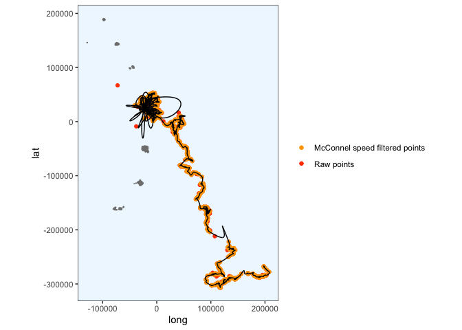
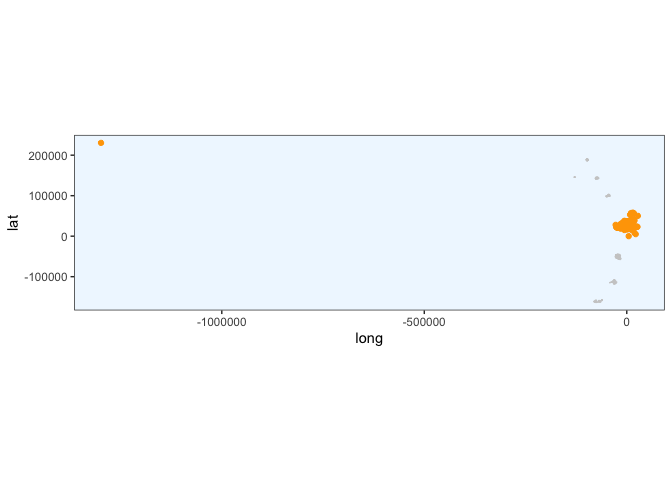

Initial processing with Crawl - caching not working
================
Gemma Clucas
6/29/2020

``` r
knitr::opts_chunk$set(echo = TRUE)
library(tidyverse)
library(lubridate)
library(crawl)   #to fit Kalman filter models
library(trip)    #to prepare GPS data
library(maptools)
library(sp)
library(rgdal)
library(raster)
library(ggplot2)
library(knitr)
library(spdplyr)
options(scipen=999)
```

Note that caching the crawled tracks each penguin stopped working, so
they would get overwritten each time I knitted this document. This
document, therefore, shows the steps that I took for the first penguin
only. I ran all the other penguins multiple times until I got no (or
only a few) NAs when I ran crawl, and I have saved an image of the
tracks for each PTT for later use.

## Load data

This is the data that Claudia sent over on 30th June 2020.

``` r
raw <- read.csv("raw_data/satellite_tracking_data_30_06_20.csv")
```

## Prepare data for analysis

**Format times**

The date and time are in the format:  
\* mm/dd/yy hh:mm

I can use the `lubridate` package to change them into a proper
date-time.

``` r
raw$Time <- mdy_hm(raw$Date, tz = "UTC")
```

Create a column with the time in hours since the first fix (that is, the
first fix for all
individuals).

``` r
raw$Time_since <- as.numeric(difftime(raw$Time, min(raw$Time), units="hours"))
```

Remove duplicated rows and rename columns.

``` r
raw <- raw[!duplicated(raw), ]

raw <- raw %>% 
  rename(Argos_loc_class = Loc.Class, LON = Lon1, LAT = Lat1)
```

At this stage I’m going to remove all the other columns from the
dataframe and just keep the ones we will work with.

``` r
clean <- raw %>% 
  dplyr::select(Ptt, Time, Time_since, LON, LAT, Argos_loc_class, Uplink)
```

## Create a map that we can plot the fixes onto later

This is the SGSSI shapefile that Vicky and I found.

``` r
Seamask<-readOGR("Seamask.shp")
```

    ## OGR data source with driver: ESRI Shapefile 
    ## Source: "/Users/gemmaclucas/GitHub/CHPE_Tracking_South_Sandwich_Islands/Seamask.shp", layer: "Seamask"
    ## with 1 features
    ## It has 1 fields

Don’t try to plot the whole thing, it takes ages as it includes all of
South Georgia. The code to use would be `plot(Seamask,axes=T)`.

Instead, crop to just the South Sandwich Islands (SSI) and convert to a
dataframe that can be plotted with ggplot. The code for doing the
conversion is from
<https://github.com/tidyverse/ggplot2/wiki/plotting-polygon-shapefiles>

``` r
SSI <- crop(Seamask, c(450000, 750000, -600000, -100000))

# convert to dataframe for use with ggplot2
SSI@data$id = rownames(SSI@data)
SSI.points = fortify(SSI, region="id")
SSI.df = plyr::join(SSI.points, SSI@data, by="id")

# NB all the polygons for the islands have hole == TRUE, so I am filtering for these.
# the polygon for the sea has hole == FALSE, so I don't need to plot that.
SSI.df %>% dplyr::filter(hole == TRUE) %>% 
  ggplot(aes(x = long, y = lat, group = group)) + 
  geom_polygon(fill="grey") +
  geom_path(color="grey") +
  coord_equal() +
  theme_bw() +
  xlim(450000, 750000) +
  ylim(-600000, -100000) +
  theme(panel.grid.major = element_blank(), 
        panel.grid.minor = element_blank(),
        panel.background = element_rect(fill = "aliceblue"))
```

<!-- -->

Check the projection

``` r
crs(SSI)
```

    ## CRS arguments:
    ##  +proj=lcc +lat_1=-54 +lat_2=-54.75 +lat_0=-55 +lon_0=-37 +x_0=0 +y_0=0
    ## +datum=WGS84 +units=m +no_defs +ellps=WGS84 +towgs84=0,0,0

Re-project to Lambert Azimuthal Equal
Area

``` r
SSI_laea<-spTransform(SSI, CRS=CRS("+proj=laea +lon_0=-26 +lat_0=-58 +units=m"))

# convert to dataframe for use with ggplot2
SSI_laea@data$id = rownames(SSI_laea@data)
SSI_laea.points = fortify(SSI_laea, region="id")
SSI_laea.df = plyr::join(SSI_laea.points, SSI_laea@data, by="id")

# filter out only the polygons for the islands
SSI_laea.df <- SSI_laea.df %>% filter(hole == TRUE)


SSI_laea.df %>% 
  ggplot(aes(x = long, y = lat, group = group)) + 
  geom_polygon(fill="grey") +
  geom_path(color="grey") +
  coord_equal() +
  theme_bw() +
  theme(panel.grid.major = element_blank(), 
        panel.grid.minor = element_blank(),
        panel.background = element_rect(fill = "aliceblue"))
```

<!-- -->

## Pick a penguin

We need to run crawl on the tracks from each individual separately.
First, display the PTT
    numbers:

``` r
unique(clean$Ptt)
```

    ##  [1] 196697 196698 196699 196700 196701 196702 196703 196704 196705 196706
    ## [11] 196707 196708 196709 196710 196711 196712 196713 196714 196715 196716

We’ll start with `196697` and select the data for that individual.

``` r
penguin <- "196697"

x1 <- clean %>%
  dplyr::filter(Ptt == penguin)

kable(head(x1))
```

|    Ptt | Time                | Time\_since |      LON |      LAT | Argos\_loc\_class | Uplink |
| -----: | :------------------ | ----------: | -------: | -------: | :---------------- | -----: |
| 196697 | 2020-01-06 17:14:00 |    0.400000 | \-26.264 | \-57.718 | A                 |      1 |
| 196697 | 2020-01-06 18:33:00 |    1.716667 | \-26.244 | \-57.705 | 1                 |      2 |
| 196697 | 2020-01-06 18:51:00 |    2.016667 | \-26.222 | \-57.704 | 0                 |      3 |
| 196697 | 2020-01-06 20:13:00 |    3.383333 | \-26.177 | \-57.686 | A                 |      5 |
| 196697 | 2020-01-06 20:13:00 |    3.383333 | \-26.183 | \-57.685 | 3                 |      5 |
| 196697 | 2020-01-06 20:36:00 |    3.766667 | \-26.178 | \-57.681 | 1                 |      6 |

## Order error classes and correct duplicated times

View a summary of the error classes:

``` r
x1 %>% 
  dplyr::group_by(Argos_loc_class) %>% 
  count() %>% 
  kable()
```

| Argos\_loc\_class |   n |
| :---------------- | --: |
| 0                 |  58 |
| 1                 | 227 |
| 2                 | 272 |
| 3                 | 131 |
| A                 | 244 |
| B                 | 436 |

There are quite a lot of low quality (B) fixes. We may need to remove
them if crawling doesn’t work very well. Make the error classes factors
and put them in order from most accurate to least accurate.

``` r
x1$Argos_loc_class <- factor(x1$Argos_loc_class,  
                             levels=c("3","2","1","0", "A","B")) 
```

No idea why there are duplicated times in here still, but I get a
warning in the next step if I do not do this.

``` r
x1$Time <- adjust.duplicateTimes(x1$Time, x1$Ptt)
```

## Apply McConnell speed filter in trip package to remove bad fixes

Note that I am setting the maximum speed for the McConnell speed filter
to 12 kph. According to Culick et al (1994), the preferred swimming
speeds of chinstrap penguins are 2.4 m/s, which is 8.6 kph. Allowing for
a speed up to 12 kph therefore seems reasonable.

``` r
# I can't find a way to do this without making a new dataframe x2
x2 <- x1 %>% 
  dplyr::select(LAT, LON, Time, Ptt) 

#Change it into class SpatialPointsDataFrame 
coordinates(x2) <- c("LON","LAT")

# Make it into a trip object, apply speed filter and save result to new variable called Pass_speed
x2$Pass_speed <- 
  x2 %>% 
  trip(., TORnames = c("Time","Ptt")) %>% 
  speedfilter(., max.speed = 12) 
```

    ## Warning in assume_if_longlat(out): input looks like longitude/latitude data,
    ## assuming +proj=longlat +datum=WGS84

``` r
# Filter the original dataframe
x1 <- x1 %>% dplyr::filter(x2$Pass_speed == TRUE)
```

## Make the data spatial and project to Lambert Azimuthal Equal Area

``` r
coordinates(x1) <- ~LON + LAT
```

First we have to give it a projection i.e. tell it it is in long lat
with WGS84.

``` r
proj4string(x1) <- CRS("+proj=longlat +ellps=WGS84")
```

Then we reproject it to laea. This is just centered on the long and lat
of Saunders for now, maybe change to UTM zones later - **check
this**

``` r
x1 <- spTransform(x1, CRS = CRS("+proj=laea +lon_0=-26 +lat_0=-58 +units=m"))
```

We can now plot it with our laea projection of the islands. We have to
convert the `SpatialPointsDataFrame` to a regular dataframe, `x1.df`
before plotting.

``` r
x1.df <- data.frame(x1)

ggplot() + 
  geom_polygon(data = SSI_laea.df, aes(x = long, y = lat, group = group), fill="grey80") +
  geom_path(data = SSI_laea.df, aes(x = long, y = lat, group = group), color="grey80") +
  coord_equal() +
  theme_bw() +
  theme(panel.grid.major = element_blank(), 
        panel.grid.minor = element_blank(),
        panel.background = element_rect(fill = "aliceblue")) +
  geom_point(data = x1.df, aes(x = LON, y = LAT), colour = "orange")
```

<!-- -->

## Set inital params for `crawl`

I took these from the [pragmatic guide to
crawling](https://jmlondon.github.io/crawl-workshop/crawl-practical.html#determining-your-model-parameters)
and modified them for our data, so that the first co-ordinate is used to
initialise `a` and the `P` params are from the guide:

> “When choosing the initial parameters, it is typical to have the mean
> centered on the first observation with zero velocity. a is the
> starting location for the model – the first known coordinate; and P is
> a 4x4 var-cov matrix that specifies the error (in projected units) for
> the initial coordinates.”

``` r
initial = list(a = c(coordinates(x1)[1,1], 0,
                     coordinates(x1)[1,2], 0),
               P = diag(c(10 ^ 2, 10 ^ 2, 10 ^ 2, 10 ^ 2)))
```

## Add location error priors

From the pragmatic guide:

> "The second option is to provide a prior distribution for each of the
> location quality classes. The crawl::crwMLE() function accepts a
> function for the ‘prior’ argument. In this example, we provide a
> normal distribution of the log-transformed error. The standard error
> is 0.2.

``` r
prior <-  function(p) { 
    dnorm(p[1], log(250), 0.2 , log = TRUE) +     # prior for 3
      dnorm(p[2], log(500), 0.2 , log = TRUE) +   # prior for 2
      dnorm(p[3], log(1500), 0.2, log = TRUE) +   # prior for 1
      dnorm(p[4], log(2500), 0.4 , log = TRUE) +  # prior for 0
      dnorm(p[5], log(2500), 0.4 , log = TRUE) +  # prior for A
      dnorm(p[6], log(2500), 0.4 , log = TRUE) +  # prior for B
      # skip p[7] as we won't provide a prior for sigma
      dnorm(p[8], -4, 2, log = TRUE)              # prior for beta
}
```

> "Previous documentation and examples that described a setup for
> ‘crawl’ often suggested users implement a mixed approach by
> providing both fixed values and constraints to optimize the fit and
> increase the model’s ability to converge with limited/challenging
> data. We now suggest users rely on prior distributions to achieve a
> similar intent but provide the model more flexibility. Users should
> feel free to explore various distributions and approaches for
> describing the priors (e.g. laplace, log-normal) based on their data
> and research questions.

> “Those documents also often suggested fixing the beta parameter to 4
> as the best approach to encourage challenging datasets to fit. This,
> essentially, forced the fit toward Brownian movement. We now suggest
> users rely on the prior distribution centered on -4 (smoother fit)
> and, if needed, fix the beta parameter to -4. Only fix the parameter
> to 4 as a final resort.”

Note that the guide used to suggest a standard deviation of 2 for the
beta prior as well, but that seems to have been removed from the
documentation.

## Run crawl (many times)

First remove any results from previous runs, then run it, saving the
results to `fit1`. Note that I am caching the results from this section
of code so that crawl is not re-run everytime I knit the document.
**EDIT: the caching is broken, so ignore the results from this section.
I ran it until I got no NAs and the tracks looked good before I saved
the result.**

``` r
if(exists("fit1")){rm(fit1)} 

fit1 <- crwMLE( 
  mov.model = ~1, 
  err.model=list(x=~Argos_loc_class-1), 
  drift=T, 
  data=x1, 
  Time.name="Time_since",  #method="L-BFGS-B",
  initial.state=initial, 
  prior=prior, 
  control=list(trace=1, REPORT=1) 
) 
```

    ##   Nelder-Mead direct search function minimizer
    ## function value for initial parameters = 79716.901525
    ##   Scaled convergence tolerance is 0.00118787
    ## Stepsize computed as 2.531528
    ## BUILD             11 87544.429117 77543.359316
    ## HI-REDUCTION      13 87543.522808 77543.359316
    ## HI-REDUCTION      15 86844.341656 77543.359316
    ## HI-REDUCTION      17 84856.716862 77543.359316
    ## EXTENSION         19 83822.487410 72626.310488
    ## LO-REDUCTION      21 83641.522550 72626.310488
    ## LO-REDUCTION      23 83273.353538 72626.310488
    ## HI-REDUCTION      25 80157.013835 72626.310488
    ## LO-REDUCTION      27 79815.314106 72626.310488
    ## LO-REDUCTION      29 79716.901525 72626.310488
    ## LO-REDUCTION      31 79567.112864 72626.310488
    ## LO-REDUCTION      33 79494.513470 72626.310488
    ## LO-REDUCTION      35 79474.408729 72626.310488
    ## EXTENSION         37 79224.874951 68491.494480
    ## LO-REDUCTION      39 77543.359316 68491.494480
    ## LO-REDUCTION      41 77503.661060 68491.494480
    ## LO-REDUCTION      43 77500.264086 68491.494480
    ## EXTENSION         45 77437.183915 65171.574245
    ## LO-REDUCTION      47 75511.731149 65171.574245
    ## LO-REDUCTION      49 74691.040857 65171.574245
    ## LO-REDUCTION      51 74087.575377 65171.574245
    ## EXTENSION         53 73031.398857 62468.869367
    ## LO-REDUCTION      55 72626.310488 62468.869367
    ## EXTENSION         57 70418.980188 55373.462469
    ## LO-REDUCTION      59 70342.712433 55373.462469
    ## LO-REDUCTION      61 70031.784463 55373.462469
    ## LO-REDUCTION      63 68491.494480 55373.462469
    ## LO-REDUCTION      65 67060.094306 55373.462469
    ## LO-REDUCTION      67 65698.690260 55373.462469
    ## LO-REDUCTION      69 65276.976533 55373.462469
    ## LO-REDUCTION      71 65171.574245 55373.462469
    ## LO-REDUCTION      73 63427.179533 55373.462469
    ## REFLECTION        75 62468.869367 54724.310881
    ## EXTENSION         77 59899.805389 50693.432965
    ## LO-REDUCTION      79 59233.665594 50693.432965
    ## LO-REDUCTION      81 58483.434235 50693.432965
    ## LO-REDUCTION      83 58255.454979 50693.432965
    ## LO-REDUCTION      85 56703.996846 50693.432965
    ## EXTENSION         87 56616.311645 48428.997929
    ## LO-REDUCTION      89 56318.229790 48428.997929
    ## EXTENSION         91 56200.557571 44306.306625
    ## LO-REDUCTION      93 55424.470047 44306.306625
    ## LO-REDUCTION      95 55373.462469 44306.306625
    ## LO-REDUCTION      97 54748.542213 44306.306625
    ## EXTENSION         99 54724.310881 43263.064129
    ## REFLECTION       101 51519.011307 43261.533157
    ## LO-REDUCTION     103 51245.645098 43261.533157
    ## REFLECTION       105 50693.432965 43254.870342
    ## LO-REDUCTION     107 50004.493653 43083.382256
    ## HI-REDUCTION     109 48557.733421 43083.382256
    ## LO-REDUCTION     111 48428.997929 42955.862619
    ## LO-REDUCTION     113 46385.536064 42611.756667
    ## LO-REDUCTION     115 46344.988579 42611.756667
    ## HI-REDUCTION     117 44752.937808 42611.756667
    ## HI-REDUCTION     119 44306.306625 42611.756667
    ## LO-REDUCTION     121 43992.752808 42611.756667
    ## HI-REDUCTION     123 43612.685280 42611.756667
    ## LO-REDUCTION     125 43439.953355 42611.756667
    ## HI-REDUCTION     127 43263.064129 42611.756667
    ## HI-REDUCTION     129 43261.533157 42611.756667
    ## EXTENSION        131 43254.870342 42197.097234
    ## LO-REDUCTION     133 43163.450762 42197.097234
    ## HI-REDUCTION     135 43083.382256 42197.097234
    ## LO-REDUCTION     137 43009.164456 42197.097234
    ## HI-REDUCTION     139 42992.152382 42197.097234
    ## LO-REDUCTION     141 42988.890988 42197.097234
    ## LO-REDUCTION     143 42955.862619 42197.097234
    ## LO-REDUCTION     145 42848.383640 42197.097234
    ## LO-REDUCTION     147 42814.076941 42197.097234
    ## LO-REDUCTION     149 42716.791611 42197.097234
    ## HI-REDUCTION     151 42681.864621 42197.097234
    ## LO-REDUCTION     153 42681.718643 42197.097234
    ## EXTENSION        155 42611.756667 41902.782898
    ## LO-REDUCTION     157 42605.376423 41902.782898
    ## LO-REDUCTION     159 42585.872647 41902.782898
    ## LO-REDUCTION     161 42522.390777 41902.782898
    ## LO-REDUCTION     163 42468.733192 41902.782898
    ## LO-REDUCTION     165 42468.552976 41902.782898
    ## EXTENSION        167 42455.639751 41894.035145
    ## REFLECTION       169 42286.269913 41848.093635
    ## REFLECTION       171 42256.556984 41826.327893
    ## LO-REDUCTION     173 42197.097234 41826.327893
    ## LO-REDUCTION     175 42178.175353 41826.327893
    ## LO-REDUCTION     177 42120.535006 41826.327893
    ## REFLECTION       179 42086.858433 41790.071214
    ## LO-REDUCTION     181 42066.696653 41786.019455
    ## LO-REDUCTION     183 41945.956589 41786.019455
    ## REFLECTION       185 41929.346529 41774.110944
    ## HI-REDUCTION     187 41924.123387 41774.110944
    ## EXTENSION        189 41902.782898 41673.025570
    ## HI-REDUCTION     191 41894.035145 41673.025570
    ## EXTENSION        193 41870.337201 41643.016297
    ## REFLECTION       195 41848.093635 41608.926132
    ## LO-REDUCTION     197 41827.478223 41608.926132
    ## HI-REDUCTION     199 41826.327893 41608.926132
    ## LO-REDUCTION     201 41801.421507 41608.926132
    ## EXTENSION        203 41790.071214 41573.599805
    ## LO-REDUCTION     205 41788.958147 41573.599805
    ## LO-REDUCTION     207 41786.019455 41573.599805
    ## REFLECTION       209 41774.110944 41552.016631
    ## LO-REDUCTION     211 41747.122967 41552.016631
    ## HI-REDUCTION     213 41681.157701 41552.016631
    ## EXTENSION        215 41673.025570 41392.316498
    ## LO-REDUCTION     217 41655.358396 41392.316498
    ## LO-REDUCTION     219 41643.212407 41392.316498
    ## LO-REDUCTION     221 41643.016297 41392.316498
    ## LO-REDUCTION     223 41613.232570 41392.316498
    ## EXTENSION        225 41608.926132 41341.993999
    ## EXTENSION        227 41594.396534 41219.228522
    ## LO-REDUCTION     229 41574.278623 41219.228522
    ## LO-REDUCTION     231 41573.599805 41219.228522
    ## LO-REDUCTION     233 41552.016631 41219.228522
    ## LO-REDUCTION     235 41504.517354 41219.228522
    ## LO-REDUCTION     237 41485.979907 41219.228522
    ## EXTENSION        239 41459.795851 41092.816641
    ## LO-REDUCTION     241 41438.993613 41092.816641
    ## LO-REDUCTION     243 41392.316498 41092.816641
    ## LO-REDUCTION     245 41370.482737 41092.816641
    ## LO-REDUCTION     247 41364.727084 41092.816641
    ## REFLECTION       249 41341.993999 41081.351225
    ## EXTENSION        251 41312.016575 40851.125490
    ## LO-REDUCTION     253 41287.034031 40851.125490
    ## LO-REDUCTION     255 41245.096394 40851.125490
    ## LO-REDUCTION     257 41219.228522 40851.125490
    ## LO-REDUCTION     259 41212.582952 40851.125490
    ## LO-REDUCTION     261 41166.048830 40851.125490
    ## LO-REDUCTION     263 41136.203778 40851.125490
    ## LO-REDUCTION     265 41093.351560 40851.125490
    ## LO-REDUCTION     267 41092.816641 40851.125490
    ## LO-REDUCTION     269 41081.351225 40851.125490
    ## LO-REDUCTION     271 41032.081458 40851.125490
    ## LO-REDUCTION     273 41031.054247 40851.125490
    ## REFLECTION       275 41028.747264 40820.811661
    ## REFLECTION       277 40983.664024 40768.454581
    ## EXTENSION        279 40959.804182 40697.520741
    ## LO-REDUCTION     281 40903.466646 40697.520741
    ## LO-REDUCTION     283 40878.513486 40697.520741
    ## LO-REDUCTION     285 40878.282924 40697.520741
    ## LO-REDUCTION     287 40874.561599 40697.520741
    ## REFLECTION       289 40862.630237 40682.637673
    ## LO-REDUCTION     291 40853.619930 40682.637673
    ## LO-REDUCTION     293 40851.125490 40682.637673
    ## REFLECTION       295 40820.811661 40669.066036
    ## LO-REDUCTION     297 40776.239056 40669.066036
    ## LO-REDUCTION     299 40768.454581 40666.319816
    ## LO-REDUCTION     301 40758.752776 40666.319816
    ## REFLECTION       303 40749.036265 40626.172724
    ## LO-REDUCTION     305 40724.867547 40626.172724
    ## LO-REDUCTION     307 40707.572985 40626.172724
    ## LO-REDUCTION     309 40697.520741 40626.172724
    ## HI-REDUCTION     311 40690.134147 40626.172724
    ## LO-REDUCTION     313 40682.637673 40626.172724
    ## REFLECTION       315 40670.391575 40624.487325
    ## HI-REDUCTION     317 40669.066036 40624.487325
    ## LO-REDUCTION     319 40668.244302 40624.487325
    ## LO-REDUCTION     321 40666.319816 40624.487325
    ## LO-REDUCTION     323 40659.387418 40624.487325
    ## LO-REDUCTION     325 40652.550407 40624.487325
    ## LO-REDUCTION     327 40651.649561 40624.487325
    ## REFLECTION       329 40650.731104 40618.409161
    ## LO-REDUCTION     331 40646.653325 40618.409161
    ## LO-REDUCTION     333 40646.296732 40618.409161
    ## LO-REDUCTION     335 40638.682629 40616.894661
    ## LO-REDUCTION     337 40632.877839 40616.423658
    ## LO-REDUCTION     339 40628.332482 40615.550400
    ## HI-REDUCTION     341 40628.028333 40615.550400
    ## EXTENSION        343 40626.172724 40609.861928
    ## LO-REDUCTION     345 40625.982037 40609.861928
    ## REFLECTION       347 40624.487325 40608.189474
    ## REFLECTION       349 40620.238396 40607.406921
    ## LO-REDUCTION     351 40620.154696 40607.406921
    ## EXTENSION        353 40618.643138 40599.891116
    ## LO-REDUCTION     355 40618.409161 40599.891116
    ## LO-REDUCTION     357 40616.894661 40599.891116
    ## LO-REDUCTION     359 40616.423658 40599.891116
    ## EXTENSION        361 40615.550400 40590.880146
    ## LO-REDUCTION     363 40614.745198 40590.880146
    ## LO-REDUCTION     365 40609.861928 40590.880146
    ## LO-REDUCTION     367 40608.923537 40590.880146
    ## LO-REDUCTION     369 40608.189474 40590.880146
    ## LO-REDUCTION     371 40607.585541 40590.880146
    ## LO-REDUCTION     373 40607.406921 40590.880146
    ## EXTENSION        375 40606.565764 40580.940046
    ## LO-REDUCTION     377 40602.030284 40580.940046
    ## LO-REDUCTION     379 40599.891116 40580.940046
    ## EXTENSION        381 40598.012427 40570.360215
    ## LO-REDUCTION     383 40597.251731 40570.360215
    ## LO-REDUCTION     385 40596.989370 40570.360215
    ## LO-REDUCTION     387 40593.268995 40570.360215
    ## LO-REDUCTION     389 40592.012042 40570.360215
    ## LO-REDUCTION     391 40591.246664 40570.360215
    ## LO-REDUCTION     393 40590.880146 40570.360215
    ## EXTENSION        395 40584.988489 40554.527558
    ## LO-REDUCTION     397 40584.169802 40554.527558
    ## LO-REDUCTION     399 40580.940046 40554.527558
    ## LO-REDUCTION     401 40577.387731 40554.527558
    ## LO-REDUCTION     403 40576.716314 40554.527558
    ## EXTENSION        405 40575.579274 40540.662707
    ## LO-REDUCTION     407 40574.898416 40540.662707
    ## LO-REDUCTION     409 40572.342044 40540.662707
    ## EXTENSION        411 40570.493159 40533.398768
    ## LO-REDUCTION     413 40570.360215 40533.398768
    ## EXTENSION        415 40559.094859 40524.218259
    ## LO-REDUCTION     417 40556.424737 40524.218259
    ## EXTENSION        419 40555.671471 40519.535366
    ## EXTENSION        421 40554.651622 40515.588320
    ## LO-REDUCTION     423 40554.527558 40515.588320
    ## EXTENSION        425 40550.245627 40485.305790
    ## LO-REDUCTION     427 40544.911819 40485.305790
    ## LO-REDUCTION     429 40540.662707 40485.305790
    ## LO-REDUCTION     431 40533.614967 40485.305790
    ## LO-REDUCTION     433 40533.398768 40485.305790
    ## HI-REDUCTION     435 40526.708225 40485.305790
    ## EXTENSION        437 40525.960815 40459.319741
    ## LO-REDUCTION     439 40524.218259 40459.319741
    ## LO-REDUCTION     441 40519.535366 40459.319741
    ## LO-REDUCTION     443 40515.588320 40459.319741
    ## LO-REDUCTION     445 40509.686657 40459.319741
    ## LO-REDUCTION     447 40495.736763 40459.319741
    ## LO-REDUCTION     449 40495.375419 40459.319741
    ## LO-REDUCTION     451 40494.626949 40459.319741
    ## EXTENSION        453 40492.117448 40451.603262
    ## EXTENSION        455 40486.915234 40442.229953
    ## EXTENSION        457 40485.305790 40428.530328
    ## LO-REDUCTION     459 40479.229839 40428.530328
    ## LO-REDUCTION     461 40473.140347 40428.530328
    ## LO-REDUCTION     463 40469.394181 40428.530328
    ## REFLECTION       465 40468.021314 40428.389213
    ## REFLECTION       467 40467.409182 40426.109794
    ## LO-REDUCTION     469 40467.346906 40426.109794
    ## LO-REDUCTION     471 40459.319741 40426.109794
    ## LO-REDUCTION     473 40451.603262 40426.109794
    ## REFLECTION       475 40443.178694 40421.488848
    ## LO-REDUCTION     477 40442.229953 40421.488848
    ## REFLECTION       479 40434.495617 40420.464260
    ## LO-REDUCTION     481 40433.943332 40420.464260
    ## REFLECTION       483 40433.705009 40420.033040
    ## REFLECTION       485 40433.062194 40418.637103
    ## LO-REDUCTION     487 40431.058619 40418.637103
    ## EXTENSION        489 40428.575670 40412.922200
    ## LO-REDUCTION     491 40428.530328 40412.922200
    ## LO-REDUCTION     493 40428.389213 40412.922200
    ## EXTENSION        495 40426.109794 40409.625388
    ## LO-REDUCTION     497 40423.617861 40409.625388
    ## REFLECTION       499 40421.488848 40409.565077
    ## Exiting from Nelder Mead minimizer
    ##     501 function evaluations used

    ## Warning in sqrt(diag(Cmat)): NaNs produced

``` r
fit1 
```

    ## 
    ## 
    ## Continuous-Time Correlated Random Walk fit
    ## 
    ## Models:
    ## --------
    ## Movement   ~ 1
    ## Error   ~Argos_loc_class - 1
    ## with Random Drift
    ## 
    ##                         Parameter Est. St. Err. 95% Lower 95% Upper
    ## ln tau Argos_loc_class3          6.121    0.076     5.973     6.269
    ## ln tau Argos_loc_class2          6.060    0.053     5.956     6.163
    ## ln tau Argos_loc_class1          6.899    0.057     6.787     7.011
    ## ln tau Argos_loc_class0          0.873    0.404     0.082     1.665
    ## ln tau Argos_loc_classA          6.443    0.055     6.335     6.552
    ## ln tau Argos_loc_classB          0.238    0.468    -0.679     1.156
    ## ln sigma (Intercept)             9.780      NaN       NaN       NaN
    ## ln beta (Intercept)             -2.229      NaN       NaN       NaN
    ## ln sigma.drift/sigma             1.137      NaN       NaN       NaN
    ## ln psi-1                        -6.950    1.180    -9.263    -4.637
    ## 
    ## 
    ## Log Likelihood = -20204.783 
    ## AIC = 40429.565

## Predict locations at 5 minute intervals

First make a new set of times, spaced by 5 minutes, to predict locations
for.

``` r
predTime <- seq(min(x1$Time_since), max(x1$Time_since), 1/12)
```

Then predict the location for each time point in `predTime`. The
`predObj` dataframe that is produced contains the original locations
from `x1`, but adds rows in between for the predicted locations at the
time given in `predTime`. The predicted locations are stored in
`predObj$mu.x` and
`predObj$mu.y`.

``` r
predObj <- crwPredict(object.crwFit = fit1, predTime = predTime, speedEst = TRUE, flat=TRUE) 
kable(head(predObj))
```

|   |   TimeNum | locType |    Ptt | Time                | Time\_since | Argos\_loc\_class | Uplink |        LON |      LAT |       mu.x |  theta.x |  gamma.x |     mu.y |  theta.y |  gamma.y |
| - | --------: | :------ | -----: | :------------------ | ----------: | :---------------- | -----: | ---------: | -------: | ---------: | -------: | -------: | -------: | -------: | -------: |
| 1 | 0.4000000 | p       | 196697 | 2020-01-06 17:14:00 |   0.4000000 | A                 |      1 | \-15733.54 | 31377.18 | \-15756.75 | 57.09292 | 555.0913 | 31382.71 | 110.8168 | 1077.564 |
| 3 | 0.4833333 | p       | 196697 | NA                  |   0.4833333 | NA                |     NA |         NA |       NA | \-15705.51 | 57.83527 | 562.2982 | 31481.69 | 110.6451 | 1075.897 |
| 4 | 0.5666667 | p       | 196697 | NA                  |   0.5666667 | NA                |     NA |         NA |       NA | \-15652.95 | 60.06237 | 583.9196 | 31580.36 | 110.1300 | 1070.896 |
| 5 | 0.6500000 | p       | 196697 | NA                  |   0.6500000 | NA                |     NA |         NA |       NA | \-15597.74 | 63.77440 | 619.9571 | 31678.42 | 109.2715 | 1062.561 |
| 6 | 0.7333333 | p       | 196697 | NA                  |   0.7333333 | NA                |     NA |         NA |       NA | \-15538.56 | 68.97166 | 670.4137 | 31775.57 | 108.0695 | 1050.892 |
| 7 | 0.8166667 | p       | 196697 | NA                  |   0.8166667 | NA                |     NA |         NA |       NA | \-15474.07 | 75.65457 | 735.2935 | 31871.48 | 106.5239 | 1035.887 |

## Plot the crawled tracks

I want to plot the crawled track against the original data i.e. before
the speed filter was applied. This means that I need to go back and
filter the data for this penguin from the `clean` dataframe and project
it to LAEA before I can plot it against `predObj`.

``` r
par(mfrow=c(1,1))

# get the original data for this penguin
x3 <- clean %>%
  dplyr::filter(Ptt == penguin)

# project to LAEA
coordinates(x3) <- ~LON + LAT 
proj4string(x3) <- CRS("+proj=longlat +ellps=WGS84")
x3 <- spTransform(x3, CRS = CRS("+proj=laea +lon_0=-26 +lat_0=-58 +units=m"))

# get just the coordinates from x3
x3 <- coordinates(x3) %>% 
  as.data.frame()

#
colors <- c("Raw points" = "orangered", "McConnel speed filtered points" = "orange")


# plot
ggplot() + 
  geom_polygon(data = SSI_laea.df, aes(x = long, y = lat, group = group), fill="grey50") +
  geom_path(data = SSI_laea.df, aes(x = long, y = lat, group = group), color="grey50") +
  coord_equal() +
  geom_point(data = x3, aes(x = LON, y = LAT, colour = "Raw points") ) +
  geom_point(data = x1.df, aes(x = LON, y = LAT, colour = "McConnel speed filtered points")) +
  geom_path(data = predObj, aes(x = mu.x, y = mu.y)) +
  scale_color_manual(values = colors) +
  theme_bw() +
  theme(panel.grid.major = element_blank(), 
        panel.grid.minor = element_blank(),
        panel.background = element_rect(fill = "aliceblue"),
        legend.title = element_blank()) 
```

<!-- -->

## Add absolute times for the predicted positions back to the dataframe `predObj`

``` r
predObj$Time_absolute <- as.POSIXct(3600 * (predObj$Time_since ), origin = min(raw$Time), tz="UTC") 
```

## Write the predicted positions to csv for use later

Commented out so that I don’t overwrite the results that I want to keep
each time I knit the
doc.

``` r
#write.csv(predObj, paste0("predicted_tracks/", penguin, "_track.csv", sep = ""), row.names = FALSE)
```

# Run for the other penguins in the dataset - except caching the results isn’t working so the crawled tracks look hideous

This gives an idea of what I was doing for each one though.

## Create functions for the different steps

I am going to define functions to select and clean the data, and plot
it, to reduce the amount of code that I have to
re-write.

``` r
# define the function for selecting the data for one penguin and applying to McConnel speed filter
filter_points <-  function(penguin) {
  # select the data for the penguin
  x1 <- clean %>% dplyr::filter(Ptt == penguin)
  # order error classes
  x1$Argos_loc_class <- factor(x1$Argos_loc_class,  
                             levels=c("3","2","1","0", "A","B"))
  # adjust duplicate times
  x1$Time <- adjust.duplicateTimes(x1$Time, x1$Ptt)
  # select just the latitude, longitude, time and id columns
  x2 <- x1 %>% dplyr::select(LAT, LON, Time, Ptt)
  # make it spatial
  coordinates(x2) <- c("LON","LAT")
  # apply McConnel speed filter
  x2$Pass_speed <- x2 %>% 
    trip(., TORnames = c("Time","Ptt")) %>% 
    speedfilter(., max.speed = 8) 
  # filter the original data for the points that pass the speed filter
  x1 <- x1 %>% dplyr::filter(x2$Pass_speed == TRUE)
  # make the points spatial
  coordinates(x1) <- ~LON + LAT
  # give it a projection
  proj4string(x1) <- CRS("+proj=longlat +ellps=WGS84")
  # transform to LAEA centered around the south sandwich islands
  x1 <- spTransform(x1, CRS = CRS("+proj=laea +lon_0=-26 +lat_0=-58 +units=m"))
}


# define a function for plotting the cleaned data to check that it looks ok
plot_cleaned_points <- function(x) {
  ggplot() + 
    geom_polygon(data = SSI_laea.df, aes(x = long, y = lat, group = group), fill="grey80") +
    geom_path(data = SSI_laea.df, aes(x = long, y = lat, group = group), color="grey80") +
    coord_equal() +
    theme_bw() +
    theme(panel.grid.major = element_blank(), 
          panel.grid.minor = element_blank(),
          panel.background = element_rect(fill = "aliceblue")) +
    geom_point(data = x, aes(x = LON, y = LAT), colour = "orange")
}  

# define the prior for crawl
prior <-  function(p) { 
    dnorm(p[1], log(250), 0.2 , log = TRUE) +     # prior for 3
      dnorm(p[2], log(500), 0.2 , log = TRUE) +   # prior for 2
      dnorm(p[3], log(1500), 0.2, log = TRUE) +   # prior for 1
      dnorm(p[4], log(2500), 0.4 , log = TRUE) +  # prior for 0
      dnorm(p[5], log(2500), 0.4 , log = TRUE) +  # prior for A
      dnorm(p[6], log(2500), 0.4 , log = TRUE) +  # prior for B
      # skip p[7] as we won't provide a prior for sigma
      dnorm(p[8], -4, 2, log = TRUE)              # prior for beta
}


# define a function for crawling
crawl <- function(x1) {
  if(exists("fit1")){rm(fit1)}
  initial = list(a = c(coordinates(x1)[1,1], 0,
                     coordinates(x1)[1,2], 0),
               P = diag(c(10 ^ 2, 10 ^ 2, 10 ^ 2, 10 ^ 2)))
  fit1 <- crwMLE( 
    mov.model = ~1, 
    err.model=list(x=~Argos_loc_class-1), 
    drift=T, 
    data=x1, 
    Time.name="Time_since",  
    initial.state=initial, 
    prior=prior, 
    control=list(trace=1, REPORT=1)) 
}

# function for creating times where points will be predicted
predict_times <- function(x) {
  seq(min(x$Time_since), max(x$Time_since), 1/12)
}

# define a function for predicting points every 5 minutes, based on the crawled data
predict_points <- function(x, y) {
  crwPredict(object.crwFit = x, predTime = y, speedEst = TRUE, flat=TRUE)
}
  

# define a function for plotting the results of the crawled tracks against the original points
plot_crawled_track <- function() {
  # get the original data
  x3 <- clean %>% dplyr::filter(Ptt == penguin)
  # project original data to LAEA
  coordinates(x3) <- ~LON + LAT 
  proj4string(x3) <- CRS("+proj=longlat +ellps=WGS84")
  x3 <- spTransform(x3, CRS = CRS("+proj=laea +lon_0=-26 +lat_0=-58 +units=m"))
  # get just the coordinates from x3 and make a dataframe for plotting
  x3 <- coordinates(x3) %>% as.data.frame()
  # define the colour scheme
  colors <- c("Raw points" = "orangered", "McConnel speed filtered points" = "orange")
  # plot
  ggplot() + 
    geom_polygon(data = SSI_laea.df, aes(x = long, y = lat, group = group), fill="grey50") +
    geom_path(data = SSI_laea.df, aes(x = long, y = lat, group = group), color="grey50") +
    coord_equal() +
    geom_point(data = x3, aes(x = LON, y = LAT, colour = "Raw points") ) +
    geom_point(data = x1.df, aes(x = LON, y = LAT, colour = "McConnel speed filtered points")) +
    geom_path(data = predObj, aes(x = mu.x, y = mu.y)) +
    scale_color_manual(values = colors) +
    theme_bw() +
    theme(panel.grid.major = element_blank(), 
          panel.grid.minor = element_blank(),
          panel.background = element_rect(fill = "aliceblue"),
          legend.title = element_blank()) 
}

# zoom in on Saunders Island only
plot_crawled_track_Saunders <- function() {
  # get the original data
  x3 <- clean %>% dplyr::filter(Ptt == penguin)
  # project original data to LAEA
  coordinates(x3) <- ~LON + LAT 
  proj4string(x3) <- CRS("+proj=longlat +ellps=WGS84")
  x3 <- spTransform(x3, CRS = CRS("+proj=laea +lon_0=-26 +lat_0=-58 +units=m"))
  # get just the coordinates from x3 and make a dataframe for plotting
  x3 <- coordinates(x3) %>% as.data.frame()
  # define the colour scheme
  colors <- c("Raw points" = "orangered", "McConnel speed filtered points" = "orange")
  # plot
  ggplot() + 
    geom_polygon(data = SSI_laea.df, aes(x = long, y = lat, group = group), fill="grey50") +
    geom_path(data = SSI_laea.df, aes(x = long, y = lat, group = group), color="grey50") +
    coord_equal() +
    geom_point(data = x3, aes(x = LON, y = LAT, colour = "Raw points") ) +
    geom_point(data = x1.df, aes(x = LON, y = LAT, colour = "McConnel speed filtered points")) +
    geom_path(data = predObj, aes(x = mu.x, y = mu.y)) +
    scale_color_manual(values = colors) +
    theme_bw() +
    theme(panel.grid.major = element_blank(), 
          panel.grid.minor = element_blank(),
          panel.background = element_rect(fill = "aliceblue"),
          legend.title = element_blank()) +
    coord_cartesian(xlim = c(-50000, 75000),
                    ylim = c(-50000, 75000))

}
```

## Ptt 196698

``` r
penguin <- "196698"
x1 <- filter_points(penguin)
```

    ## Warning in assume_if_longlat(out): input looks like longitude/latitude data,
    ## assuming +proj=longlat +datum=WGS84

``` r
# convert to dataframe for plotting
x1.df <- data.frame(x1)
plot_cleaned_points(x1.df)
```

<!-- -->

For this penguin, the first fix is funky. The code below removes it from
the dataframe `x1.df` and then converts this back to a
SpatialPointsDataFrame. I couldn’t get the subsetting on the SPDF `x1`
to work, so this is a roundabout solution…

``` r
x1.df <- x1.df %>% dplyr::filter(LON < 2000000)
plot_cleaned_points(x1.df)
```

<!-- -->

``` r
# then make x1.df spatial 
coordinates(x1.df) <- ~LON + LAT
# tell it it's already projected in LAEA centered around the south sandwich islands
proj4string(x1.df) <- CRS("+proj=laea +lon_0=-26 +lat_0=-58 +units=m")
# transform to LAEA centered around the south sandwich islands
x1.df <- spTransform(x1.df, CRS = CRS("+proj=laea +lon_0=-26 +lat_0=-58 +units=m"))

# rename back to x1 so that I can continue with the code below
x1 <- x1.df

# then recreate x1.df as a normal data frame
x1.df <- data.frame(x1)
```

Next we apply the `crwMLE()` function to the spatial object `x1`. Run
this multiple times until you don’t get any `NaN`s.

``` r
fit1 <- crawl(x1)
```

    ## Warning in rm(fit1): object 'fit1' not found

    ##   Nelder-Mead direct search function minimizer
    ## function value for initial parameters = 126294.161223
    ##   Scaled convergence tolerance is 0.00188193
    ## Stepsize computed as 2.614996
    ## BUILD             11 130661.115704 116095.809030
    ## EXTENSION         13 130256.048570 110303.916931
    ## LO-REDUCTION      15 129913.483061 110303.916931
    ## LO-REDUCTION      17 128614.677764 110303.916931
    ## EXTENSION         19 126323.873559 104593.671496
    ## LO-REDUCTION      21 126294.161223 104593.671496
    ## LO-REDUCTION      23 126294.161223 104593.671496
    ## LO-REDUCTION      25 125742.022737 104593.671496
    ## LO-REDUCTION      27 122324.084790 104593.671496
    ## LO-REDUCTION      29 118373.354075 104593.671496
    ## EXTENSION         31 116095.809030 95325.228358
    ## LO-REDUCTION      33 112956.310816 95325.228358
    ## LO-REDUCTION      35 110944.692252 95325.228358
    ## LO-REDUCTION      37 110303.916931 95325.228358
    ## LO-REDUCTION      39 109140.095307 95325.228358
    ## EXTENSION         41 107620.348124 91291.732252
    ## LO-REDUCTION      43 107351.924760 91291.732252
    ## EXTENSION         45 105993.369184 81684.053572
    ## LO-REDUCTION      47 104932.266097 81684.053572
    ## LO-REDUCTION      49 104593.671496 81684.053572
    ## LO-REDUCTION      51 99237.979885 81684.053572
    ## LO-REDUCTION      53 98637.485529 81684.053572
    ## EXTENSION         55 97564.902515 76951.307962
    ## LO-REDUCTION      57 96719.170452 76951.307962
    ## LO-REDUCTION      59 95325.228358 76951.307962
    ## LO-REDUCTION      61 92382.898951 76951.307962
    ## LO-REDUCTION      63 91291.732252 76951.307962
    ## EXTENSION         65 88723.931409 70051.609171
    ## LO-REDUCTION      67 87350.903424 70051.609171
    ## LO-REDUCTION      69 85727.811132 70051.609171
    ## LO-REDUCTION      71 85659.457402 70051.609171
    ## EXTENSION         73 84360.088617 59649.083095
    ## LO-REDUCTION      75 84351.329938 59649.083095
    ## LO-REDUCTION      77 81684.053572 59649.083095
    ## LO-REDUCTION      79 80046.727567 59649.083095
    ## LO-REDUCTION      81 77927.566816 59649.083095
    ## LO-REDUCTION      83 76951.307962 59649.083095
    ## LO-REDUCTION      85 73500.323609 59649.083095
    ## LO-REDUCTION      87 72861.770089 59649.083095
    ## EXTENSION         89 72237.998776 51762.793147
    ## LO-REDUCTION      91 70051.609171 51762.793147
    ## LO-REDUCTION      93 69471.274964 51762.793147
    ## EXTENSION         95 66162.112654 42808.690807
    ## LO-REDUCTION      97 65154.794754 42808.690807
    ## LO-REDUCTION      99 64695.392484 42808.690807
    ## LO-REDUCTION     101 61743.598521 42808.690807
    ## EXTENSION        103 61161.915116 39510.514140
    ## REFLECTION       105 60041.753588 39410.543117
    ## LO-REDUCTION     107 59649.083095 39410.543117
    ## LO-REDUCTION     109 54215.098572 39410.543117
    ## LO-REDUCTION     111 53387.433905 39410.543117
    ## LO-REDUCTION     113 51762.793147 38965.489946
    ## HI-REDUCTION     115 49050.123470 38965.489946
    ## LO-REDUCTION     117 46615.897244 38532.434248
    ## LO-REDUCTION     119 46022.184825 38532.434248
    ## HI-REDUCTION     121 43759.786561 38532.434248
    ## LO-REDUCTION     123 43125.780816 38532.434248
    ## HI-REDUCTION     125 42808.690807 38532.434248
    ## LO-REDUCTION     127 42416.720214 38505.219058
    ## HI-REDUCTION     129 40659.640755 38505.219058
    ## HI-REDUCTION     131 40432.059671 38505.219058
    ## LO-REDUCTION     133 40235.005699 38505.219058
    ## LO-REDUCTION     135 39890.819413 38505.219058
    ## LO-REDUCTION     137 39583.295786 38505.219058
    ## REFLECTION       139 39510.514140 38146.586117
    ## HI-REDUCTION     141 39483.968265 38146.586117
    ## HI-REDUCTION     143 39410.543117 38146.586117
    ## LO-REDUCTION     145 38965.489946 38146.586117
    ## LO-REDUCTION     147 38742.287472 38146.586117
    ## HI-REDUCTION     149 38718.479389 38146.586117
    ## LO-REDUCTION     151 38611.409833 38146.586117
    ## LO-REDUCTION     153 38581.800022 38146.586117
    ## LO-REDUCTION     155 38559.374673 38146.586117
    ## LO-REDUCTION     157 38532.434248 38146.586117
    ## HI-REDUCTION     159 38530.187238 38146.586117
    ## LO-REDUCTION     161 38505.219058 38146.586117
    ## REFLECTION       163 38451.024666 38097.939906
    ## LO-REDUCTION     165 38437.787462 38097.939906
    ## REFLECTION       167 38427.048535 38087.978966
    ## LO-REDUCTION     169 38308.001923 38087.978966
    ## REFLECTION       171 38298.793415 38055.258879
    ## REFLECTION       173 38296.232411 38023.293979
    ## LO-REDUCTION     175 38255.531382 38023.293979
    ## LO-REDUCTION     177 38219.901056 38023.293979
    ## LO-REDUCTION     179 38190.985142 38023.293979
    ## REFLECTION       181 38190.950804 38005.001095
    ## LO-REDUCTION     183 38171.999548 38005.001095
    ## LO-REDUCTION     185 38146.586117 38005.001095
    ## LO-REDUCTION     187 38097.939906 38003.064351
    ## LO-REDUCTION     189 38094.694291 38003.064351
    ## REFLECTION       191 38094.652500 37973.555202
    ## REFLECTION       193 38087.978966 37956.512182
    ## LO-REDUCTION     195 38055.258879 37956.512182
    ## HI-REDUCTION     197 38047.724615 37956.512182
    ## LO-REDUCTION     199 38027.952012 37956.512182
    ## LO-REDUCTION     201 38025.822339 37956.512182
    ## REFLECTION       203 38023.293979 37954.379126
    ## LO-REDUCTION     205 38009.863661 37954.269434
    ## LO-REDUCTION     207 38005.001095 37954.269434
    ## LO-REDUCTION     209 38003.064351 37951.372119
    ## LO-REDUCTION     211 38001.056965 37951.372119
    ## REFLECTION       213 37973.555202 37921.476777
    ## LO-REDUCTION     215 37967.147098 37921.476777
    ## LO-REDUCTION     217 37966.955826 37921.476777
    ## LO-REDUCTION     219 37966.946068 37921.476777
    ## LO-REDUCTION     221 37959.838570 37921.476777
    ## LO-REDUCTION     223 37956.512182 37921.476777
    ## HI-REDUCTION     225 37954.379126 37921.476777
    ## LO-REDUCTION     227 37954.269434 37921.476777
    ## LO-REDUCTION     229 37952.860956 37921.476777
    ## REFLECTION       231 37951.372119 37920.131745
    ## LO-REDUCTION     233 37949.281979 37920.131745
    ## LO-REDUCTION     235 37947.071118 37920.131745
    ## REFLECTION       237 37939.408137 37909.040426
    ## EXTENSION        239 37935.137377 37898.947949
    ## LO-REDUCTION     241 37927.032725 37898.947949
    ## LO-REDUCTION     243 37924.866672 37898.947949
    ## LO-REDUCTION     245 37923.306924 37898.947949
    ## EXTENSION        247 37922.710786 37888.139327
    ## LO-REDUCTION     249 37922.394809 37888.139327
    ## LO-REDUCTION     251 37922.271113 37888.139327
    ## HI-REDUCTION     253 37921.476777 37888.139327
    ## EXTENSION        255 37920.131745 37865.297491
    ## LO-REDUCTION     257 37909.550452 37865.297491
    ## LO-REDUCTION     259 37909.040426 37865.297491
    ## LO-REDUCTION     261 37906.326441 37865.297491
    ## LO-REDUCTION     263 37905.681291 37865.297491
    ## LO-REDUCTION     265 37903.136144 37865.297491
    ## EXTENSION        267 37898.947949 37853.678035
    ## LO-REDUCTION     269 37895.369147 37853.678035
    ## LO-REDUCTION     271 37893.965124 37853.678035
    ## LO-REDUCTION     273 37889.991577 37853.678035
    ## EXTENSION        275 37889.322020 37848.197088
    ## EXTENSION        277 37888.139327 37836.712177
    ## EXTENSION        279 37883.847975 37826.324158
    ## EXTENSION        281 37873.850960 37807.428703
    ## LO-REDUCTION     283 37867.223233 37807.428703
    ## LO-REDUCTION     285 37865.831385 37807.428703
    ## LO-REDUCTION     287 37865.583680 37807.428703
    ## LO-REDUCTION     289 37865.297491 37807.428703
    ## LO-REDUCTION     291 37855.461589 37807.428703
    ## LO-REDUCTION     293 37853.678035 37807.428703
    ## LO-REDUCTION     295 37848.197088 37807.428703
    ## LO-REDUCTION     297 37836.712177 37807.428703
    ## EXTENSION        299 37836.624993 37803.418514
    ## EXTENSION        301 37833.956329 37783.717062
    ## LO-REDUCTION     303 37829.845562 37783.717062
    ## LO-REDUCTION     305 37826.324158 37783.717062
    ## LO-REDUCTION     307 37820.848018 37783.717062
    ## EXTENSION        309 37815.265419 37778.773221
    ## EXTENSION        311 37814.510821 37774.054824
    ## EXTENSION        313 37812.537625 37765.513252
    ## LO-REDUCTION     315 37812.320487 37765.513252
    ## LO-REDUCTION     317 37807.428703 37765.513252
    ## LO-REDUCTION     319 37803.418514 37765.513252
    ## LO-REDUCTION     321 37799.004013 37765.513252
    ## LO-REDUCTION     323 37792.593040 37765.513252
    ## REFLECTION       325 37787.744055 37762.809951
    ## LO-REDUCTION     327 37784.246368 37762.809951
    ## EXTENSION        329 37783.882058 37747.781258
    ## EXTENSION        331 37783.717062 37735.492943
    ## LO-REDUCTION     333 37778.773221 37735.492943
    ## LO-REDUCTION     335 37774.054824 37735.492943
    ## LO-REDUCTION     337 37772.414614 37735.492943
    ## LO-REDUCTION     339 37770.377662 37735.492943
    ## EXTENSION        341 37766.146555 37724.916711
    ## LO-REDUCTION     343 37765.957358 37724.916711
    ## LO-REDUCTION     345 37765.513252 37724.916711
    ## EXTENSION        347 37762.809951 37707.674197
    ## EXTENSION        349 37755.257923 37682.146675
    ## LO-REDUCTION     351 37751.366054 37682.146675
    ## LO-REDUCTION     353 37747.781258 37682.146675
    ## LO-REDUCTION     355 37744.623259 37682.146675
    ## EXTENSION        357 37738.757645 37672.240287
    ## EXTENSION        359 37735.492943 37644.648739
    ## LO-REDUCTION     361 37732.761459 37644.648739
    ## LO-REDUCTION     363 37724.953620 37644.648739
    ## EXTENSION        365 37724.916711 37617.591328
    ## LO-REDUCTION     367 37707.674197 37617.591328
    ## LO-REDUCTION     369 37694.434235 37617.591328
    ## LO-REDUCTION     371 37693.927008 37617.591328
    ## LO-REDUCTION     373 37687.192479 37617.591328
    ## LO-REDUCTION     375 37682.146675 37617.591328
    ## LO-REDUCTION     377 37678.891391 37617.591328
    ## LO-REDUCTION     379 37672.240287 37617.591328
    ## EXTENSION        381 37666.912088 37593.487367
    ## LO-REDUCTION     383 37644.648739 37593.487367
    ## LO-REDUCTION     385 37641.800742 37593.487367
    ## LO-REDUCTION     387 37638.097047 37593.487367
    ## EXTENSION        389 37630.715536 37568.923746
    ## LO-REDUCTION     391 37627.225574 37568.923746
    ## LO-REDUCTION     393 37625.565208 37568.923746
    ## LO-REDUCTION     395 37622.993178 37568.923746
    ## LO-REDUCTION     397 37620.459031 37568.923746
    ## LO-REDUCTION     399 37617.591328 37568.923746
    ## LO-REDUCTION     401 37610.206574 37568.923746
    ## REFLECTION       403 37607.227626 37568.043744
    ## REFLECTION       405 37604.217384 37566.555035
    ## LO-REDUCTION     407 37597.715061 37566.555035
    ## EXTENSION        409 37595.820380 37549.493444
    ## EXTENSION        411 37593.487367 37535.578137
    ## LO-REDUCTION     413 37579.731704 37535.578137
    ## LO-REDUCTION     415 37576.673784 37535.578137
    ## LO-REDUCTION     417 37576.298212 37535.578137
    ## LO-REDUCTION     419 37575.766678 37535.578137
    ## EXTENSION        421 37570.967666 37496.017669
    ## LO-REDUCTION     423 37568.923746 37496.017669
    ## LO-REDUCTION     425 37568.043744 37496.017669
    ## LO-REDUCTION     427 37566.555035 37496.017669
    ## LO-REDUCTION     429 37549.493444 37496.017669
    ## LO-REDUCTION     431 37544.515107 37496.017669
    ## LO-REDUCTION     433 37542.791439 37496.017669
    ## LO-REDUCTION     435 37542.669519 37496.017669
    ## EXTENSION        437 37538.384420 37475.761401
    ## LO-REDUCTION     439 37538.005760 37475.761401
    ## LO-REDUCTION     441 37535.578137 37475.761401
    ## EXTENSION        443 37514.723230 37440.943808
    ## LO-REDUCTION     445 37512.355796 37440.943808
    ## LO-REDUCTION     447 37508.985398 37440.943808
    ## LO-REDUCTION     449 37507.402741 37440.943808
    ## LO-REDUCTION     451 37498.755695 37440.943808
    ## EXTENSION        453 37498.539735 37359.179688
    ## LO-REDUCTION     455 37496.017669 37359.179688
    ## REFLECTION       457 37485.559681 37353.857748
    ## REFLECTION       459 37482.407755 37304.962539
    ## LO-REDUCTION     461 37475.761401 37304.962539
    ## HI-REDUCTION     463 37461.406721 37304.962539
    ## REFLECTION       465 37452.345306 37285.646228
    ## LO-REDUCTION     467 37450.589203 37285.646228
    ## HI-REDUCTION     469 37445.979666 37285.646228
    ## HI-REDUCTION     471 37441.022518 37285.646228
    ## LO-REDUCTION     473 37440.943808 37285.646228
    ## HI-REDUCTION     475 37427.304361 37285.646228
    ## LO-REDUCTION     477 37424.157060 37285.646228
    ## HI-REDUCTION     479 37405.745296 37285.646228
    ## HI-REDUCTION     481 37390.515442 37285.646228
    ## LO-REDUCTION     483 37387.950621 37285.646228
    ## HI-REDUCTION     485 37371.708302 37285.646228
    ## LO-REDUCTION     487 37359.179688 37285.646228
    ## LO-REDUCTION     489 37354.373592 37285.646228
    ## REFLECTION       491 37353.857748 37280.224660
    ## REFLECTION       493 37352.997402 37277.374468
    ## HI-REDUCTION     495 37312.721970 37277.374468
    ## LO-REDUCTION     497 37304.962539 37277.374468
    ## HI-REDUCTION     499 37301.101225 37277.374468
    ## Exiting from Nelder Mead minimizer
    ##     501 function evaluations used
    ## 
    ## Cannot calculate covariance matrix

``` r
print(fit1)      
```

    ## 
    ## 
    ## Continuous-Time Correlated Random Walk fit
    ## 
    ## Models:
    ## --------
    ## Movement   ~ 1
    ## Error   ~Argos_loc_class - 1
    ## with Random Drift
    ## 
    ##                         Parameter Est. St. Err. 95% Lower 95% Upper
    ## ln tau Argos_loc_class3          3.924       NA        NA        NA
    ## ln tau Argos_loc_class2          6.046       NA        NA        NA
    ## ln tau Argos_loc_class1          6.578       NA        NA        NA
    ## ln tau Argos_loc_class0          4.822       NA        NA        NA
    ## ln tau Argos_loc_classA          6.185       NA        NA        NA
    ## ln tau Argos_loc_classB          1.244       NA        NA        NA
    ## ln sigma (Intercept)             7.892       NA        NA        NA
    ## ln beta (Intercept)              2.044       NA        NA        NA
    ## ln sigma.drift/sigma           -24.108       NA        NA        NA
    ## ln psi-1                         8.623       NA        NA        NA
    ## 
    ## 
    ## Log Likelihood = -18638.687 
    ## AIC = 37297.374

Again, caching is broken, so ignore these results.

Predict points and plot the crawled track.

``` r
predTime <- predict_times(x1)
predObj <- predict_points(fit1, predTime)

plot_crawled_track()
```

<!-- -->

Zoom in on Saunders Island to check the tracks around there. I think
this looks
    ok.

``` r
plot_crawled_track_Saunders()
```

    ## Coordinate system already present. Adding new coordinate system, which will replace the existing one.

<!-- -->

Write to
CSV:

``` r
#write.csv(predObj, paste0("predicted_tracks/", penguin, "_track.csv", sep = ""), row.names = FALSE)
```

## Ptt 196699

``` r
penguin <- "196699"
x1 <- filter_points(penguin)
```

    ## Warning in assume_if_longlat(out): input looks like longitude/latitude data,
    ## assuming +proj=longlat +datum=WGS84

``` r
# convert to dataframe for plotting
x1.df <- data.frame(x1)
plot_cleaned_points(x1.df)
```

<!-- -->
Crawl (ran many times)

``` r
fit1 <- crawl(x1)
```

    ## Warning in rm(fit1): object 'fit1' not found

    ##   Nelder-Mead direct search function minimizer
    ## function value for initial parameters = 14623.156673
    ##   Scaled convergence tolerance is 0.000217902
    ## Stepsize computed as 1.308177
    ## BUILD             11 14952.703156 13818.736940
    ## LO-REDUCTION      13 14949.986270 13818.736940
    ## LO-REDUCTION      15 14819.973426 13818.736940
    ## LO-REDUCTION      17 14751.197119 13818.736940
    ## LO-REDUCTION      19 14701.517511 13818.736940
    ## HI-REDUCTION      21 14623.156673 13818.736940
    ## LO-REDUCTION      23 14623.156673 13818.736940
    ## EXTENSION         25 14623.156673 13724.025204
    ## LO-REDUCTION      27 14319.075054 13724.025204
    ## EXTENSION         29 14307.778543 13047.615626
    ## LO-REDUCTION      31 14296.121574 13047.615626
    ## LO-REDUCTION      33 14050.240483 13047.615626
    ## LO-REDUCTION      35 13934.532429 13047.615626
    ## EXTENSION         37 13872.394509 12788.853045
    ## LO-REDUCTION      39 13841.039932 12788.853045
    ## EXTENSION         41 13823.055991 12143.274193
    ## LO-REDUCTION      43 13818.736940 12143.274193
    ## LO-REDUCTION      45 13736.225357 12143.274193
    ## EXTENSION         47 13724.025204 11245.282156
    ## LO-REDUCTION      49 13244.941827 11245.282156
    ## LO-REDUCTION      51 13137.068169 11245.282156
    ## LO-REDUCTION      53 13099.717343 11245.282156
    ## LO-REDUCTION      55 13047.615626 11245.282156
    ## LO-REDUCTION      57 12895.533042 11245.282156
    ## EXTENSION         59 12817.705815 10788.540339
    ## EXTENSION         61 12788.853045 10157.722708
    ## LO-REDUCTION      63 12277.271946 10157.722708
    ## LO-REDUCTION      65 12143.274193 10157.722708
    ## REFLECTION        67 11671.157749 10048.816313
    ## EXTENSION         69 11626.906719 9822.919840
    ## EXTENSION         71 11613.651767 9203.471477
    ## LO-REDUCTION      73 11573.858995 9203.471477
    ## LO-REDUCTION      75 11334.908062 9203.471477
    ## LO-REDUCTION      77 11245.282156 9203.471477
    ## LO-REDUCTION      79 10788.540339 9203.471477
    ## LO-REDUCTION      81 10244.023121 9203.471477
    ## LO-REDUCTION      83 10182.710495 9203.471477
    ## LO-REDUCTION      85 10157.722708 9203.471477
    ## LO-REDUCTION      87 10048.816313 9203.471477
    ## LO-REDUCTION      89 9936.348339 9203.471477
    ## LO-REDUCTION      91 9822.919840 9203.471477
    ## LO-REDUCTION      93 9734.360244 9203.471477
    ## LO-REDUCTION      95 9667.407700 9203.471477
    ## LO-REDUCTION      97 9662.324894 9203.471477
    ## EXTENSION         99 9648.954281 9135.141425
    ## REFLECTION       101 9540.705844 9115.779304
    ## LO-REDUCTION     103 9508.403694 9115.779304
    ## REFLECTION       105 9502.846977 9114.421947
    ## LO-REDUCTION     107 9430.420018 9114.421947
    ## EXTENSION        109 9402.281311 8884.763009
    ## LO-REDUCTION     111 9398.016420 8884.763009
    ## LO-REDUCTION     113 9390.346827 8884.763009
    ## LO-REDUCTION     115 9310.010738 8884.763009
    ## LO-REDUCTION     117 9211.825564 8884.763009
    ## LO-REDUCTION     119 9203.471477 8884.763009
    ## LO-REDUCTION     121 9179.894300 8884.763009
    ## LO-REDUCTION     123 9135.141425 8884.763009
    ## LO-REDUCTION     125 9115.779304 8884.763009
    ## LO-REDUCTION     127 9114.421947 8884.763009
    ## LO-REDUCTION     129 9069.448242 8884.763009
    ## REFLECTION       131 9063.922634 8863.312540
    ## LO-REDUCTION     133 9047.032025 8863.312540
    ## LO-REDUCTION     135 8994.026962 8863.312540
    ## LO-REDUCTION     137 8991.236721 8863.312540
    ## LO-REDUCTION     139 8977.116422 8863.312540
    ## LO-REDUCTION     141 8970.262338 8863.312540
    ## REFLECTION       143 8951.637913 8855.028101
    ## REFLECTION       145 8933.687721 8847.334348
    ## LO-REDUCTION     147 8920.393981 8847.334348
    ## LO-REDUCTION     149 8912.034458 8847.334348
    ## REFLECTION       151 8896.991082 8835.767731
    ## LO-REDUCTION     153 8892.063154 8835.767731
    ## EXTENSION        155 8884.763009 8806.465269
    ## LO-REDUCTION     157 8883.599606 8806.465269
    ## LO-REDUCTION     159 8880.652056 8806.465269
    ## LO-REDUCTION     161 8863.312540 8806.465269
    ## LO-REDUCTION     163 8861.406402 8806.465269
    ## LO-REDUCTION     165 8857.736284 8806.465269
    ## LO-REDUCTION     167 8855.028101 8806.465269
    ## EXTENSION        169 8847.334348 8790.503862
    ## LO-REDUCTION     171 8839.395704 8790.503862
    ## LO-REDUCTION     173 8839.351822 8790.503862
    ## LO-REDUCTION     175 8835.767731 8790.503862
    ## LO-REDUCTION     177 8829.818070 8790.503862
    ## REFLECTION       179 8822.201857 8789.657129
    ## REFLECTION       181 8819.921043 8785.025928
    ## LO-REDUCTION     183 8814.956676 8785.025928
    ## LO-REDUCTION     185 8813.350880 8785.025928
    ## LO-REDUCTION     187 8806.465269 8785.025928
    ## LO-REDUCTION     189 8804.402625 8785.025928
    ## REFLECTION       191 8801.552727 8784.339599
    ## LO-REDUCTION     193 8796.682179 8784.339599
    ## LO-REDUCTION     195 8796.046551 8784.339599
    ## REFLECTION       197 8790.853631 8778.729051
    ## LO-REDUCTION     199 8790.503862 8778.729051
    ## HI-REDUCTION     201 8789.972564 8778.729051
    ## LO-REDUCTION     203 8789.657129 8778.729051
    ## LO-REDUCTION     205 8788.696273 8778.729051
    ## EXTENSION        207 8787.070843 8777.067446
    ## REFLECTION       209 8786.368557 8776.432982
    ## LO-REDUCTION     211 8786.122911 8776.432982
    ## LO-REDUCTION     213 8785.025928 8776.432982
    ## HI-REDUCTION     215 8784.620252 8776.432982
    ## REFLECTION       217 8784.339599 8774.493603
    ## REFLECTION       219 8783.058285 8774.049760
    ## EXTENSION        221 8782.031843 8770.924257
    ## LO-REDUCTION     223 8779.500046 8770.924257
    ## LO-REDUCTION     225 8779.443641 8770.924257
    ## LO-REDUCTION     227 8778.729051 8770.924257
    ## LO-REDUCTION     229 8777.759819 8770.924257
    ## LO-REDUCTION     231 8777.129133 8770.924257
    ## LO-REDUCTION     233 8777.067446 8770.924257
    ## LO-REDUCTION     235 8776.432982 8770.696717
    ## REFLECTION       237 8774.493603 8769.745735
    ## LO-REDUCTION     239 8774.049760 8769.745735
    ## LO-REDUCTION     241 8772.581662 8769.745735
    ## LO-REDUCTION     243 8771.459713 8769.667173
    ## REFLECTION       245 8771.416886 8769.577290
    ## LO-REDUCTION     247 8771.405092 8769.577290
    ## EXTENSION        249 8771.200928 8767.676337
    ## LO-REDUCTION     251 8770.953402 8767.676337
    ## LO-REDUCTION     253 8770.924257 8767.676337
    ## LO-REDUCTION     255 8770.696717 8767.676337
    ## HI-REDUCTION     257 8770.517407 8767.676337
    ## LO-REDUCTION     259 8770.490069 8767.676337
    ## LO-REDUCTION     261 8769.745735 8767.676337
    ## LO-REDUCTION     263 8769.690666 8767.676337
    ## LO-REDUCTION     265 8769.667173 8767.676337
    ## LO-REDUCTION     267 8769.577290 8767.676337
    ## LO-REDUCTION     269 8769.405025 8767.676337
    ## LO-REDUCTION     271 8769.232318 8767.676337
    ## REFLECTION       273 8769.227990 8767.397676
    ## LO-REDUCTION     275 8768.552032 8767.397676
    ## LO-REDUCTION     277 8768.546017 8767.397676
    ## REFLECTION       279 8768.432760 8767.272873
    ## REFLECTION       281 8768.306779 8767.044271
    ## EXTENSION        283 8768.022835 8766.715647
    ## EXTENSION        285 8767.961341 8766.486628
    ## EXTENSION        287 8767.896706 8766.227456
    ## LO-REDUCTION     289 8767.689149 8766.227456
    ## LO-REDUCTION     291 8767.676337 8766.227456
    ## LO-REDUCTION     293 8767.483596 8766.227456
    ## REFLECTION       295 8767.425097 8766.221073
    ## LO-REDUCTION     297 8767.397676 8766.221073
    ## LO-REDUCTION     299 8767.272873 8766.221073
    ## REFLECTION       301 8767.044271 8765.670372
    ## LO-REDUCTION     303 8766.715647 8765.670372
    ## REFLECTION       305 8766.656418 8765.659410
    ## REFLECTION       307 8766.486628 8765.555331
    ## LO-REDUCTION     309 8766.316675 8765.555331
    ## REFLECTION       311 8766.315612 8765.478517
    ## REFLECTION       313 8766.296934 8765.471419
    ## LO-REDUCTION     315 8766.260213 8765.471419
    ## LO-REDUCTION     317 8766.227456 8765.471419
    ## LO-REDUCTION     319 8766.221073 8765.471419
    ## REFLECTION       321 8765.931075 8765.241736
    ## LO-REDUCTION     323 8765.712567 8765.241736
    ## LO-REDUCTION     325 8765.680175 8765.241736
    ## LO-REDUCTION     327 8765.670372 8765.241736
    ## LO-REDUCTION     329 8765.663896 8765.241736
    ## LO-REDUCTION     331 8765.659410 8765.241094
    ## REFLECTION       333 8765.584314 8765.152595
    ## LO-REDUCTION     335 8765.555331 8765.152595
    ## LO-REDUCTION     337 8765.478517 8765.152595
    ## LO-REDUCTION     339 8765.471419 8765.152595
    ## LO-REDUCTION     341 8765.342281 8765.152595
    ## REFLECTION       343 8765.287711 8765.116733
    ## LO-REDUCTION     345 8765.287370 8765.116733
    ## LO-REDUCTION     347 8765.275409 8765.116733
    ## LO-REDUCTION     349 8765.259456 8765.116733
    ## LO-REDUCTION     351 8765.241736 8765.116733
    ## LO-REDUCTION     353 8765.241094 8765.116733
    ## LO-REDUCTION     355 8765.225651 8765.116733
    ## LO-REDUCTION     357 8765.216229 8765.116733
    ## REFLECTION       359 8765.170117 8765.085814
    ## LO-REDUCTION     361 8765.153162 8765.085814
    ## LO-REDUCTION     363 8765.152595 8765.085814
    ## LO-REDUCTION     365 8765.146122 8765.085814
    ## REFLECTION       367 8765.131563 8765.076726
    ## LO-REDUCTION     369 8765.130004 8765.076726
    ## LO-REDUCTION     371 8765.126510 8765.076726
    ## LO-REDUCTION     373 8765.121648 8765.076726
    ## REFLECTION       375 8765.120152 8765.076716
    ## EXTENSION        377 8765.116733 8765.048001
    ## LO-REDUCTION     379 8765.108867 8765.048001
    ## LO-REDUCTION     381 8765.108487 8765.048001
    ## LO-REDUCTION     383 8765.106864 8765.048001
    ## LO-REDUCTION     385 8765.094735 8765.048001
    ## LO-REDUCTION     387 8765.093866 8765.048001
    ## REFLECTION       389 8765.092914 8765.046972
    ## EXTENSION        391 8765.085814 8765.019754
    ## LO-REDUCTION     393 8765.076726 8765.019754
    ## LO-REDUCTION     395 8765.076716 8765.019754
    ## LO-REDUCTION     397 8765.075892 8765.019754
    ## EXTENSION        399 8765.068494 8765.010640
    ## LO-REDUCTION     401 8765.067632 8765.010640
    ## REFLECTION       403 8765.052321 8765.009883
    ## EXTENSION        405 8765.049983 8765.005047
    ## REFLECTION       407 8765.048001 8765.004728
    ## LO-REDUCTION     409 8765.046972 8765.004728
    ## REFLECTION       411 8765.043578 8765.003797
    ## REFLECTION       413 8765.040799 8764.989639
    ## LO-REDUCTION     415 8765.032619 8764.989639
    ## LO-REDUCTION     417 8765.021218 8764.989639
    ## REFLECTION       419 8765.019754 8764.986446
    ## LO-REDUCTION     421 8765.010640 8764.986446
    ## LO-REDUCTION     423 8765.009883 8764.986446
    ## LO-REDUCTION     425 8765.005629 8764.986446
    ## HI-REDUCTION     427 8765.005047 8764.986446
    ## HI-REDUCTION     429 8765.004728 8764.986446
    ## LO-REDUCTION     431 8765.003797 8764.986446
    ## LO-REDUCTION     433 8765.001450 8764.986446
    ## LO-REDUCTION     435 8765.000906 8764.986446
    ## LO-REDUCTION     437 8764.999194 8764.986446
    ## LO-REDUCTION     439 8764.995899 8764.986446
    ## LO-REDUCTION     441 8764.995819 8764.986446
    ## REFLECTION       443 8764.993846 8764.986430
    ## EXTENSION        445 8764.993584 8764.984995
    ## LO-REDUCTION     447 8764.993209 8764.984995
    ## LO-REDUCTION     449 8764.992644 8764.984995
    ## LO-REDUCTION     451 8764.991940 8764.984995
    ## LO-REDUCTION     453 8764.990646 8764.984995
    ## LO-REDUCTION     455 8764.990582 8764.984995
    ## REFLECTION       457 8764.989639 8764.984456
    ## LO-REDUCTION     459 8764.987524 8764.984456
    ## REFLECTION       461 8764.987245 8764.984098
    ## LO-REDUCTION     463 8764.986816 8764.984098
    ## EXTENSION        465 8764.986446 8764.982961
    ## EXTENSION        467 8764.986430 8764.981767
    ## LO-REDUCTION     469 8764.985967 8764.981767
    ## LO-REDUCTION     471 8764.985693 8764.981767
    ## LO-REDUCTION     473 8764.985481 8764.981767
    ## LO-REDUCTION     475 8764.984995 8764.981767
    ## LO-REDUCTION     477 8764.984865 8764.981767
    ## EXTENSION        479 8764.984456 8764.979166
    ## LO-REDUCTION     481 8764.984342 8764.979166
    ## LO-REDUCTION     483 8764.984193 8764.979166
    ## EXTENSION        485 8764.984098 8764.977188
    ## LO-REDUCTION     487 8764.983178 8764.977188
    ## LO-REDUCTION     489 8764.982961 8764.977188
    ## LO-REDUCTION     491 8764.982578 8764.977188
    ## LO-REDUCTION     493 8764.982394 8764.977188
    ## EXTENSION        495 8764.981860 8764.975934
    ## LO-REDUCTION     497 8764.981767 8764.975934
    ## LO-REDUCTION     499 8764.981087 8764.975934
    ## Exiting from Nelder Mead minimizer
    ##     501 function evaluations used

    ## Warning in sqrt(diag(Cmat)): NaNs produced

``` r
print(fit1)
```

    ## 
    ## 
    ## Continuous-Time Correlated Random Walk fit
    ## 
    ## Models:
    ## --------
    ## Movement   ~ 1
    ## Error   ~Argos_loc_class - 1
    ## with Random Drift
    ## 
    ##                         Parameter Est. St. Err. 95% Lower 95% Upper
    ## ln tau Argos_loc_class3          5.744    0.173     5.405     6.082
    ## ln tau Argos_loc_class2          6.217    0.173     5.877     6.557
    ## ln tau Argos_loc_class1          7.185    0.147     6.897     7.474
    ## ln tau Argos_loc_class0          7.856    0.253     7.360     8.352
    ## ln tau Argos_loc_classA          6.878    0.179     6.526     7.230
    ## ln tau Argos_loc_classB          7.059    0.078     6.907     7.211
    ## ln sigma (Intercept)            13.303      NaN       NaN       NaN
    ## ln beta (Intercept)             -5.584      NaN       NaN       NaN
    ## ln sigma.drift/sigma            -9.834      NaN       NaN       NaN
    ## ln psi-1                        17.657      NaN       NaN       NaN
    ## 
    ## 
    ## Log Likelihood = -4382.488 
    ## AIC = 8784.976

``` r
predTime <- predict_times(x1)
predObj <- predict_points(fit1, predTime)

plot_crawled_track()
```

<!-- -->

``` r
plot_crawled_track_Saunders()
```

<!-- -->

Write to
CSV:

``` r
#write.csv(predObj, paste0("predicted_tracks/", penguin, "_track.csv", sep = ""), row.names = FALSE)
```

## Ptt 196700

``` r
penguin <- "196700"
x1 <- filter_points(penguin)
```

    ## Warning in assume_if_longlat(out): input looks like longitude/latitude data,
    ## assuming +proj=longlat +datum=WGS84

``` r
# convert to dataframe for plotting
x1.df <- data.frame(x1)
plot_cleaned_points(x1.df)
```

<!-- -->

Get rid of that weird fix.

``` r
x1.df <- x1.df %>% dplyr::filter(LON > -500000)
plot_cleaned_points(x1.df)
```

<!-- -->

``` r
# then make x1.df spatial 
coordinates(x1.df) <- ~LON + LAT
# tell it it's already projected in LAEA centered around the south sandwich islands
proj4string(x1.df) <- CRS("+proj=laea +lon_0=-26 +lat_0=-58 +units=m")
# transform to LAEA centered around the south sandwich islands
x1.df <- spTransform(x1.df, CRS = CRS("+proj=laea +lon_0=-26 +lat_0=-58 +units=m"))

# rename back to x1 so that I can continue with the code below
x1 <- x1.df

# then recreate x1.df as a normal data frame
x1.df <- data.frame(x1)
```

Crawl (ran many times).

``` r
if(exists("fit1")){rm(fit1)} 
fit1 <- crawl(x1) 
```

    ## Beginning SANN initialization ...

    ## Beginning likelihood optimization ...

    ##   Nelder-Mead direct search function minimizer
    ## function value for initial parameters = 12824.228598
    ##   Scaled convergence tolerance is 0.000191096
    ## Stepsize computed as 1.324722
    ## BUILD             11 13125.167198 12005.458938
    ## LO-REDUCTION      13 13086.533841 12005.458938
    ## LO-REDUCTION      15 13076.626133 12005.458938
    ## LO-REDUCTION      17 12946.192279 12005.458938
    ## LO-REDUCTION      19 12918.901440 12005.458938
    ## LO-REDUCTION      21 12824.228598 12005.458938
    ## EXTENSION         23 12824.228598 11803.073213
    ## LO-REDUCTION      25 12824.228598 11803.073213
    ## EXTENSION         27 12651.332242 11569.300899
    ## EXTENSION         29 12577.128600 11134.919649
    ## LO-REDUCTION      31 12367.194575 11134.919649
    ## LO-REDUCTION      33 12336.069486 11134.919649
    ## LO-REDUCTION      35 12275.624840 11134.919649
    ## EXTENSION         37 12137.318701 10516.729531
    ## LO-REDUCTION      39 12107.222427 10516.729531
    ## LO-REDUCTION      41 12005.458938 10516.729531
    ## LO-REDUCTION      43 11872.871566 10516.729531
    ## EXTENSION         45 11803.073213 9793.610112
    ## LO-REDUCTION      47 11638.267081 9793.610112
    ## EXTENSION         49 11569.300899 9021.131862
    ## LO-REDUCTION      51 11323.496593 9021.131862
    ## LO-REDUCTION      53 11157.218964 9021.131862
    ## LO-REDUCTION      55 11134.919649 9021.131862
    ## LO-REDUCTION      57 11023.095607 9021.131862
    ## EXTENSION         59 10694.547745 8037.219625
    ## LO-REDUCTION      61 10527.434822 8037.219625
    ## LO-REDUCTION      63 10516.729531 8037.219625
    ## LO-REDUCTION      65 9997.439919 8037.219625
    ## LO-REDUCTION      67 9793.610112 8037.219625
    ## LO-REDUCTION      69 9670.182585 8037.219625
    ## LO-REDUCTION      71 9373.413353 8037.219625
    ## EXTENSION         73 9296.096956 7354.186185
    ## LO-REDUCTION      75 9266.304634 7354.186185
    ## LO-REDUCTION      77 9021.131862 7354.186185
    ## LO-REDUCTION      79 8631.957802 7354.186185
    ## LO-REDUCTION      81 8542.412756 7354.186185
    ## LO-REDUCTION      83 8271.156706 7354.186185
    ## LO-REDUCTION      85 8234.329938 7354.186185
    ## LO-REDUCTION      87 8107.844712 7354.186185
    ## LO-REDUCTION      89 8085.161552 7354.186185
    ## REFLECTION        91 8037.219625 7337.429452
    ## LO-REDUCTION      93 7982.652150 7337.429452
    ## LO-REDUCTION      95 7690.773465 7303.920113
    ## LO-REDUCTION      97 7556.259958 7303.920113
    ## LO-REDUCTION      99 7540.226075 7303.920113
    ## REFLECTION       101 7536.496053 7187.645047
    ## EXTENSION        103 7424.404868 7065.368092
    ## LO-REDUCTION     105 7411.364416 7065.368092
    ## HI-REDUCTION     107 7391.019730 7065.368092
    ## LO-REDUCTION     109 7376.690064 7065.368092
    ## LO-REDUCTION     111 7354.186185 7065.368092
    ## LO-REDUCTION     113 7349.603240 7065.368092
    ## LO-REDUCTION     115 7337.429452 7065.368092
    ## LO-REDUCTION     117 7308.210074 7065.368092
    ## REFLECTION       119 7303.920113 7063.822690
    ## REFLECTION       121 7250.478042 7038.975447
    ## LO-REDUCTION     123 7187.645047 7038.975447
    ## LO-REDUCTION     125 7177.625743 7038.975447
    ## REFLECTION       127 7128.990342 7038.745389
    ## REFLECTION       129 7125.172784 7006.273796
    ## HI-REDUCTION     131 7123.698088 7006.273796
    ## EXTENSION        133 7104.736771 6963.801097
    ## LO-REDUCTION     135 7098.876087 6963.801097
    ## LO-REDUCTION     137 7082.187927 6963.801097
    ## LO-REDUCTION     139 7065.368092 6963.801097
    ## LO-REDUCTION     141 7063.822690 6963.801097
    ## LO-REDUCTION     143 7051.078083 6963.801097
    ## LO-REDUCTION     145 7044.689523 6963.801097
    ## HI-REDUCTION     147 7038.975447 6963.801097
    ## HI-REDUCTION     149 7038.745389 6963.801097
    ## REFLECTION       151 7026.285241 6941.556866
    ## REFLECTION       153 7006.273796 6935.622709
    ## REFLECTION       155 6987.947997 6932.990622
    ## LO-REDUCTION     157 6987.406328 6932.990622
    ## LO-REDUCTION     159 6979.015546 6932.990622
    ## LO-REDUCTION     161 6968.152738 6932.990622
    ## REFLECTION       163 6967.164115 6921.363396
    ## HI-REDUCTION     165 6965.603770 6921.363396
    ## LO-REDUCTION     167 6964.234382 6921.363396
    ## LO-REDUCTION     169 6963.801097 6921.363396
    ## REFLECTION       171 6941.556866 6917.218679
    ## LO-REDUCTION     173 6940.905462 6917.218679
    ## LO-REDUCTION     175 6940.473434 6917.218679
    ## REFLECTION       177 6938.104711 6916.526659
    ## LO-REDUCTION     179 6937.351620 6916.526659
    ## REFLECTION       181 6935.622709 6907.333197
    ## LO-REDUCTION     183 6932.990622 6907.333197
    ## LO-REDUCTION     185 6927.519828 6907.333197
    ## EXTENSION        187 6923.526947 6903.647056
    ## LO-REDUCTION     189 6922.489786 6903.647056
    ## LO-REDUCTION     191 6921.363396 6903.647056
    ## LO-REDUCTION     193 6919.810236 6903.647056
    ## LO-REDUCTION     195 6918.604229 6903.647056
    ## EXTENSION        197 6917.990626 6896.294653
    ## LO-REDUCTION     199 6917.218679 6896.294653
    ## LO-REDUCTION     201 6916.526659 6896.294653
    ## LO-REDUCTION     203 6911.270149 6896.294653
    ## LO-REDUCTION     205 6910.989802 6896.294653
    ## LO-REDUCTION     207 6909.679765 6896.294653
    ## LO-REDUCTION     209 6909.569737 6896.294653
    ## LO-REDUCTION     211 6907.551270 6896.294653
    ## EXTENSION        213 6907.333197 6893.151649
    ## LO-REDUCTION     215 6906.868574 6893.151649
    ## LO-REDUCTION     217 6904.388659 6893.151649
    ## LO-REDUCTION     219 6903.647056 6893.151649
    ## LO-REDUCTION     221 6901.642277 6893.151649
    ## LO-REDUCTION     223 6901.445240 6893.151649
    ## EXTENSION        225 6900.257750 6886.889643
    ## LO-REDUCTION     227 6899.337535 6886.889643
    ## LO-REDUCTION     229 6898.879405 6886.889643
    ## LO-REDUCTION     231 6898.767283 6886.889643
    ## LO-REDUCTION     233 6897.391913 6886.889643
    ## LO-REDUCTION     235 6896.294653 6886.889643
    ## LO-REDUCTION     237 6895.217746 6886.889643
    ## LO-REDUCTION     239 6894.827705 6886.889643
    ## LO-REDUCTION     241 6894.069791 6886.889643
    ## EXTENSION        243 6893.151649 6882.185427
    ## LO-REDUCTION     245 6892.989096 6882.185427
    ## LO-REDUCTION     247 6892.732980 6882.185427
    ## LO-REDUCTION     249 6890.790362 6882.185427
    ## LO-REDUCTION     251 6890.425158 6882.185427
    ## LO-REDUCTION     253 6890.321781 6882.185427
    ## LO-REDUCTION     255 6890.248365 6882.185427
    ## EXTENSION        257 6890.138471 6878.894407
    ## LO-REDUCTION     259 6889.117262 6878.894407
    ## LO-REDUCTION     261 6887.863643 6878.894407
    ## EXTENSION        263 6887.824410 6874.832329
    ## LO-REDUCTION     265 6886.889643 6874.832329
    ## LO-REDUCTION     267 6886.513058 6874.832329
    ## EXTENSION        269 6886.083485 6867.815709
    ## LO-REDUCTION     271 6885.353109 6867.815709
    ## LO-REDUCTION     273 6883.169377 6867.815709
    ## EXTENSION        275 6882.185427 6860.566218
    ## LO-REDUCTION     277 6880.898749 6860.566218
    ## LO-REDUCTION     279 6879.191715 6860.566218
    ## EXTENSION        281 6878.894407 6852.135756
    ## LO-REDUCTION     283 6876.852660 6852.135756
    ## LO-REDUCTION     285 6875.814381 6852.135756
    ## EXTENSION        287 6874.832329 6846.049791
    ## EXTENSION        289 6870.454700 6837.137935
    ## LO-REDUCTION     291 6868.454627 6837.137935
    ## LO-REDUCTION     293 6867.815709 6837.137935
    ## LO-REDUCTION     295 6866.600590 6837.137935
    ## LO-REDUCTION     297 6861.830082 6837.137935
    ## LO-REDUCTION     299 6860.566218 6837.137935
    ## REFLECTION       301 6856.061851 6836.480900
    ## REFLECTION       303 6853.910445 6835.375998
    ## LO-REDUCTION     305 6852.135756 6835.375998
    ## HI-REDUCTION     307 6846.434539 6835.375998
    ## EXTENSION        309 6846.049791 6828.486956
    ## LO-REDUCTION     311 6842.790267 6828.486956
    ## LO-REDUCTION     313 6842.292642 6828.486956
    ## LO-REDUCTION     315 6841.982131 6828.486956
    ## LO-REDUCTION     317 6841.521532 6828.486956
    ## LO-REDUCTION     319 6839.742673 6828.486956
    ## HI-REDUCTION     321 6837.938683 6828.486956
    ## EXTENSION        323 6837.137935 6823.711018
    ## LO-REDUCTION     325 6836.480900 6823.711018
    ## LO-REDUCTION     327 6835.869165 6823.711018
    ## LO-REDUCTION     329 6835.375998 6823.711018
    ## LO-REDUCTION     331 6834.486837 6823.711018
    ## LO-REDUCTION     333 6832.794365 6823.711018
    ## LO-REDUCTION     335 6832.226114 6823.711018
    ## EXTENSION        337 6831.337711 6820.714374
    ## LO-REDUCTION     339 6829.909106 6820.714374
    ## LO-REDUCTION     341 6828.781830 6820.714374
    ## LO-REDUCTION     343 6828.486956 6820.714374
    ## LO-REDUCTION     345 6828.334941 6820.714374
    ## EXTENSION        347 6827.625558 6815.709242
    ## LO-REDUCTION     349 6827.202332 6815.709242
    ## LO-REDUCTION     351 6826.228570 6815.709242
    ## LO-REDUCTION     353 6824.575459 6815.709242
    ## EXTENSION        355 6824.412176 6810.487842
    ## LO-REDUCTION     357 6823.999984 6810.487842
    ## LO-REDUCTION     359 6823.711018 6810.487842
    ## LO-REDUCTION     361 6821.512920 6810.487842
    ## LO-REDUCTION     363 6821.507144 6810.487842
    ## EXTENSION        365 6820.714374 6805.061723
    ## LO-REDUCTION     367 6817.333310 6805.061723
    ## LO-REDUCTION     369 6816.735907 6805.061723
    ## LO-REDUCTION     371 6816.094182 6805.061723
    ## EXTENSION        373 6815.709242 6802.998717
    ## LO-REDUCTION     375 6815.679890 6802.998717
    ## LO-REDUCTION     377 6812.950452 6802.998717
    ## EXTENSION        379 6812.352739 6796.474651
    ## LO-REDUCTION     381 6810.586838 6796.474651
    ## LO-REDUCTION     383 6810.487842 6796.474651
    ## LO-REDUCTION     385 6809.213536 6796.474651
    ## EXTENSION        387 6806.332176 6788.281343
    ## LO-REDUCTION     389 6806.203927 6788.281343
    ## HI-REDUCTION     391 6805.061723 6788.281343
    ## LO-REDUCTION     393 6804.251382 6788.281343
    ## LO-REDUCTION     395 6803.902917 6788.281343
    ## LO-REDUCTION     397 6802.998717 6788.281343
    ## LO-REDUCTION     399 6800.132019 6788.281343
    ## LO-REDUCTION     401 6799.721221 6788.281343
    ## EXTENSION        403 6799.587451 6784.265981
    ## LO-REDUCTION     405 6797.071255 6784.265981
    ## LO-REDUCTION     407 6796.474651 6784.265981
    ## LO-REDUCTION     409 6794.797389 6784.265981
    ## LO-REDUCTION     411 6794.562195 6784.265981
    ## EXTENSION        413 6792.488109 6776.800951
    ## LO-REDUCTION     415 6791.695120 6776.800951
    ## LO-REDUCTION     417 6791.684511 6776.800951
    ## LO-REDUCTION     419 6788.302010 6776.800951
    ## LO-REDUCTION     421 6788.281343 6776.800951
    ## LO-REDUCTION     423 6787.161872 6776.800951
    ## EXTENSION        425 6786.043871 6772.250225
    ## LO-REDUCTION     427 6784.716410 6772.250225
    ## LO-REDUCTION     429 6784.434483 6772.250225
    ## EXTENSION        431 6784.265981 6765.653655
    ## LO-REDUCTION     433 6780.403406 6765.653655
    ## LO-REDUCTION     435 6778.905639 6765.653655
    ## LO-REDUCTION     437 6778.899132 6765.653655
    ## LO-REDUCTION     439 6778.876364 6765.653655
    ## EXTENSION        441 6777.875037 6759.615783
    ## LO-REDUCTION     443 6776.800951 6759.615783
    ## LO-REDUCTION     445 6776.144252 6759.615783
    ## EXTENSION        447 6772.507805 6748.759234
    ## LO-REDUCTION     449 6772.250225 6748.759234
    ## LO-REDUCTION     451 6768.079658 6748.759234
    ## LO-REDUCTION     453 6766.175090 6748.759234
    ## LO-REDUCTION     455 6765.926267 6748.759234
    ## LO-REDUCTION     457 6765.796326 6748.759234
    ## LO-REDUCTION     459 6765.653655 6748.759234
    ## LO-REDUCTION     461 6764.016689 6748.759234
    ## LO-REDUCTION     463 6763.370374 6748.759234
    ## EXTENSION        465 6759.615783 6744.944873
    ## LO-REDUCTION     467 6756.409335 6744.944873
    ## LO-REDUCTION     469 6756.235534 6744.944873
    ## EXTENSION        471 6755.650148 6738.248183
    ## LO-REDUCTION     473 6755.508083 6738.248183
    ## LO-REDUCTION     475 6754.344171 6738.248183
    ## LO-REDUCTION     477 6751.845465 6738.248183
    ## LO-REDUCTION     479 6751.550121 6738.248183
    ## LO-REDUCTION     481 6750.173256 6738.248183
    ## EXTENSION        483 6748.759234 6736.237074
    ## LO-REDUCTION     485 6748.608998 6736.237074
    ## REFLECTION       487 6748.064923 6735.575266
    ## LO-REDUCTION     489 6744.944873 6735.575266
    ## LO-REDUCTION     491 6744.510335 6735.575266
    ## REFLECTION       493 6741.214973 6734.027287
    ## REFLECTION       495 6741.053702 6733.782957
    ## EXTENSION        497 6739.940723 6729.582630
    ## LO-REDUCTION     499 6739.622436 6729.582630
    ## Exiting from Nelder Mead minimizer
    ##     501 function evaluations used

    ## Warning in sqrt(diag(Cmat)): NaNs produced

``` r
print(fit1)     
```

    ## 
    ## 
    ## Continuous-Time Correlated Random Walk fit
    ## 
    ## Models:
    ## --------
    ## Movement   ~ 1
    ## Error   ~Argos_loc_class - 1
    ## with Random Drift
    ## 
    ##                         Parameter Est. St. Err. 95% Lower 95% Upper
    ## ln tau Argos_loc_class3          4.895    0.200     4.503     5.287
    ## ln tau Argos_loc_class2          6.764    0.187     6.398     7.130
    ## ln tau Argos_loc_class1          7.421    0.165     7.099     7.744
    ## ln tau Argos_loc_class0          8.630    0.389     7.867     9.392
    ## ln tau Argos_loc_classA          6.088    0.197     5.701     6.474
    ## ln tau Argos_loc_classB          6.325    0.199     5.935     6.714
    ## ln sigma (Intercept)             8.669    0.095     8.483     8.854
    ## ln beta (Intercept)             -0.177    0.214    -0.597     0.242
    ## ln sigma.drift/sigma            -6.388   94.488  -191.585   178.808
    ## ln psi-1                         2.861      NaN       NaN       NaN
    ## 
    ## 
    ## Log Likelihood = -3364.791 
    ## AIC = 6749.583

``` r
predTime <- predict_times(x1)
predObj <- predict_points(fit1, predTime)

plot_crawled_track()
```

<!-- -->

``` r
plot_crawled_track_Saunders()
```

    ## Coordinate system already present. Adding new coordinate system, which will replace the existing one.

<!-- -->

There seem to be a lot of points lost due to the speed filter on this
penguin. It doesn’t make sense to increase the speed filter any further
I don’t think, so maybe these are just a lot of inaccurate fixes outside
of the foraging area.

Write to
CSV:

``` r
#write.csv(predObj, paste0("predicted_tracks/", penguin, "_track.csv", sep = ""), row.names = FALSE)
```
