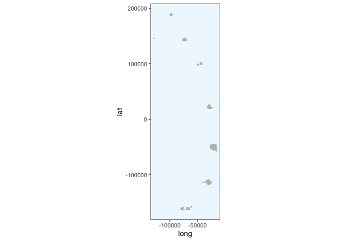
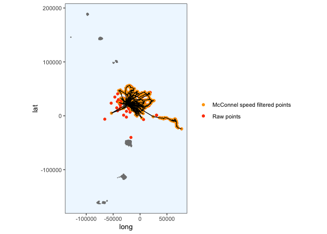
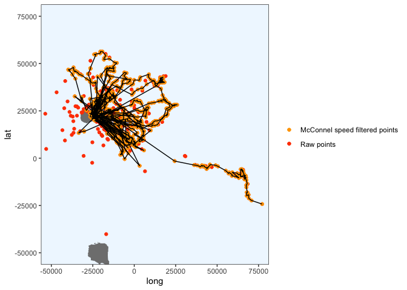

Crawl each penguin
================
Gemma Clucas
6/29/2020

``` r
knitr::opts_chunk$set(echo = TRUE)
library(tidyverse)
library(lubridate)
library(crawl)   #to fit Kalman filter models
library(trip)    #to prepare GPS data
library(maptools)
library(sp)
library(rgdal)
library(raster)
library(ggplot2)
library(knitr)
library(spdplyr)
options(scipen=999)
```

For a fully annotated version of this code, look at
`1_Initial_Processing_with_Crawl.Rmd`. I ran through this quickly for
each penguin, saving the predicted positions to excel files in the
`predicted_tracks/` folder and figures of the crawled paths in there
too.

Note that I am setting the maximum speed for the McConnell speed filter
to 12 kph. According to Culick et al (1994), the preferred swimming
speeds of chinstrap penguins are 2.4 m/s, which is 8.6 kph. Allowing for
a speed up to 12 kph therefore seems reasonable.

## Load data

This is the data that Claudia sent over on 30th June 2020.

``` r
raw <- read.csv("raw_data/satellite_tracking_data_30_06_20.csv")
```

## Prepare data for analysis

**Format times**

``` r
raw$Time <- mdy_hm(raw$Date, tz = "UTC")
raw$Time_since <- as.numeric(difftime(raw$Time, min(raw$Time), units="hours"))
raw <- raw[!duplicated(raw), ]
raw <- raw %>% 
  rename(Argos_loc_class = Loc.Class, LON = Lon1, LAT = Lat1)

clean <- raw %>% 
  dplyr::select(Ptt, Time, Time_since, LON, LAT, Argos_loc_class, Uplink)
```

## Create a map that we can plot the fixes onto later

``` r
Seamask<-readOGR("Seamask.shp")
```

    ## OGR data source with driver: ESRI Shapefile 
    ## Source: "/Users/gemmaclucas/GitHub/CHPE_Tracking_South_Sandwich_Islands/Seamask.shp", layer: "Seamask"
    ## with 1 features
    ## It has 1 fields

``` r
SSI <- crop(Seamask, c(450000, 750000, -600000, -100000))
```

    ## Warning in RGEOSUnaryPredFunc(spgeom, byid, "rgeos_isvalid"): Ring Self-
    ## intersection at or near point 77954.359424359995 26605.230663620001

    ## x[i, ] is invalid

    ## Warning in rgeos::gIntersection(x[i, ], y, byid = TRUE, drop_lower_td = TRUE):
    ## Invalid objects found; consider using set_RGEOS_CheckValidity(2L)

``` r
#Re-project to Lambert Azimuthal Equal Area
SSI_laea<-spTransform(SSI, CRS=CRS("+proj=laea +lon_0=-26 +lat_0=-58 +units=m"))

# convert to dataframe for use with ggplot2
SSI_laea@data$id = rownames(SSI_laea@data)
SSI_laea.points = fortify(SSI_laea, region="id")
SSI_laea.df = plyr::join(SSI_laea.points, SSI_laea@data, by="id")

# filter out only the polygons for the islands
SSI_laea.df <- SSI_laea.df %>% filter(hole == TRUE)


SSI_laea.df %>% 
  ggplot(aes(x = long, y = lat, group = group)) + 
  geom_polygon(fill="grey") +
  geom_path(color="grey") +
  coord_equal() +
  theme_bw() +
  theme(panel.grid.major = element_blank(), 
        panel.grid.minor = element_blank(),
        panel.background = element_rect(fill = "aliceblue"))
```

<!-- -->

## Create functions for the different steps

``` r
# define the function for selecting the data for one penguin and applying to McConnel speed filter
filter_points <-  function(penguin) {
  # select the data for the penguin
  x1 <- clean %>% dplyr::filter(Ptt == penguin)
  # order error classes
  x1$Argos_loc_class <- factor(x1$Argos_loc_class,  
                             levels=c("3","2","1","0", "A","B"))
  # adjust duplicate times
  x1$Time <- adjust.duplicateTimes(x1$Time, x1$Ptt)
  # select just the latitude, longitude, time and id columns
  x2 <- x1 %>% dplyr::select(LAT, LON, Time, Ptt)
  # make it spatial
  coordinates(x2) <- c("LON","LAT")
  # apply McConnel speed filter
  x2$Pass_speed <- x2 %>% 
    trip(., TORnames = c("Time","Ptt")) %>% 
    speedfilter(., max.speed = 12) 
  # filter the original data for the points that pass the speed filter
  x1 <- x1 %>% dplyr::filter(x2$Pass_speed == TRUE)
  # make the points spatial
  coordinates(x1) <- ~LON + LAT
  # give it a projection
  proj4string(x1) <- CRS("+proj=longlat +ellps=WGS84")
  # transform to LAEA centered around the south sandwich islands
  x1 <- spTransform(x1, CRS = CRS("+proj=laea +lon_0=-26 +lat_0=-58 +units=m"))
}


# define a function for plotting the cleaned data to check that it looks ok
plot_cleaned_points <- function(z) {
  ggplot() + 
    geom_polygon(data = SSI_laea.df, aes(x = long, y = lat, group = group), fill="grey80") +
    geom_path(data = SSI_laea.df, aes(x = long, y = lat, group = group), color="grey80") +
    coord_equal() +
    theme_bw() +
    theme(panel.grid.major = element_blank(), 
          panel.grid.minor = element_blank(),
          panel.background = element_rect(fill = "aliceblue")) +
    geom_point(data = z, aes(x = LON, y = LAT), colour = "orange")
}  

# define the prior for crawl
prior <-  function(p) { 
    dnorm(p[1], log(250), 0.2 , log = TRUE) +     # prior for 3
      dnorm(p[2], log(500), 0.2 , log = TRUE) +   # prior for 2
      dnorm(p[3], log(1500), 0.2, log = TRUE) +   # prior for 1
      dnorm(p[4], log(2500), 0.4 , log = TRUE) +  # prior for 0
      dnorm(p[5], log(2500), 0.4 , log = TRUE) +  # prior for A
      dnorm(p[6], log(2500), 0.4 , log = TRUE) +  # prior for B
      # skip p[7] as we won't provide a prior for sigma
      dnorm(p[8], -4, 2, log = TRUE)              # prior for beta
}


# function for crawling
crawl <- function(x1) {
  if(exists("fit1")){rm(fit1)}
  initial = list(a = c(coordinates(x1)[1,1], 0,
                     coordinates(x1)[1,2], 0),
               P = diag(c(10 ^ 2, 10 ^ 2, 10 ^ 2, 10 ^ 2)))
  fit1 <- crwMLE( 
    mov.model = ~1, 
    err.model=list(x=~Argos_loc_class-1), 
    drift=T, 
    data=x1, 
    Time.name="Time_since",  
    initial.state=initial, 
    prior=prior, 
    control=list(trace=1, REPORT=1)) 
}

# function for creating times where points will be predicted every 5 minutes
predict_times <- function(x) {
  seq(min(x$Time_since), max(x$Time_since), 1/12)
}

# define a function for predicting points every 5 minutes, based on the crawled data
predict_points <- function(x, y) {
  crwPredict(object.crwFit = x, predTime = y, speedEst = TRUE, flat=TRUE)
}

  
# define a function for plotting the results of the crawled tracks against the original points
plot_crawled_track <- function() {
  # get the original data
  x3 <- clean %>% dplyr::filter(Ptt == penguin)
  # project original data to LAEA
  coordinates(x3) <- ~LON + LAT 
  proj4string(x3) <- CRS("+proj=longlat +ellps=WGS84")
  x3 <- spTransform(x3, CRS = CRS("+proj=laea +lon_0=-26 +lat_0=-58 +units=m"))
  # get just the coordinates from x3 and make a dataframe for plotting
  x3 <- coordinates(x3) %>% as.data.frame()
  # define the colour scheme
  colors <- c("Raw points" = "orangered", "McConnel speed filtered points" = "orange")
  # plot
  ggplot() + 
    geom_polygon(data = SSI_laea.df, aes(x = long, y = lat, group = group), fill="grey50") +
    geom_path(data = SSI_laea.df, aes(x = long, y = lat, group = group), color="grey50") +
    coord_equal() +
    geom_point(data = x3, aes(x = LON, y = LAT, colour = "Raw points") ) +
    geom_point(data = x1.df, aes(x = LON, y = LAT, colour = "McConnel speed filtered points")) +
    geom_path(data = predObj, aes(x = mu.x, y = mu.y)) +
    scale_color_manual(values = colors) +
    theme_bw() +
    theme(panel.grid.major = element_blank(), 
          panel.grid.minor = element_blank(),
          panel.background = element_rect(fill = "aliceblue"),
          legend.title = element_blank()) 
}

# zoom in on Saunders Island only
plot_crawled_track_Saunders <- function() {
  # get the original data
  x3 <- clean %>% dplyr::filter(Ptt == penguin)
  # project original data to LAEA
  coordinates(x3) <- ~LON + LAT 
  proj4string(x3) <- CRS("+proj=longlat +ellps=WGS84")
  x3 <- spTransform(x3, CRS = CRS("+proj=laea +lon_0=-26 +lat_0=-58 +units=m"))
  # get just the coordinates from x3 and make a dataframe for plotting
  x3 <- coordinates(x3) %>% as.data.frame()
  # define the colour scheme
  colors <- c("Raw points" = "orangered", "McConnel speed filtered points" = "orange")
  # plot
  ggplot() + 
    geom_polygon(data = SSI_laea.df, aes(x = long, y = lat, group = group), fill="grey50") +
    geom_path(data = SSI_laea.df, aes(x = long, y = lat, group = group), color="grey50") +
    coord_equal() +
    geom_point(data = x3, aes(x = LON, y = LAT, colour = "Raw points") ) +
    geom_point(data = x1.df, aes(x = LON, y = LAT, colour = "McConnel speed filtered points")) +
    geom_path(data = predObj, aes(x = mu.x, y = mu.y)) +
    scale_color_manual(values = colors) +
    theme_bw() +
    theme(panel.grid.major = element_blank(), 
          panel.grid.minor = element_blank(),
          panel.background = element_rect(fill = "aliceblue"),
          legend.title = element_blank()) +
    coord_cartesian(xlim = c(-50000, 75000),
                    ylim = c(-50000, 75000))

}
```

``` r
penguin <- "196716"
x1 <- filter_points(penguin)
```

    ## Warning in assume_if_longlat(out): input looks like longitude/latitude data,
    ## assuming +proj=longlat +datum=WGS84

``` r
# convert to dataframe for plotting
x1.df <- data.frame(x1)
plot_cleaned_points(x1.df)
```

<!-- -->

Use this code in case there are any weird fixes that haven’t been
removed by speed filter (adjust the LAT or LON in the filter term for
use).

``` r
# x1.df <- x1.df %>% dplyr::filter(LAT < 100000)
# plot_cleaned_points(x1.df)
# 
# # then make x1.df spatial
# coordinates(x1.df) <- ~LON + LAT
# # tell it it's already projected in LAEA centered around the south sandwich islands
# proj4string(x1.df) <- CRS("+proj=laea +lon_0=-26 +lat_0=-58 +units=m")
# # transform to LAEA centered around the south sandwich islands
# x1.df <- spTransform(x1.df, CRS = CRS("+proj=laea +lon_0=-26 +lat_0=-58 +units=m"))
# 
# # rename back to x1 so that I can continue with the code below
# x1 <- x1.df
# 
# # then recreate x1.df as a normal data frame
# x1.df <- data.frame(x1)
```

Crawl (ran many times).

``` r
if(exists("fit1")){rm(fit1)} 
fit1 <- crawl(x1)
```

    ## Beginning SANN initialization ...

    ## Beginning likelihood optimization ...

    ##   Nelder-Mead direct search function minimizer
    ## function value for initial parameters = 115389.474673
    ##   Scaled convergence tolerance is 0.00171944
    ## Stepsize computed as 4.611388
    ## BUILD             11 124559.864639 112352.075363
    ## EXTENSION         13 124229.647291 99699.454945
    ## LO-REDUCTION      15 119831.577699 99699.454945
    ## LO-REDUCTION      17 118028.523664 99699.454945
    ## LO-REDUCTION      19 115510.338153 99699.454945
    ## LO-REDUCTION      21 115389.474673 99699.454945
    ## LO-REDUCTION      23 115389.474673 99699.454945
    ## EXTENSION         25 115389.457841 95270.571734
    ## LO-REDUCTION      27 114950.939617 95270.571734
    ## LO-REDUCTION      29 114617.463286 95270.571734
    ## REFLECTION        31 112352.075363 91682.140515
    ## EXTENSION         33 103612.568647 85480.104139
    ## LO-REDUCTION      35 102807.322664 85480.104139
    ## LO-REDUCTION      37 102367.283850 85480.104139
    ## EXTENSION         39 101041.812329 78704.534723
    ## LO-REDUCTION      41 100682.300381 78704.534723
    ## LO-REDUCTION      43 99699.454945 78704.534723
    ## EXTENSION         45 96881.817478 72648.320067
    ## LO-REDUCTION      47 95356.772711 72648.320067
    ## LO-REDUCTION      49 95270.571734 72648.320067
    ## EXTENSION         51 91682.140515 71561.262939
    ## LO-REDUCTION      53 90335.890006 71561.262939
    ## LO-REDUCTION      55 89229.580494 71561.262939
    ## LO-REDUCTION      57 85480.104139 71561.262939
    ## REFLECTION        59 83785.388219 71155.265851
    ## REFLECTION        61 81999.288660 65631.783873
    ## LO-REDUCTION      63 78961.357826 65631.783873
    ## EXTENSION         65 78704.534723 58023.851673
    ## LO-REDUCTION      67 75665.424406 58023.851673
    ## LO-REDUCTION      69 75191.631265 58023.851673
    ## LO-REDUCTION      71 74156.142470 58023.851673
    ## LO-REDUCTION      73 73575.202942 58023.851673
    ## LO-REDUCTION      75 72648.320067 58023.851673
    ## LO-REDUCTION      77 71611.865012 58023.851673
    ## LO-REDUCTION      79 71561.262939 58023.851673
    ## LO-REDUCTION      81 71155.265851 58023.851673
    ## LO-REDUCTION      83 68016.027651 58023.851673
    ## EXTENSION         85 66692.419571 51841.829370
    ## LO-REDUCTION      87 66104.343269 51841.829370
    ## LO-REDUCTION      89 65631.783873 51841.829370
    ## EXTENSION         91 65231.966046 49467.472872
    ## REFLECTION        93 62904.415167 49015.082541
    ## EXTENSION         95 61714.412211 41665.178236
    ## LO-REDUCTION      97 59796.319303 41665.178236
    ## LO-REDUCTION      99 58698.466554 41665.178236
    ## LO-REDUCTION     101 58611.760334 41665.178236
    ## LO-REDUCTION     103 58023.851673 41665.178236
    ## LO-REDUCTION     105 55962.727162 41665.178236
    ## LO-REDUCTION     107 52382.116561 41665.178236
    ## HI-REDUCTION     109 51841.829370 41665.178236
    ## LO-REDUCTION     111 49467.472872 41665.178236
    ## LO-REDUCTION     113 49015.082541 41665.178236
    ## HI-REDUCTION     115 48071.465450 41665.178236
    ## EXTENSION        117 47619.165711 39530.904558
    ## HI-REDUCTION     119 44835.547492 39530.904558
    ## HI-REDUCTION     121 44424.730703 39530.904558
    ## HI-REDUCTION     123 43723.820578 39530.904558
    ## LO-REDUCTION     125 42917.330290 39530.904558
    ## HI-REDUCTION     127 42867.070912 39530.904558
    ## LO-REDUCTION     129 42769.672804 39530.904558
    ## EXTENSION        131 42600.854001 37313.336079
    ## LO-REDUCTION     133 42479.892560 37313.336079
    ## HI-REDUCTION     135 42111.470606 37313.336079
    ## LO-REDUCTION     137 41952.482676 37313.336079
    ## LO-REDUCTION     139 41847.452786 37313.336079
    ## LO-REDUCTION     141 41665.178236 37313.336079
    ## LO-REDUCTION     143 41289.052552 37313.336079
    ## LO-REDUCTION     145 41132.520233 37313.336079
    ## LO-REDUCTION     147 40722.047151 37313.336079
    ## LO-REDUCTION     149 40711.538156 37313.336079
    ## LO-REDUCTION     151 39945.081933 37313.336079
    ## LO-REDUCTION     153 39572.615249 37313.336079
    ## HI-REDUCTION     155 39530.904558 37313.336079
    ## REFLECTION       157 39432.130410 37126.183206
    ## EXTENSION        159 38717.807815 35904.351550
    ## LO-REDUCTION     161 38600.736347 35904.351550
    ## LO-REDUCTION     163 38246.874980 35904.351550
    ## LO-REDUCTION     165 38163.277883 35904.351550
    ## LO-REDUCTION     167 38007.494325 35904.351550
    ## LO-REDUCTION     169 37816.237405 35904.351550
    ## HI-REDUCTION     171 37612.557050 35904.351550
    ## LO-REDUCTION     173 37533.302003 35904.351550
    ## LO-REDUCTION     175 37335.948667 35904.351550
    ## LO-REDUCTION     177 37313.336079 35904.351550
    ## LO-REDUCTION     179 37126.183206 35902.923951
    ## LO-REDUCTION     181 37006.885722 35902.923951
    ## EXTENSION        183 37002.974733 34988.312543
    ## LO-REDUCTION     185 36532.005782 34988.312543
    ## LO-REDUCTION     187 36343.155818 34988.312543
    ## LO-REDUCTION     189 36234.873532 34988.312543
    ## LO-REDUCTION     191 36194.241227 34988.312543
    ## LO-REDUCTION     193 36191.125482 34988.312543
    ## EXTENSION        195 36101.837735 34961.233855
    ## EXTENSION        197 36027.571266 34576.291607
    ## LO-REDUCTION     199 35904.351550 34576.291607
    ## REFLECTION       201 35902.923951 34458.572782
    ## LO-REDUCTION     203 35674.657791 34458.572782
    ## EXTENSION        205 35506.923235 33637.384642
    ## LO-REDUCTION     207 35502.128700 33637.384642
    ## LO-REDUCTION     209 35196.295742 33637.384642
    ## LO-REDUCTION     211 35182.700306 33637.384642
    ## LO-REDUCTION     213 34988.312543 33637.384642
    ## LO-REDUCTION     215 34961.233855 33637.384642
    ## REFLECTION       217 34885.582819 33573.412774
    ## EXTENSION        219 34630.848517 33215.451019
    ## LO-REDUCTION     221 34576.291607 33215.451019
    ## LO-REDUCTION     223 34458.572782 33215.451019
    ## LO-REDUCTION     225 34127.332091 33215.451019
    ## EXTENSION        227 34094.881213 33156.654588
    ## EXTENSION        229 34011.443930 32423.973628
    ## LO-REDUCTION     231 33818.815650 32423.973628
    ## LO-REDUCTION     233 33744.837859 32423.973628
    ## LO-REDUCTION     235 33637.384642 32423.973628
    ## LO-REDUCTION     237 33573.412774 32423.973628
    ## LO-REDUCTION     239 33512.524549 32423.973628
    ## LO-REDUCTION     241 33489.719495 32423.973628
    ## LO-REDUCTION     243 33449.013372 32423.973628
    ## LO-REDUCTION     245 33215.451019 32423.973628
    ## LO-REDUCTION     247 33156.654588 32423.973628
    ## LO-REDUCTION     249 33049.155149 32423.973628
    ## LO-REDUCTION     251 32996.110407 32423.973628
    ## LO-REDUCTION     253 32799.868397 32423.973628
    ## LO-REDUCTION     255 32782.084081 32423.973628
    ## LO-REDUCTION     257 32772.888842 32423.973628
    ## LO-REDUCTION     259 32751.985780 32423.973628
    ## EXTENSION        261 32717.497681 32367.537326
    ## REFLECTION       263 32660.250641 32356.771819
    ## EXTENSION        265 32606.147113 32323.746018
    ## LO-REDUCTION     267 32601.470596 32323.746018
    ## LO-REDUCTION     269 32556.800717 32323.746018
    ## LO-REDUCTION     271 32523.206532 32323.746018
    ## REFLECTION       273 32520.393744 32296.742458
    ## LO-REDUCTION     275 32518.298326 32292.400095
    ## REFLECTION       277 32481.658810 32235.197660
    ## LO-REDUCTION     279 32423.973628 32235.197660
    ## LO-REDUCTION     281 32367.977530 32235.197660
    ## LO-REDUCTION     283 32367.537326 32235.197660
    ## LO-REDUCTION     285 32356.771819 32235.197660
    ## LO-REDUCTION     287 32355.834175 32235.197660
    ## LO-REDUCTION     289 32325.156267 32235.197660
    ## LO-REDUCTION     291 32323.746018 32235.197660
    ## REFLECTION       293 32314.198980 32225.037872
    ## EXTENSION        295 32303.904403 32197.664631
    ## LO-REDUCTION     297 32301.960356 32197.664631
    ## LO-REDUCTION     299 32296.742458 32197.664631
    ## LO-REDUCTION     301 32292.400095 32197.664631
    ## LO-REDUCTION     303 32283.830388 32197.664631
    ## LO-REDUCTION     305 32262.545925 32197.664631
    ## LO-REDUCTION     307 32240.541248 32197.664631
    ## LO-REDUCTION     309 32237.242360 32197.664631
    ## LO-REDUCTION     311 32235.197660 32197.664631
    ## LO-REDUCTION     313 32230.010712 32197.664631
    ## EXTENSION        315 32229.897775 32183.969002
    ## LO-REDUCTION     317 32225.037872 32183.969002
    ## LO-REDUCTION     319 32221.411393 32183.969002
    ## LO-REDUCTION     321 32218.222211 32183.969002
    ## LO-REDUCTION     323 32209.251190 32183.969002
    ## LO-REDUCTION     325 32206.198791 32183.969002
    ## LO-REDUCTION     327 32202.578283 32183.969002
    ## LO-REDUCTION     329 32202.492421 32183.969002
    ## REFLECTION       331 32201.904093 32181.779604
    ## LO-REDUCTION     333 32200.357820 32181.779604
    ## LO-REDUCTION     335 32199.981691 32181.779604
    ## LO-REDUCTION     337 32197.664631 32181.779604
    ## LO-REDUCTION     339 32190.989279 32181.779604
    ## LO-REDUCTION     341 32190.892896 32181.779604
    ## LO-REDUCTION     343 32190.105761 32181.779604
    ## REFLECTION       345 32189.861884 32181.184675
    ## REFLECTION       347 32188.538520 32178.396199
    ## LO-REDUCTION     349 32185.126098 32178.396199
    ## LO-REDUCTION     351 32183.969002 32178.396199
    ## HI-REDUCTION     353 32183.469090 32178.396199
    ## EXTENSION        355 32183.426162 32175.765289
    ## LO-REDUCTION     357 32183.090049 32175.765289
    ## LO-REDUCTION     359 32182.878593 32175.765289
    ## EXTENSION        361 32181.813438 32174.676028
    ## LO-REDUCTION     363 32181.779604 32174.676028
    ## HI-REDUCTION     365 32181.240153 32174.676028
    ## EXTENSION        367 32181.184675 32172.821804
    ## LO-REDUCTION     369 32181.024800 32172.821804
    ## EXTENSION        371 32180.274493 32166.973635
    ## LO-REDUCTION     373 32178.530340 32166.973635
    ## EXTENSION        375 32178.396199 32161.500069
    ## LO-REDUCTION     377 32178.202589 32161.500069
    ## LO-REDUCTION     379 32176.937516 32161.500069
    ## EXTENSION        381 32175.765289 32154.587951
    ## LO-REDUCTION     383 32174.905936 32154.587951
    ## LO-REDUCTION     385 32174.676028 32154.587951
    ## LO-REDUCTION     387 32173.376908 32154.587951
    ## LO-REDUCTION     389 32172.821804 32154.587951
    ## EXTENSION        391 32168.326942 32143.624316
    ## LO-REDUCTION     393 32167.924028 32143.624316
    ## LO-REDUCTION     395 32166.973635 32143.624316
    ## LO-REDUCTION     397 32162.577039 32143.624316
    ## EXTENSION        399 32161.639172 32136.244767
    ## LO-REDUCTION     401 32161.500069 32136.244767
    ## EXTENSION        403 32160.592063 32123.176494
    ## LO-REDUCTION     405 32156.241921 32123.176494
    ## LO-REDUCTION     407 32155.639429 32123.176494
    ## LO-REDUCTION     409 32154.587951 32123.176494
    ## LO-REDUCTION     411 32149.234069 32123.176494
    ## EXTENSION        413 32146.897281 32103.857625
    ## LO-REDUCTION     415 32143.993394 32103.857625
    ## LO-REDUCTION     417 32143.624316 32103.857625
    ## LO-REDUCTION     419 32140.762316 32103.857625
    ## LO-REDUCTION     421 32136.244767 32103.857625
    ## LO-REDUCTION     423 32130.149102 32103.857625
    ## EXTENSION        425 32128.806141 32100.714588
    ## EXTENSION        427 32125.532988 32090.732145
    ## LO-REDUCTION     429 32124.506124 32090.732145
    ## LO-REDUCTION     431 32123.176494 32090.732145
    ## REFLECTION       433 32117.695386 32089.895676
    ## EXTENSION        435 32115.050646 32074.734380
    ## LO-REDUCTION     437 32107.331314 32074.734380
    ## LO-REDUCTION     439 32105.452081 32074.734380
    ## LO-REDUCTION     441 32104.541955 32074.734380
    ## LO-REDUCTION     443 32103.857625 32074.734380
    ## LO-REDUCTION     445 32100.714588 32074.734380
    ## LO-REDUCTION     447 32094.595935 32074.734380
    ## REFLECTION       449 32091.370345 32073.568369
    ## LO-REDUCTION     451 32090.732145 32073.568369
    ## REFLECTION       453 32089.895676 32072.627555
    ## LO-REDUCTION     455 32085.093135 32072.627555
    ## REFLECTION       457 32082.743101 32071.100850
    ## LO-REDUCTION     459 32082.248185 32071.100850
    ## LO-REDUCTION     461 32082.120719 32071.100850
    ## REFLECTION       463 32079.731076 32070.248306
    ## EXTENSION        465 32077.474290 32064.810963
    ## LO-REDUCTION     467 32077.072814 32064.810963
    ## LO-REDUCTION     469 32074.734380 32064.810963
    ## LO-REDUCTION     471 32074.603395 32064.810963
    ## LO-REDUCTION     473 32074.040900 32064.810963
    ## LO-REDUCTION     475 32073.568369 32064.810963
    ## LO-REDUCTION     477 32072.627555 32064.810963
    ## EXTENSION        479 32072.026268 32063.952507
    ## LO-REDUCTION     481 32071.100850 32063.952507
    ## LO-REDUCTION     483 32070.248306 32063.952507
    ## LO-REDUCTION     485 32069.699626 32063.952507
    ## LO-REDUCTION     487 32069.127519 32063.952507
    ## REFLECTION       489 32069.087207 32063.108806
    ## EXTENSION        491 32068.310832 32060.221963
    ## LO-REDUCTION     493 32066.758881 32060.221963
    ## LO-REDUCTION     495 32065.471252 32060.221963
    ## LO-REDUCTION     497 32065.250065 32060.221963
    ## LO-REDUCTION     499 32065.241011 32060.221963
    ## Exiting from Nelder Mead minimizer
    ##     501 function evaluations used
    ## 
    ## Cannot calculate covariance matrix

``` r
print(fit1)
```

    ## 
    ## 
    ## Continuous-Time Correlated Random Walk fit
    ## 
    ## Models:
    ## --------
    ## Movement   ~ 1
    ## Error   ~Argos_loc_class - 1
    ## with Random Drift
    ## 
    ##                         Parameter Est. St. Err. 95% Lower 95% Upper
    ## ln tau Argos_loc_class3          5.389       NA        NA        NA
    ## ln tau Argos_loc_class2          5.521       NA        NA        NA
    ## ln tau Argos_loc_class1          6.345       NA        NA        NA
    ## ln tau Argos_loc_class0          6.608       NA        NA        NA
    ## ln tau Argos_loc_classA          5.745       NA        NA        NA
    ## ln tau Argos_loc_classB          5.055       NA        NA        NA
    ## ln sigma (Intercept)             5.841       NA        NA        NA
    ## ln beta (Intercept)             55.685       NA        NA        NA
    ## ln sigma.drift/sigma             2.188       NA        NA        NA
    ## ln psi-1                        -2.204       NA        NA        NA
    ## 
    ## 
    ## Log Likelihood = -16030.111 
    ## AIC = 32080.222

There might be NAs in here because it reruns crawl everytime I knit the
doc. I ran it multiple times until I didn’t have NAs in real life.

``` r
predTime <- predict_times(x1)
predObj <- predict_points(fit1, predTime)
# add absolute times back to the dataframe
predObj$Time_absolute <- as.POSIXct(3600 * (predObj$Time_since ), origin = min(raw$Time), tz="UTC") 


plot_crawled_track()
```

<!-- -->

``` r
plot_crawled_track_Saunders()
```

    ## Coordinate system already present. Adding new coordinate system, which will replace the existing one.

<!-- -->

Write to
CSV:

``` r
write.csv(predObj, paste0("predicted_tracks/", penguin, "_track.csv", sep = ""), row.names = FALSE)
```

Save plot:

``` r
ggsave(
  paste0("predicted_tracks/", penguin, "_crawled_track.pdf", sep = ""),
  plot = plot_crawled_track(),
  dpi = 320,
  device = "pdf"
)
```

    ## Saving 7 x 5 in image

``` r
ggsave(
  paste0("predicted_tracks/", penguin, "_crawled_track_Saunders.pdf", sep = ""),
  plot = plot_crawled_track_Saunders(),
  dpi = 320,
  device = "pdf",
  width = 7,
  height = 4
)
```

    ## Coordinate system already present. Adding new coordinate system, which will replace the existing one.
