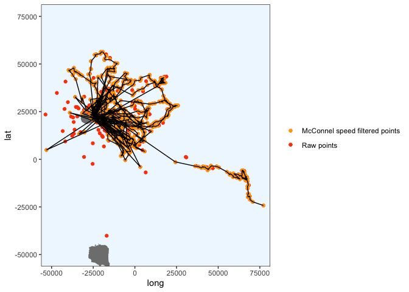

Crawl each penguin
================
Gemma Clucas
6/29/2020

``` r
knitr::opts_chunk$set(echo = TRUE)
library(tidyverse)
library(lubridate)
library(crawl)   #to fit Kalman filter models
library(trip)    #to prepare GPS data
library(maptools)
library(sp)
library(rgdal)
library(raster)
library(ggplot2)
library(knitr)
library(spdplyr)
options(scipen=999)
```

For a fully annotated version of this code, look at
`1_Initial_Processing_with_Crawl.Rmd`. I ran through this quickly for
each penguin, saving the predicted positions to excel files in the
`predicted_tracks/` folder and figures of the crawled paths in there
too.

## Load data

This is the data that Claudia sent over on 30th June 2020.

``` r
raw <- read.csv("raw_data/satellite_tracking_data_30_06_20.csv")
```

## Prepare data for analysis

**Format times**

``` r
raw$Time <- mdy_hm(raw$Date, tz = "UTC")
raw$Time_since <- as.numeric(difftime(raw$Time, min(raw$Time), units="hours"))
raw <- raw[!duplicated(raw), ]
raw <- raw %>% 
  rename(Argos_loc_class = Loc.Class, LON = Lon1, LAT = Lat1)

clean <- raw %>% 
  dplyr::select(Ptt, Time, Time_since, LON, LAT, Argos_loc_class, Uplink)
```

## Create a map that we can plot the fixes onto later

``` r
Seamask<-readOGR("Seamask.shp")
```

    ## OGR data source with driver: ESRI Shapefile 
    ## Source: "/Users/gemmaclucas/GitHub/CHPE_Tracking_South_Sandwich_Islands/Seamask.shp", layer: "Seamask"
    ## with 1 features
    ## It has 1 fields

``` r
SSI <- crop(Seamask, c(450000, 750000, -600000, -100000))
```

    ## Warning in RGEOSUnaryPredFunc(spgeom, byid, "rgeos_isvalid"): Ring Self-
    ## intersection at or near point 77954.359424359995 26605.230663620001

    ## x[i, ] is invalid

    ## Warning in rgeos::gIntersection(x[i, ], y, byid = TRUE, drop_lower_td = TRUE):
    ## Invalid objects found; consider using set_RGEOS_CheckValidity(2L)

``` r
#Re-project to Lambert Azimuthal Equal Area
SSI_laea<-spTransform(SSI, CRS=CRS("+proj=laea +lon_0=-26 +lat_0=-58 +units=m"))

# convert to dataframe for use with ggplot2
SSI_laea@data$id = rownames(SSI_laea@data)
SSI_laea.points = fortify(SSI_laea, region="id")
SSI_laea.df = plyr::join(SSI_laea.points, SSI_laea@data, by="id")

# filter out only the polygons for the islands
SSI_laea.df <- SSI_laea.df %>% filter(hole == TRUE)


SSI_laea.df %>% 
  ggplot(aes(x = long, y = lat, group = group)) + 
  geom_polygon(fill="grey") +
  geom_path(color="grey") +
  coord_equal() +
  theme_bw() +
  theme(panel.grid.major = element_blank(), 
        panel.grid.minor = element_blank(),
        panel.background = element_rect(fill = "aliceblue"))
```

<!-- -->

## Create functions for the different steps

``` r
# define the function for selecting the data for one penguin and applying to McConnel speed filter
filter_points <-  function(penguin) {
  # select the data for the penguin
  x1 <- clean %>% dplyr::filter(Ptt == penguin)
  # order error classes
  x1$Argos_loc_class <- factor(x1$Argos_loc_class,  
                             levels=c("3","2","1","0", "A","B"))
  # adjust duplicate times
  x1$Time <- adjust.duplicateTimes(x1$Time, x1$Ptt)
  # select just the latitude, longitude, time and id columns
  x2 <- x1 %>% dplyr::select(LAT, LON, Time, Ptt)
  # make it spatial
  coordinates(x2) <- c("LON","LAT")
  # apply McConnel speed filter
  x2$Pass_speed <- x2 %>% 
    trip(., TORnames = c("Time","Ptt")) %>% 
    speedfilter(., max.speed = 8) 
  # filter the original data for the points that pass the speed filter
  x1 <- x1 %>% dplyr::filter(x2$Pass_speed == TRUE)
  # make the points spatial
  coordinates(x1) <- ~LON + LAT
  # give it a projection
  proj4string(x1) <- CRS("+proj=longlat +ellps=WGS84")
  # transform to LAEA centered around the south sandwich islands
  x1 <- spTransform(x1, CRS = CRS("+proj=laea +lon_0=-26 +lat_0=-58 +units=m"))
}


# define a function for plotting the cleaned data to check that it looks ok
plot_cleaned_points <- function(x) {
  ggplot() + 
    geom_polygon(data = SSI_laea.df, aes(x = long, y = lat, group = group), fill="grey80") +
    geom_path(data = SSI_laea.df, aes(x = long, y = lat, group = group), color="grey80") +
    coord_equal() +
    theme_bw() +
    theme(panel.grid.major = element_blank(), 
          panel.grid.minor = element_blank(),
          panel.background = element_rect(fill = "aliceblue")) +
    geom_point(data = x, aes(x = LON, y = LAT), colour = "orange")
}  

# define the prior for crawl
prior <-  function(p) { 
    dnorm(p[1], log(250), 0.2 , log = TRUE) +     # prior for 3
      dnorm(p[2], log(500), 0.2 , log = TRUE) +   # prior for 2
      dnorm(p[3], log(1500), 0.2, log = TRUE) +   # prior for 1
      dnorm(p[4], log(2500), 0.4 , log = TRUE) +  # prior for 0
      dnorm(p[5], log(2500), 0.4 , log = TRUE) +  # prior for A
      dnorm(p[6], log(2500), 0.4 , log = TRUE) +  # prior for B
      # skip p[7] as we won't provide a prior for sigma
      dnorm(p[8], -4, 2, log = TRUE)              # prior for beta
}


# function for crawling
crawl <- function(x1) {
  if(exists("fit1")){rm(fit1)}
  initial = list(a = c(coordinates(x1)[1,1], 0,
                     coordinates(x1)[1,2], 0),
               P = diag(c(10 ^ 2, 10 ^ 2, 10 ^ 2, 10 ^ 2)))
  fit1 <- crwMLE( 
    mov.model = ~1, 
    err.model=list(x=~Argos_loc_class-1), 
    drift=T, 
    data=x1, 
    Time.name="Time_since",  
    initial.state=initial, 
    prior=prior, 
    control=list(trace=1, REPORT=1)) 
}

# function for creating times where points will be predicted
predict_times <- function(x) {
  seq(min(x$Time_since), max(x$Time_since), 1/12)
}

# define a function for predicting points every 5 minutes, based on the crawled data
predict_points <- function(x, y) {
  crwPredict(object.crwFit = x, predTime = y, speedEst = TRUE, flat=TRUE)
}
  

# define a function for plotting the results of the crawled tracks against the original points
plot_crawled_track <- function() {
  # get the original data
  x3 <- clean %>% dplyr::filter(Ptt == penguin)
  # project original data to LAEA
  coordinates(x3) <- ~LON + LAT 
  proj4string(x3) <- CRS("+proj=longlat +ellps=WGS84")
  x3 <- spTransform(x3, CRS = CRS("+proj=laea +lon_0=-26 +lat_0=-58 +units=m"))
  # get just the coordinates from x3 and make a dataframe for plotting
  x3 <- coordinates(x3) %>% as.data.frame()
  # define the colour scheme
  colors <- c("Raw points" = "orangered", "McConnel speed filtered points" = "orange")
  # plot
  ggplot() + 
    geom_polygon(data = SSI_laea.df, aes(x = long, y = lat, group = group), fill="grey50") +
    geom_path(data = SSI_laea.df, aes(x = long, y = lat, group = group), color="grey50") +
    coord_equal() +
    geom_point(data = x3, aes(x = LON, y = LAT, colour = "Raw points") ) +
    geom_point(data = x1.df, aes(x = LON, y = LAT, colour = "McConnel speed filtered points")) +
    geom_path(data = predObj, aes(x = mu.x, y = mu.y)) +
    scale_color_manual(values = colors) +
    theme_bw() +
    theme(panel.grid.major = element_blank(), 
          panel.grid.minor = element_blank(),
          panel.background = element_rect(fill = "aliceblue"),
          legend.title = element_blank()) 
}

# zoom in on Saunders Island only
plot_crawled_track_Saunders <- function() {
  # get the original data
  x3 <- clean %>% dplyr::filter(Ptt == penguin)
  # project original data to LAEA
  coordinates(x3) <- ~LON + LAT 
  proj4string(x3) <- CRS("+proj=longlat +ellps=WGS84")
  x3 <- spTransform(x3, CRS = CRS("+proj=laea +lon_0=-26 +lat_0=-58 +units=m"))
  # get just the coordinates from x3 and make a dataframe for plotting
  x3 <- coordinates(x3) %>% as.data.frame()
  # define the colour scheme
  colors <- c("Raw points" = "orangered", "McConnel speed filtered points" = "orange")
  # plot
  ggplot() + 
    geom_polygon(data = SSI_laea.df, aes(x = long, y = lat, group = group), fill="grey50") +
    geom_path(data = SSI_laea.df, aes(x = long, y = lat, group = group), color="grey50") +
    coord_equal() +
    geom_point(data = x3, aes(x = LON, y = LAT, colour = "Raw points") ) +
    geom_point(data = x1.df, aes(x = LON, y = LAT, colour = "McConnel speed filtered points")) +
    geom_path(data = predObj, aes(x = mu.x, y = mu.y)) +
    scale_color_manual(values = colors) +
    theme_bw() +
    theme(panel.grid.major = element_blank(), 
          panel.grid.minor = element_blank(),
          panel.background = element_rect(fill = "aliceblue"),
          legend.title = element_blank()) +
    coord_cartesian(xlim = c(-50000, 75000),
                    ylim = c(-50000, 75000))

}
```

``` r
penguin <- "196716"
x1 <- filter_points(penguin)
```

    ## Warning in assume_if_longlat(out): input looks like longitude/latitude data,
    ## assuming +proj=longlat +datum=WGS84

``` r
# convert to dataframe for plotting
x1.df <- data.frame(x1)
plot_cleaned_points(x1.df)
```

<!-- -->

Use this code in case there are any weird fixes that haven’t been
removed by speed filter (adjust the LAT or LON in the filter term for
use).

``` r
x1.df <- x1.df %>% dplyr::filter(LAT < 100000)
plot_cleaned_points(x1.df)
```

<!-- -->

``` r
# then make x1.df spatial 
coordinates(x1.df) <- ~LON + LAT
# tell it it's already projected in LAEA centered around the south sandwich islands
proj4string(x1.df) <- CRS("+proj=laea +lon_0=-26 +lat_0=-58 +units=m")
# transform to LAEA centered around the south sandwich islands
x1.df <- spTransform(x1.df, CRS = CRS("+proj=laea +lon_0=-26 +lat_0=-58 +units=m"))

# rename back to x1 so that I can continue with the code below
x1 <- x1.df

# then recreate x1.df as a normal data frame
x1.df <- data.frame(x1)
```

Crawl (ran many times).

``` r
if(exists("fit1")){rm(fit1)} 
fit1 <- crawl(x1)
```

    ## Beginning SANN initialization ...

    ## Beginning likelihood optimization ...

    ##   Nelder-Mead direct search function minimizer
    ## function value for initial parameters = 8918654916.855888
    ##   Scaled convergence tolerance is 132.898
    ## Stepsize computed as 0.487221
    ## BUILD             11 8933449260.938097 4640230100.515186
    ## LO-REDUCTION      13 8918654916.855888 4640230100.515186
    ## LO-REDUCTION      15 8892006129.888407 4640230100.515186
    ## LO-REDUCTION      17 8878170100.564779 4640230100.515186
    ## LO-REDUCTION      19 8800263009.235069 4640230100.515186
    ## LO-REDUCTION      21 8734204278.875593 4640230100.515186
    ## LO-REDUCTION      23 8617250130.918879 4640230100.515186
    ## LO-REDUCTION      25 8547243823.946499 4640230100.515186
    ## EXTENSION         27 8261112484.440299 3365744082.742953
    ## LO-REDUCTION      29 7331152439.893013 3365744082.742953
    ## LO-REDUCTION      31 7172091585.906417 3365744082.742953
    ## LO-REDUCTION      33 6896368081.671835 3365744082.742953
    ## EXTENSION         35 6579352540.739305 2209292267.733595
    ## LO-REDUCTION      37 6199593973.064496 2209292267.733595
    ## LO-REDUCTION      39 5866146360.585437 2209292267.733595
    ## EXTENSION         41 5494031776.907423 1347572536.330704
    ## LO-REDUCTION      43 5033920633.017609 1347572536.330704
    ## LO-REDUCTION      45 4640230100.515186 1347572536.330704
    ## LO-REDUCTION      47 4042103360.002872 1347572536.330704
    ## EXTENSION         49 3856145548.409847 610740218.298272
    ## LO-REDUCTION      51 3548801651.236381 610740218.298272
    ## LO-REDUCTION      53 3365744082.742953 610740218.298272
    ## LO-REDUCTION      55 2717108331.443327 610740218.298272
    ## EXTENSION         57 2445155009.640340 220009273.096713
    ## LO-REDUCTION      59 2209292267.733595 220009273.096713
    ## LO-REDUCTION      61 1756421177.996339 220009273.096713
    ## LO-REDUCTION      63 1575455879.428488 220009273.096713
    ## EXTENSION         65 1376288045.731864 51449617.771867
    ## LO-REDUCTION      67 1347572536.330704 51449617.771867
    ## LO-REDUCTION      69 946908748.655389 51449617.771867
    ## EXTENSION         71 758472705.079976 7311177.670500
    ## LO-REDUCTION      73 618645297.902264 7311177.670500
    ## LO-REDUCTION      75 610740218.298272 7311177.670500
    ## LO-REDUCTION      77 367044493.480063 7311177.670500
    ## EXTENSION         79 276609746.570660 605857.096493
    ## LO-REDUCTION      81 236790456.185523 605857.096493
    ## LO-REDUCTION      83 220009273.096713 605857.096493
    ## EXTENSION         85 99247845.632418 54907.203385
    ## LO-REDUCTION      87 59205594.033131 54907.203385
    ## LO-REDUCTION      89 51449617.771867 54907.203385
    ## LO-REDUCTION      91 24441390.310304 54907.203385
    ## EXTENSION         93 16098495.504404 34851.674264
    ## LO-REDUCTION      95 8228580.500011 34851.674264
    ## REFLECTION        97 7311177.670500 34808.761626
    ## LO-REDUCTION      99 2572805.003104 34808.761626
    ## LO-REDUCTION     101 1116918.633023 34556.915381
    ## LO-REDUCTION     103 605857.096493 34539.512028
    ## LO-REDUCTION     105 259102.749798 34539.512028
    ## LO-REDUCTION     107 137133.466558 34539.512028
    ## LO-REDUCTION     109 61322.305508 34539.512028
    ## LO-REDUCTION     111 54907.203385 34539.512028
    ## LO-REDUCTION     113 36992.972352 34539.512028
    ## LO-REDUCTION     115 36212.768640 34539.512028
    ## LO-REDUCTION     117 35922.327747 34520.663749
    ## HI-REDUCTION     119 35636.560645 34520.663749
    ## LO-REDUCTION     121 35432.326796 34520.663749
    ## HI-REDUCTION     123 35417.359911 34520.663749
    ## LO-REDUCTION     125 35036.391717 34520.663749
    ## LO-REDUCTION     127 34873.058663 34520.663749
    ## HI-REDUCTION     129 34851.674264 34520.663749
    ## HI-REDUCTION     131 34822.910591 34520.663749
    ## HI-REDUCTION     133 34808.761626 34520.663749
    ## LO-REDUCTION     135 34772.046679 34462.072761
    ## HI-REDUCTION     137 34615.522056 34462.072761
    ## Exiting from Nelder Mead minimizer
    ##     139 function evaluations used

    ## Warning in sqrt(diag(Cmat)): NaNs produced

``` r
print(fit1)
```

    ## 
    ## 
    ## Continuous-Time Correlated Random Walk fit
    ## 
    ## Models:
    ## --------
    ## Movement   ~ 1
    ## Error   ~Argos_loc_class - 1
    ## with Random Drift
    ## 
    ##                         Parameter Est. St. Err. 95% Lower 95% Upper
    ## ln tau Argos_loc_class3          1.777    0.200     1.385     2.169
    ## ln tau Argos_loc_class2         -1.378    0.200    -1.770    -0.986
    ## ln tau Argos_loc_class1         -2.030    0.200    -2.422    -1.638
    ## ln tau Argos_loc_class0         -4.362    0.400    -5.146    -3.578
    ## ln tau Argos_loc_classA         -4.380    0.400    -5.164    -3.596
    ## ln tau Argos_loc_classB          1.754    0.399     0.972     2.537
    ## ln sigma (Intercept)             7.937    0.024     7.890     7.983
    ## ln beta (Intercept)              5.246      NaN       NaN       NaN
    ## ln sigma.drift/sigma            -1.157    0.175    -1.501    -0.813
    ## ln psi-1                         1.383      NaN       NaN       NaN
    ## 
    ## 
    ## Log Likelihood = -17229.184 
    ## AIC = 34478.367

There might be NAs in here because it reruns crawl everytime I knit the
doc. I ran it multiple times until I didn’t have NAs in real life.

``` r
predTime <- predict_times(x1)
predObj <- predict_points(fit1, predTime)

plot_crawled_track()
```

<!-- -->

``` r
plot_crawled_track_Saunders()
```

    ## Coordinate system already present. Adding new coordinate system, which will replace the existing one.

<!-- -->

Write to
CSV:

``` r
write.csv(predObj, paste0("predicted_tracks/", penguin, "_track.csv", sep = ""), row.names = FALSE)
```

Save plot:

``` r
ggsave(
  paste0("predicted_tracks/", penguin, "_crawled_track.pdf", sep = ""),
  plot = plot_crawled_track(),
  dpi = 320,
  device = "pdf"
)
```

    ## Saving 7 x 5 in image

``` r
ggsave(
  paste0("predicted_tracks/", penguin, "_crawled_track_Saunders.pdf", sep = ""),
  plot = plot_crawled_track_Saunders(),
  dpi = 320,
  device = "pdf",
  width = 7,
  height = 4
)
```

    ## Coordinate system already present. Adding new coordinate system, which will replace the existing one.
