Split into trips
================
Gemma Clucas
8/26/2020

``` r
library(maptools)
library(sf)
library(patchwork)
library(ggspatial)
library(purrr)
library(rgdal)
library(raster)
library(plyr)
library(tidyverse)
library(sp)
library(ggplot2)
library(knitr)
library(spdplyr)
options(scipen=999)
```

### Load map and plot

``` r
Seamask<-readOGR("Seamask.shp")
```

    ## OGR data source with driver: ESRI Shapefile 
    ## Source: "/Users/gemmaclucas/GitHub/CHPE_Tracking_South_Sandwich_Islands/Seamask.shp", layer: "Seamask"
    ## with 1 features
    ## It has 1 fields

``` r
SSI <- crop(Seamask, c(450000, 750000, -600000, -100000))
```

    ## Warning in RGEOSUnaryPredFunc(spgeom, byid, "rgeos_isvalid"): Ring Self-
    ## intersection at or near point 77954.359424359995 26605.230663620001

    ## x[i, ] is invalid

    ## Warning in rgeos::gIntersection(x[i, ], y, byid = TRUE, drop_lower_td = TRUE):
    ## Invalid objects found; consider using set_RGEOS_CheckValidity(2L)

``` r
#Re-project to Lambert Azimuthal Equal Area
SSI_laea<-spTransform(SSI, CRS=CRS("+proj=laea +lon_0=-26 +lat_0=-58 +units=m"))

# convert to dataframe for use with ggplot2
SSI_laea@data$id = rownames(SSI_laea@data)
SSI_laea.points = fortify(SSI_laea, region="id")
SSI_laea.df = plyr::join(SSI_laea.points, SSI_laea@data, by="id")

# filter out only the polygons for the islands
SSI_laea.df <- SSI_laea.df %>% filter(hole == TRUE)

# plot
SSI_laea.df %>% 
  ggplot(aes(x = long, y = lat, group = group)) + 
  geom_polygon(fill="grey") +
  geom_path(color="grey") +
  coord_equal() +
  theme_bw() +
  theme(panel.grid.major = element_blank(), 
        panel.grid.minor = element_blank(),
        panel.background = element_rect(fill = "aliceblue"))
```

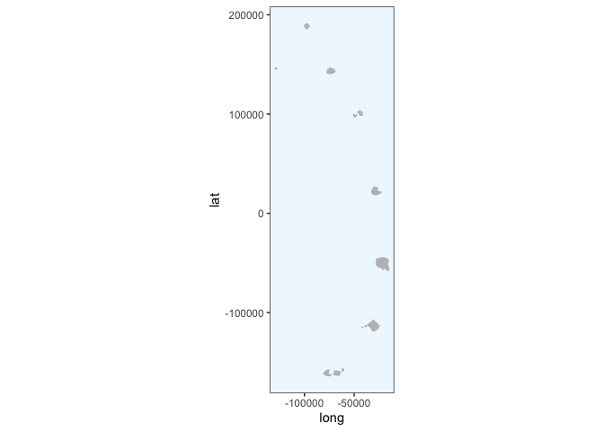<!-- -->

### Function for plotting the penguin track onto the map

``` r
plot_track <- function(x) {
  # plot
  ggplot() + 
    geom_polygon(data = SSI_laea.df, aes(x = long, y = lat, group = group), fill="grey50") +
    geom_path(data = SSI_laea.df, aes(x = long, y = lat, group = group), color="grey50") +
    coord_equal() +
    geom_point(data = x, aes(x = LON, y = LAT)) +
    theme_bw() +
    theme(panel.grid.major = element_blank(), 
          panel.grid.minor = element_blank(),
          panel.background = element_rect(fill = "aliceblue"),
          legend.title = element_blank()) 
}
```

### Function to remove points that are over land

``` r
# first create 500m buffer around island
SSI_laea_buffer <- buffer(SSI_laea, width=-500)

remove_points_on_land <- function(track) {
  # make the track spatial points df
  coordinates(track) <- ~LON + LAT
  # tell it that it's projected in LAEA
  proj4string(track) <- CRS("+proj=laea +lon_0=-26 +lat_0=-58 +units=m")
  # add new column to track object identifying whether the track is off the island
  track$off_island <- !is.na(over(track, SSI_laea_buffer))
  # filter the points for just those that are off the island
  track %>% 
    filter(off_island == TRUE)
}
```

### Split into trips using time stamps

First create a function for offsetting the values in a column by 1 row
(or more if you change `shiftLen`).

``` r
# function for offsetting values by 1 row
rowShift <- function(x, shiftLen = 1L) {
    rr <- (1L + shiftLen):(length(x) + shiftLen)
    rr[rr<1] <- NA
    return(x[rr])
  }
```

Then we calculate the lag time between each point. If there is a lag
longer than 5 minutes (0.08333 hours), then this is when the bird was on
land (technically inside the buffer zone) and so we can use this to
split the track into separate foraging trips.

In fact, I am using a lag of 30 minutes to define the end of one trip
and the start of the next, in case the bird was foraging or hanging out
just at the edge of the buffer zone.

In order to plot the final trip, I need to fudge the final line of
`at_sea` and give it `Start_Trip == TRUE` so that I can use
Start\_row\_indexes to plot this final trip

``` r
split_into_trips <- function(at_sea) {
  # offset the values in Time_since by 1 row 
  at_sea2 <- at_sea %>% mutate(lag1 = rowShift(Time_since, -1), 
                               # calculate differences between Time_since and each lag 
                               diff1 = Time_since - lag1,
                               # put track$Start_trip == TRUE where the diff1 is greater than 30 mins
                               Start_trip = diff1 >= 0.5)
  # change the "NA" at the beginning of the first trip to "TRUE"
  at_sea2$Start_trip[1] <- TRUE
  # change the final value of Start_trip to TRUE to signal this is actually the end of the last trip
  at_sea2[length(at_sea2), "Start_trip"] <- TRUE
  return(at_sea2)
}
```

### Function for plotting the trips

This function takes a sequence of numbers corresponding to the number of
`Start_trip == TRUE` in the object `at_sea` to split the dataframe up
into trips and plot each indiviudally. The function will scale the map
according to the min and max longitude and latitude for each trip.

``` r
plot_trip <- function(x) {
  # plot
  ggplot() + 
    geom_polygon(data = SSI_laea.df, aes(x = long, y = lat, group = group), fill="grey50") +
    geom_path(data = SSI_laea.df, aes(x = long, y = lat, group = group), color="grey50") +
    coord_equal() +
    geom_point(data = data.frame(at_sea[c(Start_row_indexes[[x]]:Start_row_indexes[[x+1]]-1), ]), aes(x = LON, y = LAT)) +
    theme_bw() +
    theme(panel.grid.major = element_blank(), 
          panel.grid.minor = element_blank(),
          panel.background = element_rect(fill = "aliceblue"),
          legend.title = element_blank()) +
    coord_fixed(ratio = 1, 
                xlim = c(data.frame(at_sea[c(Start_row_indexes[[x]]:Start_row_indexes[[x+1]]-1),]) %>% select(LON) %>% min(),
                         data.frame(at_sea[c(Start_row_indexes[[x]]:Start_row_indexes[[x+1]]-1),]) %>% select(LON) %>% max()), 
                ylim = c(data.frame(at_sea[c(Start_row_indexes[[x]]:Start_row_indexes[[x+1]]-1),]) %>% select(LAT) %>% min(),
                         data.frame(at_sea[c(Start_row_indexes[[x]]:Start_row_indexes[[x+1]]-1),]) %>% select(LAT) %>% max()),
                expand = TRUE, 
                clip = "on")
}
```

### Penguin - 196697

Load crawled
track.

``` r
predObj <- read.csv("predicted_tracks/196697_track.csv", stringsAsFactors = FALSE) 

# select the useful columns and rename
track <- predObj %>%  
  select(Ptt, Time_absolute, Time_since, mu.x, mu.y) %>% 
  rename(LON = mu.x, LAT = mu.y)
```

Plot

``` r
plot_track(track)
```

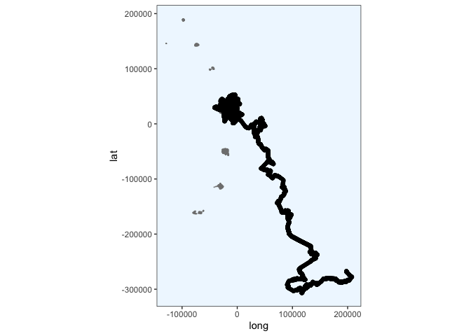<!-- -->

Remove points on land

``` r
at_sea <- remove_points_on_land(track)

# plot to make sure it worked
at_sea %>% 
    data.frame() %>% 
    plot_track(.) #+
```

<!-- -->

``` r
    #coord_fixed(ratio = 1, xlim = c(-45000, 15000), ylim = c(-10000, 60000), expand = TRUE, clip = "on")
```

**Something is going wrong here and I can’t work out what. It seems like
when the track crosses (100000, -200000) it gets cropped, why?**

Split into trips using time stamps

``` r
at_sea <- split_into_trips(at_sea)
head(at_sea)
```

    ## # A tibble: 6 x 7
    ##      Ptt Time_absolute       Time_since off_island   lag1   diff1 Start_trip
    ##    <int> <chr>                    <dbl> <lgl>       <dbl>   <dbl> <lgl>     
    ## 1 196697 2020-01-06 17:14:00      0.4   TRUE       NA     NA      TRUE      
    ## 2 196697 2020-01-06 17:19:00      0.483 TRUE        0.4    0.0833 FALSE     
    ## 3 196697 2020-01-06 17:24:00      0.567 TRUE        0.483  0.0833 FALSE     
    ## 4 196697 2020-01-06 17:29:00      0.65  TRUE        0.567  0.0833 FALSE     
    ## 5 196697 2020-01-06 17:34:00      0.733 TRUE        0.65   0.0833 FALSE     
    ## 6 196697 2020-01-06 17:39:00      0.817 TRUE        0.733  0.0833 FALSE

``` r
tail(at_sea)
```

    ## # A tibble: 6 x 7
    ##      Ptt Time_absolute       Time_since off_island  lag1  diff1 Start_trip
    ##    <int> <chr>                    <dbl> <lgl>      <dbl>  <dbl> <lgl>     
    ## 1 196697 2020-02-17 20:04:00      1011. TRUE       1011. 0.0167 FALSE     
    ## 2 196697 2020-02-17 20:05:00      1011. TRUE       1011. 0.0167 FALSE     
    ## 3 196697 2020-02-17 20:09:00      1011. TRUE       1011. 0.0667 FALSE     
    ## 4 196697 2020-02-17 20:14:00      1011. TRUE       1011. 0.0833 FALSE     
    ## 5 196697 2020-02-17 20:19:00      1011. TRUE       1011. 0.0833 FALSE     
    ## 6 196697 2020-02-17 20:24:00      1012. TRUE       1011. 0.0833 TRUE

Store the row numbers of each `Start_trip == TRUE` in a list which we
will use to split by trip

``` r
Start_row_indexes <- as.list(which(at_sea$Start_trip == TRUE))
```

Plot the trips

``` r
#plot_trip = function(x) {
#    ggplot() +
#      ggspatial::layer_spatial(data = SSI_laea) +
#     coord_fixed(ratio = 1, xlim = c(-45000, 15000), ylim = c(-10000, 60000), expand = TRUE, clip = "on") +
#     ggspatial::layer_spatial(data = at_sea[c(Start_row_indexes[[x]]:Start_row_indexes[[x+1]]-1), ])
#}

seq <- c(1:(length(Start_row_indexes) -1))
plots = purrr::map(seq, ~plot_trip(.x))

invisible(lapply(plots, print))
```

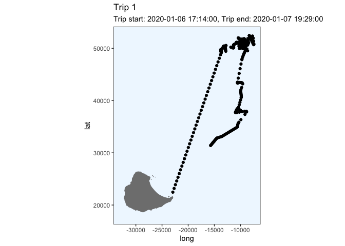<!-- -->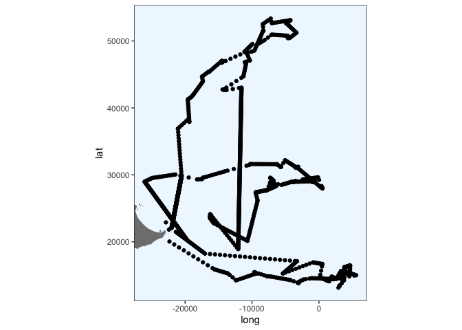<!-- -->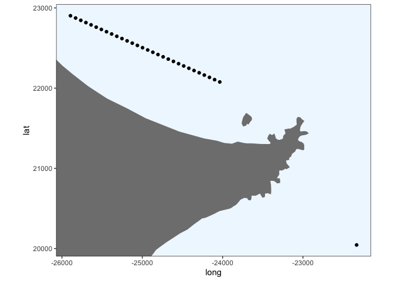<!-- -->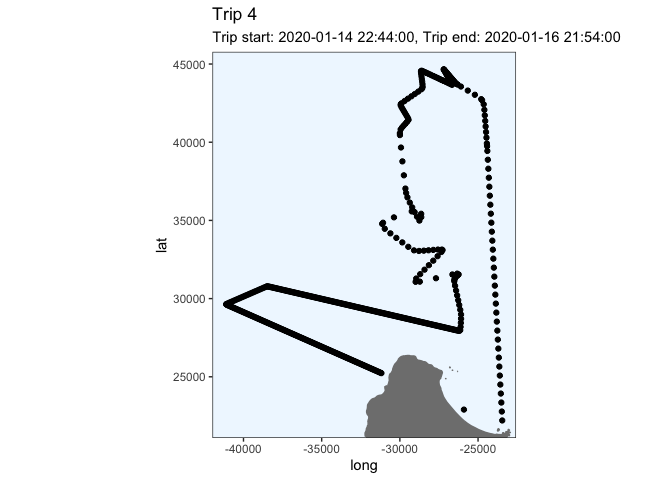<!-- --><!-- -->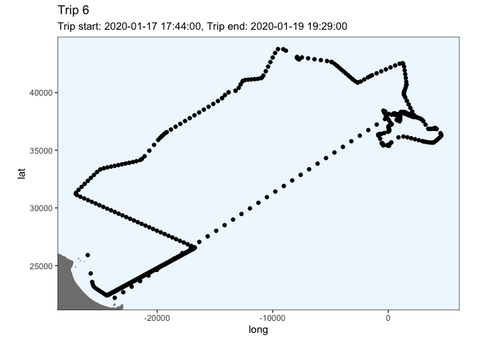<!-- -->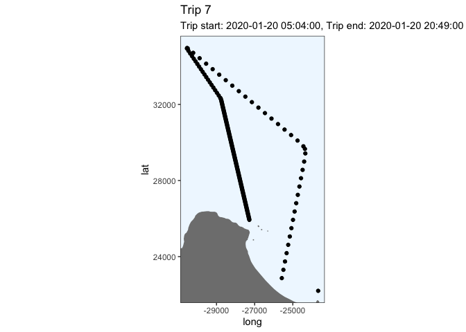<!-- -->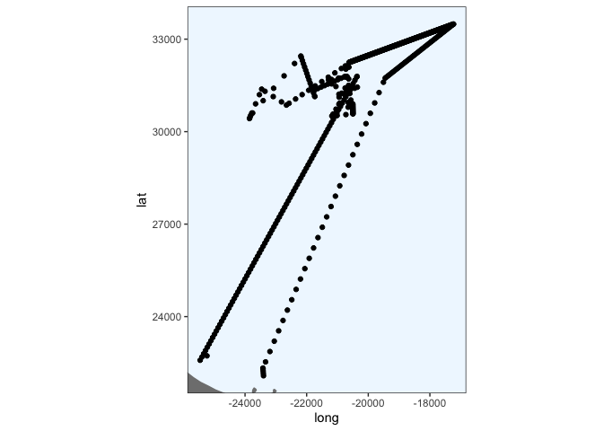<!-- -->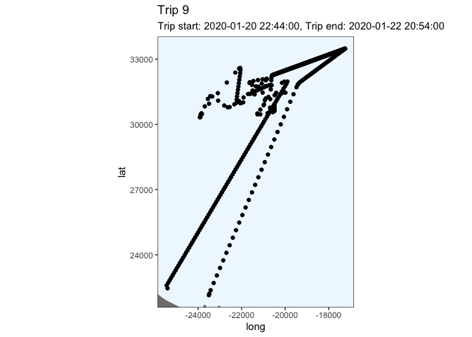<!-- --><!-- -->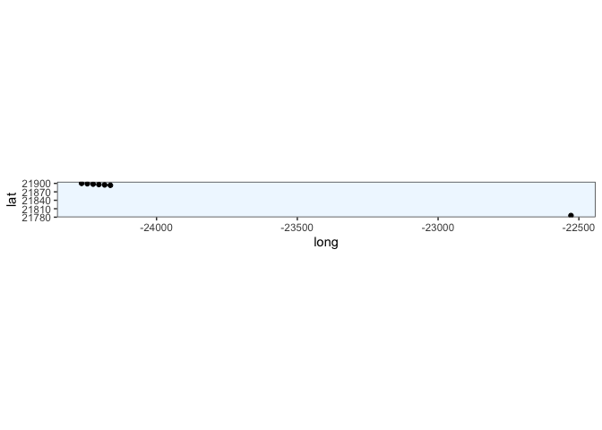<!-- -->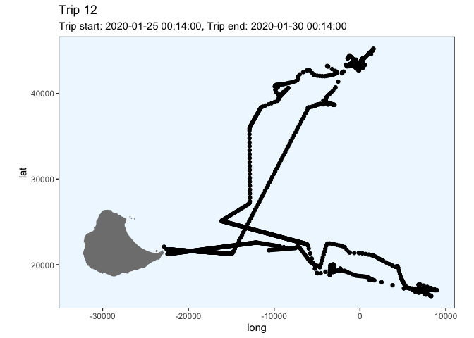<!-- -->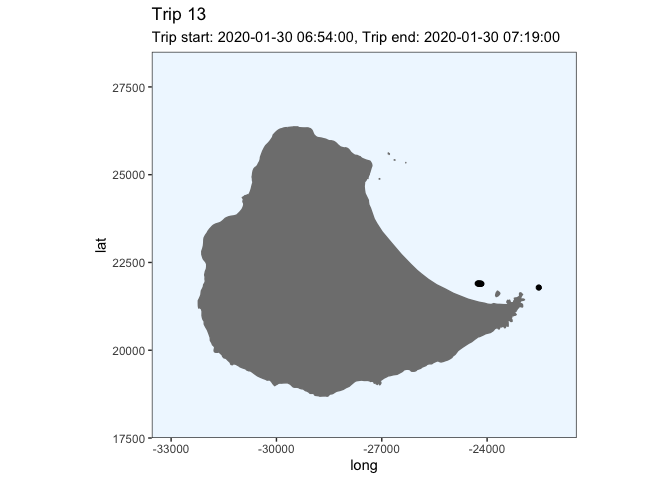<!-- -->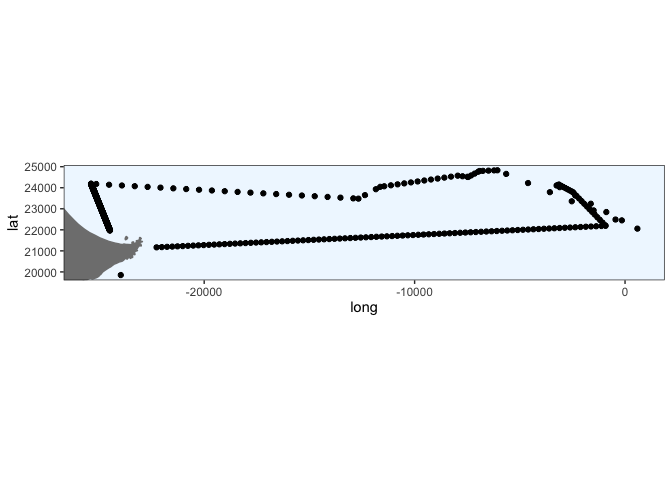<!-- -->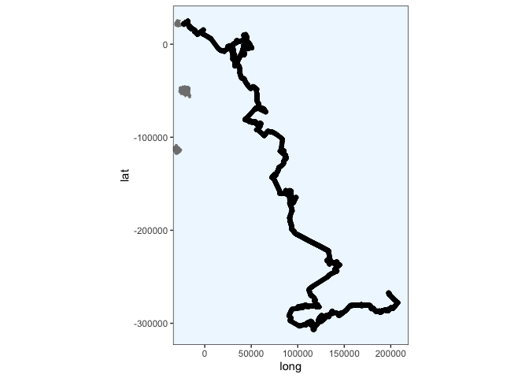<!-- -->

``` r
# plot with patchwork
#    plots[[1]] + plots[[2]] + plots[[3]] + plots[[4]] + 
#    plots[[5]] + plots[[6]] + plots[[7]] + plots[[8]] +
#    plots[[9]] + plots[[10]] + plots[[11]] + plots[[12]] +
#    plots[[13]] + plots[[14]] + plots[[15]] 
```

### Penguin - 196698

``` r
predObj <- read.csv("predicted_tracks/196698_track.csv", stringsAsFactors = FALSE) 

# select the useful columns and rename
track <- predObj %>%  
  select(Ptt, Time_absolute, Time_since, mu.x, mu.y) %>% 
  rename(LON = mu.x, LAT = mu.y)

plot_track(track)
```

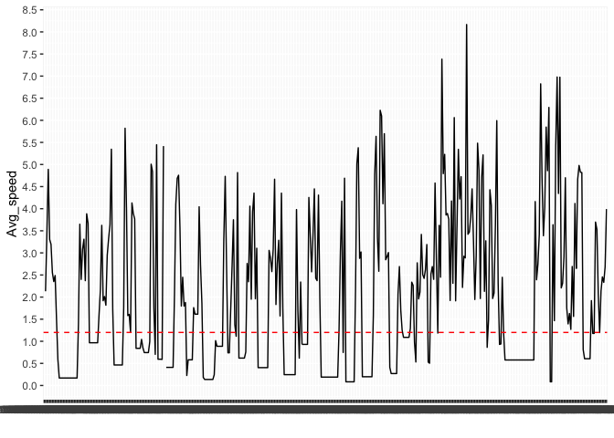<!-- -->

``` r
at_sea <- remove_points_on_land(track)

# plot to make sure it worked
at_sea %>% 
    data.frame() %>% 
    plot_track(.) #+
```

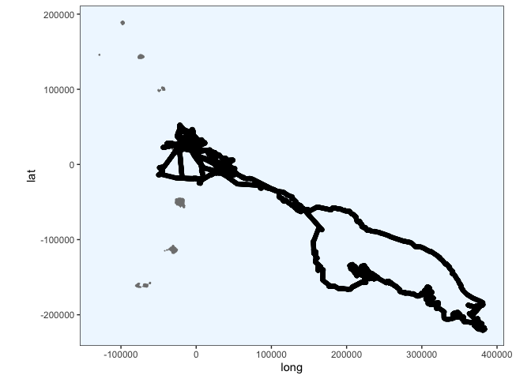<!-- -->

``` r
    #coord_fixed(ratio = 1, xlim = c(-45000, 15000), ylim = c(-10000, 60000), expand = TRUE, clip = "on")

at_sea <- split_into_trips(at_sea)
head(at_sea)
```

    ## # A tibble: 6 x 7
    ##      Ptt Time_absolute       Time_since off_island  lag1   diff1 Start_trip
    ##    <int> <chr>                    <dbl> <lgl>      <dbl>   <dbl> <lgl>     
    ## 1 196698 2020-01-08 00:47:00       32.0 TRUE        NA   NA      TRUE      
    ## 2 196698 2020-01-08 00:52:00       32.0 TRUE        32.0  0.0833 FALSE     
    ## 3 196698 2020-01-08 00:57:00       32.1 TRUE        32.0  0.0833 FALSE     
    ## 4 196698 2020-01-08 01:02:00       32.2 TRUE        32.1  0.0833 FALSE     
    ## 5 196698 2020-01-08 01:07:00       32.3 TRUE        32.2  0.0833 FALSE     
    ## 6 196698 2020-01-08 01:12:00       32.4 TRUE        32.3  0.0833 FALSE

``` r
tail(at_sea)
```

    ## # A tibble: 6 x 7
    ##      Ptt Time_absolute       Time_since off_island  lag1  diff1 Start_trip
    ##    <int> <chr>                    <dbl> <lgl>      <dbl>  <dbl> <lgl>     
    ## 1 196698 2020-02-26 20:17:00      1227. TRUE       1227. 0.0833 FALSE     
    ## 2 196698 2020-02-26 20:22:00      1228. TRUE       1227. 0.0833 FALSE     
    ## 3 196698 2020-02-26 20:27:00      1228. TRUE       1228. 0.0833 FALSE     
    ## 4 196698 2020-02-26 20:32:00      1228. TRUE       1228. 0.0833 FALSE     
    ## 5 196698 2020-02-26 20:33:00      1228. TRUE       1228. 0.0167 FALSE     
    ## 6 196698 2020-02-26 20:37:00      1228. TRUE       1228. 0.0667 TRUE

``` r
Start_row_indexes <- as.list(which(at_sea$Start_trip == TRUE))
```

**Again the final long trip is getting cropped, also when it passes
100000. Why?**

Plot each trip.

``` r
seq <- c(1:(length(Start_row_indexes) -1))
plots = purrr::map(seq, ~plot_trip(.x))

invisible(lapply(plots, print))
```

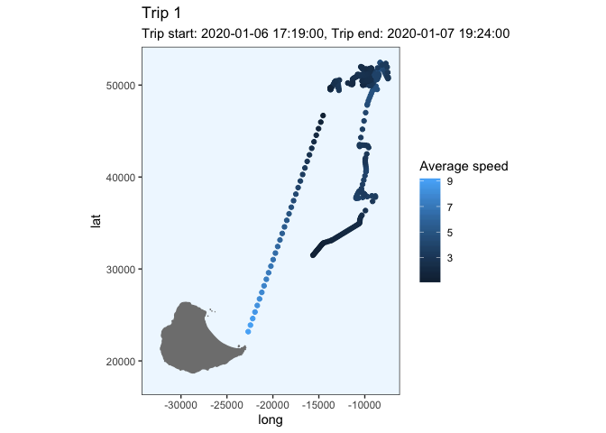<!-- -->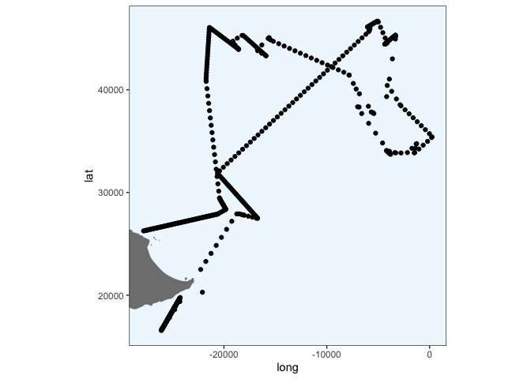<!-- -->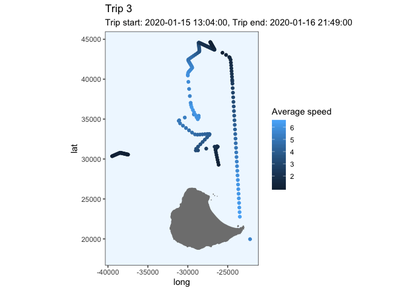<!-- -->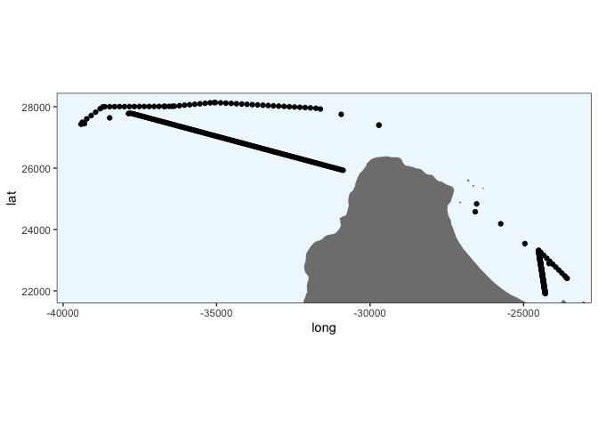<!-- -->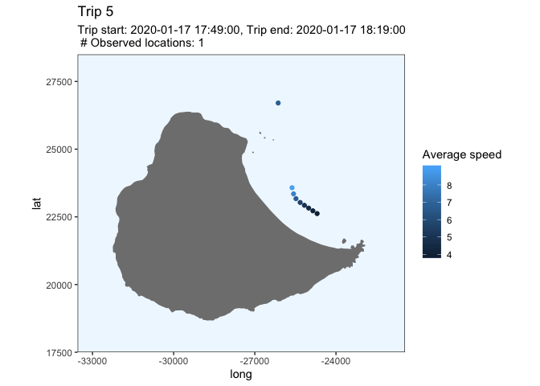<!-- -->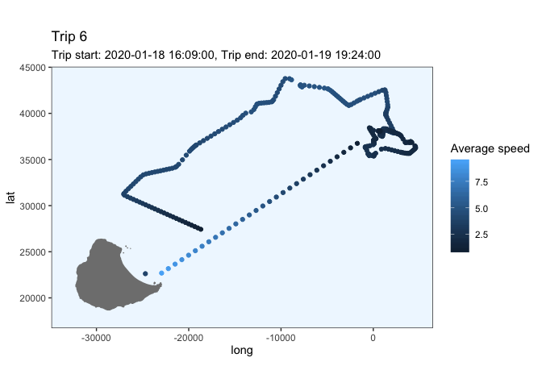<!-- -->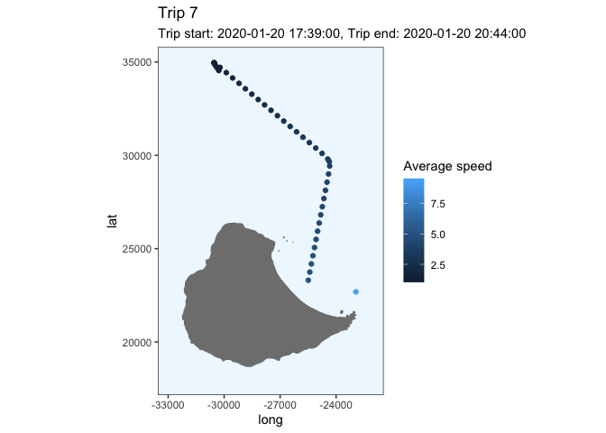<!-- -->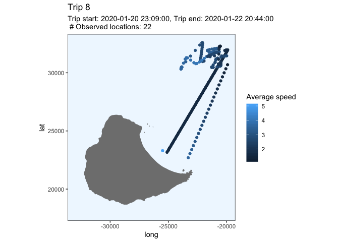<!-- -->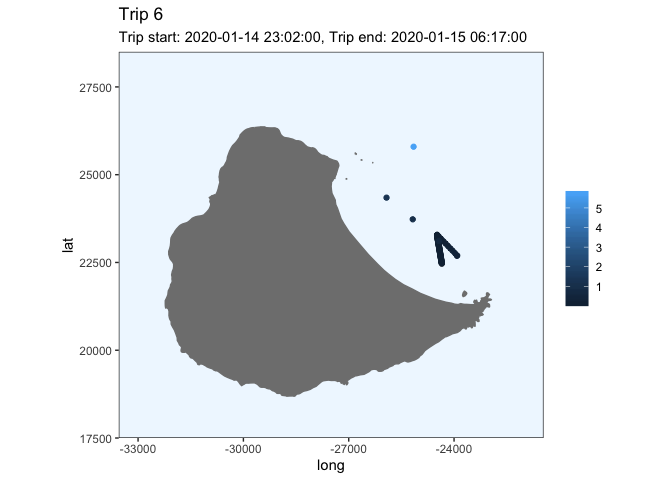<!-- -->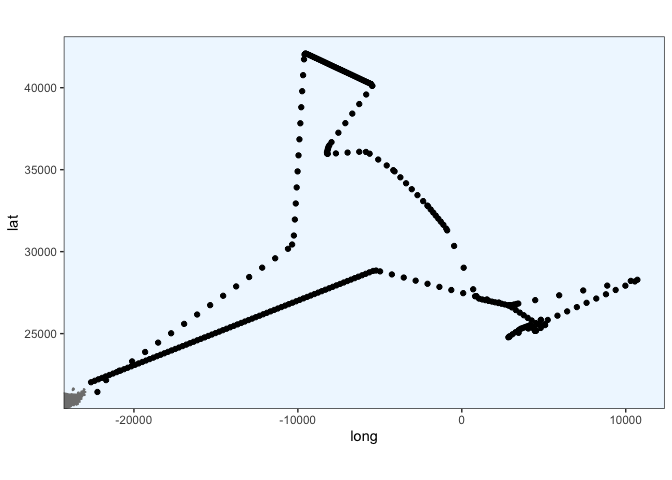<!-- -->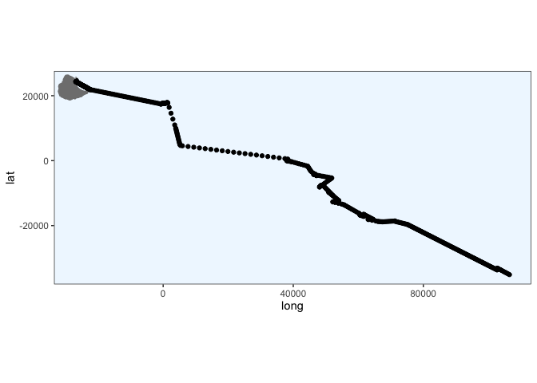<!-- -->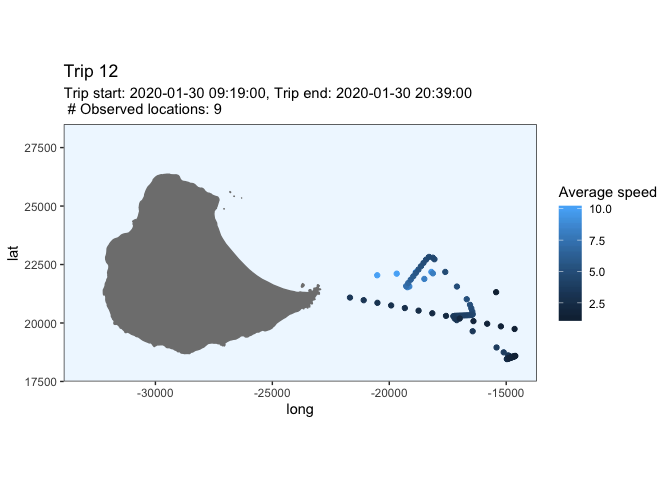<!-- -->

``` r
# plot with patchwork
#    plots[[1]] + plots[[2]] + plots[[3]] + plots[[4]] + 
#    plots[[5]] + plots[[6]] + plots[[7]] + plots[[8]] +
#    plots[[9]] + plots[[10]] + plots[[11]] + plots[[12]] 
```

Why are the ends of my trips being cut? something is happening at
-200000, -100000 I think.

It would be good to print the start date and time of the trip, and the
duration, onto each graph to see whether they make sense.
