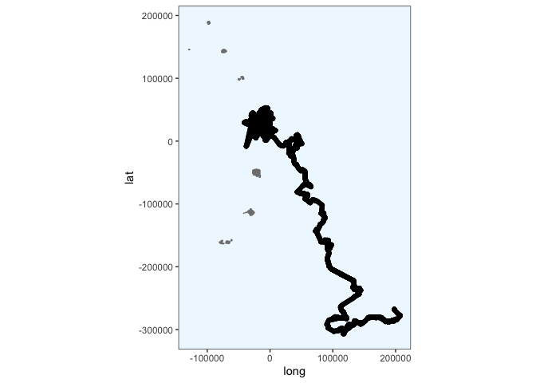
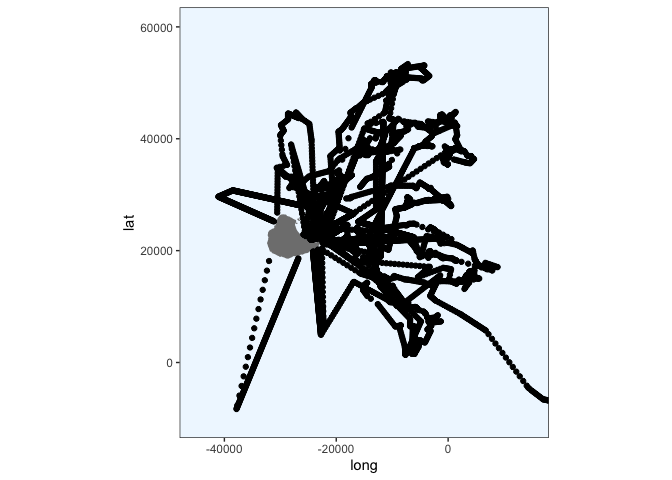
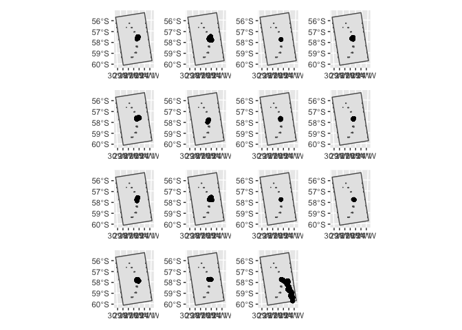

Split into trips
================
Gemma Clucas
8/26/2020

``` r
library(maptools)
library(sf)
library(patchwork)
library(ggspatial)
library(purrr)
library(rgdal)
library(raster)
library(plyr)
library(tidyverse)
library(sp)
library(ggplot2)
library(knitr)
library(spdplyr)
options(scipen=999)
```

### Load map and plot

``` r
Seamask<-readOGR("Seamask.shp")
```

    ## OGR data source with driver: ESRI Shapefile 
    ## Source: "/Users/gemmaclucas/GitHub/CHPE_Tracking_South_Sandwich_Islands/Seamask.shp", layer: "Seamask"
    ## with 1 features
    ## It has 1 fields

``` r
SSI <- crop(Seamask, c(450000, 750000, -600000, -100000))
```

    ## Warning in RGEOSUnaryPredFunc(spgeom, byid, "rgeos_isvalid"): Ring Self-
    ## intersection at or near point 77954.359424359995 26605.230663620001

    ## x[i, ] is invalid

    ## Warning in rgeos::gIntersection(x[i, ], y, byid = TRUE, drop_lower_td = TRUE):
    ## Invalid objects found; consider using set_RGEOS_CheckValidity(2L)

``` r
#Re-project to Lambert Azimuthal Equal Area
SSI_laea<-spTransform(SSI, CRS=CRS("+proj=laea +lon_0=-26 +lat_0=-58 +units=m"))

# convert to dataframe for use with ggplot2
SSI_laea@data$id = rownames(SSI_laea@data)
SSI_laea.points = fortify(SSI_laea, region="id")
SSI_laea.df = plyr::join(SSI_laea.points, SSI_laea@data, by="id")

# filter out only the polygons for the islands
SSI_laea.df <- SSI_laea.df %>% filter(hole == TRUE)


SSI_laea.df %>% 
  ggplot(aes(x = long, y = lat, group = group)) + 
  geom_polygon(fill="grey") +
  geom_path(color="grey") +
  coord_equal() +
  theme_bw() +
  theme(panel.grid.major = element_blank(), 
        panel.grid.minor = element_blank(),
        panel.background = element_rect(fill = "aliceblue"))
```

<!-- -->

### Load track for one penguin

``` r
predObj <- read.csv("predicted_tracks/196697_track.csv", stringsAsFactors = FALSE) 

# select the useful columns and rename
track <- predObj %>%  
  select(Ptt, Time_absolute, Time_since, mu.x, mu.y) %>% 
  rename(LON = mu.x, LAT = mu.y)
```

### Plot the track

Function for plotting

``` r
plot_track <- function(x) {
  # plot
  ggplot() + 
    geom_polygon(data = SSI_laea.df, aes(x = long, y = lat, group = group), fill="grey50") +
    geom_path(data = SSI_laea.df, aes(x = long, y = lat, group = group), color="grey50") +
    coord_equal() +
    geom_point(data = x, aes(x = LON, y = LAT)) +
    theme_bw() +
    theme(panel.grid.major = element_blank(), 
          panel.grid.minor = element_blank(),
          panel.background = element_rect(fill = "aliceblue"),
          legend.title = element_blank()) 
}
```

Plot

``` r
plot_track(track)
```

<!-- -->

### Remove points that are over land

First, make the tracks spatial

``` r
# make the points spatial
coordinates(track) <- ~LON + LAT
# tell it that it's projected in LAEA
proj4string(track) <- CRS("+proj=laea +lon_0=-26 +lat_0=-58 +units=m")
```

Create a buffer around the island, and mark all points outside of the
buffer zone with `off_island == TRUE`. Save as new object as we’ll use
this a lot. Plot to check.

``` r
# create 500m buffer around island
SSI_laea_buffer <- buffer(SSI_laea, width=-500)
track$off_island <- !is.na(over(track, SSI_laea_buffer))

at_sea <- track %>% 
  filter(off_island == TRUE)

at_sea %>% 
  data.frame() %>% 
  plot_track(.) +
    coord_fixed(ratio = 1, xlim = c(-45000, 15000), ylim = c(-10000, 60000), expand = TRUE, clip = "on")
```

    ## Coordinate system already present. Adding new coordinate system, which will replace the existing one.

<!-- -->

### Split into trips using time stamps

First create a function for offsetting the values in a column by 1 row
(or more if you change `shiftLen`).

``` r
# function for offsetting values by 1 row
rowShift <- function(x, shiftLen = 1L) {
    rr <- (1L + shiftLen):(length(x) + shiftLen)
    rr[rr<1] <- NA
    return(x[rr])
  }
```

Then we calculate the lag time between each point. If there is a lag
longer than 5 minutes (0.08333 hours), then this is when the bird was on
land (technically inside the buffer zone) and so we can use this to
split the track into separate foraging trips.

In fact, I am using a lag of 30 minutes to define the end of one trip
and the start of the next, in case the bird was foraging or hanging out
just at the edge of the buffer zone.

In order to plot the final trip, I need to fudge the final line of
`at_sea` and give it `Start_Trip == TRUE` so that I can use
Start\_row\_indexes to plot this final trip

``` r
# offset the values in Time_since by 1 row 
at_sea$lag1 <- rowShift(at_sea$Time_since, -1)
# calculate differences between Time_since and each lag 
at_sea$diff1 <- at_sea$Time_since - at_sea$lag1  

# put track$Start_trip == TRUE where the diff1 is greater than 30 mins
at_sea$Start_trip <- at_sea$diff1 >= 0.5
# change the "NA" at the beginning of the first trip to "TRUE"
at_sea$Start_trip[1] <- TRUE
head(at_sea)
```

    ##      Ptt       Time_absolute Time_since off_island      lag1      diff1
    ## 1 196697 2020-01-06 17:14:00  0.4000000       TRUE        NA         NA
    ## 2 196697 2020-01-06 17:19:00  0.4833333       TRUE 0.4000000 0.08333333
    ## 3 196697 2020-01-06 17:24:00  0.5666667       TRUE 0.4833333 0.08333333
    ## 4 196697 2020-01-06 17:29:00  0.6500000       TRUE 0.5666667 0.08333333
    ## 5 196697 2020-01-06 17:34:00  0.7333333       TRUE 0.6500000 0.08333333
    ## 6 196697 2020-01-06 17:39:00  0.8166667       TRUE 0.7333333 0.08333333
    ##   Start_trip
    ## 1       TRUE
    ## 2      FALSE
    ## 3      FALSE
    ## 4      FALSE
    ## 5      FALSE
    ## 6      FALSE

``` r
at_sea[length(at_sea), "Start_trip"] <- TRUE
tail(at_sea)
```

    ##          Ptt       Time_absolute Time_since off_island     lag1      diff1
    ## 13055 196697 2020-02-17 20:04:00   1011.233       TRUE 1011.217 0.01666667
    ## 13056 196697 2020-02-17 20:05:00   1011.250       TRUE 1011.233 0.01666667
    ## 13057 196697 2020-02-17 20:09:00   1011.317       TRUE 1011.250 0.06666667
    ## 13058 196697 2020-02-17 20:14:00   1011.400       TRUE 1011.317 0.08333333
    ## 13059 196697 2020-02-17 20:19:00   1011.483       TRUE 1011.400 0.08333333
    ## 13060 196697 2020-02-17 20:24:00   1011.567       TRUE 1011.483 0.08333333
    ##       Start_trip
    ## 13055      FALSE
    ## 13056      FALSE
    ## 13057      FALSE
    ## 13058      FALSE
    ## 13059      FALSE
    ## 13060       TRUE

Store the row numbers of each `Start_trip == TRUE` in a list which we
will use to split by trip

``` r
Start_row_indexes <- as.list(which(at_sea$Start_trip == TRUE))
```

Make a function for plotting the trips

``` r
trip_plot = function(x) {
    ggplot() +
      ggspatial::layer_spatial(data = SSI_laea) +
      coord_fixed(ratio = 1, xlim = c(-45000, 15000), ylim = c(-10000, 60000), expand = TRUE, clip = "on") +
      ggspatial::layer_spatial(data = at_sea[c(Start_row_indexes[[x]]:Start_row_indexes[[x+1]]-1), ])
}

seq <- c(1:(length(Start_row_indexes) -1))
plots = purrr::map(seq, ~trip_plot(.x))

loop.vector <- c(1:(length(Start_row_indexes) -1))

for (i in loop.vector){
  plots[[i]]
}

# plot with patchwork
    plots[[1]] + plots[[2]] + plots[[3]] + plots[[4]] + 
    plots[[5]] + plots[[6]] + plots[[7]] + plots[[8]] +
    plots[[9]] + plots[[10]] + plots[[11]] + plots[[12]] +
    plots[[13]] + plots[[14]] + plots[[15]] 
```

<!-- -->

I need to figure out how to share these as separate objects I guess. But
where is this going? maybe I need to figure that out first.
