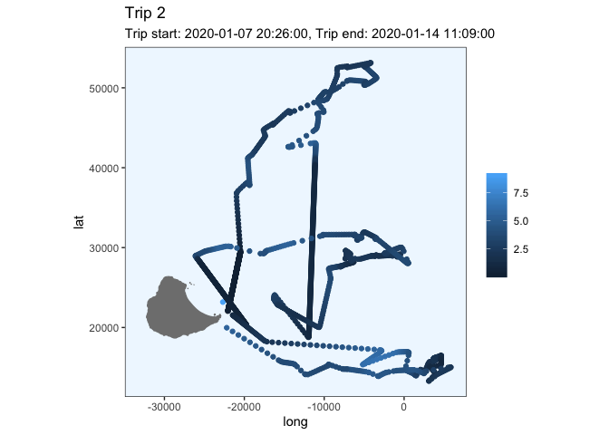
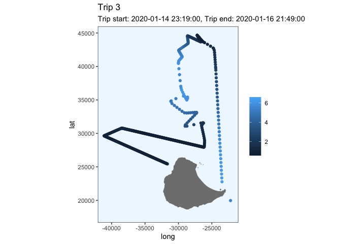
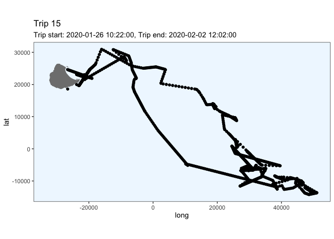
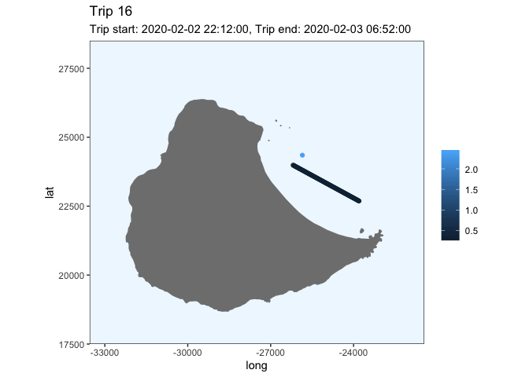
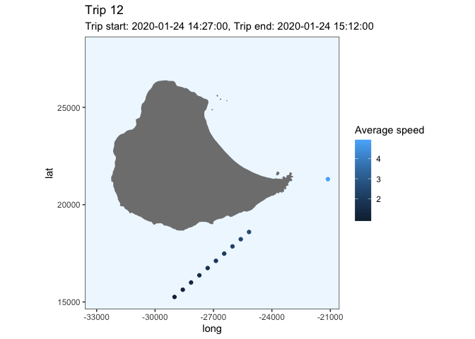

Split into trips
================
Gemma Clucas
4th January 2021

``` r
library(maptools)
library(sf)
library(patchwork)
library(ggspatial)
library(purrr)
library(rgdal)
library(raster)
library(plyr)
library(tidyverse)
library(sp)
library(ggplot2)
library(knitr)
library(spdplyr)
library(geosphere)
options(scipen=999)
```

### Load map and plot

``` r
Seamask<-readOGR("Seamask.shp")
```

    ## OGR data source with driver: ESRI Shapefile 
    ## Source: "/Users/gemmaclucas/GitHub/CHPE_Tracking_South_Sandwich_Islands/Seamask.shp", layer: "Seamask"
    ## with 1 features
    ## It has 1 fields

``` r
#SSI <- crop(Seamask, c(450000, 750000, -600000, -100000)) # the original values I used here were cropping the end of the tracks when I filtered for the points off land, so I increased the extent of this base map to prevent that
SSI <- crop(Seamask, c(0, 1000000, -1000000, -100000))
```

    ## x[i, ] is invalid

``` r
#Re-project to Lambert Azimuthal Equal Area
SSI_laea<-spTransform(SSI, CRS=CRS("+proj=laea +lon_0=-26 +lat_0=-58 +units=m"))

# convert to dataframe for use with ggplot2
SSI_laea@data$id = rownames(SSI_laea@data)
SSI_laea.points = fortify(SSI_laea, region="id")
SSI_laea.df = plyr::join(SSI_laea.points, SSI_laea@data, by="id")

# filter out only the polygons for the islands
SSI_laea.df <- SSI_laea.df %>% filter(hole == TRUE)

# plot
SSI_laea.df %>% 
  ggplot(aes(x = long, y = lat, group = group)) + 
  geom_polygon(fill="grey") +
  geom_path(color="grey") +
  coord_equal() +
  theme_bw() +
  theme(panel.grid.major = element_blank(), 
        panel.grid.minor = element_blank(),
        panel.background = element_rect(fill = "aliceblue"))
```

<!-- -->

### Function for plotting the penguin track onto the map

``` r
plot_track <- function(x) {
  # plot
  ggplot() + 
    geom_polygon(data = SSI_laea.df, aes(x = long, y = lat, group = group), fill="grey50") +
    geom_path(data = SSI_laea.df, aes(x = long, y = lat, group = group), color="grey50") +
    coord_equal() +
    geom_point(data = x, aes(x = LON, y = LAT)) +
    theme_bw() +
    theme(panel.grid.major = element_blank(), 
          panel.grid.minor = element_blank(),
          panel.background = element_rect(fill = "aliceblue"),
          legend.title = element_blank()) 
}
```

### Function to remove points that are over land

This also removes points within 500m of land.

``` r
# first create 500m buffer around island
SSI_laea_buffer <- buffer(SSI_laea, width=-500)

remove_points_on_land <- function(track) {
  # make the track spatial points df
  coordinates(track) <- ~LON + LAT
  # tell it that it's projected in LAEA
  proj4string(track) <- CRS("+proj=laea +lon_0=-26 +lat_0=-58 +units=m")
  # add new column to track object identifying whether the track is off the island
  track$off_island <- !is.na(over(track, SSI_laea_buffer))
  # filter the points for just those that are off the island
  track %>%
    filter(off_island == TRUE)
}
```

### Split into trips

First create a function for offsetting the values in a column by 1 row
(or more if you change `shiftLen`). This is needed to later calculate
the lag time between each point.

``` r
# function for offsetting values by 1 row
rowShift <- function(x, shiftLen = 1L) {
    rr <- (1L + shiftLen):(length(x) + shiftLen)
    rr[rr<1] <- NA
    return(x[rr])
}
```

Then we calculate the lag time between each point. If there is a lag
longer than 5 minutes (0.08333 hours), then this is when the bird was on
land (technically inside the buffer zone) and so we can use this to
split the track into separate foraging trips.

I still want to play around with the best lag time to use (30 mins
maybe?), in case the bird was foraging or hanging out just at the edge
of the buffer zone.

Each time there is a lag greater than x minutes, we get a `Start_trip =
TRUE` in the `at_sea` spatial object, otherwise `Start_trip = FALSE`.

In order to plot the final trip, I need to fudge the final line of
`at_sea` and give it `Start_Trip == TRUE` so that I can use
Start\_row\_indexes to plot this final trip.

``` r
split_into_trips <- function(at_sea) {
  # offset the values in Time_since by 1 row 
  at_sea2 <- at_sea %>% mutate(lag1 = rowShift(Time_since, -1), 
                               # calculate differences between Time_since and each lag 
                               diff1 = Time_since - lag1,
                               # put track$Start_trip == TRUE where the diff1 is greater than x mins
                               # Start_trip = diff1 >= 0.5) # 30 minutes on land
                               Start_trip = diff1 >= 0.16) # 10 minutes on land
                               # Start_trip = diff1 >= 0.25) # 15 minutes on land
  # change the "NA" at the beginning of the first trip to "TRUE"
  at_sea2$Start_trip[1] <- TRUE
  # change the final value of Start_trip to TRUE to signal this is actually the end of the last trip
  at_sea2[length(at_sea2), "Start_trip"] <- TRUE
  # record where each trip begins
  Start_row_indexes <- as.list(which(at_sea2$Start_trip == TRUE))
  # make a sequence from 1 to the number of trips
  seq <- c(1:(length(Start_row_indexes) -1))
  # add a column that records the trip number in the dataframe
  at_sea2$Trip <-
    purrr::map(seq, ~rep(.x, each = (Start_row_indexes[[.x + 1]] - (Start_row_indexes[[.x]])))) %>% 
    unlist() %>%
    append(., values = tail(., n=1))
  return(at_sea2)
}
```

### Function for plotting the trips

This function takes a sequence of numbers corresponding to the number of
`Start_trip == TRUE` in the object `at_sea` to split the dataframe up
into trips and plot each indiviudally. The function will resize the map
according to the min and max longitude and latitude for each trip. This
is not idea but will do for now.

``` r
plot_trip <- function(x) {
  ggplot() +
    # plot the map first
    geom_polygon(data = SSI_laea.df, aes(x = long, y = lat, group = group), fill="grey50") +
    geom_path(data = SSI_laea.df, aes(x = long, y = lat, group = group), color="grey50") +
    coord_equal() +
    # add the points. This uses the trip number (x) to subset the dataframe by trip.
    geom_point(data = data.frame(at_sea[c(Start_row_indexes[[x]]:Start_row_indexes[[x+1]]-1), ]), aes(x = LON, y = LAT)) +
    theme_bw() +
    # add headings for trip number and start/stop time
    labs(title = paste0("Trip ", x),
         subtitle = paste0("Trip start: ",
                            data.frame(at_sea[Start_row_indexes[[x]], ]) %>% select(Time_absolute),
                            ", Trip end: ",
                            data.frame(at_sea[Start_row_indexes[[x+1]]-1, ]) %>% select(Time_absolute))) +
    theme(panel.grid.major = element_blank(),
          panel.grid.minor = element_blank(),
          panel.background = element_rect(fill = "aliceblue"),
          legend.title = element_blank()) +
    # size according to the dimensions of the trip - this is not ideal
    coord_fixed(ratio = 1,
                xlim = c(data.frame(at_sea[c(Start_row_indexes[[x]]:Start_row_indexes[[x+1]]-1),]) %>% select(LON) %>% min(),
                         data.frame(at_sea[c(Start_row_indexes[[x]]:Start_row_indexes[[x+1]]-1),]) %>% select(LON) %>% max()),
                ylim = c(data.frame(at_sea[c(Start_row_indexes[[x]]:Start_row_indexes[[x+1]]-1),]) %>% select(LAT) %>% min(),
                         data.frame(at_sea[c(Start_row_indexes[[x]]:Start_row_indexes[[x+1]]-1),]) %>% select(LAT) %>% max()),
                expand = TRUE,
                clip = "on")
}
```

### Penguin - 196697

Load crawled
track.

``` r
predObj <- read.csv("predicted_tracks/196697_track.csv", stringsAsFactors = FALSE) 

# select the useful columns and rename
track <- predObj %>%  
  select(Ptt, locType, Time_absolute, Time_since, mu.x, mu.y) %>% 
  rename(LON = mu.x, LAT = mu.y)
```

Plot the raw track

``` r
plot_track(track)
```

<!-- -->

Remove points on land and replot to make sure nothing has gone wrong.

``` r
at_sea <- remove_points_on_land(track)

at_sea %>% 
    data.frame() %>% 
    plot_track(.) 
```

<!-- -->

Split into trips.

``` r
at_sea <- split_into_trips(at_sea)
head(at_sea) %>% kable() # check that the table starts with Start_trip = TRUE and trip number 1
```

|    Ptt | locType | Time\_absolute      | Time\_since | off\_island |      lag1 |     diff1 | Start\_trip | Trip |
| -----: | :------ | :------------------ | ----------: | :---------- | --------: | --------: | :---------- | ---: |
| 196697 | p       | 2020-01-06 17:14:00 |   0.4000000 | TRUE        |        NA |        NA | TRUE        |    1 |
| 196697 | p       | 2020-01-06 17:19:00 |   0.4833333 | TRUE        | 0.4000000 | 0.0833333 | FALSE       |    1 |
| 196697 | p       | 2020-01-06 17:24:00 |   0.5666667 | TRUE        | 0.4833333 | 0.0833333 | FALSE       |    1 |
| 196697 | p       | 2020-01-06 17:29:00 |   0.6500000 | TRUE        | 0.5666667 | 0.0833333 | FALSE       |    1 |
| 196697 | p       | 2020-01-06 17:34:00 |   0.7333333 | TRUE        | 0.6500000 | 0.0833333 | FALSE       |    1 |
| 196697 | p       | 2020-01-06 17:39:00 |   0.8166667 | TRUE        | 0.7333333 | 0.0833333 | FALSE       |    1 |

``` r
tail(at_sea) %>% kable() # check that the table ends with Start_trip = TRUE and some higher trip number
```

|    Ptt | locType | Time\_absolute      | Time\_since | off\_island |     lag1 |     diff1 | Start\_trip | Trip |
| -----: | :------ | :------------------ | ----------: | :---------- | -------: | --------: | :---------- | ---: |
| 196697 | p       | 2020-02-26 20:09:00 |    1227.317 | TRUE        | 1227.233 | 0.0833333 | FALSE       |   17 |
| 196697 | p       | 2020-02-26 20:14:00 |    1227.400 | TRUE        | 1227.317 | 0.0833333 | FALSE       |   17 |
| 196697 | p       | 2020-02-26 20:19:00 |    1227.483 | TRUE        | 1227.400 | 0.0833333 | FALSE       |   17 |
| 196697 | p       | 2020-02-26 20:24:00 |    1227.567 | TRUE        | 1227.483 | 0.0833333 | FALSE       |   17 |
| 196697 | p       | 2020-02-26 20:29:00 |    1227.650 | TRUE        | 1227.567 | 0.0833333 | FALSE       |   17 |
| 196697 | p       | 2020-02-26 20:34:00 |    1227.733 | TRUE        | 1227.650 | 0.0833333 | TRUE        |   17 |

### Filter out low-speed sections of the trips - not finished

I think this distance calculation is working for now but I should check
this against Vicky’s code. I think I will also need to estimate the
average speed over some sort of sliding window, so that I’m not cutting
trips up too much.

``` r
at_sea %>% 
  sp::spTransform(crs("+init=epsg:4326")) %>%   
  data.frame() %>%                              
  mutate(Distance = distHaversine(cbind(LON, LAT), 
                                  cbind(lag(LON), lag(LAT)))) %>% 
  filter(Time_absolute > "2020-01-20 22:40:00") %>% 
  filter(Time_absolute < "2020-01-22 20:54:00") %>% 
  head() %>% 
  kable()
```

|    Ptt | locType | Time\_absolute      | Time\_since | off\_island |     lag1 |     diff1 | Start\_trip | Trip |        LON |        LAT | optional | Distance |
| -----: | :------ | :------------------ | ----------: | :---------- | -------: | --------: | :---------- | ---: | ---------: | ---------: | :------- | -------: |
| 196697 | p       | 2020-01-20 22:44:00 |    341.9000 | TRUE        | 340.4833 | 1.4166667 | TRUE        |    9 | \-26.42800 | \-57.79646 | TRUE     | 135.1728 |
| 196697 | p       | 2020-01-20 22:49:00 |    341.9833 | TRUE        | 341.9000 | 0.0833333 | FALSE       |    9 | \-26.42683 | \-57.79542 | TRUE     | 134.7930 |
| 196697 | p       | 2020-01-20 22:54:00 |    342.0667 | TRUE        | 341.9833 | 0.0833333 | FALSE       |    9 | \-26.42566 | \-57.79439 | TRUE     | 134.7930 |
| 196697 | p       | 2020-01-20 22:59:00 |    342.1500 | TRUE        | 342.0667 | 0.0833333 | FALSE       |    9 | \-26.42449 | \-57.79335 | TRUE     | 134.7930 |
| 196697 | p       | 2020-01-20 23:04:00 |    342.2333 | TRUE        | 342.1500 | 0.0833333 | FALSE       |    9 | \-26.42332 | \-57.79231 | TRUE     | 134.7931 |
| 196697 | p       | 2020-01-20 23:09:00 |    342.3167 | TRUE        | 342.2333 | 0.0833333 | FALSE       |    9 | \-26.42214 | \-57.79127 | TRUE     | 134.7931 |

Plot the trips

``` r
# make a sequence of 1 to n where n is the number of trips
Start_row_indexes <- as.list(which(at_sea$Start_trip == TRUE))
seq <- c(1:(length(Start_row_indexes) -1))

plots = purrr::map(seq, ~plot_trip(.x))

invisible(lapply(plots, print))
```

<!-- --><!-- --><!-- --><!-- --><!-- --><!-- --><!-- --><!-- --><!-- --><!-- --><!-- --><!-- --><!-- --><!-- --><!-- --><!-- --><!-- -->

### Penguin - 196698

``` r
predObj <- read.csv("predicted_tracks/196698_track.csv", stringsAsFactors = FALSE) 

# select the useful columns and rename
track <- predObj %>%  
  select(Ptt, Time_absolute, Time_since, mu.x, mu.y) %>% 
  rename(LON = mu.x, LAT = mu.y)

plot_track(track)
```

<!-- -->

``` r
# remove points on land
at_sea <- remove_points_on_land(track)

# plot to make sure it worked
at_sea %>% 
    data.frame() %>% 
    plot_track(.) 
```

<!-- -->

``` r
# split into trips
at_sea <- split_into_trips(at_sea)
head(at_sea) %>% kable
```

|    Ptt | Time\_absolute      | Time\_since | off\_island |     lag1 |     diff1 | Start\_trip | Trip |
| -----: | :------------------ | ----------: | :---------- | -------: | --------: | :---------- | ---: |
| 196698 | 2020-01-08 03:57:00 |    35.11667 | TRUE        |       NA |        NA | TRUE        |    1 |
| 196698 | 2020-01-08 04:02:00 |    35.20000 | TRUE        | 35.11667 | 0.0833333 | FALSE       |    1 |
| 196698 | 2020-01-08 04:07:00 |    35.28333 | TRUE        | 35.20000 | 0.0833333 | FALSE       |    1 |
| 196698 | 2020-01-08 04:12:00 |    35.36667 | TRUE        | 35.28333 | 0.0833333 | FALSE       |    1 |
| 196698 | 2020-01-08 04:17:00 |    35.45000 | TRUE        | 35.36667 | 0.0833333 | FALSE       |    1 |
| 196698 | 2020-01-08 04:22:00 |    35.53333 | TRUE        | 35.45000 | 0.0833333 | FALSE       |    1 |

``` r
tail(at_sea) %>% kable
```

|    Ptt | Time\_absolute      | Time\_since | off\_island |     lag1 |     diff1 | Start\_trip | Trip |
| -----: | :------------------ | ----------: | :---------- | -------: | --------: | :---------- | ---: |
| 196698 | 2020-02-26 20:17:00 |    1227.450 | TRUE        | 1227.367 | 0.0833333 | FALSE       |   17 |
| 196698 | 2020-02-26 20:22:00 |    1227.533 | TRUE        | 1227.450 | 0.0833333 | FALSE       |   17 |
| 196698 | 2020-02-26 20:27:00 |    1227.617 | TRUE        | 1227.533 | 0.0833333 | FALSE       |   17 |
| 196698 | 2020-02-26 20:32:00 |    1227.700 | TRUE        | 1227.617 | 0.0833333 | FALSE       |   17 |
| 196698 | 2020-02-26 20:33:00 |    1227.717 | TRUE        | 1227.700 | 0.0166667 | FALSE       |   17 |
| 196698 | 2020-02-26 20:37:00 |    1227.783 | TRUE        | 1227.717 | 0.0666667 | TRUE        |   17 |

``` r
# store row indexes for the start of each trip
Start_row_indexes <- as.list(which(at_sea$Start_trip == TRUE))

seq <- c(1:(length(Start_row_indexes) -1))
plots = purrr::map(seq, ~plot_trip(.x))
```

    ## Coordinate system already present. Adding new coordinate system, which will replace the existing one.
    ## Coordinate system already present. Adding new coordinate system, which will replace the existing one.
    ## Coordinate system already present. Adding new coordinate system, which will replace the existing one.
    ## Coordinate system already present. Adding new coordinate system, which will replace the existing one.
    ## Coordinate system already present. Adding new coordinate system, which will replace the existing one.
    ## Coordinate system already present. Adding new coordinate system, which will replace the existing one.
    ## Coordinate system already present. Adding new coordinate system, which will replace the existing one.
    ## Coordinate system already present. Adding new coordinate system, which will replace the existing one.
    ## Coordinate system already present. Adding new coordinate system, which will replace the existing one.
    ## Coordinate system already present. Adding new coordinate system, which will replace the existing one.
    ## Coordinate system already present. Adding new coordinate system, which will replace the existing one.
    ## Coordinate system already present. Adding new coordinate system, which will replace the existing one.
    ## Coordinate system already present. Adding new coordinate system, which will replace the existing one.
    ## Coordinate system already present. Adding new coordinate system, which will replace the existing one.
    ## Coordinate system already present. Adding new coordinate system, which will replace the existing one.
    ## Coordinate system already present. Adding new coordinate system, which will replace the existing one.
    ## Coordinate system already present. Adding new coordinate system, which will replace the existing one.

``` r
invisible(lapply(plots, print))
```

<!-- --><!-- --><!-- --><!-- --><!-- --><!-- --><!-- --><!-- --><!-- --><!-- --><!-- --><!-- --><!-- --><!-- --><!-- --><!-- --><!-- -->

**Why is this last trip being cut into two? Is there a gap in the data
for some reason? Come back to
this**

### Penguin - 196699

``` r
predObj <- read.csv("predicted_tracks/196699_track.csv", stringsAsFactors = FALSE) 

# select the useful columns and rename
track <- predObj %>%  
  select(Ptt, Time_absolute, Time_since, mu.x, mu.y) %>% 
  rename(LON = mu.x, LAT = mu.y)

plot_track(track)
```

<!-- -->

``` r
at_sea <- remove_points_on_land(track)

# plot to make sure it worked
at_sea %>% 
    data.frame() %>% 
    plot_track(.) 
```

<!-- -->

``` r
at_sea <- split_into_trips(at_sea)
head(at_sea) %>% kable()
```

|    Ptt | Time\_absolute      | Time\_since | off\_island |     lag1 |     diff1 | Start\_trip | Trip |
| -----: | :------------------ | ----------: | :---------- | -------: | --------: | :---------- | ---: |
| 196699 | 2020-01-07 19:43:00 |    26.88333 | TRUE        |       NA |        NA | TRUE        |    1 |
| 196699 | 2020-01-07 19:48:00 |    26.96667 | TRUE        | 26.88333 | 0.0833333 | FALSE       |    1 |
| 196699 | 2020-01-07 19:53:00 |    27.05000 | TRUE        | 26.96667 | 0.0833333 | FALSE       |    1 |
| 196699 | 2020-01-07 19:58:00 |    27.13333 | TRUE        | 27.05000 | 0.0833333 | FALSE       |    1 |
| 196699 | 2020-01-07 20:03:00 |    27.21667 | TRUE        | 27.13333 | 0.0833333 | FALSE       |    1 |
| 196699 | 2020-01-07 20:08:00 |    27.30000 | TRUE        | 27.21667 | 0.0833333 | FALSE       |    1 |

``` r
tail(at_sea) %>% kable()
```

|    Ptt | Time\_absolute      | Time\_since | off\_island |     lag1 |     diff1 | Start\_trip | Trip |
| -----: | :------------------ | ----------: | :---------- | -------: | --------: | :---------- | ---: |
| 196699 | 2020-02-12 11:28:00 |    882.6333 | TRUE        | 882.5500 | 0.0833333 | FALSE       |   20 |
| 196699 | 2020-02-12 11:33:00 |    882.7167 | TRUE        | 882.6333 | 0.0833333 | FALSE       |   20 |
| 196699 | 2020-02-12 11:38:00 |    882.8000 | TRUE        | 882.7167 | 0.0833333 | FALSE       |   20 |
| 196699 | 2020-02-12 11:43:00 |    882.8833 | TRUE        | 882.8000 | 0.0833333 | FALSE       |   20 |
| 196699 | 2020-02-12 11:48:00 |    882.9667 | TRUE        | 882.8833 | 0.0833333 | FALSE       |   20 |
| 196699 | 2020-02-12 11:52:00 |    883.0333 | TRUE        | 882.9667 | 0.0666667 | TRUE        |   20 |

``` r
Start_row_indexes <- as.list(which(at_sea$Start_trip == TRUE))

seq <- c(1:(length(Start_row_indexes) -1))
plots = purrr::map(seq, ~plot_trip(.x))
```

    ## Coordinate system already present. Adding new coordinate system, which will replace the existing one.
    ## Coordinate system already present. Adding new coordinate system, which will replace the existing one.
    ## Coordinate system already present. Adding new coordinate system, which will replace the existing one.
    ## Coordinate system already present. Adding new coordinate system, which will replace the existing one.
    ## Coordinate system already present. Adding new coordinate system, which will replace the existing one.
    ## Coordinate system already present. Adding new coordinate system, which will replace the existing one.
    ## Coordinate system already present. Adding new coordinate system, which will replace the existing one.
    ## Coordinate system already present. Adding new coordinate system, which will replace the existing one.
    ## Coordinate system already present. Adding new coordinate system, which will replace the existing one.
    ## Coordinate system already present. Adding new coordinate system, which will replace the existing one.
    ## Coordinate system already present. Adding new coordinate system, which will replace the existing one.
    ## Coordinate system already present. Adding new coordinate system, which will replace the existing one.
    ## Coordinate system already present. Adding new coordinate system, which will replace the existing one.
    ## Coordinate system already present. Adding new coordinate system, which will replace the existing one.
    ## Coordinate system already present. Adding new coordinate system, which will replace the existing one.
    ## Coordinate system already present. Adding new coordinate system, which will replace the existing one.
    ## Coordinate system already present. Adding new coordinate system, which will replace the existing one.
    ## Coordinate system already present. Adding new coordinate system, which will replace the existing one.
    ## Coordinate system already present. Adding new coordinate system, which will replace the existing one.
    ## Coordinate system already present. Adding new coordinate system, which will replace the existing one.

``` r
invisible(lapply(plots, print))
```

<!-- --><!-- --><!-- --><!-- --><!-- --><!-- --><!-- --><!-- --><!-- --><!-- --><!-- --><!-- --><!-- --><!-- --><!-- --><!-- --><!-- --><!-- --><!-- --><!-- -->

### Penguin - 196707

``` r
predObj <- read.csv("predicted_tracks/196707_track.csv", stringsAsFactors = FALSE) 

# select the useful columns and rename
track <- predObj %>%  
  select(Ptt, Time_absolute, Time_since, mu.x, mu.y) %>% 
  rename(LON = mu.x, LAT = mu.y)

plot_track(track)
```

<!-- -->

``` r
at_sea <- remove_points_on_land(track)

# plot to make sure it worked
at_sea %>% 
    data.frame() %>% 
    plot_track(.) 
```

<!-- -->

``` r
at_sea <- split_into_trips(at_sea)
head(at_sea) %>% kable()
```

|    Ptt | Time\_absolute      | Time\_since | off\_island |     lag1 |     diff1 | Start\_trip | Trip |
| -----: | :------------------ | ----------: | :---------- | -------: | --------: | :---------- | ---: |
| 196707 | 2020-01-07 06:56:00 |    14.10000 | TRUE        |       NA |        NA | TRUE        |    1 |
| 196707 | 2020-01-07 07:01:00 |    14.18333 | TRUE        | 14.10000 | 0.0833333 | FALSE       |    1 |
| 196707 | 2020-01-07 07:06:00 |    14.26667 | TRUE        | 14.18333 | 0.0833333 | FALSE       |    1 |
| 196707 | 2020-01-07 07:11:00 |    14.35000 | TRUE        | 14.26667 | 0.0833333 | FALSE       |    1 |
| 196707 | 2020-01-07 07:16:00 |    14.43333 | TRUE        | 14.35000 | 0.0833333 | FALSE       |    1 |
| 196707 | 2020-01-07 07:21:00 |    14.51667 | TRUE        | 14.43333 | 0.0833333 | FALSE       |    1 |

``` r
tail(at_sea) %>% kable()
```

|    Ptt | Time\_absolute      | Time\_since | off\_island |     lag1 |     diff1 | Start\_trip | Trip |
| -----: | :------------------ | ----------: | :---------- | -------: | --------: | :---------- | ---: |
| 196707 | 2020-03-13 20:11:00 |    1611.350 | TRUE        | 1611.267 | 0.0833333 | FALSE       |   30 |
| 196707 | 2020-03-13 20:16:00 |    1611.433 | TRUE        | 1611.350 | 0.0833333 | FALSE       |   30 |
| 196707 | 2020-03-13 20:21:00 |    1611.517 | TRUE        | 1611.433 | 0.0833333 | FALSE       |   30 |
| 196707 | 2020-03-13 20:22:00 |    1611.533 | TRUE        | 1611.517 | 0.0166667 | FALSE       |   30 |
| 196707 | 2020-03-13 20:26:00 |    1611.600 | TRUE        | 1611.533 | 0.0666667 | FALSE       |   30 |
| 196707 | 2020-03-13 20:31:00 |    1611.683 | TRUE        | 1611.600 | 0.0833333 | TRUE        |   30 |

``` r
Start_row_indexes <- as.list(which(at_sea$Start_trip == TRUE))

seq <- c(1:(length(Start_row_indexes) -1))
plots = purrr::map(seq, ~plot_trip(.x))
```

    ## Coordinate system already present. Adding new coordinate system, which will replace the existing one.
    ## Coordinate system already present. Adding new coordinate system, which will replace the existing one.
    ## Coordinate system already present. Adding new coordinate system, which will replace the existing one.
    ## Coordinate system already present. Adding new coordinate system, which will replace the existing one.
    ## Coordinate system already present. Adding new coordinate system, which will replace the existing one.
    ## Coordinate system already present. Adding new coordinate system, which will replace the existing one.
    ## Coordinate system already present. Adding new coordinate system, which will replace the existing one.
    ## Coordinate system already present. Adding new coordinate system, which will replace the existing one.
    ## Coordinate system already present. Adding new coordinate system, which will replace the existing one.
    ## Coordinate system already present. Adding new coordinate system, which will replace the existing one.
    ## Coordinate system already present. Adding new coordinate system, which will replace the existing one.
    ## Coordinate system already present. Adding new coordinate system, which will replace the existing one.
    ## Coordinate system already present. Adding new coordinate system, which will replace the existing one.
    ## Coordinate system already present. Adding new coordinate system, which will replace the existing one.
    ## Coordinate system already present. Adding new coordinate system, which will replace the existing one.
    ## Coordinate system already present. Adding new coordinate system, which will replace the existing one.
    ## Coordinate system already present. Adding new coordinate system, which will replace the existing one.
    ## Coordinate system already present. Adding new coordinate system, which will replace the existing one.
    ## Coordinate system already present. Adding new coordinate system, which will replace the existing one.
    ## Coordinate system already present. Adding new coordinate system, which will replace the existing one.
    ## Coordinate system already present. Adding new coordinate system, which will replace the existing one.
    ## Coordinate system already present. Adding new coordinate system, which will replace the existing one.
    ## Coordinate system already present. Adding new coordinate system, which will replace the existing one.
    ## Coordinate system already present. Adding new coordinate system, which will replace the existing one.
    ## Coordinate system already present. Adding new coordinate system, which will replace the existing one.
    ## Coordinate system already present. Adding new coordinate system, which will replace the existing one.
    ## Coordinate system already present. Adding new coordinate system, which will replace the existing one.
    ## Coordinate system already present. Adding new coordinate system, which will replace the existing one.
    ## Coordinate system already present. Adding new coordinate system, which will replace the existing one.
    ## Coordinate system already present. Adding new coordinate system, which will replace the existing one.

``` r
invisible(lapply(plots, print))
```

<!-- --><!-- --><!-- --><!-- --><!-- --><!-- --><!-- --><!-- --><!-- --><!-- --><!-- --><!-- --><!-- --><!-- --><!-- --><!-- --><!-- --><!-- --><!-- --><!-- --><!-- --><!-- --><!-- --><!-- --><!-- --><!-- --><!-- --><!-- --><!-- --><!-- -->

## Questions

1.  Is 30 minutes on land a good cut-off or are short trips being
    missed? I should think about this later after sorting out question
    2.

2.  How do I deal with the fact that when the bird is most likely on
    land, the crawled tracks often show it moving slowly away from the
    colony? Should I remove parts of the track when the speed is very
    slow? How would I calculate the speed of the bird?

3.  Is it ok to delete some of the short trips which are clearly just
    the result of an inaccurate fix? Is there a rule of thumb to follow
    for keeping trips that look real (e.g. the have some wiggles in
    them?) and deleting the bad stuff?
