Split into trips
================
Gemma Clucas
4th January 2021

``` r
library(maptools)
library(sf)
library(patchwork)
library(ggspatial)
library(purrr)
library(rgdal)
library(raster)
library(plyr)
library(tidyverse)
library(sp)
library(ggplot2)
library(knitr)
library(spdplyr)
library(geosphere)
library(slider)
options(scipen=999)
```

### Load map and plot

``` r
Seamask<-readOGR("Seamask.shp")
```

    ## OGR data source with driver: ESRI Shapefile 
    ## Source: "/Users/gemmaclucas/GitHub/CHPE_Tracking_South_Sandwich_Islands/Seamask.shp", layer: "Seamask"
    ## with 1 features
    ## It has 1 fields

``` r
#SSI <- crop(Seamask, c(450000, 750000, -600000, -100000)) # the original values I used here were cropping the end of the tracks when I filtered for the points off land, so I increased the extent of this base map to prevent that
# NB you can find the maximal extent of Seamask with extent(Seamask)
SSI <- crop(Seamask, c(450000, 1095192, -795043.9, -100000))
```

    ## x[i, ] is invalid

``` r
#Re-project to Lambert Azimuthal Equal Area
SSI_laea<-spTransform(SSI, CRS=CRS("+proj=laea +lon_0=-26 +lat_0=-58 +units=m"))

# convert to dataframe for use with ggplot2
SSI_laea@data$id = rownames(SSI_laea@data)
SSI_laea.points = fortify(SSI_laea, region="id")
SSI_laea.df = plyr::join(SSI_laea.points, SSI_laea@data, by="id")

# filter out only the polygons for the islands
SSI_laea.df <- SSI_laea.df %>% filter(hole == TRUE)

# plot
SSI_laea.df %>% 
  ggplot(aes(x = long, y = lat, group = group)) + 
  geom_polygon(fill="grey") +
  geom_path(color="grey") +
  coord_equal() +
  theme_bw() +
  theme(panel.grid.major = element_blank(), 
        panel.grid.minor = element_blank(),
        panel.background = element_rect(fill = "aliceblue"))
```

<!-- -->

### Function for plotting the penguin track onto the map

``` r
plot_track <- function(x) {
  # plot
  ggplot() + 
    geom_polygon(data = SSI_laea.df, aes(x = long, y = lat, group = group), fill="grey50") +
    geom_path(data = SSI_laea.df, aes(x = long, y = lat, group = group), color="grey50") +
    coord_equal() +
    geom_point(data = x, aes(x = LON, y = LAT)) +
    theme_bw() +
    theme(panel.grid.major = element_blank(), 
          panel.grid.minor = element_blank(),
          panel.background = element_rect(fill = "aliceblue"),
          legend.title = element_blank()) 
}
```

### Function to remove points that are over land

This also removes points within 500m of land.

``` r
# first create 500m buffer around island
SSI_laea_buffer <- buffer(SSI_laea, width=-500)

remove_points_on_land <- function(track) {
  # make the track spatial points df
  coordinates(track) <- ~LON + LAT
  # tell it that it's projected in LAEA
  proj4string(track) <- CRS("+proj=laea +lon_0=-26 +lat_0=-58 +units=m")
  # add new column to track object identifying whether the track is off the island
  track$off_island <- !is.na(over(track, SSI_laea_buffer))
  # filter the points for just those that are off the island
  track %>%
    filter(off_island == TRUE)
}
```

### Function to split into trips

First create a function for offsetting the values in a column by 1 row
(or more if you change `shiftLen`). This is needed to later calculate
the lag time between each point.

``` r
# function for offsetting values by 1 row
rowShift <- function(x, shiftLen = 1L) {
    rr <- (1L + shiftLen):(length(x) + shiftLen)
    rr[rr<1] <- NA
    return(x[rr])
}
```

Then we calculate the lag time between each point. If there is a lag
longer than 5 minutes (0.08333 hours), then this is when the bird was on
land (technically inside the buffer zone) and so we can use this to
split the track into separate foraging trips.

I still want to play around with the best lag time to use (30 mins
maybe?), in case the bird was foraging or hanging out just at the edge
of the buffer zone.

Each time there is a lag greater than x minutes, we get a `Start_trip =
TRUE` in the `at_sea` spatial object, otherwise `Start_trip = FALSE`.

In order to record the final trip, I need to fudge the final line of
`at_sea` and give it `Start_Trip == TRUE` so that I can use
Start\_row\_indexes to plot this final trip.

The row indexes of where these `TRUE` values occur are then used to add
a column that records the trip number in the dataframe.

``` r
split_into_trips <- function(at_sea) {
  # offset the values in Time_since by 1 row 
  at_sea2 <- at_sea %>% mutate(lag1 = rowShift(Time_since, -1), 
                               # calculate differences between Time_since and each lag 
                               diff1 = Time_since - lag1,
                               # put track$Start_trip == TRUE where the diff1 is greater than x mins
                               # Start_trip = diff1 >= 0.5) # 30 minutes on land
                               Start_trip = diff1 >= 0.16) # 10 minutes on land
                               # Start_trip = diff1 >= 0.25) # 15 minutes on land
  # change the "NA" at the beginning of the first trip to "TRUE"
  at_sea2$Start_trip[1] <- TRUE
  # change the final value of Start_trip to TRUE to signal this is actually the end of the last trip
  at_sea2[length(at_sea2), "Start_trip"] <- TRUE
  # record where each trip begins
  Start_row_indexes <- as.list(which(at_sea2$Start_trip == TRUE))
  # make a sequence from 1 to the number of trips
  seq <- c(1:(length(Start_row_indexes) -1))
  # add a column that records the trip number in the dataframe
  at_sea2$Trip <-
    # this code takes the numbers in seq and repeats each for the number of rows between 
    # the start of trip n+1 and trip n (i.e. the length of the current trip)
    purrr::map(seq, ~rep(.x, each = (Start_row_indexes[[.x + 1]] - (Start_row_indexes[[.x]])))) %>% 
    unlist() %>%    # the result has to be changed from a list to a vector
    append(., values = tail(., n=1))    # and this repeats the last trip number once more and appends to the vector, otherwise it missed the last row
  return(at_sea2)
}
```

### Function for plotting the trips

This function takes a sequence of numbers corresponding to the number of
`Start_trip == TRUE` in the object `at_sea` to split the dataframe up
into trips and plot each indiviudally. The function will resize the map
according to the min and max longitude and latitude for each trip, while
still including Saunders Island.

Note, now that I am recording the trip number in `at_sea` I could use
facting to plot the trips instead, probably. Nope tried this, the graphs
are too squashed.

``` r
plot_trip <- function(x) {
  ggplot() +
    # plot the map first
    geom_polygon(data = SSI_laea.df, aes(x = long, y = lat, group = group), fill="grey50") +
    geom_path(data = SSI_laea.df, aes(x = long, y = lat, group = group), color="grey50") +
    coord_equal() +
    # add the points. This uses the trip number (x) to subset the dataframe by trip.
    geom_point(data = data.frame(at_sea[c(Start_row_indexes[[x]]:Start_row_indexes[[x+1]]-1), ]), aes(x = LON, y = LAT)) +
    theme_bw() +
    # add headings for trip number and start/stop time
    labs(title = paste0("Trip ", x),
         subtitle = paste0("Trip start: ",
                            data.frame(at_sea[Start_row_indexes[[x]], ]) %>% select(Time_absolute),
                            ", Trip end: ",
                            data.frame(at_sea[Start_row_indexes[[x+1]]-1, ]) %>% select(Time_absolute))) +
    theme(panel.grid.major = element_blank(),
          panel.grid.minor = element_blank(),
          panel.background = element_rect(fill = "aliceblue"),
          legend.title = element_blank()) +
    # size according to the dimensions of the trip
    # Saunders is always plotted by taking the min/max value of the island or the trip points for specifying the plot dimensions
    coord_fixed(ratio = 1,
                xlim = c(min(c(-33000, data.frame(at_sea[c(Start_row_indexes[[x]]:Start_row_indexes[[x+1]]-1),]) %>% select(LON) %>% min())),
                         max(c(-22000, data.frame(at_sea[c(Start_row_indexes[[x]]:Start_row_indexes[[x+1]]-1),]) %>% select(LON) %>% max()))),
                ylim = c(min(c(18000, data.frame(at_sea[c(Start_row_indexes[[x]]:Start_row_indexes[[x+1]]-1),]) %>% select(LAT) %>% min())),
                         max(c(28000, data.frame(at_sea[c(Start_row_indexes[[x]]:Start_row_indexes[[x+1]]-1),]) %>% select(LAT) %>% max()))),
                expand = TRUE,
                clip = "on")
  
}
```

### Penguin - 196697

Load crawled
track.

``` r
predObj <- read.csv("predicted_tracks/196697_track.csv", stringsAsFactors = FALSE) 

# select the useful columns and rename
track <- predObj %>%  
  select(Ptt, locType, Time_absolute, Time_since, mu.x, mu.y) %>% 
  rename(LON = mu.x, LAT = mu.y)

plot_track(track)
```

<!-- -->

Remove points on land and replot to make sure nothing has gone wrong.

``` r
at_sea <- remove_points_on_land(track)

at_sea %>% 
    data.frame() %>% 
    plot_track(.) 
```

<!-- -->

Split into trips.

``` r
at_sea <- split_into_trips(at_sea)
#head(at_sea) %>% kable() # check that the table starts with Start_trip = TRUE and trip number 1
#tail(at_sea) %>% kable() # check that the table ends with Start_trip = TRUE and some higher trip number
```

### Filter out low-speed sections of the trips - not finished

The `distHaversine()` function gives the same estimates of distance as
the code Vicky sent over, but it runs a bit faster.

I am estimating the average speed over a sliding window of 3 hours at
the mo, so that I’m not filtering out times when the birds are resting
between dives. There are some times when the speed is either NaN or Inf
because an observation and predicted location occur at exactly the same
time. At this stage I don’t want to go all the way back and shift the
times, as I don’t want to mess up the predicted tracks, so for the
purposes of just working out the speed, I will filter out the times when
both time stamps are identical using `distinct()` from dplyr.

Decide on a cut-off for getting rid of these duff points - is 3 hours a
long enough window? looks like 0.6 kph might be a good minimum avg
speed, but keep eyeballing the data more to work out whether this is
good.

According to Culick et al (1994), the preferred swimming speeds of
chinstrap penguins are 2.4 m/s, which is 8.6 kph.

``` r
at_sea_df <- at_sea %>%
  sp::spTransform(crs("+init=epsg:4326")) %>%
  data.frame() %>%
  dplyr::distinct(Time_absolute, .keep_all = TRUE) %>%
  dplyr::mutate(Distance = distHaversine(p1 = cbind(LON, LAT),                    # gives distance in meters
                                  p2 = cbind(lag(LON), lag(LAT)),          # lag is a base r function that takes the next observation by default
                                  r = 6362895)) %>%                        # r = radius of earth at 57.7 South
  dplyr::mutate(Speed_ms = Distance / (diff1*60*60))   %>%                     # gives speed in m/s since diff1 is in decimal hours
  dplyr::mutate(Speed_kph = (Distance/1000) / diff1)  %>%                       # speed in km per hour
  dplyr::mutate(Avg_speed = slide_dbl(.$Speed_kph, ~mean(.x), .before = 36))

# Plot the average speed over time
ggplot(data = at_sea_df, aes(x=Time_absolute, y=Avg_speed, group = Ptt)) +
  geom_line() +
  xlab("") +
  scale_y_continuous(breaks=seq(0,10,0.5)) +
  geom_hline(yintercept=1,
             linetype="dashed",
             color = "red")
```

    ## Warning: Removed 37 rows containing missing values (geom_path).

<!-- -->
It looks like 1 kph might be a good cut-off to use from this plot,
although there are maybe two instances when the average speed is stable
and just over 1kph. Check with other individuals.

Plot the
trips

``` r
Start_row_indexes <- as.list(which(at_sea$Start_trip == TRUE))    # need this for plot_trips() function

plots <- at_sea %>% 
  data.frame() %>%                  # convert to dataframe
  distinct(Trip) %>%                # find number of trips
  deframe() %>%                     # change to vector to pass to map
  purrr::map(., ~plot_trip(.x))

invisible(lapply(plots, print))
```

<!-- --><!-- --><!-- --><!-- --><!-- --><!-- --><!-- --><!-- --><!-- --><!-- --><!-- --><!-- --><!-- --><!-- --><!-- --><!-- --><!-- -->

### Penguin - 196698

``` r
predObj <- read.csv("predicted_tracks/196698_track.csv", stringsAsFactors = FALSE) 

# select the useful columns and rename
track <- predObj %>%  
  select(Ptt, Time_absolute, Time_since, mu.x, mu.y) %>% 
  rename(LON = mu.x, LAT = mu.y)

plot_track(track)
```

<!-- -->

``` r
# remove points on land
at_sea <- remove_points_on_land(track)

# plot to make sure it worked
at_sea %>% 
    data.frame() %>% 
    plot_track(.) 
```

<!-- -->

``` r
# split into trips
at_sea <- split_into_trips(at_sea)
# head(at_sea) %>% kable
# tail(at_sea) %>% kable

Start_row_indexes <- as.list(which(at_sea$Start_trip == TRUE))    # need this for plot_trips() function

# create plots for each trip
plots <- at_sea %>% 
  data.frame() %>%                  # convert at_sea to dataframe
  distinct(Trip) %>%                # find number of trips
  deframe() %>%                     # change to vector to pass to map
  purrr::map(., ~plot_trip(.x))

#plot
invisible(lapply(plots, print))
```

<!-- --><!-- --><!-- --><!-- --><!-- --><!-- --><!-- --><!-- --><!-- --><!-- --><!-- --><!-- --><!-- --><!-- --><!-- --><!-- -->

Plot speed

``` r
# at_sea_df <- at_sea %>% 
#   sp::spTransform(crs("+init=epsg:4326")) %>%   
#   data.frame() %>%
#   dplyr::distinct(Time_absolute, .keep_all = TRUE) %>% 
#   dplyr::mutate(Distance = distHaversine(p1 = cbind(LON, LAT),                    # gives distance in meters
#                                   p2 = cbind(lag(LON), lag(LAT)),          # lag is a base r function that takes the next observation by default
#                                   r = 6362895)) %>%                        # r = radius of earth at 57.7 South
#   dplyr::mutate(Speed_ms = Distance / (diff1*60*60))   %>%                     # gives speed in m/s since diff1 is in decimal hours
#   dplyr::mutate(Speed_kph = (Distance/1000) / diff1)  %>%                       # speed in km per hour
#   dplyr::mutate(Avg_speed = slide_dbl(.$Speed_kph, ~mean(.x), .before = 36))
# 
# # Plot the average speed over time
# ggplot(data = at_sea_df, aes(x=Time_absolute, y=Avg_speed, group = Ptt)) +
#   geom_line() + 
#   xlab("") + 
#   scale_y_continuous(breaks=seq(0,10,0.5)) +
#   geom_hline(yintercept=1, 
#              linetype="dashed", 
#              color = "red")
```

### Penguin - 196699

``` r
predObj <- read.csv("predicted_tracks/196699_track.csv", stringsAsFactors = FALSE) 

# select the useful columns and rename
track <- predObj %>%  
  select(Ptt, Time_absolute, Time_since, mu.x, mu.y) %>% 
  rename(LON = mu.x, LAT = mu.y)

plot_track(track)
```

<!-- -->

``` r
at_sea <- remove_points_on_land(track)

# plot to make sure it worked
at_sea %>% 
    data.frame() %>% 
    plot_track(.) 
```

<!-- -->

``` r
at_sea <- split_into_trips(at_sea)
# head(at_sea) %>% kable()
# tail(at_sea) %>% kable()

Start_row_indexes <- as.list(which(at_sea$Start_trip == TRUE))    # need this for plot_trips() function

plots <- at_sea %>% 
  data.frame() %>%                  # convert to dataframe
  distinct(Trip) %>%                # find number of trips
  deframe() %>%                     # change to vector to pass to map
  purrr::map(., ~plot_trip(.x))

invisible(lapply(plots, print))
```

<!-- --><!-- --><!-- --><!-- --><!-- --><!-- --><!-- -->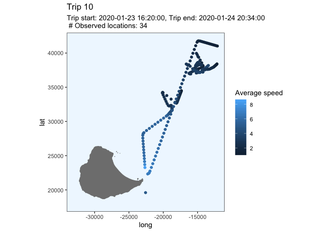<!-- --><!-- --><!-- -->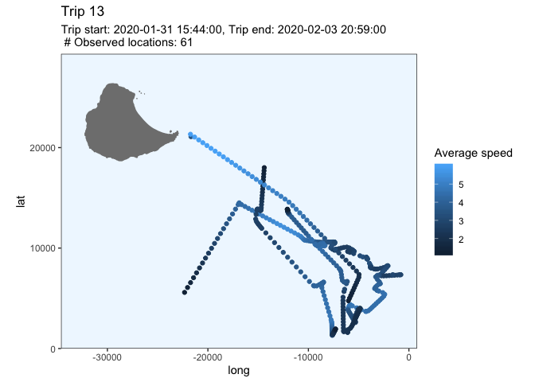<!-- -->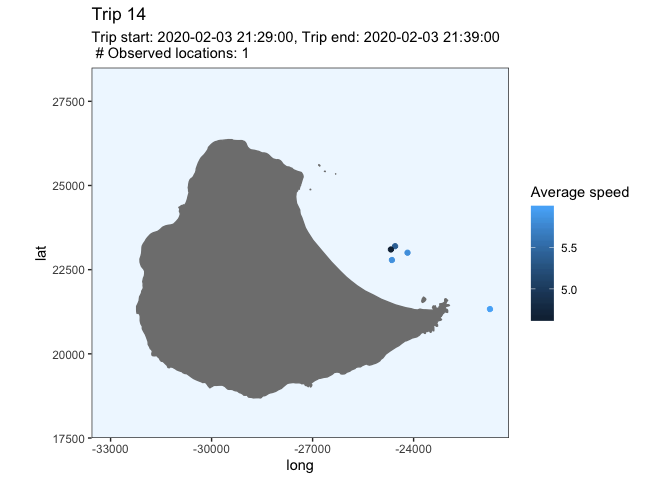<!-- --><!-- --><!-- -->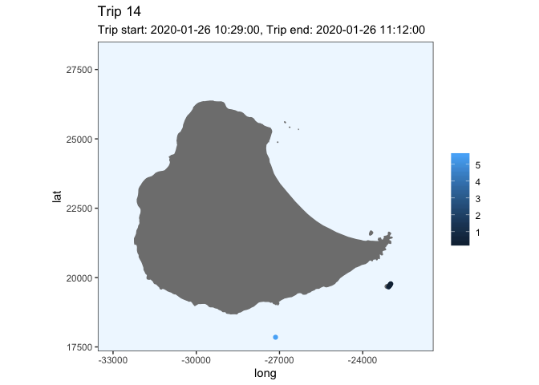<!-- --><!-- --><!-- --><!-- --><!-- --><!-- -->

Plot speed

``` r
# at_sea_df <- at_sea %>% 
#   sp::spTransform(crs("+init=epsg:4326")) %>%   
#   data.frame() %>%
#   dplyr::distinct(Time_absolute, .keep_all = TRUE) %>% 
#   dplyr::mutate(Distance = distHaversine(p1 = cbind(LON, LAT),                    # gives distance in meters
#                                   p2 = cbind(lag(LON), lag(LAT)),          # lag is a base r function that takes the next observation by default
#                                   r = 6362895)) %>%                        # r = radius of earth at 57.7 South
#   dplyr::mutate(Speed_ms = Distance / (diff1*60*60))   %>%                     # gives speed in m/s since diff1 is in decimal hours
#   dplyr::mutate(Speed_kph = (Distance/1000) / diff1)  %>%                       # speed in km per hour
#   dplyr::mutate(Avg_speed = slide_dbl(.$Speed_kph, ~mean(.x), .before = 36))
# 
# # Plot the average speed over time
# ggplot(data = at_sea_df, aes(x=Time_absolute, y=Avg_speed, group = Ptt)) +
#   geom_line() + 
#   xlab("") + 
#   scale_y_continuous(breaks=seq(0,10,0.5)) +
#   geom_hline(yintercept=1, 
#              linetype="dashed", 
#              color = "red")
```

Maybe a cut-off of something slightly above one is needed
here?

### Penguin - 196707

``` r
predObj <- read.csv("predicted_tracks/196707_track.csv", stringsAsFactors = FALSE) 

# select the useful columns and rename
track <- predObj %>%  
  select(Ptt, Time_absolute, Time_since, mu.x, mu.y) %>% 
  rename(LON = mu.x, LAT = mu.y)

plot_track(track)
```

<!-- -->

``` r
at_sea <- remove_points_on_land(track)

# plot to make sure it worked
at_sea %>% 
    data.frame() %>% 
    plot_track(.) 
```

<!-- -->

``` r
at_sea <- split_into_trips(at_sea)
# head(at_sea) %>% kable()
# tail(at_sea) %>% kable()

Start_row_indexes <- as.list(which(at_sea$Start_trip == TRUE))    # need this for plot_trips() function

plots <- at_sea %>% 
  data.frame() %>%                  # convert to dataframe
  distinct(Trip) %>%                # find number of trips
  deframe() %>%                     # change to vector to pass to map
  purrr::map(., ~plot_trip(.x))

invisible(lapply(plots, print))
```

<!-- --><!-- --><!-- -->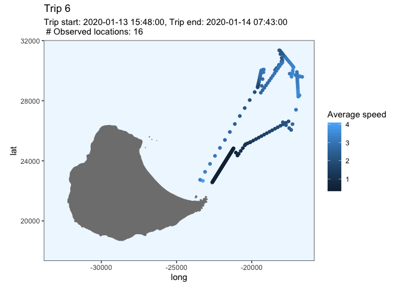<!-- -->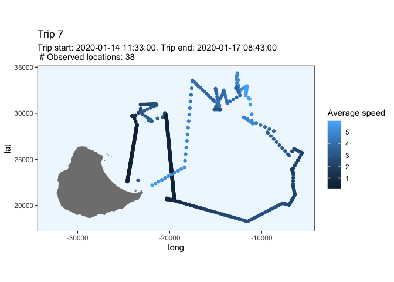<!-- --><!-- --><!-- --><!-- -->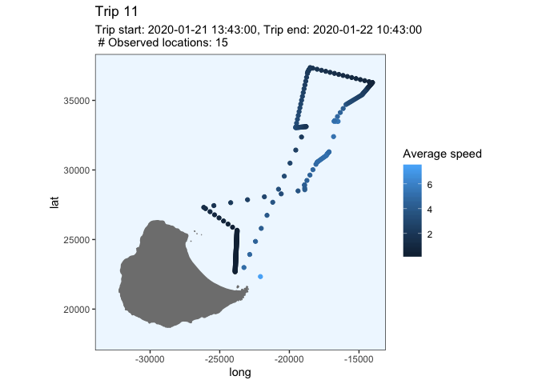<!-- -->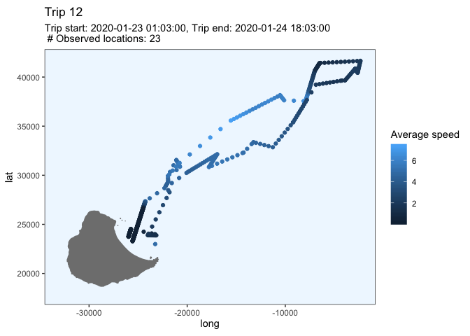<!-- --><!-- -->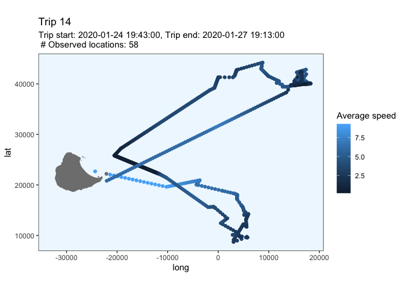<!-- --><!-- -->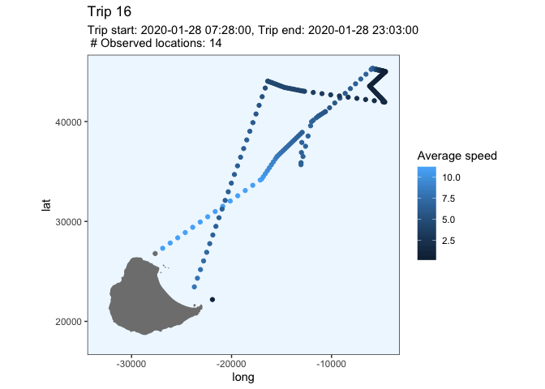<!-- --><!-- -->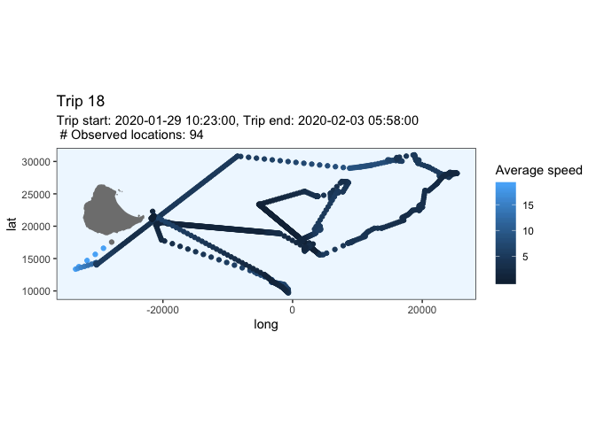<!-- --><!-- --><!-- --><!-- -->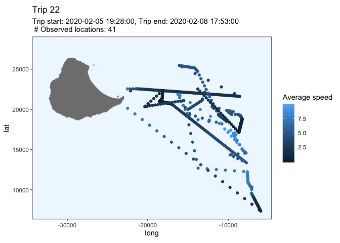<!-- --><!-- --><!-- -->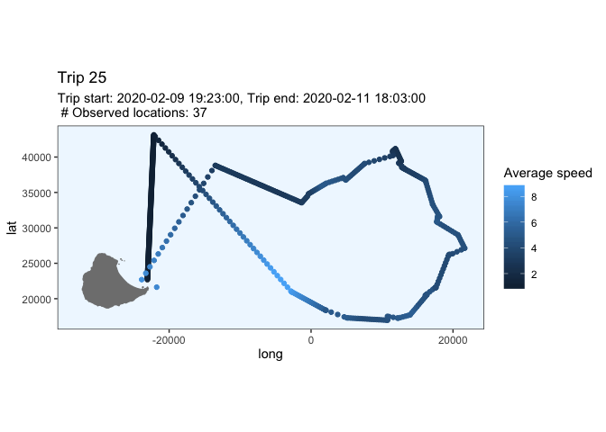<!-- --><!-- -->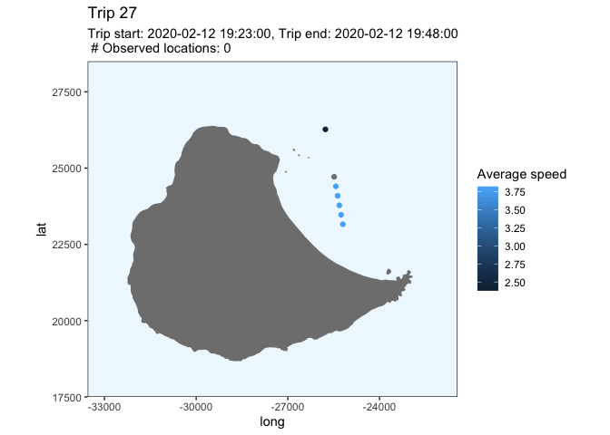<!-- --><!-- --><!-- --><!-- --><!-- --><!-- -->

Plot speed

``` r
# at_sea_df <- at_sea %>% 
#   sp::spTransform(crs("+init=epsg:4326")) %>%   
#   data.frame() %>%
#   dplyr::distinct(Time_absolute, .keep_all = TRUE) %>% 
#   dplyr::mutate(Distance = distHaversine(p1 = cbind(LON, LAT),                    # gives distance in meters
#                                   p2 = cbind(lag(LON), lag(LAT)),          # lag is a base r function that takes the next observation by default
#                                   r = 6362895)) %>%                        # r = radius of earth at 57.7 South
#   dplyr::mutate(Speed_ms = Distance / (diff1*60*60))   %>%                     # gives speed in m/s since diff1 is in decimal hours
#   dplyr::mutate(Speed_kph = (Distance/1000) / diff1)  %>%                       # speed in km per hour
#   dplyr::mutate(Avg_speed = slide_dbl(.$Speed_kph, ~mean(.x), .before = 36))
# 
# #slice(which(row_number() %% 5 == 1))
# 
# # Plot the average speed over time
# ggplot(data = at_sea_df, aes(x=Time_absolute, y=Avg_speed, group = Ptt)) +
#   geom_line() + 
#   xlab("") + 
#   scale_y_continuous(breaks=seq(0,10,0.5)) +
#   geom_hline(yintercept=1, 
#              linetype="dashed", 
#              color = "red")
```

## Questions

1.  Is 30 minutes on land a good cut-off or are short trips being
    missed? I should think about this later after sorting out question
    2.

2.  How do I deal with the fact that when the bird is most likely on
    land, the crawled tracks often show it moving slowly away from the
    colony? Should I remove parts of the track when the speed is very
    slow? How would I calculate the speed of the bird?

3.  Is it ok to delete some of the short trips which are clearly just
    the result of an inaccurate fix? Is there a rule of thumb to follow
    for keeping trips that look real (e.g. the have some wiggles in
    them?) and deleting the bad stuff?
