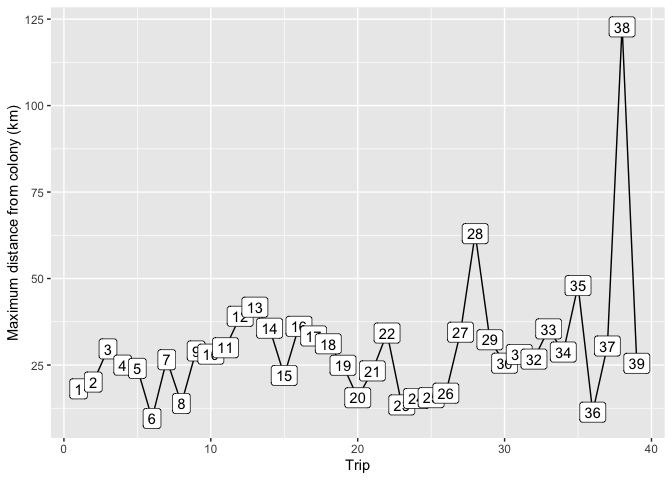

Discarding pre-moult foraging trips
================
Gemma Clucas
2/22/2021

With this code, I am going to exclude any pre-moult foraging trips from
each individual’s data. We don’t have enough of these pre-moult trips to
model them, so we are going to constrain our analysis to the
chick-rearing period.

To discard the pre-moult trips, I am plotting the maximum distance that
the individual went from the colony during each foraging trip. Since the
pre-moult trips go considerably further offshore than the chick-rearing
trips (as they are no longer contrained by having to return to the
colony), it is then easy to distinguish the pre-moult trip from
chick-rearing foraging trips.

### Read in trimmed tracking data

This csv file has the data from all Ptts after splitting into trips,
removing low-speed sections of trips, and removing duff trips with only
1 observed
fix.

``` r
All <- read.csv("Trimmed_trips/All_trimmed_trips.csv", stringsAsFactors = FALSE)
```

### Estimate distance from colony and plot

For each point, estimate the distance from the colony, find the max
distance for each trip, and plot these max distances.

``` r
plot_distance <- function(x, penguin){
  # select penguin
  x <- x %>% filter(Ptt == penguin)
  # Make it spatial
  coordinates(x) <- ~LON + LAT
  proj4string(x) <- CRS("+proj=laea +lon_0=-26 +lat_0=-58 +units=m")
  # Reproject to WGS84
  x <- spTransform(x, CRS = CRS("+proj=longlat +ellps=WGS84"))
  # calculate distance between current point and the colony, in metres
  x <- x %>% 
    data.frame() %>% 
    dplyr::mutate(Distance_from_colony = distHaversine(p1 = cbind(LON, LAT),    
                                                       p2 = cbind(-26.401944, -57.808056),   # colony location in decimal degrees
                                                       r = 6362895))
  # Find max distance from colony for each trip and plot
  x %>% group_by(Trip) %>% 
    summarise(Max_dist = max(Distance_from_colony)) %>% 
    ggplot(aes(x = Trip, y = Max_dist/1000, label = Trip)) + 
    geom_line() +
    geom_label() +
    ylab("Maximum distance from colony (km)")
}
```

## Run through each penguin

### 196697

``` r
penguin <- 196697
plot_distance(All, penguin)
```

<!-- -->

``` r
# Define trip(s) to remove
remove <- 17

# Remove those trips
chick_rearing_df <- All %>% 
  filter(Ptt == penguin & Trip != remove) 

# Save to df and csv
assign(paste0("chick-rearing_", penguin), chick_rearing_df) %>% 
   write.csv(., paste0("Chick-rearing_trips/", penguin, "_chick-rearing.csv", sep = ""), row.names = FALSE)

# replot distance to check it worked
plot_distance(chick_rearing_df, penguin)
```

<!-- -->

### 196698

``` r
penguin <- 196698
plot_distance(All, penguin)
```

<!-- -->

``` r
# Define trip(s) to remove
remove <- 12

# Remove those trips
chick_rearing_df <- All %>% 
  filter(Ptt == penguin & Trip != remove) 

# Save to df and csv
assign(paste0("chick-rearing_", penguin), chick_rearing_df) %>% 
   write.csv(., paste0("Chick-rearing_trips/", penguin, "_chick-rearing.csv", sep = ""), row.names = FALSE)

# replot distance to check it worked
plot_distance(chick_rearing_df, penguin)
```

<!-- -->

### 196699

``` r
penguin <- 196699
plot_distance(All, penguin)
```

<!-- -->

No pre-moult trips captured for this individual so simply save as csv.

``` r
# Save 
chick_rearing_df <- All %>% 
  filter(Ptt == penguin) 

# Save to df and csv
assign(paste0("chick-rearing_", penguin), chick_rearing_df) %>% 
   write.csv(., paste0("Chick-rearing_trips/", penguin, "_chick-rearing.csv", sep = ""), row.names = FALSE)
```

### 196700

``` r
penguin <- 196700
plot_distance(All, penguin)
```

<!-- -->

No pre-moult trips captured for this individual so simply save as csv.

``` r
# Save 
chick_rearing_df <- All %>% 
  filter(Ptt == penguin) 

# Save to df and csv
assign(paste0("chick-rearing_", penguin), chick_rearing_df) %>% 
   write.csv(., paste0("Chick-rearing_trips/", penguin, "_chick-rearing.csv", sep = ""), row.names = FALSE)
```

### 196701

``` r
penguin <- 196701
plot_distance(All, penguin)
```

<!-- -->

No pre-moult trips captured for this individual so simply save as csv.

``` r
# Save 
chick_rearing_df <- All %>% 
  filter(Ptt == penguin) 

# Save to df and csv
assign(paste0("chick-rearing_", penguin), chick_rearing_df) %>% 
   write.csv(., paste0("Chick-rearing_trips/", penguin, "_chick-rearing.csv", sep = ""), row.names = FALSE)
```

### 196702

``` r
penguin <- 196702
plot_distance(All, penguin)
```

<!-- -->

No pre-moult trips captured for this individual so simply save as csv.

``` r
# Save 
chick_rearing_df <- All %>% 
  filter(Ptt == penguin) 

# Save to df and csv
assign(paste0("chick-rearing_", penguin), chick_rearing_df) %>% 
   write.csv(., paste0("Chick-rearing_trips/", penguin, "_chick-rearing.csv", sep = ""), row.names = FALSE)
```

### 196703

``` r
penguin <- 196703
plot_distance(All, penguin)
```

<!-- -->

Only two trips captured, not pre-moult trips, so simply save and write
to csv.

``` r
# Save 
chick_rearing_df <- All %>% 
  filter(Ptt == penguin) 

# Save to df and csv
assign(paste0("chick-rearing_", penguin), chick_rearing_df) %>% 
   write.csv(., paste0("Chick-rearing_trips/", penguin, "_chick-rearing.csv", sep = ""), row.names = FALSE)
```

### 196704

``` r
penguin <- 196704
plot_distance(All, penguin)
```

<!-- -->

No pre-moult trips captured for this individual so simply save as csv.

``` r
# Save 
chick_rearing_df <- All %>% 
  filter(Ptt == penguin) 

# Save to df and csv
assign(paste0("chick-rearing_", penguin), chick_rearing_df) %>% 
   write.csv(., paste0("Chick-rearing_trips/", penguin, "_chick-rearing.csv", sep = ""), row.names = FALSE)
```

### 196705

``` r
penguin <- 196705
plot_distance(All, penguin)
```

<!-- -->

``` r
# Define trip(s) to remove
remove <- 32

# Remove those trips
chick_rearing_df <- All %>% 
  filter(Ptt == penguin & Trip != remove) 

# Save to df and csv
assign(paste0("chick-rearing_", penguin), chick_rearing_df) %>% 
   write.csv(., paste0("Chick-rearing_trips/", penguin, "_chick-rearing.csv", sep = ""), row.names = FALSE)

# replot distance to check it worked
plot_distance(chick_rearing_df, penguin)
```

<!-- -->

### 196706

``` r
penguin <- 196706
plot_distance(All, penguin)
```

<!-- -->

``` r
# Define trip(s) to remove
remove <- 28

# Remove those trips
chick_rearing_df <- All %>% 
  filter(Ptt == penguin & Trip != remove) 

# Save to df and csv
assign(paste0("chick-rearing_", penguin), chick_rearing_df) %>% 
   write.csv(., paste0("Chick-rearing_trips/", penguin, "_chick-rearing.csv", sep = ""), row.names = FALSE)

# replot distance to check it worked
plot_distance(chick_rearing_df, penguin)
```

<!-- -->

### 196707

``` r
penguin <- 196707
plot_distance(All, penguin)
```

<!-- -->

``` r
# Define trip(s) to remove
remove <- 31

# Remove those trips
chick_rearing_df <- All %>% 
  filter(Ptt == penguin & Trip != remove) 

# Save to df and csv
assign(paste0("chick-rearing_", penguin), chick_rearing_df) %>% 
   write.csv(., paste0("Chick-rearing_trips/", penguin, "_chick-rearing.csv", sep = ""), row.names = FALSE)

# replot distance to check it worked
plot_distance(chick_rearing_df, penguin)
```

<!-- -->

### 196708

``` r
penguin <- 196708
plot_distance(All, penguin)
```

<!-- -->

``` r
# Define trip(s) to remove
remove <- 38

# Remove those trips
chick_rearing_df <- All %>% 
  filter(Ptt == penguin & Trip != remove) 

# Save to df and csv
assign(paste0("chick-rearing_", penguin), chick_rearing_df) %>% 
   write.csv(., paste0("Chick-rearing_trips/", penguin, "_chick-rearing.csv", sep = ""), row.names = FALSE)

# replot distance to check it worked
plot_distance(chick_rearing_df, penguin)
```

<!-- -->

### 196709

``` r
penguin <- 196709
plot_distance(All, penguin)
```

<!-- -->

``` r
# Define trip(s) to remove
remove <- 28

# Remove those trips
chick_rearing_df <- All %>% 
  filter(Ptt == penguin & Trip != remove) 

# Save to df and csv
assign(paste0("chick-rearing_", penguin), chick_rearing_df) %>% 
   write.csv(., paste0("Chick-rearing_trips/", penguin, "_chick-rearing.csv", sep = ""), row.names = FALSE)

# replot distance to check it worked
plot_distance(chick_rearing_df, penguin)
```

<!-- -->

### 196710

``` r
penguin <- 196710
plot_distance(All, penguin)
```

<!-- -->

No pre-moult trips captured for this individual so simply save as csv.

``` r
# Save 
chick_rearing_df <- All %>% 
  filter(Ptt == penguin) 

# Save to df and csv
assign(paste0("chick-rearing_", penguin), chick_rearing_df) %>% 
   write.csv(., paste0("Chick-rearing_trips/", penguin, "_chick-rearing.csv", sep = ""), row.names = FALSE)
```

### 196711

``` r
penguin <- 196711
plot_distance(All, penguin)
```

<!-- -->

``` r
# Define trip(s) to remove
remove <- c(38,39)

# Since there are two trips to remove, create a notin operator (you can't simply use !%in%)
`%notin%` <- Negate(`%in%`)

# Remove those trips
chick_rearing_df <- All %>% 
  filter(Ptt == penguin & Trip %notin% remove)

# Save to df and csv
assign(paste0("chick-rearing_", penguin), chick_rearing_df) %>% 
   write.csv(., paste0("Chick-rearing_trips/", penguin, "_chick-rearing.csv", sep = ""), row.names = FALSE)

# replot distance to check it worked
plot_distance(chick_rearing_df, penguin)
```

<!-- -->

### 196712

``` r
penguin <- 196712
plot_distance(All, penguin)
```

<!-- -->

``` r
# Define trip(s) to remove
remove <- c(15,16)

# Since there are two trips to remove, create a notin operator (you can't simply use !%in%)
`%notin%` <- Negate(`%in%`)

# Remove those trips
chick_rearing_df <- All %>% 
  filter(Ptt == penguin & Trip %notin% remove)

# Save to df and csv
assign(paste0("chick-rearing_", penguin), chick_rearing_df) %>% 
   write.csv(., paste0("Chick-rearing_trips/", penguin, "_chick-rearing.csv", sep = ""), row.names = FALSE)

# replot distance to check it worked
plot_distance(chick_rearing_df, penguin)
```

<!-- -->

### 196713

``` r
penguin <- 196713
plot_distance(All, penguin)
```

<!-- -->

No pre-moult trips captured for this individual so simply save as csv.

``` r
# Save 
chick_rearing_df <- All %>% 
  filter(Ptt == penguin) 

# Save to df and csv
assign(paste0("chick-rearing_", penguin), chick_rearing_df) %>% 
   write.csv(., paste0("Chick-rearing_trips/", penguin, "_chick-rearing.csv", sep = ""), row.names = FALSE)
```

### 196714

``` r
penguin <- 196714
plot_distance(All, penguin)
```

<!-- -->

No pre-moult trips captured for this individual so simply save as csv.

``` r
# Save 
chick_rearing_df <- All %>% 
  filter(Ptt == penguin) 

# Save to df and csv
assign(paste0("chick-rearing_", penguin), chick_rearing_df) %>% 
   write.csv(., paste0("Chick-rearing_trips/", penguin, "_chick-rearing.csv", sep = ""), row.names = FALSE)
```

### 196715

``` r
penguin <- 196715
plot_distance(All, penguin)
```

<!-- -->

``` r
# Define trip(s) to remove
remove <- 23

# Remove those trips
chick_rearing_df <- All %>% 
  filter(Ptt == penguin & Trip != remove) 

# Save to df and csv
assign(paste0("chick-rearing_", penguin), chick_rearing_df) %>% 
   write.csv(., paste0("Chick-rearing_trips/", penguin, "_chick-rearing.csv", sep = ""), row.names = FALSE)

# replot distance to check it worked
plot_distance(chick_rearing_df, penguin)
```

<!-- -->

### 196716

``` r
penguin <- 196716
plot_distance(All, penguin)
```

<!-- -->

``` r
# Define trip(s) to remove
remove <- 35

# Remove those trips
chick_rearing_df <- All %>% 
  filter(Ptt == penguin & Trip != remove) 

# Save to df and csv
assign(paste0("chick-rearing_", penguin), chick_rearing_df) %>% 
   write.csv(., paste0("Chick-rearing_trips/", penguin, "_chick-rearing.csv", sep = ""), row.names = FALSE)

# replot distance to check it worked
plot_distance(chick_rearing_df, penguin)
```

<!-- -->

## Combine all individual csv files into one

``` r
# If an old version of the combined file already exists, delete it
f <- "Chick-rearing_trips/All_chick-rearing_trips.csv"
#Check its existence
if (file.exists(f)) {
  #Delete file if it exists
  file.remove(f)
}
```

    ## [1] TRUE

``` r
# define directory
data_dir <- "Chick-rearing_trips"

data_dir %>%
  fs::dir_ls() %>%              # list all files in the directory
  purrr::map_dfr(read_csv) %>% 
  write.csv(., file = "Chick-rearing_trips/All_chick-rearing_trips.csv", row.names = FALSE)
```
