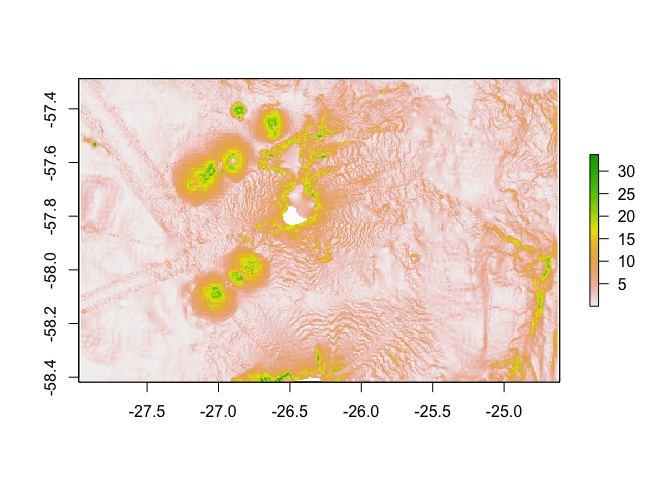
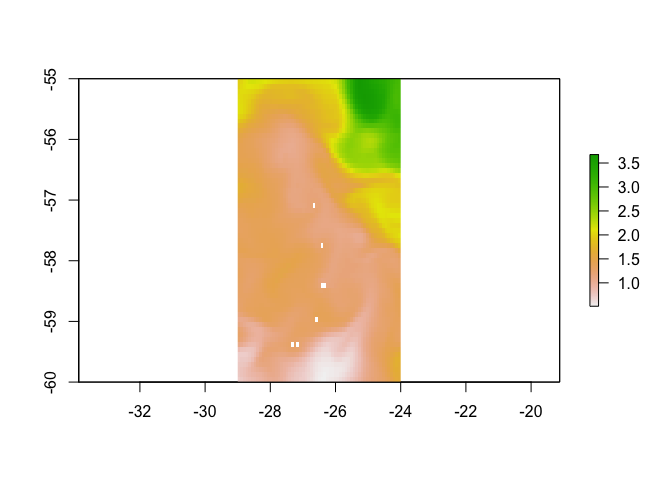

4 Environmental Data
================
Gemma Clucas
2/23/2021

## Load tracking data from chick-rearing period

Read it in and find the extent of the area covered - this will be the
study
area.

``` r
All <- read.csv("Chick-rearing_trips/All_chick-rearing_trips.csv", stringsAsFactors = FALSE)
# Keep one version as a dataframe
All.df <- All

# Make it spatial
coordinates(All) <- ~LON + LAT
proj4string(All) <- CRS("+proj=laea +lon_0=-26 +lat_0=-58 +units=m")
# Reproject to WGS84
All <- spTransform(All, CRS = CRS("+proj=longlat +ellps=WGS84"))

# Find the extent of the chick-rearing tracks
extent(All)
```

    ## class      : Extent 
    ## xmin       : -27.96598 
    ## xmax       : -24.623 
    ## ymin       : -58.41806 
    ## ymax       : -57.28708

What is the temporal distribution of the data? This isn’t working. I
can’t figure out why it won’t convert the characters in
`Time_absolute` to a datetime. Spent too much time on this already, come
back to it later.

``` r
# All.df %>%
#   dplyr::select("Time_absolute") %>% 
#   as.POSIXct(tz = "UTC")
# # lubridate also isn't working
#   lubridate::ymd_hms("Time_absolute", tz = "UTC")
```

## Create a raster of the study area with land masked

This just creates a raster with all values set to 1 across the study
area.

``` r
# Read in bathymetry raster and crop to extent
SSI_bath_WGS84 <- raster("ssi_geotif/full_ssi18a.tif") %>% 
  projectRaster(., crs=crs("+init=epsg:4326")) %>% 
  crop(., c(-27.96598, -24.623, -58.41806, -57.28708))

# Set all values to 1
x <- SSI_bath_WGS84
values(x) <- 1
```

Crop out land from the study area raster using `mask()`.

``` r
# Read in shapefile for land
SSI_WGS84 <- readOGR("Seamask.shp") %>% 
  crop(., c(450000, 1095192, -795043.9, -100000)) %>% 
  spTransform(., crs("+init=epsg:4326"))
```

    ## OGR data source with driver: ESRI Shapefile 
    ## Source: "/Users/gemmaclucas/GitHub/CHPE_Tracking_South_Sandwich_Islands/Seamask.shp", layer: "Seamask"
    ## with 1 features
    ## It has 1 fields

``` r
# Use mask() to cut out land from the raster
mask<-mask(x, SSI_WGS84, inverse=F)

# Plot to check
plot(mask)
```

<!-- -->

## Sample the raster layer to create ‘background’ points

This just creates a random sample of ‘background’ points across the
study area raster. It takes a little while for this to run, so I have
saved the dataframe as a CSV and just read it in each time for
efficiency.

``` r
# birds<-unique(All$Ptt)
# background<-data.frame()
# i<-birds[1]
# #RUN THROUGH EACH BIRD IN TURN
# for(i in birds){
#   bird<-All[All$Ptt==i,] #subset 1 bird
#   back <- randomPoints(mask, n = (nrow(bird)) ,prob=F) # this was originally 3*nrow
#   dat<-as.data.frame(back)
#   head(dat)
#   names(dat)<-c("Lon","Lat")
#   dat$bird<-i
#   background<-rbind(background,dat)
# }
# head(background)
# 
# write.csv(background, "background_points.csv", sep = "", row.names = FALSE)

background <- read.csv("background_points.csv", stringsAsFactors = FALSE)

# Plot the points to check
as.data.frame(mask, xy = TRUE) %>%
  ggplot() +
  geom_raster(aes(x=x, y=y)) +
  geom_point(data = background, aes(x=Lon, y=Lat)) +
  ylab("Latitude") +
  xlab("Longitude")
```

<!-- -->

## Bathymetry

I’ve already read in the bathymetry raster, so I’m just masking land and
plotting.

``` r
# Use mask() to cut out land from the bathymetry raster
# values(SSI_bath_WGS84) <- 1
bathy_mask<-mask(SSI_bath_WGS84, SSI_WGS84, inverse=F)

# Make a plot using the marmap package
dat <- marmap::as.bathy(bathy_mask)
autoplot(dat, geom=c("raster", "contour"), coast = FALSE, colour="white", size=0.1) + 
  scale_fill_gradient(low = "steelblue4", high = "lightblue") +
  ylab("Latitude") +
  xlab("Longitude") +
  labs(fill = "Depth") 
```

<!-- -->

``` r
  # xlim(c(-26.5, -26.35)) +
  # ylim(c(-57.875, -57.79))
```

## Distance from the colony

``` r
colony_lat<- -57.808 
colony_lon<- -26.404

# Find the colony cell in the study area raster
j <- cellFromXY(mask, cbind(colony_lon, colony_lat))
# Change the value of the cell where the colony is to 2 (all the other cells are 1)
mask[j]<-2 

# Check it worked
# table(values(mask)) 

# Create a distance raster from the colony
# Moving through land is prevented by omiting cells with NA values
dist<-gridDistance(mask, origin=2, omit=NA)
plot(dist)
```

<!-- -->

``` r
plot(dist, xlim = c(-26.6, -26.2), ylim = c(-57.9, -57.7))
```

<!-- -->

The zoomed in plot shows that the distance raster does take into account
land, when calculating at sea distances.

## Distance to shelf break

Firstly, view shelf break around the
island.

``` r
# plotting using metR package - can't figure out how to make it label all contour lines
autoplot(dat, geom=c("raster"), coast = FALSE, colour="white", size=0.1) + 
  scale_fill_gradient(low = "steelblue4", high = "lightblue") +
  geom_contour(data = as.data.frame(bathy_mask, xy = TRUE), 
               aes(x=x, y=y, z = full_ssi18a), 
               colour = "white",
               binwidth = 100) +
  geom_text_contour(data = as.data.frame(bathy_mask, xy = TRUE), 
                    aes(z = full_ssi18a), 
                    stroke = 0.2, 
                    skip = 0,
                    label.placement = label_placement_flattest(2)) +
  ylab("Latitude") +
  xlab("Longitude") +
  labs(colour = "Depth") +
  xlim(c(-26.7, -26.2)) +
  ylim(c(-57.9, -57.6))
```

<!-- -->

It seems like the shelf break occurs at around 500 - 1000m depth.

Make a raster that includes the distance to the shelf break from all
points in the study area.

``` r
# first draw contours every 50m
contours <- rasterToContour(bathy_mask, nlevels = 92)
# plot(bathy_mask)
# plot(contours, add=TRUE)

# select just the 750m depth contour
contour750 <- contours[contours@data$level == -750, ]

# check the contour and the study area raster have the same projection
# crs(contour750)
# crs(mask)
# yes they do

# Make the SpatialLinesDataFrame (contour750) into a raster with the same characteristics as the study area raster (mask)
# Set the contour pixels to 1, all others should be NA
r750 <- rasterize(contour750, mask, field = 1, background = NA)

# Calculate the distance to the nearest non-NA cell
shelfdist <- raster::distance(r750)

# Mask the land
shelfdist <- mask(shelfdist, SSI_WGS84, inverse=F)
plot(shelfdist)
```

<!-- -->

## Bearing to the shelf break

``` r
# get the values from the distance to colony raster along the 750m depth contour and find the minimum value
# i.e. the minimum distance of the depth contour from the colony
min750dist <- raster::extract(dist,contour750) %>% 
  unlist() %>% 
  min()

# Change the raster into a dataframe, so that we can extract the coordinates of this minimum point
as.data.frame(rasterToPoints(dist)) %>% 
  dplyr::filter(layer == min750dist) %>% 
  select(x,y)
```

    ##           x         y
    ## 1 -26.34801 -57.82869

``` r
# So these are the coordinates of the nearest bit of shelf break
shelf_lon <- -26.34801
shelf_lat <- -57.82869  

bearing <- geosphere::bearingRhumb(c(colony_lon, colony_lat), c(shelf_lon, shelf_lat))
```

So the bearing to the nearest bit of shelf is 124.7535463 (southeast)
but if you look down to the density plot below, the penguins tend to go
due east from the colony.

Next step would be to work out the bearing to this nearest bit of shelf
break from every fix (and background point). But if they don’t seem to
be honing in on this anyway, is it worth it?

## GLOBAL-ANALYSIS-FORECAST-PHY-001-024-MONTHLY Dataset

I have downloaded the monthly averaged dataset for January 2020
(1/16/2020) from
<https://resources.marine.copernicus.eu/?option=com_csw&view=details&product_id=GLOBAL_ANALYSIS_FORECAST_PHY_001_024>

I have selected seven variables (but I probably don’t need them all) and
subsetted the area from -60 to -55 lat, and -29 to -25 lon. The
variables in the dataset are: 1. mlotst = Density ocean mixed layer
thickness 2. vo = Northward sea water velocity 3. thetao = Sea water
potential temperature 4. uo = Eastward sea water velocity 5. bottomT =
Sea water potential temperature at sea floor 6. so = Salinity 7. zos =
Sea surface height above geoid

There are 50 depth layers from 0.49m (surface) to 5727m. The data format
is netCDF-3 and the CRS is WGS 84 (EPSG 4326). The resolution should be
a 0.083 x 0.083 degree grid.

I am following instructions from [this
site](https://rpubs.com/boyerag/297592) to import the data into R.

``` r
library(ncdf4) # package for netcdf manipulation

nc_data <- nc_open('global-analysis-forecast-phy-001-024-monthly_1615738967905.nc')

# Save the print(nc) dump to a text file
# This shows all the variable names and the dimensions of the data
{
    sink('global-analysis-forecast-phy-001-024-monthly_1615738967905.txt')
 print(nc_data)
    sink()
}
```

Read in the long/lat data.

``` r
nc_lon <- ncvar_get(nc_data, "longitude")
nc_lat <- ncvar_get(nc_data, "latitude", verbose = F)
```

### Sea surface temperature

``` r
# Read in the temperature variable as an array
temp.array <- ncvar_get(nc_data, "thetao")
# There should be 49 longitudes, 61 latitudes, and 50 depth layers
dim(temp.array) 
```

    ## [1] 49 61 50

Take the surface depth i.e. the top slice of the depth data.

``` r
surface.temp <- temp.array[, , 1] 
```

Save it as a raster. It needs to be transposed and
flipped.

``` r
SST <- raster(t(surface.temp), xmn=min(nc_lon), xmx=max(nc_lon), ymn=min(nc_lat), ymx=max(nc_lat), crs=crs("+init=epsg:4326"))
SST <- flip(SST, direction='y')
# mask land - I don't think the two rasters are quite matching up
SST <- mask(SST, SSI_WGS84, inverse=F)
#plot(SST)
```

Zoom in on study
area.

``` r
plot(SST, xlim = c(-27.96598, -24.623), ylim = c(-58.41806, -57.28708))
```

<!-- -->
It’s very blocky…

### Sea surface height

``` r
# Read in the variable as an array
zos.array <- ncvar_get(nc_data, "zos")
# There should be 49 longitudes and 61 latitudes
dim(zos.array) 
```

    ## [1] 49 61

Save it as a raster. It needs to be transposed and
flipped.

``` r
SS_height <- raster(t(zos.array), xmn=min(nc_lon), xmx=max(nc_lon), ymn=min(nc_lat), ymx=max(nc_lat), crs=crs("+init=epsg:4326"))
SS_height <- flip(SS_height, direction='y')
# mask land - I don't think the two rasters are quite matching up
SS_height <- mask(SS_height, SSI_WGS84, inverse=F)
#plot(SS_height)
```

Zoom in on study
area.

``` r
plot(SS_height, xlim = c(-27.96598, -24.623), ylim = c(-58.41806, -57.28708))
```

<!-- -->

## Water velocity

``` r
north.array <- ncvar_get(nc_data, "vo")
# take surface values
north.array <- north.array[, , 1] 

east.array <- ncvar_get(nc_data, "uo")
# take surface values
east.array <- east.array[, , 1]

north_velocity <- raster(t(north.array), xmn=min(nc_lon), xmx=max(nc_lon), ymn=min(nc_lat), ymx=max(nc_lat), crs=crs("+init=epsg:4326"))
north_velocity <- flip(north_velocity, direction='y')
north_velocity <- mask(north_velocity, SSI_WGS84, inverse=F)

east_velocity <- raster(t(east.array), xmn=min(nc_lon), xmx=max(nc_lon), ymn=min(nc_lat), ymx=max(nc_lat), crs=crs("+init=epsg:4326"))
east_velocity <- flip(east_velocity, direction='y')
east_velocity <- mask(east_velocity, SSI_WGS84, inverse=F)

plot(north_velocity, xlim = c(-27.96598, -24.623), ylim = c(-58.41806, -57.28708))
```

<!-- -->

``` r
plot(east_velocity, xlim = c(-27.96598, -24.623), ylim = c(-58.41806, -57.28708))
```

<!-- -->

## Messing around with KDEs and density plots

This should go in a separate script really and is not finished. I just
wanted to be able to view the density of fixes when thinking about
environmental variables.

Can use this to formally calculate a KDE and plot

``` r
library(spatialEco)
kde <- sp.kde(All, bw = 0.01, 
              nr = 50,
              nc = 50,
              standardize = TRUE)

ggplot(data = as.data.frame(kde, xy = TRUE), aes(x=x, y=y)) +
  geom_contour_fill(aes(z = kde)) +
  #scale_fill_gradient(low = "yellow", high = "red") +
  scale_alpha(range = c(0.00, 0.5), guide = FALSE) 
```

<!-- -->

Or you can just plot the density directly from the
`SpatialPointsDataFrame` using `stat_density2d()`.

Plotting on top of bathymetry
map

``` r
autoplot(dat, geom=c("raster", "contour"), coast = FALSE, colour="white", size=0.1) + 
  scale_fill_gradient(low = "steelblue4", high = "lightblue") +
  ylab("Latitude") +
  xlab("Longitude") +
  labs(fill = "Depth") +
  stat_density2d(data = as.data.frame(All),
                 aes(x = LON, y = LAT, alpha = ..level..), 
                 geom = "polygon", 
                 fill = "red") +
  scale_alpha(range=c(0.2,0.9),guide=FALSE)
```

<!-- -->

## Other things

Look at google earth engine for SST/chlorophylA:
<https://developers.google.com/earth-engine/datasets/catalog/NASA_OCEANDATA_MODIS-Terra_L3SMI>

VICKY USES MARINE COPERNICUS FOR THIS. START WITH SST AND CHLORA, BUT
CAN ALSO LOOK AT EDDY KINETIC ENERGY AND SEA SURFACE HEIGHT ANOMOLY.
