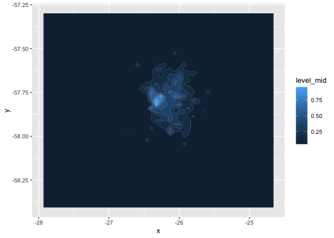
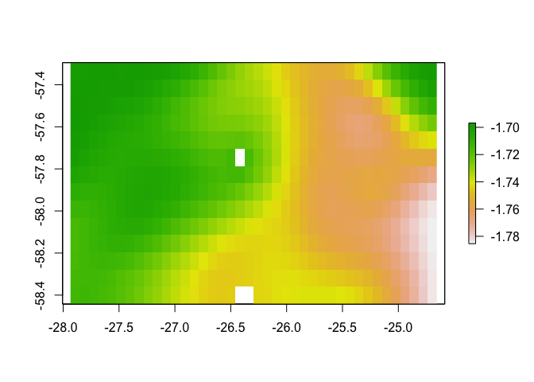
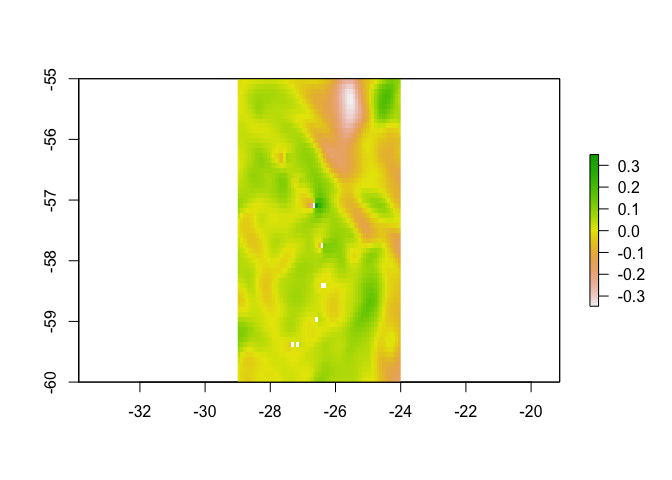
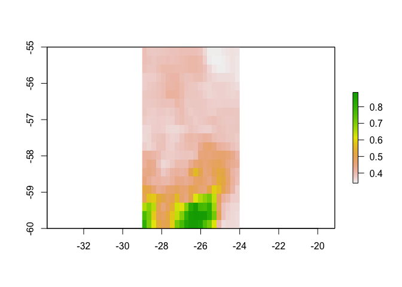

4 Environmental Data
================
Gemma Clucas
2/23/2021

## Load tracking data from chick-rearing period

Read it in and find the extent of the area covered - this will be the
study
area.

``` r
All <- read.csv("Chick-rearing_trips/All_chick-rearing_trips.csv", stringsAsFactors = FALSE)
# Keep one version as a dataframe
All.df <- All

# Make it spatial
coordinates(All) <- ~LON + LAT
proj4string(All) <- CRS("+proj=laea +lon_0=-26 +lat_0=-58 +units=m")
# Reproject to WGS84
All <- spTransform(All, CRS = CRS("+proj=longlat +ellps=WGS84"))

# Find the extent of the chick-rearing tracks
extent(All)
```

    ## class      : Extent 
    ## xmin       : -27.96598 
    ## xmax       : -24.623 
    ## ymin       : -58.41806 
    ## ymax       : -57.28708

What is the temporal distribution of the data? I had to add a new column
to the dataframe to convert `Time_absolute` to real datetimes.

``` r
All.df <- All.df %>%
  mutate(datetime = lubridate::ymd_hms(Time_absolute))

ggplot(data = All.df) +
  geom_density(aes(x = datetime), fill = "skyblue", colour = "skyblue") +
  ylab("Density of observations") +
  xlab("Date")
```

<!-- -->

So there are quite a few observations in February. How many?

``` r
# Add column for month
All.df <- All.df %>% mutate(month = lubridate::month(datetime))

n_obs <- nrow(All.df)
All.df %>% group_by(month) %>% 
  summarise(n = n(),
            proportion = n/n_obs) %>% 
  kable()
```

| month |     n | proportion |
| ----: | ----: | ---------: |
|     1 | 55468 |  0.6395185 |
|     2 | 31266 |  0.3604815 |

If 64% of the observations are in January and 36% are in February, then
I should probably calculate a weighted average for the environmental
variables (SST, sea surface height, velocity, chlorophyll a) for January
and February.

## Create a raster of the study area with land masked

This just creates a raster with all values set to 1 across the study
area.

``` r
# Read in bathymetry raster and crop to extent
SSI_bath_WGS84 <- raster("ssi_geotif/full_ssi18a.tif") %>% 
  projectRaster(., crs=crs("+init=epsg:4326")) %>% 
  crop(., c(-27.96598, -24.623, -58.41806, -57.28708))

# Set all values to 1
x <- SSI_bath_WGS84
values(x) <- 1
```

Crop out land from the study area raster using `mask()`.

``` r
# Read in shapefile for land
SSI_WGS84 <- readOGR("Seamask.shp") %>% 
  crop(., c(450000, 1095192, -795043.9, -100000)) %>% 
  spTransform(., crs("+init=epsg:4326"))
```

    ## OGR data source with driver: ESRI Shapefile 
    ## Source: "/Users/gemmaclucas/GitHub/CHPE_Tracking_South_Sandwich_Islands/Seamask.shp", layer: "Seamask"
    ## with 1 features
    ## It has 1 fields

``` r
# Use mask() to cut out land from the raster
mask<-mask(x, SSI_WGS84, inverse=F)

# Plot to check
plot(mask)
```

<!-- -->

## Sample the raster layer to create ‘background’ points

This just creates a random sample of ‘background’ points across the
study area raster. It takes a little while for this to run, so I have
saved the dataframe as a CSV and just read it in each time for
efficiency.

``` r
# birds<-unique(All$Ptt)
# background<-data.frame()
# i<-birds[1]
# #RUN THROUGH EACH BIRD IN TURN
# for(i in birds){
#   bird<-All[All$Ptt==i,] #subset 1 bird
#   back <- randomPoints(mask, n = (nrow(bird)) ,prob=F) # this was originally 3*nrow
#   dat<-as.data.frame(back)
#   head(dat)
#   names(dat)<-c("Lon","Lat")
#   dat$bird<-i
#   background<-rbind(background,dat)
# }
# head(background)
# 
# write.csv(background, "background_points.csv", sep = "", row.names = FALSE)

background <- read.csv("background_points.csv", stringsAsFactors = FALSE)

# Plot the points to check
as.data.frame(mask, xy = TRUE) %>%
  ggplot() +
  geom_raster(aes(x=x, y=y)) +
  geom_point(data = background, aes(x=Lon, y=Lat)) +
  ylab("Latitude") +
  xlab("Longitude")
```

<!-- -->

``` r
# Make it spatial
coordinates(background) <- ~Lon + Lat
proj4string(background) <- CRS("+proj=longlat +ellps=WGS84")
```

## Bathymetry

I’ve already read in the bathymetry raster, so I’m just masking land and
plotting.

``` r
# Use mask() to cut out land from the bathymetry raster
# values(SSI_bath_WGS84) <- 1
bathy_mask<-mask(SSI_bath_WGS84, SSI_WGS84, inverse=F)

# Make a plot using the marmap package
dat <- marmap::as.bathy(bathy_mask)
autoplot(dat, geom=c("raster", "contour"), coast = FALSE, colour="white", size=0.1) + 
  scale_fill_gradient(low = "steelblue4", high = "lightblue") +
  ylab("Latitude") +
  xlab("Longitude") +
  labs(fill = "Depth") 
```

<!-- -->

``` r
  # xlim(c(-26.5, -26.35)) +
  # ylim(c(-57.875, -57.79))
```

Sample the bathymetry layer to add the depth to each background and
observed fix.

``` r
All$depth <- raster::extract(bathy_mask, All)
background$depth <- raster::extract(bathy_mask, background)
```

## Messing around with KDEs and density plots

This should go in a separate script really and is not finished. I just
wanted to be able to view the density of fixes when thinking about
environmental variables.

Can use this to formally calculate a KDE and plot

``` r
library(spatialEco)
kde <- sp.kde(All, bw = 0.01, 
              nr = 50,
              nc = 50,
              standardize = TRUE)

ggplot(data = as.data.frame(kde, xy = TRUE), aes(x=x, y=y)) +
  geom_contour_fill(aes(z = kde)) +
  #scale_fill_gradient(low = "yellow", high = "red") +
  scale_alpha(range = c(0.00, 0.5), guide = FALSE) 
```

<!-- -->

Or you can just plot the density directly from the
`SpatialPointsDataFrame` using `stat_density2d()`.

Plotting on top of bathymetry
map

``` r
autoplot(dat, geom=c("raster", "contour"), coast = FALSE, colour="white", size=0.1) + 
  scale_fill_gradient(low = "steelblue4", high = "lightblue") +
  ylab("Latitude") +
  xlab("Longitude") +
  labs(fill = "Depth") +
  stat_density2d(data = as.data.frame(All),
                 aes(x = LON, y = LAT, alpha = ..level..), 
                 geom = "polygon", 
                 fill = "red") +
  scale_alpha(range=c(0.2,0.9),guide=FALSE)
```

<!-- -->

## Distance from the colony

``` r
colony_lat<- -57.808 
colony_lon<- -26.404

# Find the colony cell in the study area raster
j <- cellFromXY(mask, cbind(colony_lon, colony_lat))
# Change the value of the cell where the colony is to 2 (all the other cells are 1)
mask[j]<-2 

# Check it worked
# table(values(mask)) 

# Create a distance raster from the colony
# Moving through land is prevented by omiting cells with NA values
dist <- gridDistance(mask, origin=2, omit=NA)
plot(dist)
```

<!-- -->

``` r
plot(dist, xlim = c(-26.6, -26.2), ylim = c(-57.9, -57.7))
```

<!-- -->

The zoomed in plot shows that the distance raster does take into account
land when calculating at sea distances.

Sample the distance layer to add the distance to the colony for each
background and observed fix.

``` r
All$colonydist <- raster::extract(dist, All)
background$colonydist <- raster::extract(dist, background)
```

## Distance to shelf break

Firstly, view shelf break around the
island.

``` r
# plotting using metR package - can't figure out how to make it label all contour lines
autoplot(dat, geom=c("raster"), coast = FALSE, colour="white", size=0.1) + 
  scale_fill_gradient(low = "steelblue4", high = "lightblue") +
  geom_contour(data = as.data.frame(bathy_mask, xy = TRUE), 
               aes(x=x, y=y, z = full_ssi18a), 
               colour = "white",
               binwidth = 100) +
  geom_text_contour(data = as.data.frame(bathy_mask, xy = TRUE), 
                    aes(z = full_ssi18a), 
                    stroke = 0.2, 
                    skip = 0,
                    label.placement = label_placement_flattest(2)) +
  ylab("Latitude") +
  xlab("Longitude") +
  labs(colour = "Depth") +
  xlim(c(-26.7, -26.2)) +
  ylim(c(-57.9, -57.6))
```

<!-- -->

It seems like the shelf break occurs at around 500 - 1000m depth.

Make a raster that includes the distance to the shelf break from all
points in the study area. Doing this takes a while, so I have commented
out the code that I used and just read in the resulting raster below.

``` r
# first draw contours every 50m
contours <- rasterToContour(bathy_mask, nlevels = 92)

# select just the 750m depth contour
contour750 <- contours[contours@data$level == -750, ]
# 
# # check the contour and the study area raster have the same projection
# # crs(contour750)
# # crs(mask)
# # yes they do
# 
# # Make the SpatialLinesDataFrame (contour750) into a raster with the same characteristics as the study area raster (mask)
# # Set the contour pixels to 1, all others should be NA
# r750 <- rasterize(contour750, mask, field = 1, background = NA)
# 
# # Calculate the distance to the nearest non-NA cell
# shelfdist <- raster::distance(r750)
# 
# # Mask the land
# shelfdist <- mask(shelfdist, SSI_WGS84, inverse=F)
# plot(shelfdist)
# 
# writeRaster(shelfdist, filename = "Shelfdist_raster", format = "raster")
```

Read in the raster and plot.

``` r
shelfdist <- raster("Shelfdist_raster.grd")
plot(shelfdist)
```

<!-- -->

Sample the distance layer to add the distance to the colony for each
background and observed fix.

``` r
All$shelfdist <- raster::extract(shelfdist, All)
background$shelfdist <- raster::extract(shelfdist, background)
```

## Bearing to the shelf break

``` r
# get the values from the distance to colony raster along the 750m depth contour and find the minimum value
# i.e. the minimum distance of the depth contour from the colony
min750dist <- raster::extract(dist,contour750) %>% 
  unlist() %>% 
  min()

# Change the raster into a dataframe, so that we can extract the coordinates of this minimum point
as.data.frame(rasterToPoints(dist)) %>% 
  dplyr::filter(layer == min750dist) %>% 
  select(x,y)
```

    ##           x         y
    ## 1 -26.34801 -57.82869

``` r
# So these are the coordinates of the nearest bit of shelf break
shelf_lon <- -26.34801
shelf_lat <- -57.82869  

bearing <- geosphere::bearingRhumb(c(colony_lon, colony_lat), c(shelf_lon, shelf_lat))
```

So the bearing to the nearest bit of shelf is 124.7535463 (southeast)
but if you look down to the density plot below, the penguins tend to go
due east from the colony -\> not worth including the bearing to the
colony in our gams.

## Slope

With the `terrain()` function, it seems like the number or neighbours
can be either 4 or 8. According to the function description, 4 is better
for smooth surfaces while 8 is better for rough. Given the scale of our
study area, I would guess that it’s relatively smooth since it’s
covering a very big distance, so I’m going to use 4. I ran with 8 and
the plot looked almost identical, so I don’t think it will make a
difference either way
anyway.

``` r
slope4 <- terrain(x = bathy_mask, opt = "slope", unit = 'degrees', neighbours = 4)

plot(slope4)
```

<!-- -->

Add the slope for each point to the the observed and background data.

``` r
All$slope <- raster::extract(slope4, All)
background$slope <- raster::extract(slope4, background)
```

## Physical Oceanographic Variables Downloaded from the Copernicus Marine Service

I have downloaded the GLOBAL-ANALYSIS-FORECAST-PHY-001-024-MONTHLY
dataset for January and February 2020 (monthly averages) from
<https://resources.marine.copernicus.eu/?option=com_csw&view=details&product_id=GLOBAL_ANALYSIS_FORECAST_PHY_001_024>

I have selected seven variables (but I probably don’t need them all) and
subsetted the area from -60 to -55 lat, and -29 to -24 lon. The
variables in the dataset are:

1.  mlotst - Density ocean mixed layer thickness
2.  vo - Northward sea water velocity
3.  thetao - Sea water potential temperature
4.  uo - Eastward sea water velocity
5.  bottomT - Sea water potential temperature at sea floor
6.  so - Salinity
7.  zos - Sea surface height above geoid

There are 50 depth layers from 0.49m (surface) to 5727m. The data format
is netCDF-3 and the CRS is WGS 84 (EPSG 4326). The resolution should be
a 0.083 x 0.083 degree grid.

Chinstraps’ mean dive depth seems to be about 25m from Miller &
Trivelpiece
(2008)\[<https://link.springer.com/article/10.1007/s00227-008-0909-z>\],
although it varies with krill size. There is a depth layer at 25m in
this dataset (also 21, 29, 34 m) but from eyeballing the data on the
online viewer for temperature and chlorophyl (bioligcal dataset below)
it looks like the patterns are very consistent, and only the magnitude
of values really differs. Therefore, don’t include values for 25m deep
as they will be highly correlated with surface values.

I am following instructions from [this
site](https://rpubs.com/boyerag/297592) to import the data into
R.

``` r
nc_data_Jan <- nc_open('global-analysis-forecast-phy-001-024-monthly_January2020.nc')
nc_data_Feb <- nc_open('global-analysis-forecast-phy-001-024-monthly_February2020.nc')

# Save the print(nc) dump to a text file
# This shows all the variable names and the dimensions of the datasets
{
    sink('global-analysis-forecast-phy-001-024-monthly_January2020.txt')
 print(nc_data_Jan)
    sink()
}
# do the same for February
{
    sink('global-analysis-forecast-phy-001-024-monthly_February2020.txt')
 print(nc_data_Feb)
    sink()
}
```

Read in the long/lat data.

``` r
nc_lon <- ncvar_get(nc_data_Jan, "longitude")
nc_lat <- ncvar_get(nc_data_Jan, "latitude", verbose = F)
```

### Sea surface temperature

Read in the temperature variable as an array for Jan and Feb.

``` r
temp.array.Jan <- ncvar_get(nc_data_Jan, "thetao")
# There should be 61 longitudes, 61 latitudes, and 50 depth layers
dim(temp.array.Jan) 
```

    ## [1] 61 61 50

``` r
temp.array.Feb <- ncvar_get(nc_data_Feb, "thetao")
# There should be 61 longitudes, 61 latitudes, and 50 depth layers
dim(temp.array.Feb) 
```

    ## [1] 61 61 50

Take the surface layer i.e. the top slice of the depth data.

``` r
surface.temp.Jan <- temp.array.Jan[, , 1] 
surface.temp.Feb <- temp.array.Feb[, , 1] 
```

Convert to rasters and plot. They need to be transposed and flipped.

``` r
# mask land - I don't think the two rasters are quite matching up
#SST <- mask(SST, SSI_WGS84, inverse=F)
#plot(SST)

SST_Jan <- raster(t(surface.temp.Jan), 
                   xmn=min(nc_lon), 
                   xmx=max(nc_lon), 
                   ymn=min(nc_lat), 
                   ymx=max(nc_lat), 
                   crs=crs("+init=epsg:4326")) %>% 
  flip(., direction = "y")

SST_Feb <- raster(t(surface.temp.Feb), 
                   xmn=min(nc_lon), 
                   xmx=max(nc_lon), 
                   ymn=min(nc_lat), 
                   ymx=max(nc_lat), 
                   crs=crs("+init=epsg:4326")) %>% 
  flip(., direction = "y")

plot(SST_Jan)
```

<!-- -->

``` r
plot(SST_Feb)
```

<!-- -->

Calculate the weighted mean for Jan and Feb and plot. Weighting January
by 64%, since 64% of the observations were in Jan.

``` r
wMeanSST <- stack(c(SST_Jan, SST_Feb)) %>% 
  weighted.mean(., w = c(0.64, 0.36))
plot(wMeanSST)
```

<!-- -->

Zoom in on study
area.

``` r
plot(wMeanSST, xlim = c(-27.96598, -24.623), ylim = c(-58.41806, -57.28708))
```

<!-- -->

Add the SST for each point to the the observed and background data.

``` r
All$SST <- raster::extract(wMeanSST, All)
background$SST <- raster::extract(wMeanSST, background)
```

### Sea surface height

``` r
# Read in the variable as an array
zos.array.Jan <- ncvar_get(nc_data_Jan, "zos")
zos.array.Feb <- ncvar_get(nc_data_Feb, "zos")
# There should be 49 longitudes and 61 latitudes
dim(zos.array.Jan) 
```

    ## [1] 61 61

``` r
dim(zos.array.Feb) 
```

    ## [1] 61 61

Save as rasters.

``` r
SS_height_Jan <- raster(t(zos.array.Jan), 
                   xmn=min(nc_lon), 
                   xmx=max(nc_lon), 
                   ymn=min(nc_lat), 
                   ymx=max(nc_lat), 
                   crs=crs("+init=epsg:4326")) %>% 
  flip(., direction = "y")

SS_height_Feb <- raster(t(zos.array.Feb), 
                   xmn=min(nc_lon), 
                   xmx=max(nc_lon), 
                   ymn=min(nc_lat), 
                   ymx=max(nc_lat), 
                   crs=crs("+init=epsg:4326")) %>% 
  flip(., direction = "y")

plot(SS_height_Jan)
```

<!-- -->

``` r
plot(SS_height_Feb)
```

<!-- -->

Calculate the weighted mean.

``` r
wMeanSSHeight <- stack(c(SS_height_Jan, SS_height_Feb)) %>% 
  weighted.mean(., w = c(0.64, 0.36))
plot(wMeanSSHeight)
```

<!-- -->

Zoom in on study
area.

``` r
plot(wMeanSSHeight, xlim = c(-27.96598, -24.623), ylim = c(-58.41806, -57.28708))
```

<!-- -->

Add the sea surface height anomoly for the observed and background data.

``` r
All$Height <- raster::extract(wMeanSSHeight, All)
background$Height <- raster::extract(wMeanSSHeight, background)
```

## Northward water velocity

``` r
north.array.Jan <- ncvar_get(nc_data_Jan, "vo")
north.array.Feb <- ncvar_get(nc_data_Feb, "vo")

# take surface values
north.array.Jan <- north.array.Jan[, , 1]
north.array.Feb <- north.array.Feb[, , 1]

# transpose, flip, and rasterise
north_velocity_Jan <- raster(t(north.array.Jan), 
                   xmn=min(nc_lon), 
                   xmx=max(nc_lon), 
                   ymn=min(nc_lat), 
                   ymx=max(nc_lat), 
                   crs=crs("+init=epsg:4326")) %>% 
  flip(., direction = "y")

north_velocity_Feb <- raster(t(north.array.Feb), 
                   xmn=min(nc_lon), 
                   xmx=max(nc_lon), 
                   ymn=min(nc_lat), 
                   ymx=max(nc_lat), 
                   crs=crs("+init=epsg:4326")) %>% 
  flip(., direction = "y")

plot(north_velocity_Jan)
```

<!-- -->

``` r
plot(north_velocity_Feb)
```

<!-- -->

Calculate the weighted mean.

``` r
wMeanNorth <- stack(c(north_velocity_Jan, north_velocity_Feb)) %>% 
  weighted.mean(., w = c(0.64, 0.36))
plot(wMeanNorth)
```

<!-- -->

Add the northward water velocity for the observed and background data.

``` r
All$NorthVelocity <- raster::extract(wMeanNorth, All)
background$NorthVelocity <- raster::extract(wMeanNorth, background)
```

## Eastward water velocity

``` r
east.array.Jan <- ncvar_get(nc_data_Jan, "uo")
east.array.Feb <- ncvar_get(nc_data_Feb, "uo")

# take surface values
east.array.Jan <- east.array.Jan[, , 1]
east.array.Feb <- east.array.Feb[, , 1]

# transpose, flip, and rasterise
east_velocity_Jan <- raster(t(east.array.Jan), 
                   xmn=min(nc_lon), 
                   xmx=max(nc_lon), 
                   ymn=min(nc_lat), 
                   ymx=max(nc_lat), 
                   crs=crs("+init=epsg:4326")) %>% 
  flip(., direction = "y")

east_velocity_Feb <- raster(t(east.array.Feb), 
                   xmn=min(nc_lon), 
                   xmx=max(nc_lon), 
                   ymn=min(nc_lat), 
                   ymx=max(nc_lat), 
                   crs=crs("+init=epsg:4326")) %>% 
  flip(., direction = "y")

plot(east_velocity_Jan)
```

<!-- -->

``` r
plot(east_velocity_Feb)
```

<!-- -->

Calculate the weighted mean.

``` r
wMeanEast <- stack(c(east_velocity_Jan, east_velocity_Feb)) %>% 
  weighted.mean(., w = c(0.64, 0.36))
plot(wMeanEast)
```

<!-- -->

Add the eastward water velocity for the observed and background data.

``` r
All$EastVelocity <- raster::extract(wMeanEast, All)
background$EastVelocity <- raster::extract(wMeanEast, background)

nc_close(nc_data_Jan)
nc_close(nc_data_Feb)
```

## Biological Oceanographic variables

I have downloaded the data for January and February combined, so I only
need to read in one netcdf file. The dataset is:
<https://resources.marine.copernicus.eu/?option=com_csw&view=details&product_id=GLOBAL_ANALYSIS_FORECAST_BIO_001_028>

The dataset includes chlorophyll A and estimated phytoplankton
concentration. Since these essentially measure the same thing, I am only
going to include chlorophyll A. Units are mg
m-3.

``` r
nc_biodata <- nc_open('global-analysis-forecast-bio-001-028-monthly_JanFeb2020.nc')


# Save the print(nc) dump to a text file
# This shows all the variable names and the dimensions of the datasets
{
    sink('global-analysis-forecast-bio-001-028-monthly_JanFeb2020.txt')
 print(nc_biodata)
    sink()
}
```

## Chlorophyll A

Read in the long/lat and time(month) data.

``` r
nc_biolon <- ncvar_get(nc_biodata, "longitude")
nc_biolat <- ncvar_get(nc_biodata, "latitude", verbose = F)
nc_biotime <- ncvar_get(nc_biodata, "time")
```

``` r
chl.array <- ncvar_get(nc_biodata, "chl")
# there should be 21 longitudes, 21 latitudes, 50 depth layers, and 2 times(months)
dim(chl.array)
```

    ## [1] 21 21 50  2

``` r
# take surface values for Jan and Feb
chl.array.Jan <- chl.array[, , 1, 1]
chl.array.Feb <- chl.array[, , 1, 2]

# transpose, flip, and rasterise
chl_Jan <- raster(t(chl.array.Jan), 
                   xmn=min(nc_lon), 
                   xmx=max(nc_lon), 
                   ymn=min(nc_lat), 
                   ymx=max(nc_lat), 
                   crs=crs("+init=epsg:4326")) %>% 
  flip(., direction = "y")

chl_Feb <- raster(t(chl.array.Feb), 
                   xmn=min(nc_lon), 
                   xmx=max(nc_lon), 
                   ymn=min(nc_lat), 
                   ymx=max(nc_lat), 
                   crs=crs("+init=epsg:4326")) %>% 
  flip(., direction = "y")

plot(chl_Jan)
```

<!-- -->

``` r
plot(chl_Feb)
```

<!-- -->

Calculate the weighted mean.

``` r
wMeanChl <- stack(c(chl_Jan, chl_Feb)) %>% 
  weighted.mean(., w = c(0.64, 0.36))
plot(wMeanChl)
```

<!-- -->

Zoom in on study
area.

``` r
plot(wMeanChl, xlim = c(-27.96598, -24.623), ylim = c(-58.41806, -57.28708))
```

<!-- -->

Add chlorA for the observed and background data.

``` r
All$chlorA <- raster::extract(wMeanChl, All)
background$chlorA <- raster::extract(wMeanChl, background)

nc_close(nc_biodata)
```

## Save

Convert the SpatialPointsDataFrames to regular dataframes, do some
rounding of the numbers, and write-out.

``` r
# Columns to round to 1 decimal places
cols1 <- c("depth", "colonydist", "shelfdist")
# Columns to round to 3 decimal places
cols3 <- c("slope", "NorthVelocity", "EastVelocity")
# Columns to round to 4 decimal places
cols4 <- c("SST", "Height", "chlorA")

All %>% data.frame() %>% 
  mutate(across(cols1, round, 1)) %>% 
  mutate(across(cols3, round, 3)) %>% 
  mutate(across(cols4, round, 4)) %>% 
  select(LON,
         LAT,
         Ptt,
         Trip,
         locType,
         Time_absolute,
         depth,
         colonydist,
         shelfdist,
         slope,
         SST,
         Height,
         NorthVelocity,
         EastVelocity,
         chlorA) %>% 
  write.csv(file = "SampledLocationsWithEnvironmentalViariables.csv",quote = FALSE, row.names = FALSE)

# Repeat for the background points
background %>% data.frame() %>% 
  rename(LON = Lon, LAT = Lat, Ptt = bird) %>% 
  mutate(across(cols1, round, 1)) %>% 
  mutate(across(cols3, round, 3)) %>% 
  mutate(across(cols4, round, 4)) %>% 
  select(LON,
         LAT,
         Ptt,
         depth,
         colonydist,
         shelfdist,
         slope,
         SST,
         Height,
         NorthVelocity,
         EastVelocity,
         chlorA) %>% 
  write.csv(file = "BackgroundLocationsWithEnvironmentalViariables.csv",quote = FALSE, row.names = FALSE)
```

## Are any of these variables correlated with one another?

Taking this from
(here)\[<https://statsandr.com/blog/correlation-coefficient-and-correlation-test-in-r/>\].

Function to make plot showing correlation coefficient by colour, while
non-significant values will be in a white box.

``` r
corrplot2 <- function(data,
                      method = "pearson",
                      sig.level = 0.05,
                      order = "original",
                      diag = FALSE,
                      type = "upper",
                      tl.srt = 90,
                      number.font = 1,
                      number.cex = 1,
                      mar = c(0, 0, 0, 0)) {
  library(corrplot)
  data_incomplete <- data
  data <- data[complete.cases(data), ]
  mat <- cor(data, method = method)
  cor.mtest <- function(mat, method) {
    mat <- as.matrix(mat)
    n <- ncol(mat)
    p.mat <- matrix(NA, n, n)
    diag(p.mat) <- 0
    for (i in 1:(n - 1)) {
      for (j in (i + 1):n) {
        tmp <- cor.test(mat[, i], mat[, j], method = method)
        p.mat[i, j] <- p.mat[j, i] <- tmp$p.value
      }
    }
    colnames(p.mat) <- rownames(p.mat) <- colnames(mat)
    p.mat
  }
  p.mat <- cor.mtest(data, method = method)
  col <- colorRampPalette(c("#BB4444", "#EE9988", "#FFFFFF", "#77AADD", "#4477AA"))
  corrplot(mat,
    method = "color", col = col(200), number.font = number.font,
    mar = mar, number.cex = number.cex,
    type = type, order = order,
    addCoef.col = "black", # add correlation coefficient
    tl.col = "black", tl.srt = tl.srt, # rotation of text labels
    # combine with significance level
    p.mat = p.mat, sig.level = sig.level, insig = "blank",
    # hide correlation coefficients on the diagonal
    diag = diag
  )
}
```

``` r
dat <- background %>% data.frame() %>% 
  mutate(across(cols1, round, 1)) %>% 
  mutate(across(cols3, round, 3)) %>% 
  mutate(across(cols4, round, 4)) %>% 
  select(depth,
         colonydist,
         shelfdist,
         slope,
         SST,
         Height,
         NorthVelocity,
         EastVelocity,
         chlorA)

library(corrplot)
corrplot2(
  data = dat,
  method = "pearson",
  sig.level = 0.05,
  order = "original",
  diag = FALSE,
  type = "upper",
  tl.srt = 75
)
```

<!-- -->

I find this correlation plot hard to interpret. I might get rid of it.
All are significant according to the correlation test, but coefficients
vary.

``` r
library(correlation)

correlation::correlation(dat,
  include_factors = TRUE, method = "auto"
)
```

    ## # Correlation table (auto-method)
    ## 
    ## Parameter1    |    Parameter2 |     r |         95% CI |       t |    df |         p
    ## ------------------------------------------------------------------------------------
    ## depth         |    colonydist | -0.68 | [-0.68, -0.67] | -270.39 | 86732 | < .001***
    ## depth         |     shelfdist | -0.80 | [-0.80, -0.79] | -387.30 | 86732 | < .001***
    ## depth         |         slope |  0.54 | [ 0.53,  0.54] |  186.20 | 86254 | < .001***
    ## depth         |           SST | -0.23 | [-0.24, -0.22] |  -69.52 | 86429 | < .001***
    ## depth         |        Height |  0.21 | [ 0.20,  0.21] |   62.40 | 86429 | < .001***
    ## depth         | NorthVelocity |  0.35 | [ 0.34,  0.35] |  109.40 | 86429 | < .001***
    ## depth         |  EastVelocity | -0.35 | [-0.36, -0.34] | -109.68 | 86429 | < .001***
    ## depth         |        chlorA |  0.41 | [ 0.41,  0.42] |  133.47 | 86732 | < .001***
    ## colonydist    |     shelfdist |  0.78 | [ 0.78,  0.78] |  370.01 | 86732 | < .001***
    ## colonydist    |         slope | -0.31 | [-0.31, -0.30] |  -95.31 | 86254 | < .001***
    ## colonydist    |           SST |  0.26 | [ 0.25,  0.26] |   78.49 | 86429 | < .001***
    ## colonydist    |        Height | -0.10 | [-0.11, -0.09] |  -29.40 | 86429 | < .001***
    ## colonydist    | NorthVelocity | -0.36 | [-0.37, -0.35] | -113.32 | 86429 | < .001***
    ## colonydist    |  EastVelocity |  0.18 | [ 0.17,  0.18] |   52.50 | 86429 | < .001***
    ## colonydist    |        chlorA | -0.22 | [-0.22, -0.21] |  -65.92 | 86732 | < .001***
    ## shelfdist     |         slope | -0.28 | [-0.29, -0.28] |  -86.15 | 86254 | < .001***
    ## shelfdist     |           SST |  0.13 | [ 0.12,  0.13] |   37.18 | 86429 | < .001***
    ## shelfdist     |        Height | -0.44 | [-0.45, -0.44] | -145.01 | 86429 | < .001***
    ## shelfdist     | NorthVelocity | -0.35 | [-0.36, -0.35] | -111.17 | 86429 | < .001***
    ## shelfdist     |  EastVelocity |  0.29 | [ 0.28,  0.29] |   87.76 | 86429 | < .001***
    ## shelfdist     |        chlorA | -0.18 | [-0.18, -0.17] |  -53.19 | 86732 | < .001***
    ## slope         |           SST | -0.09 | [-0.09, -0.08] |  -25.11 | 85962 | < .001***
    ## slope         |        Height | -0.03 | [-0.04, -0.03] |   -9.53 | 85962 | < .001***
    ## slope         | NorthVelocity |  0.19 | [ 0.18,  0.19] |   56.21 | 85962 | < .001***
    ## slope         |  EastVelocity | -0.06 | [-0.07, -0.06] |  -18.48 | 85962 | < .001***
    ## slope         |        chlorA |  0.18 | [ 0.18,  0.19] |   55.23 | 86254 | < .001***
    ## SST           |        Height |  0.68 | [ 0.68,  0.69] |  275.57 | 86429 | < .001***
    ## SST           | NorthVelocity | -0.56 | [-0.57, -0.56] | -199.29 | 86429 | < .001***
    ## SST           |  EastVelocity |  0.51 | [ 0.51,  0.52] |  174.87 | 86429 | < .001***
    ## SST           |        chlorA | -0.62 | [-0.63, -0.62] | -234.99 | 86429 | < .001***
    ## Height        | NorthVelocity | -0.20 | [-0.20, -0.19] |  -59.22 | 86429 | < .001***
    ## Height        |  EastVelocity |  0.12 | [ 0.11,  0.12] |   34.56 | 86429 | < .001***
    ## Height        |        chlorA | -0.53 | [-0.53, -0.52] | -183.00 | 86429 | < .001***
    ## NorthVelocity |  EastVelocity | -0.36 | [-0.36, -0.35] | -112.99 | 86429 | < .001***
    ## NorthVelocity |        chlorA |  0.29 | [ 0.29,  0.30] |   90.26 | 86429 | < .001***
    ## EastVelocity  |        chlorA | -0.43 | [-0.44, -0.42] | -140.19 | 86429 | < .001***
    ## 
    ## p-value adjustment method: Holm (1979)
    ## Observations: 85964-86734

While all are significantly correlated with one another, the varibles
with correlation coefficient \>|0.7| (or close to that value) are:

1.  Depth and distance to the colony (-0.68)
2.  Depth and distance to the shelf break (-0.8)
3.  Distance to the shelf break and distance to the colony (0.78)
4.  SST and sea surface height (0.68)
