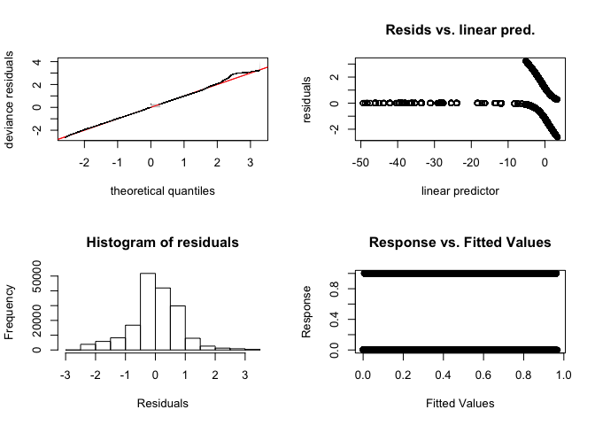

5\_GAMs
================
Gemma Clucas
3/24/2021

Read in the
data.

``` r
data <- read.csv(file = "PresBackgroundLocationsWithEnvironmentalVariables.csv", stringsAsFactors = FALSE)

birds <- unique(data$Ptt)

names(data)
```

    ##  [1] "LON"           "LAT"           "Ptt"           "Trip"         
    ##  [5] "locType"       "Time_absolute" "depth"         "colonydist"   
    ##  [9] "shelfdist"     "slope"         "SST"           "Height"       
    ## [13] "NorthVelocity" "EastVelocity"  "chlorA"        "pres"

## Model selection using cross-validation

Run the GAMs varying the covariate and the number of knots from 3 to 6.
This holds out the real and background data for each Ptt in turn, and
then calculates the mean AUC, sensitivity, and specificty from all 20
runs.

I have commented this out to allow me to knit the document quickly. I
read in the results of each model in the next
chunk.

``` r
# var <- c("depth", "colonydist", "slope", "SST", "Height", "NorthVelocity", "EastVelocity", "chlorA")
# knots <- c(3,4,5,6)
# 
# for (l in var) {
#   for (i in knots) {
#     for (j in birds){
#       TRAIN <- data[data$Ptt!=j,]  # use all groups except 1 in training data
#       TEST<- data[data$Ptt==j,]  # keep the other group for testing data
#       # run gam with one variable, k is number of knots
#       # have to define the formula as a string first, then convert to formula and pass to GAM
#       form <- as.formula(paste("pres ~ s(", l, ", k = i)"))
#       GAM <- gam(form, data=TRAIN, bs="cs", family=binomial, select=TRUE, method='GCV.Cp')  
#       TEST$GAM_pred <- as.numeric(predict(GAM, type="response", newdata=TEST)) # predict into the test data frame
#       roc1 <- roc(TEST$pres, TEST$GAM_pred) # create a roc curve from the test data
#       AUCEVAL <- as.numeric(roc1[9]) # get the auc value
#       #also get specificity and sensitivity from the best point on the ROC curve
#       co1 <- pROC::coords(roc1, x = "best", best.method = "closest.topleft", ret=c("specificity","sensitivity")) 
#       spec1 <- as.numeric(co1[1])
#       sen1 <- as.numeric(co1[2])
#       eva <- as.data.frame(rbind(AUCEVAL,spec1,sen1))
#       names(eva) <- j
#       eva
#       if(exists("allevals")){
#         allevals <- cbind(allevals, eva)
#       }else {
#         allevals <- eva
#       }
#     }
#     # after running through all 20 birds
#     # calculate mean AUC, sensitiviy, and specificity for this number of knots
#     allevals$mean <- rowMeans(allevals)
#     # save as a csv
#     write.csv(allevals, file = paste("GAMs/", l, "_k", i, ".csv", sep = "" ))
#     # save just the mean, with the variable names to an object
#     assign(paste(l, i, sep = "_k"), 
#            as_tibble(cbind(group = names(allevals), t(allevals))) %>%
#              filter(group == "mean") %>% 
#              select(-group) %>% 
#              mutate(var = l, k = i) )
#     # remove allevals before starting the next run, since now the number of knots will change
#     rm(allevals)
#   }
# }
```

Load the csv files and create a dataframe with the AUC, sensitivty, and
specifity for each
model.

``` r
var <- c("depth", "colonydist", "slope", "SST", "Height", "NorthVelocity", "EastVelocity", "chlorA")
knots <- c(3,4,5,6)

# create an empty list to store the results from each round of the loop in
datalist = list()
# also initialise a counter that will increase by 1 each time the loop runs
count <- 0

for (l in var) {
  for (i in knots) {
    count <- count + 1
    read.csv(paste0("GAMs/", l, "_k", i, ".csv")) %>% 
      select("mean") %>%  
      unlist() %>% 
      c(., l, i) -> datalist[[count]]
  }
}

# bind all the list elements from the list into a dataframe, give proper names to values, and sort
dplyr::bind_rows(datalist) %>% 
  rename(covariate = "...4", 
         knots = "...5",
         AUC = mean1, 
         Sensitivity = mean2, 
         Specificity = mean3) %>%
  select(covariate, 
         knots, 
         AUC, 
         Sensitivity, 
         Specificity) %>% 
  arrange(desc(AUC)) %>% 
  kable()
```

| covariate     | knots | AUC               | Sensitivity       | Specificity       |
| :------------ | :---- | :---------------- | :---------------- | :---------------- |
| colonydist    | 3     | 0.909608425882688 | 0.827084783386952 | 0.889801892036128 |
| colonydist    | 4     | 0.909060454779673 | 0.827084783386952 | 0.889801892036128 |
| colonydist    | 5     | 0.9089978338479   | 0.827084783386952 | 0.889801892036128 |
| colonydist    | 6     | 0.90848164994757  | 0.827084783386952 | 0.889801892036128 |
| NorthVelocity | 4     | 0.832084499520837 | 0.814399308020126 | 0.767539626695713 |
| NorthVelocity | 3     | 0.831838519233904 | 0.814399308020126 | 0.767539626695713 |
| NorthVelocity | 5     | 0.831743120447851 | 0.814399308020126 | 0.767539626695713 |
| NorthVelocity | 6     | 0.831465880678151 | 0.814399308020126 | 0.767539626695713 |
| SST           | 5     | 0.803332196235139 | 0.707964758497825 | 0.848865570285839 |
| SST           | 6     | 0.803174944334274 | 0.701185660300201 | 0.848765154074878 |
| SST           | 4     | 0.798794598140906 | 0.692770921245631 | 0.851357154133042 |
| SST           | 3     | 0.796964223836273 | 0.687276697318897 | 0.854635842535718 |
| chlorA        | 3     | 0.786983142330099 | 0.715886440496589 | 0.862295559983993 |
| chlorA        | 4     | 0.783192182088201 | 0.702916501401651 | 0.876315169514258 |
| chlorA        | 6     | 0.778995353745926 | 0.727592486068985 | 0.830193761816342 |
| chlorA        | 5     | 0.777045901904991 | 0.727355877996042 | 0.827973438714291 |
| depth         | 4     | 0.77415753569438  | 0.675978929834417 | 0.77382858625012  |
| depth         | 5     | 0.77415753569438  | 0.675978929834417 | 0.77382858625012  |
| depth         | 6     | 0.77415753569438  | 0.675978929834417 | 0.77382858625012  |
| depth         | 3     | 0.771299002347198 | 0.675978929834417 | 0.77382858625012  |
| Height        | 5     | 0.761896643307295 | 0.663688853053151 | 0.770713599455564 |
| Height        | 6     | 0.761753662505073 | 0.663812632619186 | 0.770713599455564 |
| Height        | 4     | 0.756550814671168 | 0.647633935519823 | 0.779453149563908 |
| Height        | 3     | 0.742385744422253 | 0.625713679702043 | 0.792228186077669 |
| slope         | 4     | 0.701765656800504 | 0.636995722084473 | 0.682861005921849 |
| slope         | 6     | 0.701455342020985 | 0.642744335357008 | 0.675533687695169 |
| slope         | 5     | 0.701246328830413 | 0.641419991103852 | 0.679670004010068 |
| slope         | 3     | 0.700717040219356 | 0.641429218808832 | 0.679868839653738 |
| EastVelocity  | 3     | 0.582425353487991 | 0.569448280427117 | 0.62462291188875  |
| EastVelocity  | 5     | 0.572240678433732 | 0.565424017718041 | 0.629917881277024 |
| EastVelocity  | 6     | 0.570698558242197 | 0.561801311670791 | 0.610390487284602 |
| EastVelocity  | 4     | 0.559354141394348 | 0.59018565031381  | 0.56968005686513  |

So `colonydist` with 3 knots is the best predictor. Run models with
`colonydist` plus the other covariates next (commented out to allow me
to knit the
doc).

``` r
# var <- c("depth", "slope", "SST", "Height", "NorthVelocity", "EastVelocity", "chlorA")
# knots <- c(3,4,5,6)
# 
# 
# for (l in var) {
#   for (i in knots) {
#     for (j in birds){
#       TRAIN <- data[data$Ptt!=j,]  # use all groups except 1 in training data
#       TEST<- data[data$Ptt==j,]  # keep the other group for testing data
#       # run gam with colonydist, knots = 3, and vary the other covariates and number of knots
#       # have to define the formula first as a string
#       form <- as.formula(paste("pres ~ s(colonydist, k = 3) + s(", l, ", k = i)"))
#       GAM <- gam(form, data=TRAIN, bs="cs", family=binomial, select=TRUE, method='GCV.Cp')  
#       TEST$GAM_pred <- as.numeric(predict(GAM, type="response", newdata=TEST)) # predict into the test data frame
#       roc2 <- roc(TEST$pres, TEST$GAM_pred) # create a roc curve from the test data
#       AUCEVAL2 <- as.numeric(roc2[9]) # get the auc value
#       co2 <- pROC::coords(roc2, x = "best", best.method = "closest.topleft", ret=c("specificity","sensitivity")) #also get specificity and sensitivity
#       spec2 <- as.numeric(co2[1])
#       sen2 <- as.numeric(co2[2])
#       eva2 <- as.data.frame(rbind(AUCEVAL2,spec2,sen2))
#       names(eva2) <- j
#       eva2
#       if(exists("allevals2")){
#         allevals2 <- cbind(allevals2, eva2)
#       }else {
#         allevals2 <- eva2
#       }
#     }
#     # calculate mean AUC, sensitiviy, and specificity
#     allevals2$mean <- rowMeans(allevals2)
#     # save as a csv
#     write.csv(allevals2, file = paste("GAMs/colonydist_k3+", l, "_k", i, ".csv", sep = "" ))
#     # save just the mean, with the variable names to an object
#     assign(paste("colonydist_k3_", l, "_k", i, sep = ""), 
#            as_tibble(cbind(group = names(allevals2), t(allevals2))) %>%
#              filter(group == "mean") %>% 
#              select(-group) %>% 
#              mutate(var = l, k = i) )
#     rm(allevals2)
#   }
# }
```

Read in csv files as before and
sort.

``` r
var <- c("depth", "slope", "SST", "Height", "NorthVelocity", "EastVelocity", "chlorA")
knots <- c(3,4,5,6)

# create an empty list to store the results from each round of the loop in
datalist2 = list()
# also initialise a counter that will increase by 1 each time the loop runs
count <- 0

for (l in var) {
  for (i in knots) {
    count <- count + 1
    read.csv(paste0("GAMs/colonydist_k3+", l, "_k", i, ".csv")) %>% 
      select("mean") %>%  
      unlist() %>% 
      c(., l, i) -> datalist2[[count]]
  }
}

# bind all the list elements into a dataframe, give proper names to values, and sort
dplyr::bind_rows(datalist2) %>% 
  rename(covariate = "...4", 
         knots = "...5",
         AUC = mean1, 
         Sensitivity = mean2, 
         Specificity = mean3) %>%
  select(covariate, 
         knots, 
         AUC, 
         Sensitivity, 
         Specificity) %>% 
  arrange(desc(AUC)) %>% 
  kable()
```

| covariate     | knots | AUC               | Sensitivity       | Specificity       |
| :------------ | :---- | :---------------- | :---------------- | :---------------- |
| SST           | 6     | 0.927336411577047 | 0.847580743523461 | 0.903632678808584 |
| SST           | 5     | 0.927326529168583 | 0.84678585042701  | 0.905167557306216 |
| chlorA        | 5     | 0.926962296481647 | 0.848881198207213 | 0.896031195471952 |
| chlorA        | 6     | 0.926960296879388 | 0.848329559645755 | 0.896934870709578 |
| chlorA        | 3     | 0.926913017118764 | 0.848098357059054 | 0.902878146439703 |
| SST           | 4     | 0.926587163441911 | 0.846934814278437 | 0.899963160200896 |
| SST           | 3     | 0.926540760641897 | 0.850550065728098 | 0.899792157135855 |
| chlorA        | 4     | 0.926343727683006 | 0.847139770392056 | 0.899145327693035 |
| Height        | 3     | 0.924156242726136 | 0.854229456756023 | 0.897038754220948 |
| Height        | 5     | 0.923390892682883 | 0.851425703756084 | 0.897973431910238 |
| Height        | 4     | 0.923253898294554 | 0.851709093942963 | 0.896511340237487 |
| Height        | 6     | 0.923100023454276 | 0.85043262116958  | 0.899443061561603 |
| depth         | 5     | 0.922544339977131 | 0.846886056712137 | 0.885659366879783 |
| depth         | 6     | 0.922469436856597 | 0.847503495532224 | 0.884535333542918 |
| depth         | 4     | 0.921751284899308 | 0.836453285342533 | 0.892598467027963 |
| NorthVelocity | 4     | 0.921381222538106 | 0.852037017394909 | 0.877336738364354 |
| NorthVelocity | 6     | 0.920849691512474 | 0.857735687166235 | 0.869786469437004 |
| NorthVelocity | 5     | 0.920645163815892 | 0.856560550977975 | 0.870736018068827 |
| depth         | 3     | 0.920269042638705 | 0.840151383292074 | 0.892637752564834 |
| EastVelocity  | 6     | 0.918675045439337 | 0.84170266366054  | 0.896152219846928 |
| NorthVelocity | 3     | 0.918259627837207 | 0.850196920387328 | 0.878408021441719 |
| EastVelocity  | 5     | 0.917381902615144 | 0.840033825685227 | 0.894187743443783 |
| EastVelocity  | 4     | 0.916771085262984 | 0.838896131125879 | 0.891856653278324 |
| EastVelocity  | 3     | 0.916480705016821 | 0.839014011775481 | 0.894153616876666 |
| slope         | 4     | 0.910758699644351 | 0.830075475578753 | 0.888119316532792 |
| slope         | 5     | 0.910756825399658 | 0.830678297860466 | 0.887093375401057 |
| slope         | 6     | 0.910731987003826 | 0.830105385447731 | 0.887604593758127 |
| slope         | 3     | 0.910730767764567 | 0.830721327303071 | 0.886385210563947 |

So colony distance with 3 knots and SST with 6 knots gives the highest
AUC, but SST with 5 knots has an almost identical AUC.

Repeat again to add a third
variable.

``` r
# var <- c("depth", "slope", "Height", "NorthVelocity", "EastVelocity", "chlorA")
# knots <- c(3,4,5,6)
# 
# 
# for (l in var) {
#   for (i in knots) {
#     for (j in birds){
#       TRAIN <- data[data$Ptt!=j,]  # use all groups except 1 in training data
#       TEST<- data[data$Ptt==j,]  # keep the other group for testing data
#       # run gam with colonydist, knots = 3, and vary the other covariates and number of knots
#       # have to define the formula first as a string
#       form <- as.formula(paste("pres ~ s(colonydist, k = 3) + s(SST, k = 6) + s(", l, ", k = i)"))
#       GAM <- gam(form, data=TRAIN, bs="cs", family=binomial, select=TRUE, method='GCV.Cp')
#       TEST$GAM_pred <- as.numeric(predict(GAM, type="response", newdata=TEST)) # predict into the test data frame
#       roc3 <- roc(TEST$pres, TEST$GAM_pred) # create a roc curve from the test data
#       AUCEVAL3 <- as.numeric(roc3[9]) # get the auc value
#       co3 <- pROC::coords(roc3, x = "best", best.method = "closest.topleft", ret=c("specificity","sensitivity")) #also get specificity and sensitivity
#       spec3 <- as.numeric(co3[1])
#       sen3 <- as.numeric(co3[2])
#       eva3 <- as.data.frame(rbind(AUCEVAL3,spec3,sen3))
#       names(eva3) <- j
#       eva3
#       if(exists("allevals3")){
#         allevals3 <- cbind(allevals3, eva3)
#       }else {
#         allevals3 <- eva3
#       }
#     }
#     # calculate mean AUC, sensitiviy, and specificity
#     allevals3$mean <- rowMeans(allevals3)
#     # save as a csv
#     write.csv(allevals3, file = paste("GAMs/colonydist_k3+SST_k6+", l, "_k", i, ".csv", sep = "" ))
#     # save just the mean, with the variable names to an object
#     assign(paste("colonydist_k3_SST_k6_", l, "_k", i, sep = ""),
#            as_tibble(cbind(group = names(allevals3), t(allevals3))) %>%
#              filter(group == "mean") %>%
#              select(-group) %>%
#              mutate(var = l, k = i) )
#     rm(allevals3)
#   }
# }
```

Combine outputs from models with 3
covariates.

``` r
var <- c("depth", "slope", "Height", "NorthVelocity", "EastVelocity", "chlorA")
knots <- c(3,4,5,6)

# create an empty list to store the results from each round of the loop in
datalist3 = list()
# also initialise a counter that will increase by 1 each time the loop runs
count <- 0

for (l in var) {
  for (i in knots) {
    count <- count + 1
    read.csv(paste0("GAMs/colonydist_k3+SST_k6+", l, "_k", i, ".csv")) %>% 
      select("mean") %>%  
      unlist() %>% 
      c(., l, i) -> datalist3[[count]]
  }
}

# bind all the list elements into a dataframe, give proper names to values, and sort
dplyr::bind_rows(datalist3) %>% 
  rename(covariate = "...4", 
         knots = "...5",
         AUC = mean1, 
         Sensitivity = mean2, 
         Specificity = mean3) %>%
  select(covariate, 
         knots, 
         AUC, 
         Sensitivity, 
         Specificity) %>% 
  arrange(desc(AUC)) %>% 
  kable()
```

| covariate     | knots | AUC               | Sensitivity       | Specificity       |
| :------------ | :---- | :---------------- | :---------------- | :---------------- |
| NorthVelocity | 4     | 0.92981752596812  | 0.856602746176724 | 0.891511268626536 |
| depth         | 6     | 0.929574433772099 | 0.854762765011837 | 0.900382567656511 |
| NorthVelocity | 6     | 0.929479113733748 | 0.857814105256402 | 0.891638126514569 |
| NorthVelocity | 5     | 0.929475825501471 | 0.85789766817092  | 0.889883104301758 |
| depth         | 5     | 0.929354775304444 | 0.855790576256265 | 0.900527021551429 |
| NorthVelocity | 3     | 0.929345177937922 | 0.859731726964039 | 0.88747429265799  |
| chlorA        | 5     | 0.92896359736617  | 0.854074320714317 | 0.900734222136715 |
| chlorA        | 3     | 0.928874598817353 | 0.852429888873345 | 0.90134273068169  |
| chlorA        | 4     | 0.928865003897342 | 0.855501579475131 | 0.894710417833384 |
| chlorA        | 6     | 0.928592478114612 | 0.856467948684937 | 0.893660470065148 |
| depth         | 3     | 0.928379091561141 | 0.852501601513292 | 0.902220384282509 |
| depth         | 4     | 0.928049269571058 | 0.853001422686962 | 0.901544469366818 |
| Height        | 3     | 0.927637473631585 | 0.855375656378218 | 0.897012611683877 |
| Height        | 4     | 0.926807421495245 | 0.859245139832295 | 0.894345476327732 |
| slope         | 6     | 0.926651119415974 | 0.852137202540955 | 0.890394654445303 |
| slope         | 5     | 0.926619731566197 | 0.851703280392858 | 0.891040900205504 |
| slope         | 3     | 0.926571330781131 | 0.849286879163128 | 0.894923253778513 |
| EastVelocity  | 6     | 0.926561804303542 | 0.847947742571198 | 0.903938636609796 |
| slope         | 4     | 0.926549969123641 | 0.850731335954504 | 0.892271198776567 |
| EastVelocity  | 4     | 0.926414304673197 | 0.84781047034757  | 0.902501263479666 |
| EastVelocity  | 3     | 0.926319197390943 | 0.849600542574481 | 0.900638478412644 |
| Height        | 5     | 0.926283929457712 | 0.860363786358741 | 0.890790804517151 |
| EastVelocity  | 5     | 0.926229575206382 | 0.84940012895455  | 0.901980520787882 |
| Height        | 6     | 0.925843732168364 | 0.857396141296817 | 0.893916823338509 |

The increase in the AUC is only very marginal when adding a third
covariate -\> stick to just two covariates (distance to colony and SST)
and run with all the data
next.

### Run the model with all of the data

``` r
GAM <- gam(pres ~ s(colonydist, k = 3) + s(SST, k = 6), data=data, bs="cs", family=binomial, select=TRUE, method='GCV.Cp')
summary(GAM)
```

    ## 
    ## Family: binomial 
    ## Link function: logit 
    ## 
    ## Formula:
    ## pres ~ s(colonydist, k = 3) + s(SST, k = 6)
    ## 
    ## Parametric coefficients:
    ##             Estimate Std. Error z value Pr(>|z|)    
    ## (Intercept) -0.88964    0.04845  -18.36   <2e-16 ***
    ## ---
    ## Signif. codes:  0 '***' 0.001 '**' 0.01 '*' 0.05 '.' 0.1 ' ' 1
    ## 
    ## Approximate significance of smooth terms:
    ##                 edf Ref.df Chi.sq p-value    
    ## s(colonydist) 1.995      2  30609  <2e-16 ***
    ## s(SST)        3.988      5   9746  <2e-16 ***
    ## ---
    ## Signif. codes:  0 '***' 0.001 '**' 0.01 '*' 0.05 '.' 0.1 ' ' 1
    ## 
    ## R-sq.(adj) =  0.585   Deviance explained = 50.3%
    ## UBRE = -0.31158  Scale est. = 1         n = 171174

``` r
#gratia::draw(GAM, residuals = TRUE)
```

``` r
gam.check(GAM, rep = 300)
```

<!-- -->

    ## 
    ## Method: UBRE   Optimizer: outer newton
    ## full convergence after 12 iterations.
    ## Gradient range [-8.349486e-10,4.78246e-07]
    ## (score -0.31158 & scale 1).
    ## Hessian positive definite, eigenvalue range [8.339634e-10,1.369375e-06].
    ## Model rank =  8 / 8 
    ## 
    ## Basis dimension (k) checking results. Low p-value (k-index<1) may
    ## indicate that k is too low, especially if edf is close to k'.
    ## 
    ##                 k'  edf k-index p-value    
    ## s(colonydist) 2.00 2.00    0.97   0.005 ** 
    ## s(SST)        5.00 3.99    0.89  <2e-16 ***
    ## ---
    ## Signif. codes:  0 '***' 0.001 '**' 0.01 '*' 0.05 '.' 0.1 ' ' 1

The residuals look pretty good in the plots on the left. The plots on
the right are always going to look weird because it’s binomial I think.
