Making predictions from the model
================
Gemma Clucas
5/3/2021

Read in the
data.

``` r
data <- read.csv(file = "PresBackgroundLocationsWithEnvironmentalVariables.csv", stringsAsFactors = FALSE)
```

Run the final
model.

``` r
GAM <- gam(pres ~ s(colonydist, k = 3) + s(SST, k = 6), data=data, bs="cs", family=binomial, select=TRUE, method='GCV.Cp')
```

### Load map for plotting

Note this is unprojected (WGS84).

``` r
Seamask<-readOGR("Seamask.shp")
```

    ## OGR data source with driver: ESRI Shapefile 
    ## Source: "/Users/gemmaclucas/GitHub/CHPE_Tracking_South_Sandwich_Islands/Seamask.shp", layer: "Seamask"
    ## with 1 features
    ## It has 1 fields

``` r
SSI_polygons <- crop(Seamask, c(450000, 1095192, -795043.9, -100000)) %>% 
  spTransform(., crs("+init=epsg:4326"))
```

    ## Warning in RGEOSUnaryPredFunc(spgeom, byid, "rgeos_isvalid"): Ring Self-
    ## intersection at or near point 77954.359424359995 26605.230663620001

    ## x[i, ] is invalid

    ## Warning in rgeos::gIntersection(x[i, ], y, byid = TRUE, drop_lower_td = TRUE):
    ## Invalid objects found; consider using set_RGEOS_CheckValidity(2L)

``` r
# convert to dataframe for use with ggplot2
SSI_polygons@data$id = rownames(SSI_polygons@data)
SSI_polygons.points = fortify(SSI_polygons, region="id")
SSI_polygons.df = plyr::join(SSI_polygons.points, SSI_polygons@data, by="id")

# filter out only the polygons for the islands
SSI_polygons.df <- SSI_polygons.df %>% filter(hole == TRUE)

# plot
SSI_polygons.df %>% 
  ggplot(aes(x = long, y = lat, group = group)) + 
  geom_polygon(fill="grey") +
  geom_path(color="grey") +
  theme_bw() +
  coord_fixed() +
  theme(panel.grid.major = element_blank(), 
        panel.grid.minor = element_blank(),
        panel.background = element_rect(fill = "aliceblue"))
```

<!-- -->

## 1\. Predict around Saunders to check that the distribution looks ok

This just creates a raster across the study area using the bathymetry
raster cropped to the right extent.

``` r
# Read in bathymetry raster and crop to extent of the study area
SSI_bath_WGS84 <- raster("ssi_geotif/full_ssi18a.tif") %>% 
  projectRaster(., crs=crs("+init=epsg:4326")) %>% 
  crop(., c(-27.96598, -24.623, -58.41806, -57.28708))

x <- SSI_bath_WGS84

# Project to LAEA to find extent in metres
y <- projectRaster(x, crs = CRS("+proj=laea +lon_0=-26 +lat_0=-58 +units=m"))
extent(y)
```

    ## class      : Extent 
    ## xmin       : -119511.7 
    ## xmax       : 83876.27 
    ## ymin       : -49280.75 
    ## ymax       : 80319.25

Crop out land from the bathymetry raster using `mask()`

``` r
# Read in shapefile for land
SSI_WGS84 <- readOGR("Seamask.shp") %>% 
  crop(., c(450000, 1095192, -795043.9, -100000)) %>% 
  spTransform(., crs("+init=epsg:4326"))
```

    ## OGR data source with driver: ESRI Shapefile 
    ## Source: "/Users/gemmaclucas/GitHub/CHPE_Tracking_South_Sandwich_Islands/Seamask.shp", layer: "Seamask"
    ## with 1 features
    ## It has 1 fields

    ## Warning in RGEOSUnaryPredFunc(spgeom, byid, "rgeos_isvalid"): Ring Self-
    ## intersection at or near point 77954.359424359995 26605.230663620001

    ## x[i, ] is invalid

    ## Warning in rgeos::gIntersection(x[i, ], y, byid = TRUE, drop_lower_td = TRUE):
    ## Invalid objects found; consider using set_RGEOS_CheckValidity(2L)

``` r
# Cut out land
mask <- mask(x, SSI_WGS84, inverse=F)

# Plot to check
# plot(mask, col=viridis(100))
# plot(mask, xlim = c(-26.6, -26.2), ylim = c(-57.9, -57.7), col=viridis(100))
```

### Make a raster for the distance from colony for Saunders

``` r
colony_lat<- -57.808 
colony_lon<- -26.404

# Find the colony cell in the study area raster
j <- cellFromXY(mask, cbind(colony_lon, colony_lat))
# Change the value of the cell where the colony is to 2 (all the other cells are 1)
mask[j]<-2 


# Create a distance raster from the colony
# Moving through land is prevented by omiting cells with NA values
dist <- gridDistance(mask, origin=2, omit=NA)
```

    ## Loading required namespace: igraph

``` r
plot(dist, col=viridis(100))
```

<!-- -->

``` r
#plot(dist, xlim = c(-26.6, -26.2), ylim = c(-57.9, -57.7), col=viridis(100))
```

### SST raster

Get the sea surface temperature data that I downloaded previously.

``` r
# Open data - note there is a dataset for Jan and one for Feb
nc_data_Jan <- nc_open('global-analysis-forecast-phy-001-024-monthly_January2020.nc')
nc_data_Feb <- nc_open('global-analysis-forecast-phy-001-024-monthly_February2020.nc')
# Extract longs and lats
nc_lon <- ncvar_get(nc_data_Jan, "longitude")
nc_lat <- ncvar_get(nc_data_Jan, "latitude", verbose = F)
# Create an array of the SST data
temp.array.Jan <- ncvar_get(nc_data_Jan, "thetao")
temp.array.Feb <- ncvar_get(nc_data_Feb, "thetao")
# Take just the surface layer
surface.temp.Jan <- temp.array.Jan[, , 1] 
surface.temp.Feb <- temp.array.Feb[, , 1] 
# Make it into a raster
SST_Jan <- raster(t(surface.temp.Jan), 
                   xmn=min(nc_lon), 
                   xmx=max(nc_lon), 
                   ymn=min(nc_lat), 
                   ymx=max(nc_lat), 
                   crs=crs("+init=epsg:4326")) %>% 
  flip(., direction = "y")
# Same for Feb
SST_Feb <- raster(t(surface.temp.Feb), 
                   xmn=min(nc_lon), 
                   xmx=max(nc_lon), 
                   ymn=min(nc_lat), 
                   ymx=max(nc_lat), 
                   crs=crs("+init=epsg:4326")) %>% 
  flip(., direction = "y")
# Calculate weighted mean (weighting by the number of observations in January vs February)
wMeanSST <- stack(c(SST_Jan, SST_Feb)) %>% 
  weighted.mean(., w = c(0.64, 0.36))
# Plot for study area
raster::plot(wMeanSST, xlim = c(-27.96598, -24.623), ylim = c(-58.41806, -57.28708), col=viridis(100))
```

<!-- -->

The low resolution of this data makes the predictions very pixelated.
Interpolate before making predictions.

``` r
# plot around Saunders
resample(x = wMeanSST, y = dist, method = 'bilinear') %>% plot(xlim = c(-27.96598, -24.623), ylim = c(-58.41806, -57.28708), col=viridis(100))
```

<!-- -->

``` r
# interpolate across entire archipelago
wMeanSST_resampled <- resample(x = wMeanSST, y = dist, method = 'bilinear')
```

### Make a 1km x 1km grid

Use this to sample the distance and SST rasters. The values for the max
and min long/lat are from converting the depth raster to LAEA after
cropping it to the study area extent
(above).

``` r
long <- seq(-119511.7 , 83876.27, 1000) #first minimum longitude in m, then max, 1000 is 1km
# head(long)
lat <- seq(-49280.75, 80319.25, 1000)
# head(lat)
Saunders_1KmPoints <- expand.grid(long,lat)
names(Saunders_1KmPoints) <- c("Lon","Lat")
# make it spatial
coordinates(Saunders_1KmPoints) <- ~Lon+Lat
proj4string(Saunders_1KmPoints) <- CRS("+proj=laea +lon_0=-26 +lat_0=-58 +units=m")


# change it back to wgs84 to extract the environmental data (those layers are WGS84)
Saunders_1KmPoints <- spTransform(Saunders_1KmPoints, CRS = proj4string(dist))


# sample the distance and SST layers
Saunders_1KmPoints$SST <- raster::extract(wMeanSST_resampled, Saunders_1KmPoints)
Saunders_1KmPoints$colonydist <- raster::extract(dist, Saunders_1KmPoints)
```

### Make predictions for Saunders

``` r
Saunders_1KmPoints$GAM_pred <- as.numeric(predict(GAM, type="response", newdata = Saunders_1KmPoints))
```

Make a new raster with the correct resolution and extent of the 1km
grid, then use it to convert `Saunders_1KmPoints` into a raster for
plotting.

``` r
# new raster in LAEA
r <- raster(ncols = 204, nrows = 130, crs = CRS("+proj=laea +lon_0=-26 +lat_0=-58 +units=m")) 
# define the extent of the raster
extent(r) <- c(-119511.7 , 83876.27, -49280.75, 80319.25  )
# change points into LAEA as well
Saunders_1KmPoints <- spTransform(Saunders_1KmPoints, CRS = "+proj=laea +lon_0=-26 +lat_0=-58 +units=m")
# rasterize the predicted values
r3 <- rasterize(Saunders_1KmPoints, r, 'GAM_pred', fun=mean)
# project back to WGS84 for plotting
r3 <- projectRaster(from = r3, to = dist)
#plot(r3, col=viridis(100))


# convert to a df for plotting in two steps,
# First, to a SpatialPointsDataFrame
r3_pts <- rasterToPoints(r3, spatial = TRUE)
# Then to a 'conventional' dataframe
r3_df  <- data.frame(r3_pts)
rm(r3_pts)

ggplot() +
  geom_raster(data = r3_df , aes(x = x, y = y, fill = layer)) + 
  scale_fill_viridis() +
  geom_polygon(data = SSI_polygons.df, aes(x = long, y = lat, group = group), fill = "white") +
  ggtitle("Predicted distribution around Saunders Island") +
  coord_fixed(ratio = 1,
                xlim = c(-27.96598, -24.623),
                ylim = c(-58.41806, -57.28708),
                expand = TRUE,
                clip = "on")
```

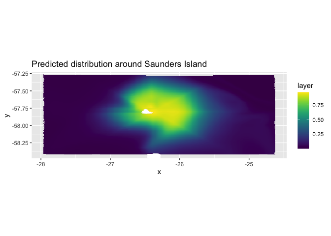<!-- -->

What is the actual distribution of the
data?

``` r
All <- read.csv("Chick-rearing_trips/All_chick-rearing_trips.csv", stringsAsFactors = FALSE) 
# Make it spatial
coordinates(All) <- ~LON + LAT
proj4string(All) <- CRS("+proj=laea +lon_0=-26 +lat_0=-58 +units=m")
# Reproject to WGS84
All <- spTransform(All, CRS = CRS("+proj=longlat +ellps=WGS84"))


ggplot() +
  geom_density_2d_filled(data = as.data.frame(All), aes(x = LON, y = LAT), bins = 20) +
  geom_polygon(data = SSI_polygons.df, aes(x = long, y = lat, group = group), fill = "white") +
  theme_bw() +
  coord_fixed(ratio = 1,
                xlim = c(-27.96598, -24.623),
                ylim = c(-58.41806, -57.28708),
                expand = TRUE,
                clip = "on") +
  ggtitle("Observed distribution around Saunders Island") +
  xlab("Lat") +
  ylab("Long") +
  theme(legend.position = "none")
```

<!-- -->

The actual distribution is pretty close to the predicted distribution.

## 2\. Predict around all other colonies

Make raster for entire chain of islands using the bathymetry raster as a
starting point.

``` r
SSI_bath_WGS84 <- raster("ssi_geotif/full_ssi18a.tif") %>% 
  projectRaster(., crs=crs("+init=epsg:4326")) %>% 
  crop(., c(-30, -25, -60, -56))

# Read in shapefile for land
SSI_WGS84 <- readOGR("Seamask.shp") %>% 
  crop(., c(450000, 1095192, -795043.9, -100000)) %>% 
  spTransform(., crs("+init=epsg:4326"))
```

    ## OGR data source with driver: ESRI Shapefile 
    ## Source: "/Users/gemmaclucas/GitHub/CHPE_Tracking_South_Sandwich_Islands/Seamask.shp", layer: "Seamask"
    ## with 1 features
    ## It has 1 fields

    ## Warning in RGEOSUnaryPredFunc(spgeom, byid, "rgeos_isvalid"): Ring Self-
    ## intersection at or near point 77954.359424359995 26605.230663620001

    ## x[i, ] is invalid

    ## Warning in rgeos::gIntersection(x[i, ], y, byid = TRUE, drop_lower_td = TRUE):
    ## Invalid objects found; consider using set_RGEOS_CheckValidity(2L)

``` r
# Cut out land
mask <- mask(SSI_bath_WGS84, SSI_WGS84, inverse=F)

# Plot to check
plot(mask, col=viridis(100))
```

<!-- -->

``` r
# Set all values to 1
x <- mask
values(x) <- 1
# Cut out land
x <- mask(x, SSI_WGS84, inverse=F)

# Plot to check
plot(x, col=viridis(100))
```

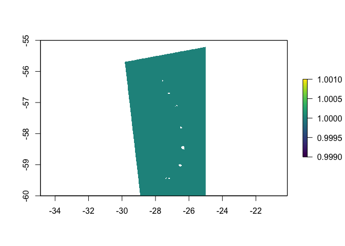<!-- -->

### SST

This is the SST temperature from above, plotted for the whole study area
after interpolating it.

``` r
wMeanSST_resampled <- resample(x = wMeanSST, y = x, method = 'bilinear')
raster::plot(wMeanSST_resampled, col=viridis(100))
```

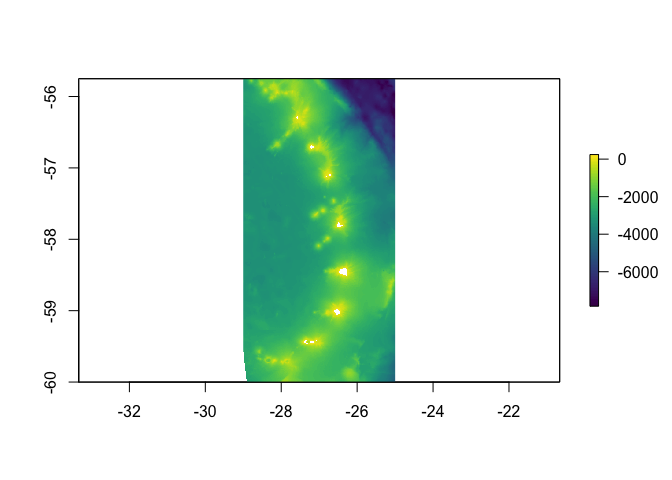<!-- -->

### Make a grid with a 1x1km resolution to sample the raster layers

First I need to find the extent of the entire island change when it’s in
LAEA
projection.

``` r
projectRaster(wMeanSST_resampled, crs = CRS("+proj=laea +lon_0=-26 +lat_0=-58 +units=m"))
```

    ## class      : RasterLayer 
    ## dimensions : 2270, 1546, 3509420  (nrow, ncol, ncell)
    ## resolution : 203, 200  (x, y)
    ## extent     : -250405.5, 63432.49, -230376.3, 223623.7  (xmin, xmax, ymin, ymax)
    ## crs        : +proj=laea +lon_0=-26 +lat_0=-58 +units=m +ellps=WGS84 
    ## source     : memory
    ## names      : layer 
    ## values     : 0.6994274, 2.866962  (min, max)

``` r
long <- seq(-250405.5 , 63432.49, 1000) #first minimum longitude in m, then max, 1000 is 1km
# head(long)
lat <- seq(-230376.3, 223623.7, 1000)
# head(lat)
All_1KmPoints <- expand.grid(long,lat)
names(All_1KmPoints) <- c("Lon","Lat")
# make it spatial
coordinates(All_1KmPoints) <- ~Lon+Lat
proj4string(All_1KmPoints) <- CRS("+proj=laea +lon_0=-26 +lat_0=-58 +units=m")


# change it back to wgs84 to extract the environmental data (those layers are WGS84)
All_1KmPoints <- spTransform(All_1KmPoints, CRS = proj4string(dist))
```

I also need to make a new raster with the correct resolution and extent
of the study area, which I will use to rasterise the 1km grid with
later.

``` r
# new raster in LAEA
r <- raster(ncols = 313, nrows = 454, crs = CRS("+proj=laea +lon_0=-26 +lat_0=-58 +units=m")) 
# define the extent of the raster
extent(r) <- c(-250405.5 , 63432.49, -230376.3, 223623.7  )
```

### Read in all colony locations

``` r
colonies <- read.csv("Colony_LatLons.csv", header = TRUE)
coordinates(colonies) <- ~Long+Lat
```

### Make functions to predict the distribution and plot

``` r
single_island_prediction <- function(colony_name) {
  location <- colonies %>% subset(., str_detect(Colony, colony_name))
  j <- cellFromXY(x, location)
  x[j] <- 2 
  # Create a distance raster from the colony
  dist <- gridDistance(x, origin=2, omit=NA)
  # sample the distance and SST layers
  All_1KmPoints$SST <- raster::extract(wMeanSST_resampled, All_1KmPoints)
  All_1KmPoints$colonydist <- raster::extract(dist, All_1KmPoints)
  # Make predictions
  All_1KmPoints$GAM_pred <- as.numeric(predict(GAM, type="response", newdata = All_1KmPoints))
  # change points into LAEA so that it matches the raster
  All_1KmPoints <- spTransform(All_1KmPoints, CRS = "+proj=laea +lon_0=-26 +lat_0=-58 +units=m")
  # rasterize the predicted values
  r3 <- rasterize(All_1KmPoints, r, 'GAM_pred', fun=mean)
  # project back to WGS84 for plotting
  r3 <- projectRaster(from = r3, to = dist)
}


plot_predicted_distribution <- function(raster, colony_name) {
  # convert to a df for plotting in two steps,
  # First, to a SpatialPointsDataFrame
  r3_pts <- rasterToPoints(raster, spatial = TRUE)
  # Then to a 'conventional' dataframe
  r3_df  <- data.frame(r3_pts)
  rm(r3_pts)
  ggplot() +
    geom_raster(data = r3_df , aes(x = x, y = y, fill = layer)) + 
    scale_fill_viridis() +
    geom_polygon(data = SSI_polygons.df, aes(x = long, y = lat, group = group), fill = "white") +
    ggtitle(paste0("Predicted distribution around ", colony_name)) +
    coord_fixed(ratio = 1)
}
```

### Run for each colony

``` r
# colony_codes <- c("CAND", "BRIS")
# predicted_rasters <- purrr::map(colony_codes, ~assign(paste0(colony_codes, "_predicted"), single_island_prediction(colony_codes)))

colony_code <- "ZAV"
assign(paste0(colony_code, "_predicted"), single_island_prediction(colony_code))
plot_predicted_distribution(get(paste0(colony_code, "_predicted")), "Zavodovski")
```

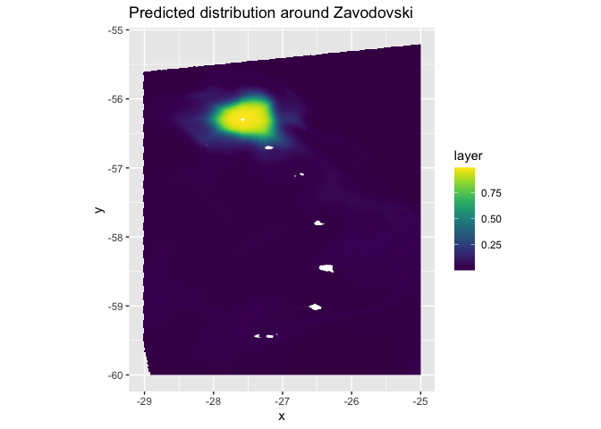<!-- -->

``` r
colony_code <- "VIS"
assign(paste0(colony_code, "_predicted"), single_island_prediction(colony_code))
plot_predicted_distribution(get(paste0(colony_code, "_predicted")), "Visokoi")
```

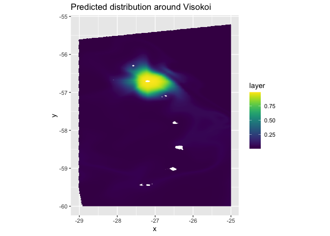<!-- -->

``` r
colony_code <- "CAND"
assign(paste0(colony_code, "_predicted"), single_island_prediction(colony_code))
plot_predicted_distribution(get(paste0(colony_code, "_predicted")), "Candelmas")
```

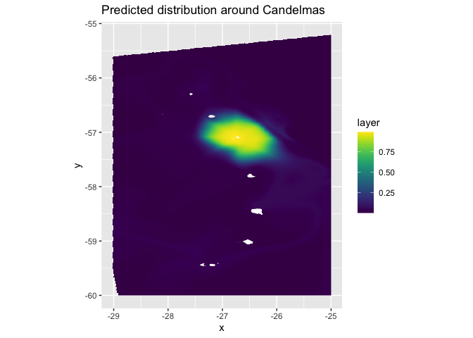<!-- -->

``` r
colony_code <- "VIND"
assign(paste0(colony_code, "_predicted"), single_island_prediction(colony_code))
plot_predicted_distribution(get(paste0(colony_code, "_predicted")), "Vindication")
```

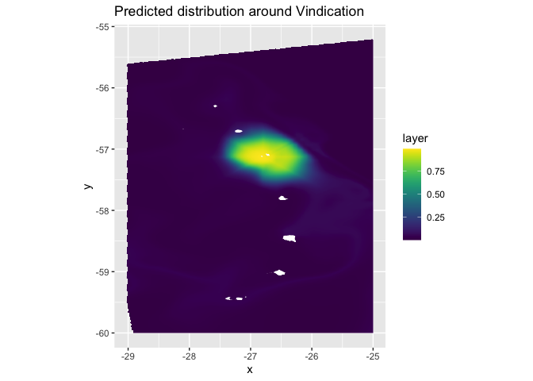<!-- -->

``` r
colony_code <- "SAUN"
assign(paste0(colony_code, "_predicted"), single_island_prediction(colony_code))
plot_predicted_distribution(get(paste0(colony_code, "_predicted")), "Saunders")
```

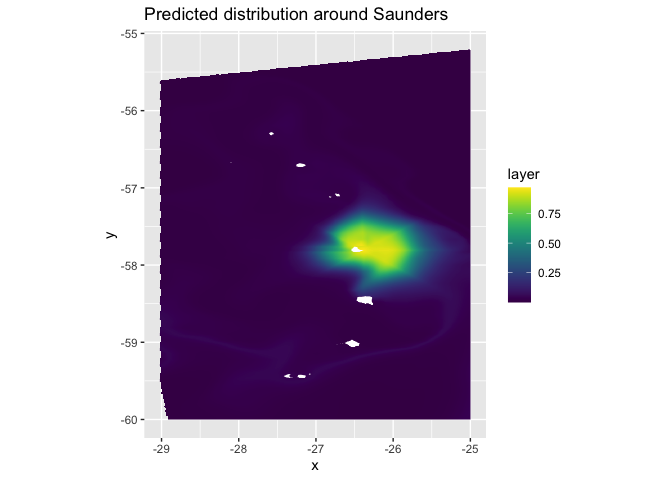<!-- -->

``` r
colony_code <- "MONT"
assign(paste0(colony_code, "_predicted"), single_island_prediction(colony_code))
plot_predicted_distribution(get(paste0(colony_code, "_predicted")), "Montagu")
```

<!-- -->

``` r
colony_code <- "BRIS"
assign(paste0(colony_code, "_predicted"), single_island_prediction(colony_code))
plot_predicted_distribution(get(paste0(colony_code, "_predicted")), "Bristol")
```

<!-- -->

``` r
colony_code <- "BELL"
assign(paste0(colony_code, "_predicted"), single_island_prediction(colony_code))
plot_predicted_distribution(get(paste0(colony_code, "_predicted")), "Bellingshausen")
```

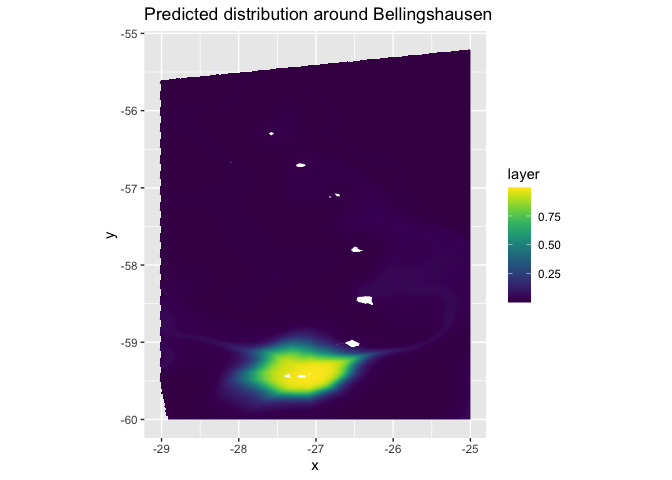<!-- -->

``` r
colony_code <- "COOK"
assign(paste0(colony_code, "_predicted"), single_island_prediction(colony_code))
plot_predicted_distribution(get(paste0(colony_code, "_predicted")), "Cook")
```

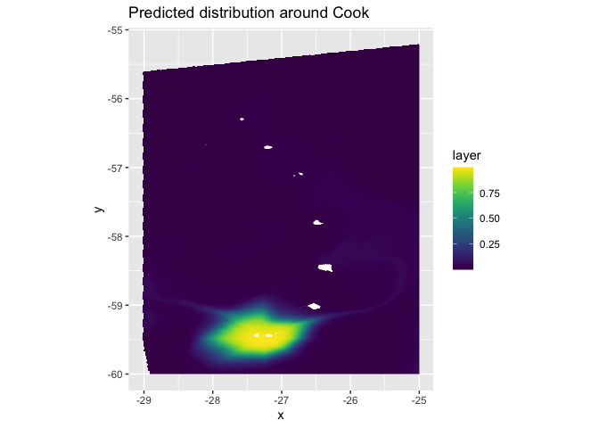<!-- -->

``` r
colony_code <- "THUL"
assign(paste0(colony_code, "_predicted"), single_island_prediction(colony_code))
plot_predicted_distribution(get(paste0(colony_code, "_predicted")), "Thule")
```

<!-- -->

### Calculate weighted distributions for each island

I want to calculate the importance of each cell by dividing its value
(the probability of occurrence of a penguin) by the sum of the
probability of occurences across all cells in that raster, and then
multiply by the colony size. This will give the expected number of
individuals that would forage in that cell.

``` r
importance <- function(x) {
  col <- get(paste0(x, "_predicted"))
  col / cellStats(col, stat = "sum")
}

ZAV_expected <- importance("ZAV") * 1000000
VIS_expected <- importance("VIS") * 185000
CAND_expected <- importance("CAND") * 205000
VIND_expected <- importance("VIND") * 95000
SAUN_expected <- importance("SAUN") * 155000
MONT_expected <- importance("MONT") * 10000
BRIS_expected <- importance("BRIS") * 15000
BELL_expected <- importance("BELL") * 36000
COOK_expected <- importance("COOK") * 1000
THUL_expected <- importance("THUL") * 100000

stack <- stack(ZAV_expected, VIS_expected, CAND_expected, VIND_expected, SAUN_expected, MONT_expected, BRIS_expected, BELL_expected, COOK_expected, THUL_expected)
stack_sum <- calc(stack, sum)

plot(stack_sum, col=viridis(100))
```

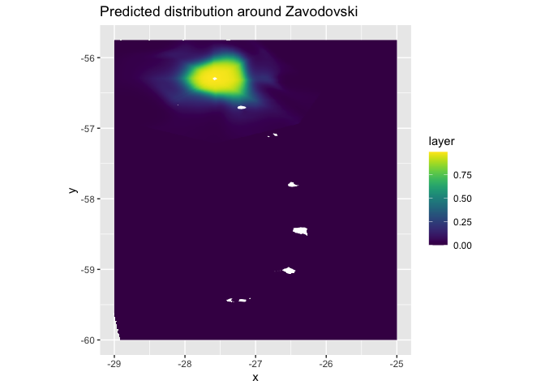<!-- -->

What are the units for the predicted number of penguins? I think I need
to plot in LAEA to be able to say the plotted values predict x penguins
per km (or whatever).
