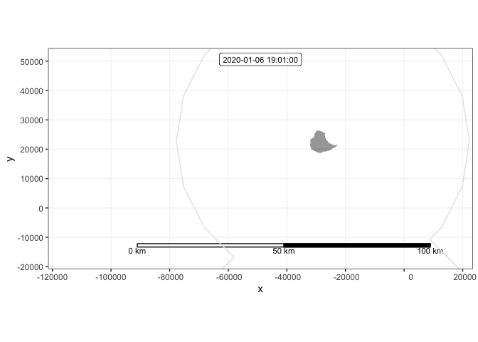
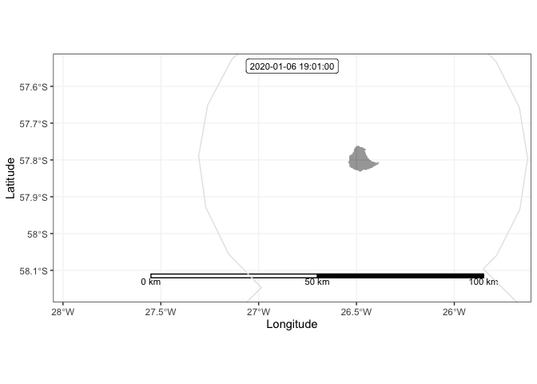
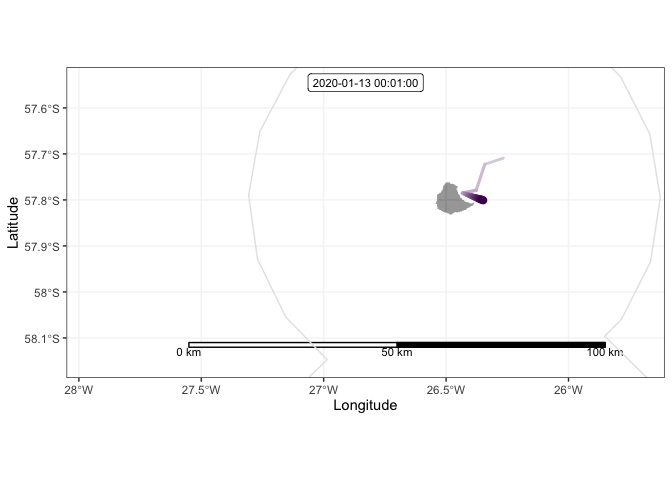

Penguin movement animation
================
Gemma Clucas
10/14/2020

## Example data

``` r
# data("move_data")
# unique(timestamps(move_data))
# timeLag(move_data, unit = "mins")

# move_data <- align_move(move_data, res = 4, unit = "mins")
# 
# frames <- frames_spatial(move_data, path_colours = c("red", "green", "blue"),
#                          map_service = "osm", map_type = "watercolor", alpha = 0.5)
# 
# length(frames)
# frames[[10]]

#animate_frames(frames, out_file = "example.gif")
```

## My data - one individual

``` r
# read in one track
predObj <- read.csv("predicted_tracks/196707_track.csv", stringsAsFactors = FALSE)

# format one track
track <- predObj %>%
  dplyr::filter(locType == "p") %>%                                   # select only predicted positions
  dplyr::select(Ptt, Time_absolute, Time_since, mu.x, mu.y) %>%       # select only useful colums
  rename(LON = mu.x, LAT = mu.y) %>%                                 # rename columns for ease of use
  mutate(time = as.POSIXct(Time_absolute, tz = "UTC"))               # make sure times are in POSIXct

# Optional: crop the tracks to just the chick-rearing period. 
# 196697 leaves the colony around 8th February
# track <- track %>% filter(time <= "2020-02-07 23:59:00")
# 196698 leaves the colony on 3rd Feb
# track <- track %>% filter(time <= "2020-02-03 23:59:00")
# 196707 leaves the colony on 21st Feb
track <- track %>% filter(time <= "2020-02-21 23:59:00")


# change to move object and supply the LAEA projection
track.move <- track %>%
  df2move(.,
          proj = CRS("+proj=laea +lon_0=-26 +lat_0=-58 +units=m"),
          x = "LON",
          y = "LAT",
          time = "time",
          track_id = "Ptt")
```

## My data - all individuals

``` r
# # read in all tracks at once into tibble
# tbl <-
#     list.files(path = "predicted_tracks", pattern = "*.csv") %>% 
#     map_df(~read_csv(paste0("predicted_tracks/", .)))
# 
# # do some formatting on all tracks
# track <- tbl %>%
#   dplyr::filter(locType == "p") %>%                                   # select only predicted positions
#   dplyr::select(Ptt, Time_absolute, Time_since, mu.x, mu.y) %>%       # select only useful colums
#   rename(LON = mu.x, LAT = mu.y) %>%                                 # rename columns for ease of use
#   mutate(time = as.POSIXct(Time_absolute, tz = "UTC"))               # make sure times are in POSIXct
# 
# # function for adjusting times to make them all unique by adjusting by 5 seconds (only needs to run with more than one individual)
# make_unique <- function(x) {
#   xts::make.time.unique(x$Time_absolute, eps = 5)
# }
# 
# # apply that function (run with more than one individual)
# track <- track %>% 
#   dplyr::arrange(time, Ptt) %>%                             # order by time, then ID
#   dplyr::group_by(time) %>% tidyr::nest() %>%               # nesting makes a list of tibbles containing data for each time stamp
#   dplyr::mutate(unique_time = purrr::map(data, make_unique)) %>%      # apply function and save results in new column 'unique_time'
#   tidyr::unnest_legacy() %>%                                # this is much faster than unnest() and restores the dataframe
#   dplyr::select(-Time_absolute) %>% 
#   dplyr::arrange(Ptt, time)
# 
# 
# # change to move object and supply the LAEA projection 
# track.move <- track %>% 
#   df2move(., 
#           proj = CRS("+proj=laea +lon_0=-26 +lat_0=-58 +units=m"), 
#           x = "LON", 
#           y = "LAT", 
#           time = "unique_time",
#           track_id = "Ptt")
# 
```

Change the projection to `WGS 84/EPSG:4326` so that the axes on the
graph are in lat/long. Note that when you create the frames with the
`frames_spatial()` function, you need to add `equidistant = F`.

I actually need a projection that is not in degrees, in order to be able
to draw the 12nm buffer around the islands. This is because it is
difficult to draw circles in degrees, as degrees change in size
depending on where you are on the planet.

BUT I found that the next step, `align_move()`, doesn’t work in the LAEA
projection so I’m projecting to WGS84 to perform this step, and then
back to LAEA later to draw buffers.

``` r
track.move <- sp::spTransform(track.move, crs("+init=epsg:4326"))
```

Note: Saunders UTM zone = 26E but I don’t need that for this.

Align the timestaps among tracks and down-sample to taking a position
every 2 hours (120 mins) to reduce the number of frames in the final
animation, as it is very slow to make it. Also project back to
LAEA.

``` r
# track.move <- align_move(track.move, res = 120, unit = "mins") # use this for all individuals
track.move <- align_move(track.move, res = 60, unit = "mins") # using higher resolution for single individuals

track.move <- sp::spTransform(track.move, crs("+proj=laea +lon_0=-26 +lat_0=-58 +units=m"))
```

Create a buffer around the islands showing the current and proposed
extent of the no take zones.

``` r
# Center of islands 
b <- data.frame(lat = c(-57.795354, -58.450292, -59.042031, -59.450274, -57.094589), 
                lon = c(-26.465941, -26.369959, -26.583162, -27.233031, -26.713769), 
                island = c("Saunders",
                           "Montagu",
                           "Bristol",
                           "Southern Thule",
                           "Candelmas"),
                group = rep("SSI", 5))

# Tell it it's spatial and in lat/lon
coordinates(b) <- ~ lon + lat
projection(b) <- "+init=epsg:4326"

# Reproject to tracking data projection i.e. Lambert azimuthal equal area
b_laea <- spTransform(b, CRS = CRS(projection(track.move)))

# Create buffers around the islands
b_laea_22km <- gBuffer(b_laea, width = 22200, byid = TRUE)     # 12nm is 22.2 km
b_laea_50km <- gBuffer(b_laea, width = 50000, byid = TRUE)     # 50km is the proposed extent

# Create a vector to group the five polygons with
IDs <- rep("SSI", 5)

# Find the unions of the dataframes
b_union_22km <- unionSpatialPolygons(b_laea_22km, IDs = IDs)
b_union_50km <- unionSpatialPolygons(b_laea_50km, IDs = IDs)

# Transform to data frame for plotting
transformed_22km <- broom::tidy(b_union_22km)
transformed_50km <- broom::tidy(b_union_50km)
```

## LAEA projection

Create the frames using the `frames_spatial` function and then add the
buffer zones as polygons using `add_gg`.

``` r
frames <- frames_spatial(track.move, 
                         #path_colours = viridis(20), # run this for all individuals
                         path_colours = viridis(1), # run this for a single individual
                         map_service = "carto", 
                         map_type = "dark", 
                         alpha = 0.5, 
                         path_legend = FALSE,
                         equidistant = FALSE) %>% 
  # add_labels(x = "Longitude", y = "Latitude") %>%
  add_scalebar(colour = "black", position = "bottomright", label_margin = 1, units = "km", distance = 100) %>%
  add_timestamps(track.move, type = "label")
```

    ## Checking temporal alignment...
    ## Processing movement data...
    ## Approximated animation duration: ≈ 44.56s at 25 fps for 1114 frames
    ## Retrieving and compositing basemap imagery...
    ## Assigning raster maps to frames...
    ## Creating frames...

``` r
#  working
# frames = add_gg(frames,
#                 gg = expr(geom_polygon(data = transformed_22km, 
#                                        aes(x = long, y = lat, group = id),
#                                        colour = "grey70", fill = NA)))

frames = add_gg(frames,
                gg = expr(geom_polygon(data = transformed_50km, 
                                       aes(x = long, y = lat, group = id),
                                       colour = "grey90", fill = NA)))


# # This was working when there was just one polygon around Saunders, so don't delete this
# frames = add_gg(frames,
#                 gg = expr(geom_path(data = b_laea_50km,
#                                     aes(x = b_laea_50km@polygons[[1]]@Polygons[[1]]@coords[,1],
#                                         y = b_laea_50km@polygons[[1]]@Polygons[[1]]@coords[,2]),
#                                     colour = "grey",
#                                     linetype = "dashed")))


# To look at frames individually
frames[[1]]
```

    ## geom_path: Each group consists of only one observation. Do you need to adjust
    ## the group aesthetic?

<!-- -->

``` r
frames[[150]]
```

<!-- -->

``` r
# animate_frames(frames, out_file = "AllPtt_LonLAT_res240_withbuffers.gif", overwrite = TRUE)
# animate_frames(frames, out_file = "196697_laea_res120.mov", overwrite = TRUE)
# animate_frames(frames, out_file = "196697_laea_res120_chickrearing.mov", overwrite = TRUE)
# animate_frames(frames, out_file = "196698_laea_res120_chickrearing.mov", overwrite = TRUE)
# animate_frames(frames, out_file = "196707_laea_res120_chickrearing.mov", overwrite = TRUE)
```

## WGS84 projection (map axes are in lon/lat)

``` r
# Project back to WGS84
track.move.merc <- sp::spTransform(track.move, crs("+init=epsg:4326"))

# Project buffers to WGS84
b_union_22km_merc <- sp::spTransform(b_union_22km, crs("+init=epsg:4326"))
b_union_50km_merc <- sp::spTransform(b_union_50km, crs("+init=epsg:4326"))

# Transform to dataframes for plotting
transformed_22km_merc <- broom::tidy(b_union_22km_merc)
transformed_50km_merc <- broom::tidy(b_union_50km_merc)

frames_merc <- frames_spatial(track.move.merc, 
                         # path_colours = viridis(20), # use for all individuals
                         path_colours = viridis(1),    # use for one individual
                         map_service = "carto", 
                         map_type = "dark", 
                         alpha = 0.5, 
                         path_legend = FALSE,
                         equidistant = FALSE) %>% 
  add_labels(x = "Longitude", y = "Latitude") %>%
  add_scalebar(colour = "black", position = "bottomright", label_margin = 1, units = "km", distance = 100) %>%
  add_timestamps(track.move.merc, type = "label")
```

    ## Checking temporal alignment...
    ## Processing movement data...
    ## Approximated animation duration: ≈ 44.56s at 25 fps for 1114 frames
    ## Retrieving and compositing basemap imagery...
    ## Assigning raster maps to frames...
    ## Creating frames...

``` r
# add 12nm buffers
# frames_merc = add_gg(frames_merc,
#                 gg = expr(geom_polygon(data = transformed_22km_merc, 
#                                        aes(x = long, y = lat, group = id),
#                                        colour = "grey70", fill = NA)))

# add 50km buffers
frames_merc = add_gg(frames_merc,
                gg = expr(geom_polygon(data = transformed_50km_merc, 
                                       aes(x = long, y = lat, group = id),
                                       colour = "grey90", fill = NA)))
# To look at frames individually
frames_merc[[1]]
```

    ## geom_path: Each group consists of only one observation. Do you need to adjust
    ## the group aesthetic?

<!-- -->

``` r
frames_merc[[150]]
```

<!-- -->

``` r
# animate_frames(frames_merc, out_file = "AllPtt_LonLAT_res120_with50kmbuffer.gif", overwrite = TRUE)
```
