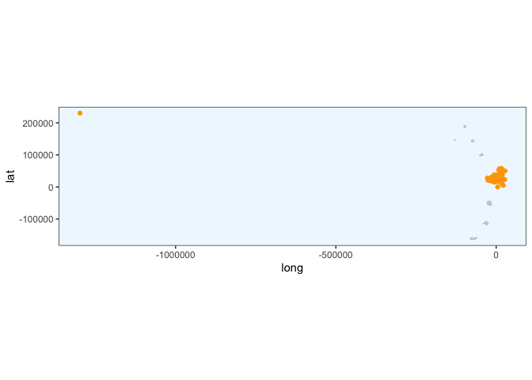
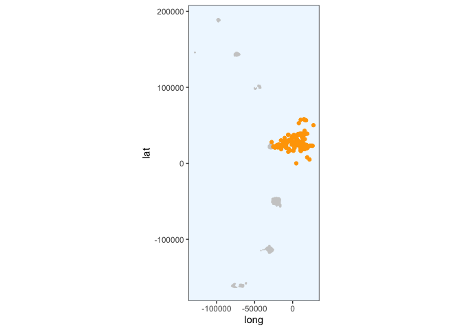
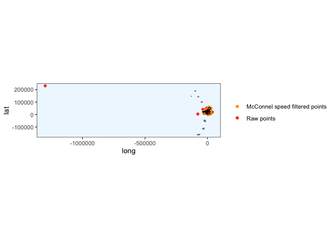
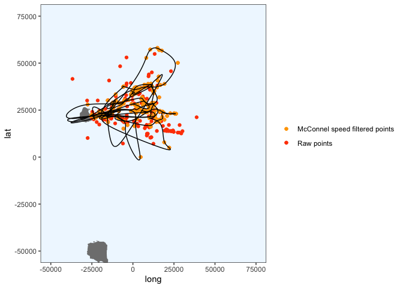

Crawl PTT 196700
================
Gemma Clucas
6/29/2020

``` r
knitr::opts_chunk$set(echo = TRUE)
library(tidyverse)
library(lubridate)
library(crawl)   #to fit Kalman filter models
library(trip)    #to prepare GPS data
library(maptools)
library(sp)
library(rgdal)
library(raster)
library(ggplot2)
library(knitr)
library(spdplyr)
options(scipen=999)
```

For an annotated version of this, look at
`1_Initial_Processing_with_Crawl.Rmd`

## Load data

This is the data that Claudia sent over on 30th June 2020.

``` r
raw <- read.csv("raw_data/satellite_tracking_data_30_06_20.csv")
```

## Prepare data for analysis

**Format times**

``` r
raw$Time <- mdy_hm(raw$Date, tz = "UTC")
raw$Time_since <- as.numeric(difftime(raw$Time, min(raw$Time), units="hours"))
raw <- raw[!duplicated(raw), ]
raw <- raw %>% 
  rename(Argos_loc_class = Loc.Class, LON = Lon1, LAT = Lat1)

clean <- raw %>% 
  dplyr::select(Ptt, Time, Time_since, LON, LAT, Argos_loc_class, Uplink)
```

## Create a map that we can plot the fixes onto later

``` r
Seamask<-readOGR("Seamask.shp")
```

    ## OGR data source with driver: ESRI Shapefile 
    ## Source: "/Users/gemmaclucas/GitHub/CHPE_Tracking_South_Sandwich_Islands/Seamask.shp", layer: "Seamask"
    ## with 1 features
    ## It has 1 fields

``` r
SSI <- crop(Seamask, c(450000, 750000, -600000, -100000))
```

    ## Warning in RGEOSUnaryPredFunc(spgeom, byid, "rgeos_isvalid"): Ring Self-
    ## intersection at or near point 77954.359424359995 26605.230663620001

    ## x[i, ] is invalid

    ## Warning in rgeos::gIntersection(x[i, ], y, byid = TRUE, drop_lower_td = TRUE):
    ## Invalid objects found; consider using set_RGEOS_CheckValidity(2L)

``` r
#Re-project to Lambert Azimuthal Equal Area
SSI_laea<-spTransform(SSI, CRS=CRS("+proj=laea +lon_0=-26 +lat_0=-58 +units=m"))

# convert to dataframe for use with ggplot2
SSI_laea@data$id = rownames(SSI_laea@data)
SSI_laea.points = fortify(SSI_laea, region="id")
SSI_laea.df = plyr::join(SSI_laea.points, SSI_laea@data, by="id")

# filter out only the polygons for the islands
SSI_laea.df <- SSI_laea.df %>% filter(hole == TRUE)


SSI_laea.df %>% 
  ggplot(aes(x = long, y = lat, group = group)) + 
  geom_polygon(fill="grey") +
  geom_path(color="grey") +
  coord_equal() +
  theme_bw() +
  theme(panel.grid.major = element_blank(), 
        panel.grid.minor = element_blank(),
        panel.background = element_rect(fill = "aliceblue"))
```

<!-- -->

## Create functions for the different steps

``` r
# define the function for selecting the data for one penguin and applying to McConnel speed filter
filter_points <-  function(penguin) {
  # select the data for the penguin
  x1 <- clean %>% dplyr::filter(Ptt == penguin)
  # order error classes
  x1$Argos_loc_class <- factor(x1$Argos_loc_class,  
                             levels=c("3","2","1","0", "A","B"))
  # adjust duplicate times
  x1$Time <- adjust.duplicateTimes(x1$Time, x1$Ptt)
  # select just the latitude, longitude, time and id columns
  x2 <- x1 %>% dplyr::select(LAT, LON, Time, Ptt)
  # make it spatial
  coordinates(x2) <- c("LON","LAT")
  # apply McConnel speed filter
  x2$Pass_speed <- x2 %>% 
    trip(., TORnames = c("Time","Ptt")) %>% 
    speedfilter(., max.speed = 8) 
  # filter the original data for the points that pass the speed filter
  x1 <- x1 %>% dplyr::filter(x2$Pass_speed == TRUE)
  # make the points spatial
  coordinates(x1) <- ~LON + LAT
  # give it a projection
  proj4string(x1) <- CRS("+proj=longlat +ellps=WGS84")
  # transform to LAEA centered around the south sandwich islands
  x1 <- spTransform(x1, CRS = CRS("+proj=laea +lon_0=-26 +lat_0=-58 +units=m"))
}


# define a function for plotting the cleaned data to check that it looks ok
plot_cleaned_points <- function(x) {
  ggplot() + 
    geom_polygon(data = SSI_laea.df, aes(x = long, y = lat, group = group), fill="grey80") +
    geom_path(data = SSI_laea.df, aes(x = long, y = lat, group = group), color="grey80") +
    coord_equal() +
    theme_bw() +
    theme(panel.grid.major = element_blank(), 
          panel.grid.minor = element_blank(),
          panel.background = element_rect(fill = "aliceblue")) +
    geom_point(data = x, aes(x = LON, y = LAT), colour = "orange")
}  

# define the prior for crawl
prior <-  function(p) { 
    dnorm(p[1], log(250), 0.2 , log = TRUE) +     # prior for 3
      dnorm(p[2], log(500), 0.2 , log = TRUE) +   # prior for 2
      dnorm(p[3], log(1500), 0.2, log = TRUE) +   # prior for 1
      dnorm(p[4], log(2500), 0.4 , log = TRUE) +  # prior for 0
      dnorm(p[5], log(2500), 0.4 , log = TRUE) +  # prior for A
      dnorm(p[6], log(2500), 0.4 , log = TRUE) +  # prior for B
      # skip p[7] as we won't provide a prior for sigma
      dnorm(p[8], -4, 2, log = TRUE)              # prior for beta
}


# define a function for crawling
crawl <- function(x1) {
  if(exists("fit1")){rm(fit1)}
  initial = list(a = c(coordinates(x1)[1,1], 0,
                     coordinates(x1)[1,2], 0),
               P = diag(c(10 ^ 2, 10 ^ 2, 10 ^ 2, 10 ^ 2)))
  fit1 <- crwMLE( 
    mov.model = ~1, 
    err.model=list(x=~Argos_loc_class-1), 
    drift=T, 
    data=x1, 
    Time.name="Time_since",  
    initial.state=initial, 
    prior=prior, 
    control=list(trace=1, REPORT=1)) 
}

# function for creating times where points will be predicted
predict_times <- function(x) {
  seq(min(x$Time_since), max(x$Time_since), 1/12)
}

# define a function for predicting points every 5 minutes, based on the crawled data
predict_points <- function(x, y) {
  crwPredict(object.crwFit = x, predTime = y, speedEst = TRUE, flat=TRUE)
}
  

# define a function for plotting the results of the crawled tracks against the original points
plot_crawled_track <- function() {
  # get the original data
  x3 <- clean %>% dplyr::filter(Ptt == penguin)
  # project original data to LAEA
  coordinates(x3) <- ~LON + LAT 
  proj4string(x3) <- CRS("+proj=longlat +ellps=WGS84")
  x3 <- spTransform(x3, CRS = CRS("+proj=laea +lon_0=-26 +lat_0=-58 +units=m"))
  # get just the coordinates from x3 and make a dataframe for plotting
  x3 <- coordinates(x3) %>% as.data.frame()
  # define the colour scheme
  colors <- c("Raw points" = "orangered", "McConnel speed filtered points" = "orange")
  # plot
  ggplot() + 
    geom_polygon(data = SSI_laea.df, aes(x = long, y = lat, group = group), fill="grey50") +
    geom_path(data = SSI_laea.df, aes(x = long, y = lat, group = group), color="grey50") +
    coord_equal() +
    geom_point(data = x3, aes(x = LON, y = LAT, colour = "Raw points") ) +
    geom_point(data = x1.df, aes(x = LON, y = LAT, colour = "McConnel speed filtered points")) +
    geom_path(data = predObj, aes(x = mu.x, y = mu.y)) +
    scale_color_manual(values = colors) +
    theme_bw() +
    theme(panel.grid.major = element_blank(), 
          panel.grid.minor = element_blank(),
          panel.background = element_rect(fill = "aliceblue"),
          legend.title = element_blank()) 
}

# zoom in on Saunders Island only
plot_crawled_track_Saunders <- function() {
  # get the original data
  x3 <- clean %>% dplyr::filter(Ptt == penguin)
  # project original data to LAEA
  coordinates(x3) <- ~LON + LAT 
  proj4string(x3) <- CRS("+proj=longlat +ellps=WGS84")
  x3 <- spTransform(x3, CRS = CRS("+proj=laea +lon_0=-26 +lat_0=-58 +units=m"))
  # get just the coordinates from x3 and make a dataframe for plotting
  x3 <- coordinates(x3) %>% as.data.frame()
  # define the colour scheme
  colors <- c("Raw points" = "orangered", "McConnel speed filtered points" = "orange")
  # plot
  ggplot() + 
    geom_polygon(data = SSI_laea.df, aes(x = long, y = lat, group = group), fill="grey50") +
    geom_path(data = SSI_laea.df, aes(x = long, y = lat, group = group), color="grey50") +
    coord_equal() +
    geom_point(data = x3, aes(x = LON, y = LAT, colour = "Raw points") ) +
    geom_point(data = x1.df, aes(x = LON, y = LAT, colour = "McConnel speed filtered points")) +
    geom_path(data = predObj, aes(x = mu.x, y = mu.y)) +
    scale_color_manual(values = colors) +
    theme_bw() +
    theme(panel.grid.major = element_blank(), 
          panel.grid.minor = element_blank(),
          panel.background = element_rect(fill = "aliceblue"),
          legend.title = element_blank()) +
    coord_cartesian(xlim = c(-50000, 75000),
                    ylim = c(-50000, 75000))

}
```

``` r
penguin <- "196700"
x1 <- filter_points(penguin)
```

    ## Warning in assume_if_longlat(out): input looks like longitude/latitude data,
    ## assuming +proj=longlat +datum=WGS84

``` r
# convert to dataframe for plotting
x1.df <- data.frame(x1)
plot_cleaned_points(x1.df)
```

<!-- -->

Get rid of that weird fix.

``` r
x1.df <- x1.df %>% dplyr::filter(LON > -500000)
plot_cleaned_points(x1.df)
```

<!-- -->

``` r
# then make x1.df spatial 
coordinates(x1.df) <- ~LON + LAT
# tell it it's already projected in LAEA centered around the south sandwich islands
proj4string(x1.df) <- CRS("+proj=laea +lon_0=-26 +lat_0=-58 +units=m")
# transform to LAEA centered around the south sandwich islands
x1.df <- spTransform(x1.df, CRS = CRS("+proj=laea +lon_0=-26 +lat_0=-58 +units=m"))

# rename back to x1 so that I can continue with the code below
x1 <- x1.df

# then recreate x1.df as a normal data frame
x1.df <- data.frame(x1)
```

Crawl (ran many times).

``` r
if(exists("fit1")){rm(fit1)} 
fit1 <- crawl(x1)
```

    ## Beginning SANN initialization ...

    ## Beginning likelihood optimization ...

    ##   Nelder-Mead direct search function minimizer
    ## function value for initial parameters = 10115.466293
    ##   Scaled convergence tolerance is 0.000150732
    ## Stepsize computed as 1.092312
    ## BUILD             11 10453.416015 9351.650393
    ## EXTENSION         13 10257.998791 8689.082704
    ## LO-REDUCTION      15 10177.181445 8689.082704
    ## LO-REDUCTION      17 10141.882782 8689.082704
    ## LO-REDUCTION      19 10115.466293 8689.082704
    ## LO-REDUCTION      21 10050.713020 8689.082704
    ## LO-REDUCTION      23 10030.553728 8689.082704
    ## LO-REDUCTION      25 9783.881698 8689.082704
    ## LO-REDUCTION      27 9748.356879 8689.082704
    ## LO-REDUCTION      29 9351.660556 8689.082704
    ## EXTENSION         31 9351.650393 8255.737746
    ## LO-REDUCTION      33 9188.067252 8255.737746
    ## LO-REDUCTION      35 8997.435259 8255.737746
    ## LO-REDUCTION      37 8988.538090 8255.737746
    ## LO-REDUCTION      39 8976.089110 8255.737746
    ## LO-REDUCTION      41 8962.892177 8255.737746
    ## EXTENSION         43 8942.348399 7973.192477
    ## LO-REDUCTION      45 8904.148003 7973.192477
    ## LO-REDUCTION      47 8814.957807 7973.192477
    ## LO-REDUCTION      49 8689.082704 7973.192477
    ## EXTENSION         51 8633.248905 7758.411173
    ## LO-REDUCTION      53 8624.484915 7758.411173
    ## EXTENSION         55 8472.838333 7524.248760
    ## LO-REDUCTION      57 8374.594773 7524.248760
    ## LO-REDUCTION      59 8325.291986 7524.248760
    ## LO-REDUCTION      61 8255.737746 7524.248760
    ## LO-REDUCTION      63 8159.355486 7524.248760
    ## LO-REDUCTION      65 8126.794953 7524.248760
    ## EXTENSION         67 7998.603721 7389.224515
    ## LO-REDUCTION      69 7988.787135 7389.224515
    ## REFLECTION        71 7973.192477 7224.337799
    ## LO-REDUCTION      73 7758.411173 7224.337799
    ## LO-REDUCTION      75 7629.068673 7224.337799
    ## LO-REDUCTION      77 7606.997291 7224.337799
    ## LO-REDUCTION      79 7559.839116 7224.337799
    ## LO-REDUCTION      81 7558.098251 7224.337799
    ## LO-REDUCTION      83 7551.337646 7224.337799
    ## LO-REDUCTION      85 7524.248760 7224.337799
    ## HI-REDUCTION      87 7411.687028 7224.337799
    ## LO-REDUCTION      89 7403.050711 7224.337799
    ## LO-REDUCTION      91 7401.774394 7224.337799
    ## LO-REDUCTION      93 7389.224515 7224.337799
    ## LO-REDUCTION      95 7350.075030 7224.337799
    ## LO-REDUCTION      97 7345.366548 7224.337799
    ## REFLECTION        99 7325.809038 7205.792956
    ## LO-REDUCTION     101 7310.144864 7205.792956
    ## LO-REDUCTION     103 7303.266995 7205.792956
    ## EXTENSION        105 7291.821922 7149.349568
    ## LO-REDUCTION     107 7266.801106 7149.349568
    ## LO-REDUCTION     109 7263.358707 7149.349568
    ## LO-REDUCTION     111 7257.718292 7149.349568
    ## LO-REDUCTION     113 7250.609734 7149.349568
    ## EXTENSION        115 7248.015848 7124.132375
    ## LO-REDUCTION     117 7244.133632 7124.132375
    ## EXTENSION        119 7239.178492 7118.683985
    ## EXTENSION        121 7224.337799 7040.936637
    ## LO-REDUCTION     123 7205.792956 7040.936637
    ## LO-REDUCTION     125 7179.678688 7040.936637
    ## LO-REDUCTION     127 7169.739469 7040.936637
    ## LO-REDUCTION     129 7164.747023 7040.936637
    ## LO-REDUCTION     131 7164.693020 7040.936637
    ## LO-REDUCTION     133 7158.928205 7040.936637
    ## LO-REDUCTION     135 7149.349568 7040.936637
    ## REFLECTION       137 7124.132375 7039.662055
    ## LO-REDUCTION     139 7118.683985 7039.662055
    ## LO-REDUCTION     141 7095.666810 7039.662055
    ## LO-REDUCTION     143 7095.547031 7039.662055
    ## EXTENSION        145 7088.034556 7028.803882
    ## EXTENSION        147 7087.142783 7018.227546
    ## LO-REDUCTION     149 7072.005332 7018.227546
    ## LO-REDUCTION     151 7068.672930 7018.227546
    ## REFLECTION       153 7063.398768 7010.267826
    ## EXTENSION        155 7060.486554 6975.552430
    ## LO-REDUCTION     157 7053.275742 6975.552430
    ## LO-REDUCTION     159 7050.154131 6975.552430
    ## LO-REDUCTION     161 7040.936637 6975.552430
    ## HI-REDUCTION     163 7039.662055 6975.552430
    ## LO-REDUCTION     165 7028.803882 6975.552430
    ## EXTENSION        167 7023.665322 6959.844801
    ## LO-REDUCTION     169 7021.970798 6959.844801
    ## EXTENSION        171 7018.723156 6934.348864
    ## LO-REDUCTION     173 7018.227546 6934.348864
    ## LO-REDUCTION     175 7010.267826 6934.348864
    ## LO-REDUCTION     177 7009.307670 6934.348864
    ## LO-REDUCTION     179 6996.752802 6934.348864
    ## REFLECTION       181 6993.529495 6930.930197
    ## REFLECTION       183 6978.815508 6921.726738
    ## REFLECTION       185 6975.552430 6918.828797
    ## REFLECTION       187 6973.087322 6916.976405
    ## LO-REDUCTION     189 6963.096470 6916.976405
    ## REFLECTION       191 6959.844801 6915.216159
    ## EXTENSION        193 6947.427073 6895.151552
    ## LO-REDUCTION     195 6945.333755 6895.151552
    ## LO-REDUCTION     197 6939.534437 6895.151552
    ## LO-REDUCTION     199 6934.348864 6895.151552
    ## LO-REDUCTION     201 6930.930197 6895.151552
    ## LO-REDUCTION     203 6922.317653 6895.151552
    ## LO-REDUCTION     205 6921.726738 6895.151552
    ## LO-REDUCTION     207 6918.828797 6895.151552
    ## REFLECTION       209 6916.976405 6892.428063
    ## EXTENSION        211 6915.216159 6869.544334
    ## LO-REDUCTION     213 6913.678417 6869.544334
    ## LO-REDUCTION     215 6910.519843 6869.544334
    ## LO-REDUCTION     217 6902.186133 6869.544334
    ## LO-REDUCTION     219 6898.158962 6869.544334
    ## LO-REDUCTION     221 6896.988986 6869.544334
    ## LO-REDUCTION     223 6896.565863 6869.544334
    ## LO-REDUCTION     225 6896.257468 6869.544334
    ## LO-REDUCTION     227 6895.151552 6869.544334
    ## LO-REDUCTION     229 6892.428063 6869.544334
    ## LO-REDUCTION     231 6889.772994 6869.544334
    ## EXTENSION        233 6881.747770 6859.603307
    ## LO-REDUCTION     235 6880.805522 6859.603307
    ## LO-REDUCTION     237 6879.929582 6859.603307
    ## EXTENSION        239 6879.727148 6853.308622
    ## LO-REDUCTION     241 6878.262603 6853.308622
    ## LO-REDUCTION     243 6874.970627 6853.308622
    ## LO-REDUCTION     245 6874.895172 6853.308622
    ## EXTENSION        247 6874.708000 6843.165839
    ## LO-REDUCTION     249 6871.731717 6843.165839
    ## LO-REDUCTION     251 6869.544334 6843.165839
    ## LO-REDUCTION     253 6861.833355 6843.165839
    ## LO-REDUCTION     255 6859.808976 6843.165839
    ## HI-REDUCTION     257 6859.743965 6843.165839
    ## LO-REDUCTION     259 6859.603307 6843.165839
    ## LO-REDUCTION     261 6856.497077 6843.165839
    ## LO-REDUCTION     263 6854.271506 6843.165839
    ## EXTENSION        265 6853.308622 6838.376786
    ## LO-REDUCTION     267 6853.292490 6838.376786
    ## LO-REDUCTION     269 6852.509986 6838.376786
    ## LO-REDUCTION     271 6850.078513 6838.376786
    ## LO-REDUCTION     273 6849.443151 6838.376786
    ## EXTENSION        275 6849.326868 6834.792339
    ## LO-REDUCTION     277 6848.580397 6834.792339
    ## LO-REDUCTION     279 6846.833601 6834.792339
    ## LO-REDUCTION     281 6846.731368 6834.792339
    ## REFLECTION       283 6843.649346 6833.262267
    ## EXTENSION        285 6843.165839 6828.281674
    ## LO-REDUCTION     287 6842.087282 6828.281674
    ## LO-REDUCTION     289 6840.558579 6828.281674
    ## LO-REDUCTION     291 6838.914957 6828.281674
    ## LO-REDUCTION     293 6838.497931 6828.281674
    ## LO-REDUCTION     295 6838.376786 6828.281674
    ## LO-REDUCTION     297 6836.652919 6828.281674
    ## LO-REDUCTION     299 6836.528908 6828.281674
    ## LO-REDUCTION     301 6834.792339 6828.281674
    ## LO-REDUCTION     303 6833.262267 6828.281674
    ## LO-REDUCTION     305 6833.147788 6828.281674
    ## LO-REDUCTION     307 6832.694897 6828.281674
    ## EXTENSION        309 6831.828417 6822.981694
    ## LO-REDUCTION     311 6831.551182 6822.981694
    ## LO-REDUCTION     313 6830.131853 6822.981694
    ## LO-REDUCTION     315 6829.435401 6822.981694
    ## LO-REDUCTION     317 6829.275308 6822.981694
    ## EXTENSION        319 6829.241490 6820.913564
    ## LO-REDUCTION     321 6828.736169 6820.913564
    ## LO-REDUCTION     323 6828.709976 6820.913564
    ## LO-REDUCTION     325 6828.600609 6820.913564
    ## EXTENSION        327 6828.281674 6819.124266
    ## REFLECTION       329 6824.852040 6819.103890
    ## LO-REDUCTION     331 6824.828219 6819.103890
    ## LO-REDUCTION     333 6824.817180 6819.103890
    ## REFLECTION       335 6824.710866 6818.947274
    ## REFLECTION       337 6824.089546 6817.686664
    ## EXTENSION        339 6822.981694 6812.513607
    ## LO-REDUCTION     341 6821.896043 6812.513607
    ## LO-REDUCTION     343 6821.447244 6812.513607
    ## LO-REDUCTION     345 6820.913564 6812.513607
    ## LO-REDUCTION     347 6820.438723 6812.513607
    ## LO-REDUCTION     349 6819.952004 6812.513607
    ## EXTENSION        351 6819.124266 6808.508933
    ## LO-REDUCTION     353 6819.103890 6808.508933
    ## LO-REDUCTION     355 6818.947274 6808.508933
    ## LO-REDUCTION     357 6817.686664 6808.508933
    ## LO-REDUCTION     359 6816.626531 6808.508933
    ## EXTENSION        361 6814.816782 6805.747739
    ## LO-REDUCTION     363 6814.709336 6805.747739
    ## LO-REDUCTION     365 6813.921122 6805.747739
    ## LO-REDUCTION     367 6813.865804 6805.747739
    ## LO-REDUCTION     369 6813.632737 6805.747739
    ## LO-REDUCTION     371 6813.552471 6805.747739
    ## EXTENSION        373 6812.513607 6801.686575
    ## LO-REDUCTION     375 6809.958692 6801.686575
    ## LO-REDUCTION     377 6809.864881 6801.686575
    ## LO-REDUCTION     379 6809.322524 6801.686575
    ## EXTENSION        381 6808.508933 6799.977882
    ## LO-REDUCTION     383 6808.155908 6799.977882
    ## LO-REDUCTION     385 6807.287269 6799.977882
    ## LO-REDUCTION     387 6806.664271 6799.977882
    ## LO-REDUCTION     389 6805.753809 6799.977882
    ## EXTENSION        391 6805.747739 6798.139201
    ## LO-REDUCTION     393 6804.873809 6798.139201
    ## LO-REDUCTION     395 6803.910812 6798.139201
    ## EXTENSION        397 6803.036992 6796.205420
    ## LO-REDUCTION     399 6801.890234 6796.205420
    ## LO-REDUCTION     401 6801.703598 6796.205420
    ## LO-REDUCTION     403 6801.686575 6796.205420
    ## LO-REDUCTION     405 6801.575478 6796.205420
    ## REFLECTION       407 6800.027787 6796.043838
    ## LO-REDUCTION     409 6799.977882 6796.043838
    ## HI-REDUCTION     411 6799.315635 6796.043838
    ## EXTENSION        413 6799.134932 6793.518843
    ## LO-REDUCTION     415 6798.966478 6793.518843
    ## LO-REDUCTION     417 6798.139201 6793.518843
    ## LO-REDUCTION     419 6797.983128 6793.518843
    ## EXTENSION        421 6797.829278 6792.890166
    ## LO-REDUCTION     423 6797.363598 6792.890166
    ## LO-REDUCTION     425 6797.066981 6792.890166
    ## LO-REDUCTION     427 6796.817799 6792.890166
    ## EXTENSION        429 6796.205420 6791.805993
    ## LO-REDUCTION     431 6796.043838 6791.805993
    ## REFLECTION       433 6795.243360 6791.793339
    ## LO-REDUCTION     435 6795.230697 6791.793339
    ## EXTENSION        437 6794.284825 6790.556644
    ## EXTENSION        439 6794.265045 6789.951580
    ## LO-REDUCTION     441 6794.226433 6789.951580
    ## LO-REDUCTION     443 6794.183813 6789.951580
    ## LO-REDUCTION     445 6793.518843 6789.951580
    ## HI-REDUCTION     447 6792.890166 6789.951580
    ## EXTENSION        449 6792.517122 6787.888646
    ## LO-REDUCTION     451 6792.075090 6787.888646
    ## LO-REDUCTION     453 6791.805993 6787.888646
    ## LO-REDUCTION     455 6791.793339 6787.888646
    ## LO-REDUCTION     457 6791.540271 6787.888646
    ## LO-REDUCTION     459 6791.450958 6787.888646
    ## EXTENSION        461 6790.602134 6786.417190
    ## LO-REDUCTION     463 6790.556644 6786.417190
    ## LO-REDUCTION     465 6790.240529 6786.417190
    ## LO-REDUCTION     467 6790.191992 6786.417190
    ## LO-REDUCTION     469 6790.022472 6786.417190
    ## LO-REDUCTION     471 6789.951580 6786.417190
    ## LO-REDUCTION     473 6789.894953 6786.417190
    ## EXTENSION        475 6788.806076 6783.756414
    ## LO-REDUCTION     477 6788.555342 6783.756414
    ## LO-REDUCTION     479 6788.513398 6783.756414
    ## LO-REDUCTION     481 6788.354858 6783.756414
    ## LO-REDUCTION     483 6787.888646 6783.756414
    ## LO-REDUCTION     485 6787.631274 6783.756414
    ## EXTENSION        487 6787.420688 6782.907808
    ## EXTENSION        489 6786.882216 6780.771133
    ## LO-REDUCTION     491 6786.583721 6780.771133
    ## LO-REDUCTION     493 6786.417190 6780.771133
    ## LO-REDUCTION     495 6785.809856 6780.771133
    ## LO-REDUCTION     497 6785.501588 6780.771133
    ## EXTENSION        499 6784.820227 6777.817754
    ## Exiting from Nelder Mead minimizer
    ##     501 function evaluations used

    ## Warning in sqrt(diag(Cmat)): NaNs produced

``` r
print(fit1)
```

    ## 
    ## 
    ## Continuous-Time Correlated Random Walk fit
    ## 
    ## Models:
    ## --------
    ## Movement   ~ 1
    ## Error   ~Argos_loc_class - 1
    ## with Random Drift
    ## 
    ##                         Parameter Est. St. Err. 95% Lower 95% Upper
    ## ln tau Argos_loc_class3          5.391    0.196     5.007     5.776
    ## ln tau Argos_loc_class2          5.982    0.191     5.608     6.356
    ## ln tau Argos_loc_class1          6.579    0.177     6.232     6.927
    ## ln tau Argos_loc_class0          8.664    0.394     7.892     9.436
    ## ln tau Argos_loc_classA          6.318    0.147     6.030     6.607
    ## ln tau Argos_loc_classB          6.724      NaN       NaN       NaN
    ## ln sigma (Intercept)            -0.239  699.053 -1370.382  1369.905
    ## ln beta (Intercept)             -1.225      NaN       NaN       NaN
    ## ln sigma.drift/sigma             9.615  699.053 -1360.529  1379.758
    ## ln psi-1                        -7.261    8.974   -24.849    10.327
    ## 
    ## 
    ## Log Likelihood = -3388.909 
    ## AIC = 6797.818

This was the best I could get, but the tracks look ok below

``` r
predTime <- predict_times(x1)
predObj <- predict_points(fit1, predTime)

plot_crawled_track()
```

<!-- -->

``` r
plot_crawled_track_Saunders()
```

    ## Coordinate system already present. Adding new coordinate system, which will replace the existing one.

<!-- --> **A lot
of points seem to have been filtered by the speed filter - should it be
more lenient?**

Write to
CSV:

``` r
write.csv(predObj, paste0("predicted_tracks/", penguin, "_track.csv", sep = ""), row.names = FALSE)
```
