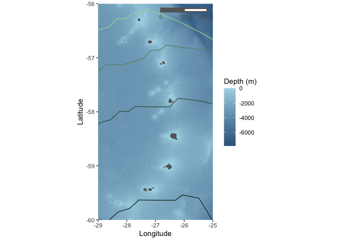
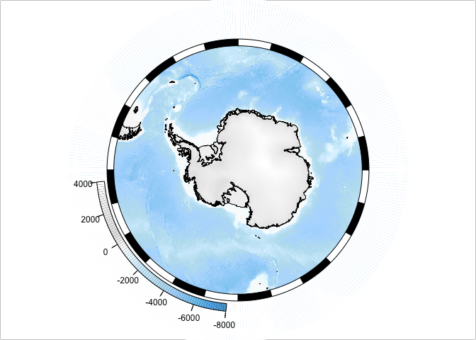
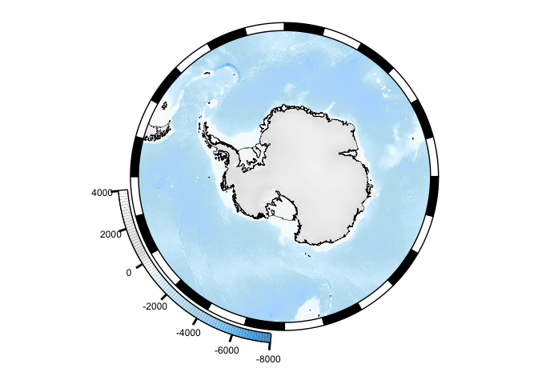

Maps
================
Gemma Clucas
6/7/2021

# Map of study area (Figure 1)

## All islands

Read in bathymetry data.

``` r
SSI_bath_WGS84 <- raster("ssi_geotif/full_ssi18a.tif") %>% 
  projectRaster(., crs=crs("+init=epsg:4326")) %>% 
  crop(., c(-35, -20, -65, -50))

# SSI_bath_WGS84 %>% crop(., c(-26.6, -26.35, -57.85, -57.75)) %>% plot()
# Plot to check
#plot(SSI_bath_WGS84, col=viridis(100, option = "mako"))
```

Note this has the elevation of the island -\> must remove before making
into bathymtery plot.

These are the polygons for the coastline.

``` r
SSI_WGS84 <- readOGR("Seamask.shp")
```

    ## OGR data source with driver: ESRI Shapefile 
    ## Source: "/Volumes/Data_SS1/CHPE_Tracking_South_Sandwich_Islands/Seamask.shp", layer: "Seamask"
    ## with 1 features
    ## It has 1 fields

``` r
SSI_polygons <- crop(SSI_WGS84, c(450000, 1095192, -695043.9, -100000)) %>% 
  spTransform(., crs("+init=epsg:4326"))
```

    ## Warning in RGEOSUnaryPredFunc(spgeom, byid, "rgeos_isvalid"): Ring
    ## Self-intersection at or near point 77954.359424359995 26605.230663620001

    ## x[i, ] is invalid

    ## Attempting to make x[i, ] valid by zero-width buffering

Function to convert SpatialPolygonsDataFrame to regular dataframe.

``` r
spatialpolygons_to_df <- function(sp) {
  sp@data$id = rownames(sp@data)
  sp.points = fortify(sp, region="id")
  sp.df = plyr::join(sp.points, sp@data, by="id")
}
```

Convert and plot.

``` r
SSI_polygons.df <- spatialpolygons_to_df(SSI_polygons)

# filter out only the polygons for the islands
SSI_polygons.df <- SSI_polygons.df %>% filter(hole == TRUE)

# plot
# SSI_polygons.df %>% 
#   ggplot(aes(x = long, y = lat, group = group)) + 
#   geom_polygon(fill="grey") +
#   geom_path(color="grey") +
#   theme_bw() +
#   coord_fixed() +
#   theme(panel.grid.major = element_blank(), 
#         panel.grid.minor = element_blank(),
#         panel.background = element_rect(fill = "aliceblue"))
```

# MPA boundaries

These are all individual shape files that I have downloaded from
[here](https://add.data.bas.ac.uk/repository/entry/show?entryid=7f3136e7-8b50-4909-bb82-f4223a4f9768).
There is a useful [viewer](https://sggis.gov.gs/) too. They are in some
weird projection so I am converting all to WGS84 before plotting.

``` r
# # This is the entire extent of the MPA around SG and SSI
# SGSSI_MPA <- readOGR("MPA/SG_MPA/sg_mpa.shp") %>% 
#   spTransform(., crs("+init=epsg:4326"))
# #plot(SGSSI_MPA)
# SGSSI_MPA.df <- spatialpolygons_to_df(SGSSI_MPA)
# 
# # CCAMLR management areas
CCAMLR <- readOGR("MPA/Ccamlr_zones/Ccamlr_zones.shp") %>%
  spTransform(., crs("+init=epsg:4326"))
```

    ## OGR data source with driver: ESRI Shapefile 
    ## Source: "/Volumes/Data_SS1/CHPE_Tracking_South_Sandwich_Islands/MPA/Ccamlr_zones/Ccamlr_zones.shp", layer: "Ccamlr_zones"
    ## with 4 features
    ## It has 3 fields
    ## Integer64 fields read as strings:  id

``` r
#plot(CCAMLR)
CCAMLR.df <- spatialpolygons_to_df(CCAMLR)

# 50 km no-take zone around SSI
NoTake_50km <- readOGR("MPA/sg_mpa_notake_ssi50km/sg_mpa_notake_ssi50km.shp") %>% 
  spTransform(., crs("+init=epsg:4326"))
```

    ## OGR data source with driver: ESRI Shapefile 
    ## Source: "/Volumes/Data_SS1/CHPE_Tracking_South_Sandwich_Islands/MPA/sg_mpa_notake_ssi50km/sg_mpa_notake_ssi50km.shp", layer: "sg_mpa_notake_ssi50km"
    ## with 1 features
    ## It has 2 fields
    ## Integer64 fields read as strings:  Id

``` r
#plot(NoTake_50km)
NoTake_50km.df <- spatialpolygons_to_df(NoTake_50km)

# # 50 km no-take zone around SSI trench
# NoTake_Trench50km <- readOGR("MPA/sg_mpa_notake_ssitrench50km/sg_mpa_notake_ssitrench50km.shp") %>% 
#   spTransform(., crs("+init=epsg:4326"))
# #plot(NoTake_Trench50km)
# NoTake_Trench50km.df <- spatialpolygons_to_df(NoTake_Trench50km)
# 
# # No-take zone south of 60 South
# NoTake_60South <- readOGR("MPA/sg_mpa_notake_s60s/sg_mpa_notake_s60s.shp") %>% 
#   spTransform(., crs("+init=epsg:4326"))
# #plot(NoTake_60South)
# NoTake_60South.df <- spatialpolygons_to_df(NoTake_60South)
# 
# # Pelagic closed areas (just SSI)
# Pelagic_closed <- readOGR("MPA/sg_mpa_pelagic_closed_areas/sg_mpa_pelagic_closed_areas.shp") %>% 
#   spTransform(., crs("+init=epsg:4326"))
# #plot(Pelagic_closed)
# Pelagic_closed.df <- spatialpolygons_to_df(Pelagic_closed)
# 
# # Benthic closed areas (includes SG, not just SSI)
# Benthic_closed <- readOGR("MPA/sg_mpa_benthic_closed_areas/sg_mpa_benthic_closed_areas.shp") %>% 
#   spTransform(., crs("+init=epsg:4326"))
# #plot(Benthic_closed)
# Benthic_closed.df <- spatialpolygons_to_df(Benthic_closed)

# CCAMLR management areas
CCAMLR2 <- readOGR("MPA/asd-shapefile-WGS84/asd-shapefile-WGS84.shp") %>%
  spTransform(., crs("+init=epsg:4326")) %>% 
  gBuffer(., byid=TRUE, width=0) %>%  # I was getting an error here about bad polygons, this is a hack to solve it
  crop(., c(-75, -20, -65, -50))
```

    ## OGR data source with driver: ESRI Shapefile 
    ## Source: "/Volumes/Data_SS1/CHPE_Tracking_South_Sandwich_Islands/MPA/asd-shapefile-WGS84/asd-shapefile-WGS84.shp", layer: "asd-shapefile-WGS84"
    ## with 19 features
    ## It has 13 fields

    ## Warning in gBuffer(., byid = TRUE, width = 0): Spatial object is not projected;
    ## GEOS expects planar coordinates

``` r
plot(CCAMLR2)
```

<!-- -->

``` r
CCAMLR2.df <- spatialpolygons_to_df(CCAMLR2)
```

## Figure 1, Panel B Sea ice

Plot the islands with the bathymetry. MPA stuff off for now.

``` r
# Use mask() to cut out land from the bathymetry raster
bathy_mask <- mask(SSI_bath_WGS84, SSI_WGS84, inverse=F) %>% 
  crop(., c(-29, -25, -60, -56))

# set positive values to zero
bathy_mask[bathy_mask > 0] <- 0

# read in sea ice extent

# May_ice <- readOGR("Sea ice medians/median_extent_S_05_1981-2010_polyline_v3.0.shp") %>% 
#   spTransform(., crs("+init=epsg:4326")) %>% 
#   crop(., c(-29, -25, -60, -56)) %>% 
#   spatialpolygons_to_df()

June_ice <- readOGR("Sea ice medians/median_extent_S_06_1981-2010_polyline_v3.0.shp") %>% 
  spTransform(., crs("+init=epsg:4326")) %>% 
  crop(., c(-29, -25, -60, -56)) %>% 
  spatialpolygons_to_df()
```

    ## OGR data source with driver: ESRI Shapefile 
    ## Source: "/Volumes/Data_SS1/CHPE_Tracking_South_Sandwich_Islands/Sea ice medians/median_extent_S_06_1981-2010_polyline_v3.0.shp", layer: "median_extent_S_06_1981-2010_polyline_v3.0"
    ## with 1 features
    ## It has 1 fields
    ## Integer64 fields read as strings:  FID

``` r
July_ice <- readOGR("Sea ice medians/median_extent_S_07_1981-2010_polyline_v3.0.shp") %>% 
  spTransform(., crs("+init=epsg:4326")) %>% 
  crop(., c(-29, -25, -60, -56)) %>% 
  spatialpolygons_to_df()
```

    ## OGR data source with driver: ESRI Shapefile 
    ## Source: "/Volumes/Data_SS1/CHPE_Tracking_South_Sandwich_Islands/Sea ice medians/median_extent_S_07_1981-2010_polyline_v3.0.shp", layer: "median_extent_S_07_1981-2010_polyline_v3.0"
    ## with 1 features
    ## It has 1 fields
    ## Integer64 fields read as strings:  FID

``` r
August_ice <- readOGR("Sea ice medians/median_extent_S_08_1981-2010_polyline_v3.0.shp") %>% 
  spTransform(., crs("+init=epsg:4326")) %>% 
  crop(., c(-29, -25, -60, -56)) %>% 
  spatialpolygons_to_df()
```

    ## OGR data source with driver: ESRI Shapefile 
    ## Source: "/Volumes/Data_SS1/CHPE_Tracking_South_Sandwich_Islands/Sea ice medians/median_extent_S_08_1981-2010_polyline_v3.0.shp", layer: "median_extent_S_08_1981-2010_polyline_v3.0"
    ## with 1 features
    ## It has 1 fields
    ## Integer64 fields read as strings:  FID

``` r
September_ice <- readOGR("Sea ice medians/median_extent_S_09_1981-2010_polyline_v3.0.shp") %>% 
  spTransform(., crs("+init=epsg:4326")) %>% 
  crop(., c(-29, -25, -60, -56)) %>% 
  spatialpolygons_to_df()
```

    ## OGR data source with driver: ESRI Shapefile 
    ## Source: "/Volumes/Data_SS1/CHPE_Tracking_South_Sandwich_Islands/Sea ice medians/median_extent_S_09_1981-2010_polyline_v3.0.shp", layer: "median_extent_S_09_1981-2010_polyline_v3.0"
    ## with 1 features
    ## It has 1 fields
    ## Integer64 fields read as strings:  FID

``` r
October_ice <- readOGR("Sea ice medians/median_extent_S_10_1981-2010_polyline_v3.0.shp") %>% 
  spTransform(., crs("+init=epsg:4326")) %>% 
  crop(., c(-29, -25, -60, -56)) %>% 
  spatialpolygons_to_df()
```

    ## OGR data source with driver: ESRI Shapefile 
    ## Source: "/Volumes/Data_SS1/CHPE_Tracking_South_Sandwich_Islands/Sea ice medians/median_extent_S_10_1981-2010_polyline_v3.0.shp", layer: "median_extent_S_10_1981-2010_polyline_v3.0"
    ## with 1 features
    ## It has 1 fields
    ## Integer64 fields read as strings:  FID

``` r
November_ice <- readOGR("Sea ice medians/median_extent_S_11_1981-2010_polyline_v3.0.shp") %>% 
  spTransform(., crs("+init=epsg:4326")) %>% 
  crop(., c(-29, -25, -60, -56)) %>% 
  spatialpolygons_to_df()
```

    ## OGR data source with driver: ESRI Shapefile 
    ## Source: "/Volumes/Data_SS1/CHPE_Tracking_South_Sandwich_Islands/Sea ice medians/median_extent_S_11_1981-2010_polyline_v3.0.shp", layer: "median_extent_S_11_1981-2010_polyline_v3.0"
    ## with 1 features
    ## It has 1 fields
    ## Integer64 fields read as strings:  FID

``` r
December_ice <- readOGR("Sea ice medians/median_extent_S_12_1981-2010_polyline_v3.0.shp") %>% 
  spTransform(., crs("+init=epsg:4326")) %>% 
  crop(., c(-29, -25, -60, -56)) %>% 
  spatialpolygons_to_df()
```

    ## OGR data source with driver: ESRI Shapefile 
    ## Source: "/Volumes/Data_SS1/CHPE_Tracking_South_Sandwich_Islands/Sea ice medians/median_extent_S_12_1981-2010_polyline_v3.0.shp", layer: "median_extent_S_12_1981-2010_polyline_v3.0"
    ## with 1 features
    ## It has 1 fields
    ## Integer64 fields read as strings:  FID

``` r
# January_ice <- readOGR("Sea ice medians/median_extent_S_01_1981-2010_polyline_v3.0.shp") %>% 
#   spTransform(., crs("+init=epsg:4326")) %>% 
#   crop(., c(-29, -25, -60, -56)) %>% 
#   spatialpolygons_to_df()
# 
# February_ice <- readOGR("Sea ice medians/median_extent_S_02_1981-2010_polyline_v3.0.shp") %>% 
#   spTransform(., crs("+init=epsg:4326")) %>% 
#   crop(., c(-29, -25, -60, -56)) %>% 
#   spatialpolygons_to_df()

# Make a plot using the marmap package
dat <- marmap::as.bathy(bathy_mask)
autoplot(dat, geom=c("raster"), coast = FALSE) + 
  scale_fill_gradient(low = "steelblue4", high = "lightblue") +
  geom_polygon(data = SSI_polygons.df, aes(x = long, y = lat, group = group), fill = "grey40", colour = "grey40", size = 0.1) +
  #geom_path(data = June_ice, aes(x = long, y = lat, group = group), colour = "#b3efb2") +
  #geom_path(data = July_ice, aes(x = long, y = lat, group = group), colour = "#a1d8a2") +
  #geom_path(data = August_ice, aes(x = long, y = lat, group = group), colour = "#b3efb2") +
  geom_path(data = September_ice, aes(x = long, y = lat, group = group), colour = "#a1d8a2") +
  geom_path(data = October_ice, aes(x = long, y = lat, group = group), colour = "#699271") +
  geom_path(data = November_ice, aes(x = long, y = lat, group = group), colour = "#446450") +
  geom_path(data = December_ice, aes(x = long, y = lat, group = group), colour = "#1e352f") +
  #geom_path(data = January_ice, aes(x = long, y = lat, group = group), colour = "#446450") +
  #geom_path(data = February_ice, aes(x = long, y = lat, group = group), colour = "#1e352f") +
  #geom_polygon(data = NoTake_50km.df, aes(x = long, y = lat, group = group), fill = NA, colour = "grey40") +
  ylab("Latitude") +
  xlab("Longitude") +
  labs(fill = "Depth (m)") +
  ggsn::scalebar(SSI_polygons.df, location = "bottomright", 
                 dist = 50, height=0.02, dist_unit = "km", transform = TRUE, model = "WGS84",
                 box.fill = c("grey40", "white"), st.color = "grey40", box.color = "grey40",
                 anchor = c(x = -25.2, y = -56.15), st.size = 3, st.dist = 0.03)
```

    ## Warning: Using `size` aesthetic for lines was deprecated in ggplot2 3.4.0.

    ## Warning: Please use `linewidth` instead.

<!-- -->

``` r
  # xlim(c(-29, -25)) +
  # ylim(c(-60, -55.5)) +
  # theme(panel.background = element_rect(fill = "white", colour = "grey60")) 

# ggsave(filename = "Figures/Figure1_panel2.pdf", dpi = 300, device = "pdf",
#       height = 3.5, width = 3.5, units = "in")
```

Adding text labels to the map seems to take forever, so I’ll have to
manually add them.

Tweaking the map for Tom, to make the scale bar look better

``` r
autoplot(dat, geom=c("raster"), coast = FALSE) + 
  scale_fill_gradient(low = "steelblue4", high = "lightblue") +
  geom_polygon(data = SSI_polygons.df, 
               aes(x = long, y = lat, group = group), 
               fill = "grey40", 
               colour = "grey40", 
               size = 0.1) +
  #geom_path(data = June_ice, aes(x = long, y = lat, group = group), colour = "#b3efb2") +
  #geom_path(data = July_ice, aes(x = long, y = lat, group = group), colour = "#a1d8a2") +
  #geom_path(data = August_ice, aes(x = long, y = lat, group = group), colour = "#b3efb2") +
  geom_path(data = September_ice, aes(x = long, y = lat, group = group), colour = "#a1d8a2") +
  geom_path(data = October_ice, aes(x = long, y = lat, group = group), colour = "#699271") +
  geom_path(data = November_ice, aes(x = long, y = lat, group = group), colour = "#446450") +
  geom_path(data = December_ice, aes(x = long, y = lat, group = group), colour = "#1e352f") +
  #geom_path(data = January_ice, aes(x = long, y = lat, group = group), colour = "#446450") +
  #geom_path(data = February_ice, aes(x = long, y = lat, group = group), colour = "#1e352f") +
  #geom_polygon(data = NoTake_50km.df, aes(x = long, y = lat, group = group), fill = NA, colour = "grey40") +
  ylab("Latitude") +
  xlab("Longitude") +
  labs(fill = "Depth (m)") +
  ggsn::scalebar(SSI_polygons.df, location = "bottomright", 
                 dist = 25, height=0.02, dist_unit = "km", transform = TRUE, model = "WGS84",
                 box.fill = c("grey30", "white"), st.color = "grey30", box.color = "grey30",
                 anchor = c(x = -25.4, y = -56.15), st.size = 2.5, st.dist = 0.03) +
  theme(text=element_text(size=10))
```

<!-- -->

``` r
# ggsave(filename = "Figures/SSI_for_Tom.pdf", dpi = 300, device = "pdf",
#       height = 5, width = 3.5, units = "in")
```

## Larger map using ggOceanMaps

``` r
# library(ggOceanMaps)
# 
# dt <- data.frame(lon = c(-40, -40, -20, -20), lat = c(-65, -50, -50, -65))
# 
# # with north at zero degrees
# basemap(data = dt, bathymetry = TRUE,  bathy.style = "poly_blues") 
# 
# # or north at the centre of the map
# basemap(data = dt, bathymetry = TRUE,  rotate = TRUE, bathy.style = "poly_blues") 
# 
# # Find out how to rotate it
# 
# basemap(-60, bathymetry = TRUE, bathy.style = "poly_greys", land.col = "white")
# 

# basemap(-60, bathymetry = TRUE, glaciers = TRUE)
```

I’m not sure I can control the colours with this map that well, so
perhaps I should use marmap instead.

## Figure 1, panel A

``` r
# This should load next time from a saved matrix
papoue <- getNOAA.bathy(lon1 = -75.00, lon2 = -20.00, lat1 = -65.00, lat2 = -50.00, resolution = 1.00, keep = TRUE)
```

    ## File already exists ; loading 'marmap_coord_-75;-65;-20;-50_res_1.csv'

For this I think I need a coastlines shapefile so that I can plot them
as a separate layer, rather than relying on marmap, which plots empty
coasts.

``` r
# get the coastline polygons but don't crop out SG this time
SGSSI_WGS84.df <- readOGR("Seamask.shp") %>% 
  spTransform(., crs("+init=epsg:4326")) %>% 
  spatialpolygons_to_df()
```

    ## OGR data source with driver: ESRI Shapefile 
    ## Source: "/Volumes/Data_SS1/CHPE_Tracking_South_Sandwich_Islands/Seamask.shp", layer: "Seamask"
    ## with 1 features
    ## It has 1 fields

    ## Warning in RGEOSUnaryPredFunc(spgeom, byid, "rgeos_isvalid"): Ring
    ## Self-intersection at or near point -35.789159179999999 -54.754994570000001

    ## SpP is invalid

    ## Warning in rgeos::gUnaryUnion(spgeom = SpP, id = IDs): Invalid objects found;
    ## consider using set_RGEOS_CheckValidity(2L)

``` r
# filter out only the polygons for the islands
SGSSI_WGS84.df  <- SGSSI_WGS84.df  %>% filter(hole == TRUE)

# coastline shapefile
world_coasts <- readOGR("ne_10m_coastline/ne_10m_coastline.shp") %>% 
  spTransform(., crs("+init=epsg:4326")) %>% 
  crop(., c(-75, -20, -65, -50)) %>% 
  spatialpolygons_to_df()
```

    ## OGR data source with driver: ESRI Shapefile 
    ## Source: "/Volumes/Data_SS1/CHPE_Tracking_South_Sandwich_Islands/ne_10m_coastline/ne_10m_coastline.shp", layer: "ne_10m_coastline"
    ## with 4133 features
    ## It has 3 fields
    ## Integer64 fields read as strings:  scalerank

``` r
# fronts shapefile
fronts <- readOGR("Fronts/all_fronts.shp") %>% 
  spTransform(., crs("+init=epsg:4326")) %>% 
  crop(., c(-75, -20, -65, -50)) %>% 
  spatialpolygons_to_df()
```

    ## OGR data source with driver: ESRI Shapefile 
    ## Source: "/Volumes/Data_SS1/CHPE_Tracking_South_Sandwich_Islands/Fronts/all_fronts.shp", layer: "all_fronts"
    ## with 7 features
    ## It has 3 fields

Plot.

``` r
papoue[papoue > 0] <- NA

autoplot(papoue, geom=c("raster"), coast = FALSE) + 
  scale_fill_gradient(low = "steelblue4", high = "lightblue") +
  geom_polygon(data = CCAMLR2.df, aes(x = long, y = lat, group = group), 
               fill = NA, colour = "black", size = 0.1, linetype = "dashed") +
  geom_polygon(data = SGSSI_WGS84.df, aes(x = long, y = lat, group = group), fill = "grey40", colour = "grey40", size = 0.1) +
  geom_polygon(data = world_coasts, aes(x = long, y = lat, group = group), fill = "grey40", colour = "grey40", size = 0.1) +
  geom_path(data = fronts %>% filter(., id %in% c("6 1")), aes(x = long, y = lat, group = group), colour = "#EAAC8B") +
  geom_path(data = fronts %>% filter(., id %in% c("3 1", "4 1", "5 1")), aes(x = long, y = lat, group = group), colour = "#e56b6f") +
  geom_path(data = fronts %>% filter(., id %in% c("2 1", "1 1")), aes(x = long, y = lat, group = group), colour = "#b56576") +
  geom_path(data = fronts %>% filter(., id %in% c("7 1")), aes(x = long, y = lat, group = group), colour = "#6d597a") +
  ylab("Latitude") +
  xlab("Longitude") +
  labs(fill = "Depth (m)") +
  ggsn::scalebar(world_coasts, location = "bottomright", 
                 dist = 200, height=0.015, dist_unit = "km", transform = TRUE, model = "WGS84",
                 box.fill = c("grey40", "white"), st.color = "grey40", box.color = "grey40",
                 anchor = c(x = -25, y = -64.15), st.size = 2, st.dist = 0.03)
```

<!-- -->

``` r
  #theme(legend.position = "none")

# ggsave(filename = "Figures/Figure1_panel1.pdf", dpi = 300, device = "pdf",
#        height = 3.5, width = 8, units = "in")


# SACCF = 2 1 and 1 1
# APF = 3 1 and 4 1 and 5 1
# SACCB = 7 1
# SAF = 6 1
```

## Inset Map for Tom

Playing around with
[SOmap](https://australianantarcticdivision.github.io/SOmap/articles/SOmap-introduction.html)

``` r
#remotes::install_github("AustralianAntarcticDivision/SOmap")
library(SOmap)
## also define a colour map to use for some examples
my_cmap <- colorRampPalette(c("#4D4140", "#596F7E", "#168B98", "#ED5B67",
                              "#E27766", "#DAAD50", "#EAC3A6"))(51)
base_map <- SOmap(trim = -50) ## plot to 40S
```

    ## old-style crs object detected; please recreate object with a recent sf::st_crs()
    ## old-style crs object detected; please recreate object with a recent sf::st_crs()
    ## old-style crs object detected; please recreate object with a recent sf::st_crs()

``` r
plot(base_map)
```

<!-- -->

``` r
## add the exclusive economic zones management layer
# SOmanagement(eez = TRUE)

SOgg(base_map)
```

    ## Warning: The `guide` argument in `scale_*()` cannot be `FALSE`. This was
    ## deprecated in ggplot2 3.3.4.

    ## Warning: Please use "none" instead.

<!-- -->

``` r
# ggsave(filename = "Figures/Antarctica_for_Tom.pdf", dpi = 300, device = "pdf",
#        height = 5, width = 5, units = "in")
```

## Figure 1, Panel C

``` r
# I downloaded the contour for SSI from the South Georgia GIS website
SSI_contours.df <- readOGR("Ssi_contours/Ssi_contours.shp") %>% 
  spTransform(., crs("+init=epsg:4326")) %>% 
  crop(., c(-27, -26, -58, -57.5)) %>% 
  spatialpolygons_to_df()
```

    ## OGR data source with driver: ESRI Shapefile 
    ## Source: "/Volumes/Data_SS1/CHPE_Tracking_South_Sandwich_Islands/Ssi_contours/Ssi_contours.shp", layer: "Ssi_contours"
    ## with 177 features
    ## It has 4 fields
    ## Integer64 fields read as strings:  id index100

``` r
# crop the bathymetry to just the area around Saunders
Saunders_bathy_mask <- bathy_mask  %>%  crop(., c(-26.6, -26.35, -57.85, -57.75))
Saunders_bathy <- marmap::as.bathy(Saunders_bathy_mask)

# crop the island polygons to just Saunders
Saunders_polygon.df <- SSI_polygons %>% crop(., c(-26.6, -26.35, -57.85, -57.75)) %>% spatialpolygons_to_df()
Saunders_polygon.df <- Saunders_polygon.df %>% filter(hole == TRUE)


# autoplot(Saunders_bathy, geom=c("raster", "contour"), coast = FALSE, colour = "white", size = 0.1) + 
#   scale_fill_gradient(low = "steelblue4", high = "lightblue") +
#   geom_polygon(data = Saunders_polygon.df, 
#                aes(x = long, y = lat, group = group), 
#                fill = "grey40", 
#                colour = "grey40", 
#                size = 0.1) +
#   geom_polygon(data = SSI_contours.df, 
#                aes(x = long, y = lat, group = group), 
#                fill = NA, 
#                colour = "grey60" ) +
#   ylab("Latitude") +
#   xlab("Longitude") +
#   labs(fill = "Depth") 


# ggsave(filename = "Figures/Figure1_panel3.pdf", dpi = 300, device = "pdf",
#        height = 3.5, width = 6, units = "in")
# 

library(metR)
```

    ## 
    ## Attaching package: 'metR'

    ## The following object is masked from 'package:purrr':
    ## 
    ##     cross

``` r
# add depth contours
autoplot(Saunders_bathy, geom=c("raster"), coast = FALSE) + 
  scale_fill_gradient(low = "steelblue4", high = "lightblue") +
  geom_contour(data = as.data.frame(Saunders_bathy_mask, xy = TRUE), 
               aes(x=x, y=y, z = full_ssi18a), 
               colour = "white",
               binwidth = 100,
               size = 0.1) +
  # geom_text_contour(data = as.data.frame(Saunders_bathy_mask, xy = TRUE), 
  #                   aes(z = full_ssi18a), 
  #                   colour = "white", 
  #                   skip = 4,
  #                   label.placement = label_placement_flattest(1)) +
  geom_polygon(data = Saunders_polygon.df, 
               aes(x = long, y = lat, group = group), 
               fill = "grey40", 
               colour = "grey40", 
               size = 0.1) +
  geom_polygon(data = SSI_contours.df, 
               aes(x = long, y = lat, group = group), 
               fill = NA, 
               colour = "grey60" ) +
    ylab("Latitude") +
  xlab("Longitude") +
  labs(fill = "Depth (m)") +
  ggsn::scalebar(Saunders_polygon.df, location = "bottomright", 
                 dist = 1, height=0.02, dist_unit = "km", transform = TRUE, model = "WGS84",
                 box.fill = c("grey40", "white"), st.color = "grey40", box.color = "grey40",
                 anchor = c(x = -26.365, y = -57.755), st.size = 3, st.dist = 0.03)
```

<!-- -->

``` r
# ggsave(filename = "Figures/Figure1_panel3.pdf", dpi = 300, device = "pdf",
#        height = 3.5, width = 6, units = "in")
```

## Figure 2 - Actual tracking data

``` r
All <- read.csv("Chick-rearing_trips/All_chick-rearing_trips.csv", stringsAsFactors = FALSE)
# Keep one version as a dataframe
All.df <- All
# Make it spatial
coordinates(All) <- ~LON + LAT
proj4string(All) <- CRS("+proj=laea +lon_0=-26 +lat_0=-58 +units=m")
# Reproject to WGS84
All <- spTransform(All, CRS = CRS("+proj=longlat +ellps=WGS84"))
extent(All)
```

    ## class      : Extent 
    ## xmin       : -27.96598 
    ## xmax       : -24.623 
    ## ymin       : -58.41806 
    ## ymax       : -57.28708

``` r
# Grab the bathymetry data
bathy_mask <- mask(SSI_bath_WGS84, SSI_WGS84, inverse=F) %>% 
  crop(., c(-29, -24, -60, -56))
# set positive values to zero
bathy_mask[bathy_mask > 0] <- 0
# crop the bathymetry to just the area around Saunders
# fig2_bathy_mask <- bathy_mask  %>%  crop(., c(-27.96598 , -24.623 , -58.41806 , -57.28708 ))
fig2_bathy_mask <- bathy_mask  %>%  crop(., c(-28 , -24.6 , -58.5 , -57.25 ))
fig2_bathy <- marmap::as.bathy(fig2_bathy_mask)

# crop the island polygons to just Saunders and Montagu (this is in the study area slightly)
# fig2_polygon.df <- SSI_polygons %>% crop(., c(-27.96598 , -24.623 , -58.41806 , -57.28708 )) %>% spatialpolygons_to_df()
fig2_polygon.df <- SSI_polygons %>% crop(., c(-28 , -24.6 , -58.5 , -57.25 )) %>% spatialpolygons_to_df()
fig2_polygon.df <- fig2_polygon.df %>% filter(hole == TRUE)


# 50 km no-take zone around SSI
NoTake_50km <- readOGR("MPA/sg_mpa_notake_ssi50km/sg_mpa_notake_ssi50km.shp") %>% 
  spTransform(., crs("+init=epsg:4326")) %>% 
  # crop(., c(-27.96598 , -24.623 , -58.41806 , -57.28708 ))
  crop(., c(-28 , -24.6 , -58.5 , -57.25 ))
```

    ## OGR data source with driver: ESRI Shapefile 
    ## Source: "/Volumes/Data_SS1/CHPE_Tracking_South_Sandwich_Islands/MPA/sg_mpa_notake_ssi50km/sg_mpa_notake_ssi50km.shp", layer: "sg_mpa_notake_ssi50km"
    ## with 1 features
    ## It has 2 fields
    ## Integer64 fields read as strings:  Id

``` r
#plot(NoTake_50km)
NoTake_50km.df <- spatialpolygons_to_df(NoTake_50km)


# library(spatialEco)
# kde <- sp.kde(All, nr = 100, nc = 100)
# 
# ggplot(data = as.data.frame(kde, xy = TRUE), aes(x=x, y=y)) +
#   geom_contour_fill(aes(z = kde)) +
#   #scale_fill_gradient(low = "yellow", high = "red") +
#   scale_alpha(range = c(0.00, 0.5), guide = FALSE) 


autoplot(fig2_bathy, geom=c("raster"), coast = FALSE, colour="white", size=0.1) + 
  scale_fill_gradient(low = "steelblue4", high = "lightblue") +
  ylab("Latitude") +
  xlab("Longitude") +
  labs(fill = "Depth (m)") +
  geom_contour(data = as.data.frame(fig2_bathy_mask, xy = TRUE), 
               aes(x=x, y=y, z = full_ssi18a), 
               colour = "white",
               binwidth = 500,
               size = 0.1) +
  geom_polygon(data = fig2_polygon.df, 
               aes(x = long, y = lat, group = group), 
               fill = "grey40", 
               colour = "grey40", 
               size = 0.1) +
  geom_path(data = NoTake_50km.df , aes(x = long, y = lat, group = group), 
            fill = NA, colour = "#EE7674", linetype = "twodash") +
  geom_point(data = as.data.frame(All) %>% filter(., locType == "o"),
             aes(x = LON, y = LAT), alpha = 0.2, colour = "black", size = 0.4) +
  ggsn::scalebar(fig2_polygon.df, location = "bottomright", 
                 dist = 25, height=0.02, dist_unit = "km", transform = TRUE, model = "WGS84",
                 box.fill = c("grey40", "white"), st.color = "grey40", box.color = "grey40",
                 anchor = c(x = -24.8, y = -57.35), st.size = 3, st.dist = 0.05)
```

    ## Warning in ggplot2::geom_raster(ggplot2::aes_string(fill = "z"), ...): Ignoring
    ## unknown parameters: `colour` and `size`

    ## Warning in geom_path(data = NoTake_50km.df, aes(x = long, y = lat, group =
    ## group), : Ignoring unknown parameters: `fill`

<!-- -->

``` r
  # stat_density2d(data = as.data.frame(All),
  #                aes(x = LON, y = LAT, alpha = ..level..), 
  #                geom = "polygon", 
  #                fill = "red") +
  # scale_alpha(range=c(0.2,0.9),guide=FALSE) 


# ggsave(filename = "Figures/Figure2_v2.pdf", dpi = 300, device = "pdf",
#        height = 4, width = 7, units = "in")

# 
```

I can’t figure out a way not to get the lines at the top and bottom of
the NTZ so just crop them out manually afterwards.

## Maps of other islands

### Zavodovski

``` r
# I downloaded the contour for SSI from the South Georgia GIS website
SSI_contours.df <- readOGR("Ssi_contours/Ssi_contours.shp") %>% 
  spTransform(., crs("+init=epsg:4326")) %>% 
  crop(., c(-27, -26, -58, -57.5)) %>% 
  spatialpolygons_to_df()
```

    ## OGR data source with driver: ESRI Shapefile 
    ## Source: "/Volumes/Data_SS1/CHPE_Tracking_South_Sandwich_Islands/Ssi_contours/Ssi_contours.shp", layer: "Ssi_contours"
    ## with 177 features
    ## It has 4 fields
    ## Integer64 fields read as strings:  id index100

``` r
# crop the bathymetry to just the area around Zavo
Gen_bathy_mask <- bathy_mask  %>%  crop(., c(-27.63, -27.52, -56.33, -56.27))
Gen_bathy <- marmap::as.bathy(Gen_bathy_mask)

# crop the island polygons to just Zavo
Gen_polygon.df <- SSI_polygons %>% 
  crop(., c(-27.63, -27.52, -56.33, -56.27)) %>% 
  spatialpolygons_to_df() %>% 
  filter(hole == TRUE)

# plot
autoplot(Gen_bathy, geom=c("raster"), coast = FALSE) + 
  scale_fill_gradient(low = "steelblue4", high = "lightblue") +
  geom_contour(data = as.data.frame(Gen_bathy_mask, xy = TRUE), 
               aes(x=x, y=y, z = full_ssi18a), 
               colour = "white",
               binwidth = 100,
               size = 0.1) +
  geom_polygon(data = Gen_polygon.df, 
               aes(x = long, y = lat, group = group), 
               fill = "grey40", 
               colour = "grey40", 
               size = 0.1) +
    ylab("Latitude") +
  xlab("Longitude") +
  labs(fill = "Depth (m)") +
  ggsn::scalebar(Gen_polygon.df, location = "bottomright", 
                 dist = 1, height=0.02, dist_unit = "km", transform = TRUE, model = "WGS84",
                 box.fill = c("grey30", "white"), st.color = "grey30", box.color = "grey30",
                 anchor = c(x = -27.59, y = -56.327), st.size = 2.5, st.dist = 0.05) +
  theme(text=element_text(size=10))
```

<!-- -->

``` r
ggsave(filename = "Figures/Zavo.pdf", dpi = 300, device = "pdf",
       height = 3.5, width = 6, units = "in")
```

### Candlemas

``` r
# crop the bathymetry to just the area around Cand
Gen_bathy_mask <- bathy_mask  %>%  crop(., c(-26.79, -26.65, -57.12, -57.06))
Gen_bathy <- marmap::as.bathy(Gen_bathy_mask)

# crop the island polygons to just Cand
Gen_polygon.df <- SSI_polygons %>% 
  crop(., c(-26.79, -26.65, -57.12, -57.06)) %>% 
  spatialpolygons_to_df() %>% 
  filter(hole == TRUE)

# plot
autoplot(Gen_bathy, geom=c("raster"), coast = FALSE) + 
  scale_fill_gradient(low = "steelblue4", high = "lightblue") +
  geom_contour(data = as.data.frame(Gen_bathy_mask, xy = TRUE), 
               aes(x=x, y=y, z = full_ssi18a), 
               colour = "white",
               binwidth = 100,
               size = 0.1) +
  geom_polygon(data = Gen_polygon.df, 
               aes(x = long, y = lat, group = group), 
               fill = "grey40", 
               colour = "grey40", 
               size = 0.1) +
    ylab("Latitude") +
  xlab("Longitude") +
  labs(fill = "Depth (m)") +
  ggsn::scalebar(Gen_polygon.df, location = "bottomright", 
                 dist = 1, height=0.02, dist_unit = "km", transform = TRUE, model = "WGS84",
                 box.fill = c("grey30", "white"), st.color = "grey30", box.color = "grey30",
                 anchor = c(x = -26.75, y = -57.118), st.size = 2.5, st.dist = 0.05) +
  theme(text=element_text(size=10))
```

<!-- -->

``` r
ggsave(filename = "Figures/Cand.pdf", dpi = 300, device = "pdf",
       height = 3.5, width = 6, units = "in")
```

### Saunders

``` r
# crop the bathymetry to just the area around Saunders
Gen_bathy_mask <- bathy_mask  %>%  crop(., c(-26.6, -26.35, -57.85, -57.75))
Gen_bathy <- marmap::as.bathy(Gen_bathy_mask)

# crop the island polygons to just Saunders
Gen_polygon.df <- SSI_polygons %>% 
  crop(., c(-26.6, -26.35, -57.85, -57.75)) %>% 
  spatialpolygons_to_df() %>% 
  filter(hole == TRUE)

# plot
autoplot(Gen_bathy, geom=c("raster"), coast = FALSE) + 
  scale_fill_gradient(low = "steelblue4", high = "lightblue") +
  geom_contour(data = as.data.frame(Gen_bathy_mask, xy = TRUE), 
               aes(x=x, y=y, z = full_ssi18a), 
               colour = "white",
               binwidth = 100,
               size = 0.1) +
  geom_polygon(data = Gen_polygon.df, 
               aes(x = long, y = lat, group = group), 
               fill = "grey40", 
               colour = "grey40", 
               size = 0.1) +
    ylab("Latitude") +
  xlab("Longitude") +
  labs(fill = "Depth (m)") +
  ggsn::scalebar(Gen_polygon.df, location = "bottomright", 
                 dist = 1, height=0.02, dist_unit = "km", transform = TRUE, model = "WGS84",
                 box.fill = c("grey30", "white"), st.color = "grey30", box.color = "grey30",
                 anchor = c(x = -26.55, y = -57.84), st.size = 2.5, st.dist = 0.05) +
  theme(text=element_text(size=10))
```

<!-- -->

``` r
ggsave(filename = "Figures/Saund.pdf", dpi = 300, device = "pdf",
       height = 3.5, width = 6, units = "in")
```

### Bellingshausen, Cook, Thule

``` r
# crop the bathymetry to just the area around islands
Gen_bathy_mask <- bathy_mask  %>%  crop(., c(-27.47, -27.02, -59.49, -59.39))
Gen_bathy <- marmap::as.bathy(Gen_bathy_mask)

# crop the island polygons to just islands
Gen_polygon.df <- SSI_polygons %>% 
  crop(., c(-27.47, -27.02, -59.49, -59.39)) %>% 
  spatialpolygons_to_df() %>% 
  filter(hole == TRUE)

# plot
autoplot(Gen_bathy, geom=c("raster"), coast = FALSE) + 
  scale_fill_gradient(low = "steelblue4", high = "lightblue") +
  geom_contour(data = as.data.frame(Gen_bathy_mask, xy = TRUE), 
               aes(x=x, y=y, z = full_ssi18a), 
               colour = "white",
               binwidth = 100,
               size = 0.1) +
  geom_polygon(data = Gen_polygon.df, 
               aes(x = long, y = lat, group = group), 
               fill = "grey40", 
               colour = "grey40", 
               size = 0.1) +
    ylab("Latitude") +
  xlab("Longitude") +
  labs(fill = "Depth (m)") +
  ggsn::scalebar(Gen_polygon.df, location = "bottomright", 
                 dist = 1, height=0.02, dist_unit = "km", transform = TRUE, model = "WGS84",
                 box.fill = c("grey30", "white"), st.color = "grey30", box.color = "grey30",
                 anchor = c(x = -27.05, y = -59.48), st.size = 2.5, st.dist = 0.05) +
  theme(text=element_text(size=10))
```

<!-- -->

``` r
ggsave(filename = "Figures/Thule.pdf", dpi = 300, device = "pdf",
       height = 3.5, width = 6, units = "in")
```

# South Georgia Map

Read in bathymetry that I downloaded some time.

``` r
SG_bath_WGS84 <- raster("Bathymetry/gebco_bathymetry/sg_gebco2014.tif") %>% 
  projectRaster(., crs=crs("+init=epsg:4326")) %>% 
  crop(., c(-40, -33, -56, -53))

# Plot to check
plot(SG_bath_WGS84, col=viridis(100, option = "mako"))
```

<!-- -->

These are the polygons for the coastline.

``` r
SSI_WGS84 <- readOGR("Seamask.shp")
```

    ## OGR data source with driver: ESRI Shapefile 
    ## Source: "/Volumes/Data_SS1/CHPE_Tracking_South_Sandwich_Islands/Seamask.shp", layer: "Seamask"
    ## with 1 features
    ## It has 1 fields

``` r
SG_polygons <- spTransform(SSI_WGS84, crs("+init=epsg:4326")) %>% 
  crop(., c(-40, -33, -56, -53))
```

    ## Warning in RGEOSUnaryPredFunc(spgeom, byid, "rgeos_isvalid"): Ring
    ## Self-intersection at or near point -35.789159179999999 -54.754994570000001

    ## x[i, ] is invalid

    ## Attempting to make x[i, ] valid by zero-width buffering

Convert and plot.

``` r
SG_polygons.df <- spatialpolygons_to_df(SG_polygons)

# filter out only the polygons for the islands
SG_polygons.df <- SG_polygons.df %>% filter(hole == TRUE)

# plot
SG_polygons.df %>%
  ggplot(aes(x = long, y = lat, group = group)) +
  geom_polygon(fill="grey") +
  geom_path(color="grey") +
  theme_bw() +
  coord_fixed() +
  theme(panel.grid.major = element_blank(),
        panel.grid.minor = element_blank(),
        panel.background = element_rect(fill = "aliceblue"))
```

<!-- -->

I think there is an easier way to do this:

``` r
# This should load next time from a saved matrix
SG <- getNOAA.bathy(lon1 = -40.00, lon2 = -33.50, lat1 = -55.50, lat2 = -53.50, resolution = 1.00, keep = TRUE)
```

    ## File already exists ; loading 'marmap_coord_-40;-55.5;-33.5;-53.5_res_1.csv'

For this I think I need a coastlines shapefile so that I can plot them
as a separate layer, rather than relying on marmap, which plots empty
coasts.

``` r
# coastline shapefile
world_coasts <- readOGR("ne_10m_coastline/ne_10m_coastline.shp") %>% 
  spTransform(., crs("+init=epsg:4326")) %>% 
  crop(., c(-40, -33, -55.5, -53.5)) %>% 
  spatialpolygons_to_df()
```

    ## OGR data source with driver: ESRI Shapefile 
    ## Source: "/Volumes/Data_SS1/CHPE_Tracking_South_Sandwich_Islands/ne_10m_coastline/ne_10m_coastline.shp", layer: "ne_10m_coastline"
    ## with 4133 features
    ## It has 3 fields
    ## Integer64 fields read as strings:  scalerank

Plot.

``` r
SG[SG > 0] <- NA

autoplot(SG, geom=c("raster"), coast = FALSE) + 
  scale_fill_gradient(low = "steelblue4", high = "lightblue") +
  geom_polygon(data = SG_polygons.df, aes(x = long, y = lat, group = group), fill = "grey50", colour = "grey50", size = 0.1) +
  geom_polygon(data = world_coasts, aes(x = long, y = lat, group = group), fill = "grey50", colour = "grey50", size = 0.1) +
  ylab("Latitude") +
  xlab("Longitude") +
  labs(fill = "Depth (m)") +
  ggsn::scalebar(world_coasts, location = "bottomright", 
                 dist = 50, height=0.015, dist_unit = "km", transform = TRUE, model = "WGS84",
                 box.fill = c("grey40", "white"), st.color = "grey40", box.color = "grey40",
                 anchor = c(x = -33.8, y = -55.42), st.size = 3, st.dist = 0.05)
```

<!-- -->

``` r
  #theme(legend.position = "none")

 ggsave(filename = "Figures/SouthGeorgia.pdf", dpi = 300, device = "pdf",
        height = 3.5, width = 8, units = "in")


# SACCF = 2 1 and 1 1
# APF = 3 1 and 4 1 and 5 1
# SACCB = 7 1
# SAF = 6 1
```
