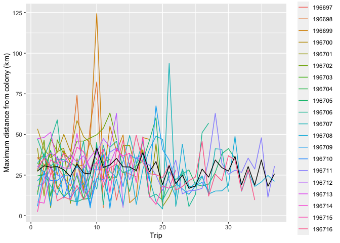

Trip metrics
================
Gemma Clucas
6/4/2021

### Read in trimmed tracking data

This csv file has the data from all Ptts after limiting to just the
chick-rearing trips (no pre-moult
trips).

``` r
All <- read.csv("Chick-rearing_trips/All_chick-rearing_trips.csv", stringsAsFactors = FALSE)
All$Ptt <- as.factor(All$Ptt)
```

### Find maximum distance from colony for each trip and plot

For each point, estimate the distance from the colony, find the max
distance for each trip, and plot these max distances.

``` r
get_trip_distances <- function(x){
  # Make it spatial
  coordinates(x) <- ~LON + LAT
  proj4string(x) <- CRS("+proj=laea +lon_0=-26 +lat_0=-58 +units=m")
  # Reproject to WGS84
  x <- spTransform(x, CRS = CRS("+proj=longlat +ellps=WGS84"))
  # calculate distance between current point and the colony, in metres
  x <- x %>% 
    data.frame() %>% 
    dplyr::mutate(Distance_from_colony = distHaversine(p1 = cbind(LON, LAT),    
                                                       p2 = cbind(-26.401944, -57.808056),   # colony location in decimal degrees
                                                       r = 6362895))
  # Find max distance from colony for each trip and plot
  trip_distances <- x %>% group_by(Trip, Ptt) %>% 
    summarise(Max_dist = max(Distance_from_colony)) 
}
  
plot_distances <- function(trip_distances){
  trip_distances %>% 
    ggplot(aes(x = Trip, y = Max_dist/1000, colour = Ptt)) + 
    geom_line() +
    stat_summary(fun=mean, geom="line", colour="black") +
    ylab("Maximum distance from colony (km)")
}
```

``` r
trip_distances <- get_trip_distances(All)
plot_distances(trip_distances)
```

<!-- -->
